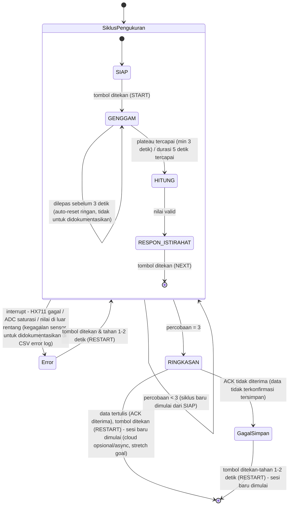

# Catatan Proyek - Hand Grip Dynamometer (v37)
**Final Project - Embedded Systems Course**

> Catatan kerja proyek akhir mata kuliah embedded system (biomedik): keputusan desain beserta alasannya, rujukan, data ukur, dan hal yang masih terbuka. Ditulis supaya bisa dibaca sendiri (offline) tanpa konteks tambahan selain dokumen yang ditautkan. Proposal G1 sudah dikumpulkan; catatan ini sekarang dipakai untuk G2-G4, makalah akhir, dan demo. Bagian 13 merekam isi Bagian 2-3 proposal G1 sebagaimana dikumpulkan, Bagian 14 merangkum desain housing dan menautkan ke dokumen housing yang terpisah, dan Bagian 15 memuat tabel pengukuran dengan jangka sorong.

## Dokumen terkait

| Dokumen | Isi | Status |
|---|---|---|
| [desain-housing-load-cell.md](desain-housing-load-cell.md) | Desain housing grip load cell: layout dua batang, kekakuan batang, kalibrasi, pengadaan pelat, rujukan, dan asumsi gambar skematik v5 | Ada (v7) |
| [desain-housing-elektronik.md](desain-housing-elektronik.md) | Desain housing elektronik (PCB, ESP32, LCD, HX711, tombol, LED; proposal 3.6) | Rencana, belum dibuat |

---

## 1. RINGKASAN PROYEK

| Item | Detail |
|------|--------|
| Mata kuliah | Mata kuliah embedded system (biomedik), proyek akhir berkelompok (3 orang) |
| Posisi saat ini | G1 (proposal + design review) sudah dikumpulkan. Berikutnya G2: jalur penginderaan dan aktuasi hidup di breadboard, PCB dipesan kolektif |
| Pembagian kerja | Pemilik catatan ini memegang Bagian 2 (spesifikasi) dan Bagian 3 (desain sistem) proposal, serta peran sensing, kalibrasi, power budget, skema dan layout PCB (spesifikasi S1 dan S3). Dua anggota lain: firmware dan antarmuka pengguna (state machine, LCD, LED; S2 dan S5), serta jalur logging, enclosure, BOM, dan dokumentasi (S4) |
| Platform wajib | ESP32 (Arduino IDE) |
| Anggaran komponen | Maksimum Rp300.000 per kelompok, dengan bukti pembelian |
| Filosofi cakupan | Menguji keterampilan teknis mahasiswa - BUKAN prototipe siap produksi massal |
| Perangkat | Hand grip dynamometer |

---

## 2. SUMBER RUJUKAN

https://drive.google.com/drive/folders/1nbT_B_snksXwBb6IFAcCBsopwRYrQzlZ?usp=sharing
| Sumber | Fokus utama | Kontribusi ke proyek ini |
|--------|-------------|---------------------------|
| Ramadhani et al. 2019 (IJEEEMI) | Alat ukur genggam pasien pasca-stroke: Arduino Uno + HX711 + load cell batang + LCD 16x2 + indikator 3-tingkat | Arsitektur paling sederhana dan paling dekat dengan skala proyek kelas - jadi referensi utama arsitektur hardware |
| Gotthelf et al. 2021 (J NeuroEng Rehab) | Sistem grip berbasis game (Rocket Launch), tracking MVC + fatigue selama sesi, divalidasi terhadap data normatif literatur | Sumber ide "pengukuran serial dari waktu ke waktu", TIDAK diadopsi fitur game-nya (di luar skop kelas) |
| Becerra et al. 2021 (Applied Sciences, UIB) | Perangkat wireless multi-sensor: gaya genggam + tekanan jari (FSR) + orientasi/tremor (IMU) + Bluetooth | Referensi untuk memahami instrumentation amplifier (AD627) sebagai alternatif HX711 - TIDAK diadopsi multi-sensornya (di luar skop kelas) |
| Chang & Chen 2015 (Bio-Med Mat & Eng, Taiwan) | Dynamometer + NI DAQ + LabView, data normatif Taiwan berdasarkan usia/tinggi/berat/panjang telapak | Referensi metodologi korelasi (tinggi, berat, panjang tangan vs kekuatan genggam) - platform (NI DAQ) TIDAK relevan untuk ESP32 |
| Vaishya et al. 2024 (J Health Pop & Nutrition) | Narrative review: HGS sebagai vital sign baru, cutoff per populasi, asosiasi dengan T2D/CVD/mortalitas/sarcopenia, protokol pengukuran (Box 1) | Sumber argumen medis utama proposal + protokol pengukuran standar (duduk, siku 90 derajat, tahan 3-5 detik, 3 kali percobaan, istirahat 1 menit antar percobaan) + konsep relative HGS (HGS/BMI) |
| Marwedel, *Embedded System Design* (ed. 4) | Buku teks embedded system - teori state machine, evaluasi, dependability | §2.4 StateCharts (formalisasi hierarki 2 lapisan, Bagian 6), §5.3 Quality Metrics (RMSE/MAE, Bagian 9), §5.6.5 FMEA/FTA (daftar risiko, Bagian 9), Bab 1 Tabel 1.2 (justifikasi ESP32, Bagian 8) |
| White, *Making Embedded Systems* (ed. 1, 2011) - dirujuk BRP sebagai [3] | Buku teks embedded system - praktik implementasi C untuk mikrokontroler | Bab 4 (debounce tombol, PWM), Bab 5 (table-driven state machine, watchdog), Bab 6 (circular buffer, event vs data-driven), Bab 3 (pola "Error Handling Library"), Bab 9 (taking an average) - lihat §6.4 untuk rincian per keputusan |
| Russell, *Introduction to Embedded Systems Using ANSI C and the Arduino Development Environment* (2010) - dirujuk BRP sebagai [1] | Buku teks embedded system - dasar C, arsitektur ATmega328P, GPIO/timer/interrupt/ADC | §9.1.2 ISR and Main Task Communication (kebenaran teknis komunikasi ISR-loop utama, Bagian 6.2 SIAP), §6.2.2 Internal Pull-up Resistor (justifikasi hindari floating pin, Bagian 6.2 SIAP) |
| Dokumentasi alat komersial: Kinvent K-Grip, GripAble, Vernier HD-BTA, Biopac SS25LA (dokumen pabrikan dan penjual, bukan peer-review) | Bentuk, rentang, dan ergonomi hand dynamometer komersial | Pembanding desain housing grip ([HL2](desain-housing-load-cell.md#hl2-pembanding-alat-komersial-dokumen-pabrikan-bukan-peer-review)). Bukan bukti ilmiah; jangan disitasi sebagai sumber akademik. Rincian dan URL di [HL18 dokumen housing](desain-housing-load-cell.md#hl18-sumber-rujukan-housing-bukan-peer-review) |
| Diskusi komunitas: Arduino Forum, "calibrating a straight-bar load cell" (bukan sumber akademik) | Kapasitas load cell untuk grip, rig kalibrasi, efek kekakuan rangka | Kalibrasi setelah rakit ([HL5](desain-housing-load-cell.md#hl5-dampak-housing-terhadap-pembacaan-gaya)). Rincian di [HL18 dokumen housing](desain-housing-load-cell.md#hl18-sumber-rujukan-housing-bukan-peer-review) |

---

## 3. KEBUTUHAN DARI BRP DAN PANDUAN G1

### 3.1 Gerbang proyek dan tenggat waktu

| Minggu | Tonggak |
|--------|---------|
| 5-6 | Proposal + Design Review (**G1**): proposal sudah dikumpulkan; revisi sesuai catatan TA saat design review (Minggu 6); skema rangkaian sendiri (Modul 5) |
| 7 | Layout PCB dan gerber (Modul 6) |
| 7 ATAU 8 | Tenggat berkas gerber: **konflik antar dokumen resmi**, lihat catatan di bawah (proposal G1 memakai Minggu 8) |
| 9 | **G2**: satu jalur penginderaan dan satu jalur aktuasi hidup di breadboard; PCB dipesan kolektif |
| 10-11 | Modul Raspberry Pi dan Edge AI; sertifikasi cetak 3D wajib selesai paling lambat Minggu 11 |
| 11-12 | PCB diterima (sekitar dua minggu setelah pesanan) |
| 12 | **G3**: PCB dirakit dan lolos uji dasar |
| 14 | **G4**: purwarupa terintegrasi lolos uji mandiri |
| 15 | Evaluasi sejawat rahasia |
| 16 | UAS: demo expo, makalah akhir, viva individu |

> Konflik yang belum terkonfirmasi: BRP menyebut tenggat gerber Minggu ke-7 di dua tempat (Modul Praktikum 6, dan Bagian D.5: berkas gerber yang melewati tenggat Minggu ke-7 tidak ikut batch fabrikasi). Panduan Proposal G1 menyebut Minggu 8 ("Gerber files due - no extension", pada baris UTS, terpisah dari baris layout PCB di Minggu 7). Jadwal proposal G1 yang dikumpulkan mengikuti Minggu 8 dan menargetkan gerber dikumpulkan lebih awal. Sampai TA mengonfirmasi, jangan menulis salah satu minggu sebagai final di dokumen resmi berikutnya.

### 3.2 Checklist internal (bukan rubrik skor resmi)

> Rubrik skor G1 yang sebenarnya hanya punya **4 kriteria** (perumusan masalah medis; spesifikasi terukur; kelayakan teknis + arsitektur + BOM digabung; jadwal + risiko digabung), masing-masing 0-100, G1 = rata-rata keempatnya. Tabel di bawah adalah checklist internal yang lebih granular (6 baris); jangan disamakan dengan struktur rubrik resmi saat presentasi design review.

| Bagian wajib (checklist internal) | Status |
|---|---|
| Perumusan masalah medis | Sudah tertulis di Bagian 1 proposal (ditulis anggota lain). Draf kerja versi v5 ada di Bagian 4 catatan ini |
| Spesifikasi terukur (range, akurasi, waktu respons, daya) | Sudah tertulis di proposal Bagian 2.1 (S1-S5); salinannya di Bagian 13.1. Akurasi sistem penuh baru diverifikasi lewat RMSE di G4 |
| Arsitektur sistem + kelayakan teknis | Sudah tertulis di proposal Bagian 3.1-3.6; salinannya di Bagian 13. Perhatian: tabel pin 3.4 salah ketik (lihat Bagian 12) |
| BOM dalam anggaran Rp300.000 | Sudah di proposal Bagian 4; BOM aktual di Bagian 9.1 (total pembelian sekitar Rp253.875 sebelum ongkir) |
| Jadwal selaras dengan gerbang proyek | Sudah di proposal Bagian 5 (ditulis anggota lain); ringkasan di Bagian 13.9. Terkait konflik tenggat gerber di 3.1 |
| Daftar risiko dan mitigasi | Sudah di proposal Bagian 6 (6 risiko, masing-masing dengan tanda peringatan dini, mitigasi, dan fallback); ringkasan di Bagian 13.9 |

### 3.3 Persyaratan format resmi (dari Panduan dan Template G1)

| Persyaratan | Sumber | Status |
|---|---|---|
| Body maksimal 8 halaman (Bagian 1-6; cover, referensi, lampiran tidak dihitung) | Template | **Perlu dicek**: pada PDF yang dikumpulkan, Bagian 1-6 menempati halaman 2 sampai 16 (sekitar 15 halaman) |
| Pakai Template resmi apa adanya, urutan bagian tidak boleh diubah | Panduan | Dipenuhi (urutan bagian 1-7 sesuai template) |
| Nama file `G1_Kelompok-XX_Proposal.pdf` | Panduan | Dipenuhi (XX diisi nomor kelompok) |
| Tiap komponen BOM yang dibeli wajib punya link supplier riil | Template §4 | Kolom Supplier link terisi (Shopee) di proposal; URL lengkapnya tidak dicatat di catatan ini |
| Tiap risiko wajib 3 bagian: tanda peringatan dini + mitigasi + fallback | Template §6 | Dipenuhi di proposal Bagian 6 |
| Tabel alokasi pin: tidak ada pin dobel, pin input-only dan strapping ESP32 tidak disalahgunakan | Template §3.4 | Ada, tetapi **SDA tertulis GPIO 22 (sama dengan SCL)**; yang benar GPIO 21. Perbaiki di revisi |
| Power budget ditutup 1 baris: catu daya, arus rated, margin di atas peak total | Template §3.3 | Dipenuhi (satu baris di bawah tabel 3.3) |
| Rail aktuator terpisah dari rail logika, satu ground bersama | Panduan | Tidak ada motor atau aktuator berarus besar; satu rail logika 3,3 V (LED sekitar 15 mA berbagi rail). Kalimat eksplisit soal ini belum ada di proposal 3.3 |
| Design review: anggota manapun bisa ditanya bagian manapun | Panduan | Semua anggota perlu paham seluruh desain, bukan hanya subsistem sendiri |

---

## 4. EVOLUSI PERUMUSAN MASALAH

Keputusan populasi target berubah beberapa kali selama penyusunan proposal - dicatat di sini supaya alasan penolakan versi-versi sebelumnya tidak hilang.

| Versi | Populasi target | Alasan ditolak/direvisi |
|-------|------------------|--------------------------|
| **v1 (motivasi medis dasar - lihat catatan di bawah)** | Pasien pasca-stroke | Terlalu besar skopnya untuk proyek satu semester; butuh proses rekrutmen populasi rentan yang lebih rumit dari yang bisa ditangani jadwal kelas. **TIDAK dibuang** - dipakai kembali di v5 sebagai rujukan kebutuhan klinis, bukan sebagai populasi yang diuji |
| v2 | Mahasiswa teknik, argumen berbasis tugas okupasional (mengetik/coding, menyolder, menggambar manual) | Lebih kuat, tapi populasinya (lintas fakultas) masih sulit direkrut secara realistis |
| v3 (superseded oleh v5) | Mahasiswa Teknik Elektro, Teknik Biomedik, dan Teknik Komputer (satu departemen di fakultas teknik) | Sempat dipilih karena: (1) tidak mudah ditebak arah hasilnya; (2) populasi realistis direkrut karena satu departemen; (3) penulis sendiri mahasiswa Teknik Biomedik. **Dibatalkan**: tetap merupakan pengujian pada orang di luar anggota tim (lintas jurusan), yang menurut Panduan G1 ("Testing on patients or on anyone outside your team") perlu persetujuan tertulis dosen sebelum proposal diajukan - risiko approval tidak turun tepat waktu sebelum tenggat Minggu 5 dianggap terlalu tinggi |
| v4 (superseded oleh v5) | Mahasiswa Teknik Biomedik saja (satu jurusan) | Sempat dicatat sebagai fallback kalau rekrutmen 3 jurusan (v3) tidak realistis. **Dibatalkan untuk alasan yang sama seperti v3**: tetap pengujian di luar anggota tim, tetap butuh persetujuan yang sama, cuma skalanya lebih kecil - tidak menyelesaikan masalah kepatuhan, cuma mengecilkannya |
| **v5 (final)** | **Hanya anggota kelompok sendiri** - tidak ada pengujian ke pasien maupun ke mahasiswa/pihak lain di luar tim | Dipilih karena sesuai persis dengan batas yang diizinkan Panduan G1: *"Non-invasive, low-voltage measurements on team members are fine"* - dynamometry genggam tangan non-invasif dan tegangan rendah, jadi seluruh pengukuran validasi (kalibrasi, MVC, protokol V1) bisa dijalankan tanpa perlu persetujuan tertulis dosen sama sekali. Pertanyaan "apakah jurusan berkorelasi dengan kekuatan genggam" (inti v3) **tidak lagi jadi tujuan proyek** - dicatat sebagai future work/di luar cakupan mata kuliah, bukan sesuatu yang diklaim sudah dijawab. Motivasi klinis proyek tetap dari v1 (lihat catatan di bawah), dan celah yang diisi proyek berubah dari "pertanyaan lintas-jurusan" menjadi "logging otomatis yang tidak dimiliki alat komersial" (lihat catatan di bawah) |

*v5 adalah rencana final untuk proposal G1. v1-v4 tetap didokumentasikan di sini supaya jejak alasan penolakan tiap versi tidak hilang - terutama v1, yang isinya (motivasi medis) tetap dipakai lagi di v5 walau populasi ujinya tidak.*

> **v1 sebagai motivasi medis dasar (bukan populasi uji).** Kebutuhan klinis yang memotivasi proyek ini tetap argumen v1: pasien pasca-stroke dan populasi dengan penurunan kekuatan genggam adalah alasan HGS penting diukur dan dipantau secara klinis (R1 - Ramadhani et al. memakai populasi ini langsung; V1/V2/V4 - Vaishya et al. mendokumentasikan HGS sebagai vital sign dan ambang klinisnya). Proposal G1 memakai v1 di Bagian 1 (Perumusan Masalah Medis) sebagai *rujukan kebutuhan klinis*, bukan sebagai populasi yang direkrut - device dirancang mengikuti protokol dan rentang yang relevan untuk populasi tersebut, tapi pengujian aktual di course ini (Minggu 5-14) hanya dilakukan pada anggota tim, sesuai v5.

> **Celah yang diisi proyek (pengganti pertanyaan lintas-jurusan v3): logging.** Kebanyakan hand grip dynamometer komersial (termasuk model analog klasik seperti JAMAR) tidak punya pencatatan data otomatis - pencatat harus menyalin nilai secara manual satu per satu, yang rawan human error dan kehilangan data (C2 - Chang & Chen 2015 secara eksplisit menyebut ini sebagai kelemahan dynamometer tradisional yang coba diatasi versi digital-terintegrasi). Argumen v2 dari Vaishya (nilai klinis HGS datang dari pengukuran serial dari waktu ke waktu, bukan sekali baca) berarti logging bukan fitur tambahan - itu bagian dari kenapa alat ini punya nilai dibanding alat manual. Kontribusi proyek: menambahkan logging otomatis yang tidak dimiliki alat pembanding.

> **Standar keberhasilan proyek disederhanakan jadi dua hal saja (menggantikan daftar 5-6 fitur "wajib" di Bagian 5 sebagai kriteria sukses utama):**
> 1. **Measurement** - pengukuran sesuai protokol standar V1 (duduk, siku ditekuk 90°, tahan 3-5 detik, 3 kali percobaan, istirahat ~1 menit antar percobaan), diverifikasi dengan RMSE/MAE terhadap beban referensi (M5).
> 2. **Logging** - data setiap sesi tersimpan otomatis (tidak hilang, tidak perlu disalin manual) ke berkas CSV di laptop host lewat USB-Serial. ESP32 mengirim baris CSV dengan `Serial.print()`, dan skrip Python `logger.py` berbasis pyserial di laptop yang menulis berkas dan melakukan flush tiap baris (pola Modul 3 Guided Example 4: *"Logging in Guided Example 4 now goes to a CSV file on your own laptop over the USB serial link"*). Cloud logging bukan requirement: Panduan G1 mengelompokkannya sejajar Raspberry Pi sebagai tambahan opsional (*"may be added where the problem needs them; say why in the proposal"*), jadi masuk 2.3 Stretch goals. SD card tidak dipakai karena lab hanya punya satu modul SD sebagai stasiun opsional (risiko rebutan). Trade-off yang dinyatakan di 2.2 proposal: logging membutuhkan laptop host tersambung selama sesi.

> **Rumusan masalah (draf kerja, versi v5):**
> Kekuatan genggam (HGS) makin diakui sebagai indikator kesehatan, dan nilai klinisnya terutama datang dari pengukuran berulang dari waktu ke waktu (V2). Dynamometer komersial umumnya menampilkan angka tanpa pencatatan otomatis sehingga nilai disalin manual (C2). Proyek ini membuat dynamometer genggam digital berbasis ESP32 dan load cell yang mengikuti protokol pengukuran standar (V1: tiga percobaan, tahan 3-5 detik, istirahat sekitar satu menit) dan mencatat tiap sesi secara otomatis ke CSV. Alat hanya divalidasi pada anggota tim sendiri (v5); pertanyaan perbandingan antar-jurusan dari v3 tidak dikerjakan (future work). Catatan: Bagian 1 proposal ditulis anggota lain, jadi teks ini draf kerja dari catatan, bukan kutipan proposal.

---

## 5. FUNGSI PERANGKAT (Keputusan Skop)

| # | Fungsi | Sub-CPMK terkait | Sumber ide | Status |
|---|--------|-------------------|------------|--------|
| 1 | Pembacaan gaya real-time (kg/N) | Sub-CPMK 4 (ADC) | Semua paper referensi | Wajib |
| 2 | Penangkapan gaya puncak per percobaan (MVC) | Sub-CPMK 4 | Ramadhani (R1), Gotthelf (G1), protokol Vaishya (V1) | Wajib |
| 3 | Tampilan hasil (LCD/serial) | Sub-CPMK 4 | Semua paper referensi | Wajib |
| 4 | Umpan balik aktuator (LED, menyala selama proses genggam) | Sub-CPMK 5 (aktuator) | Tidak ada di paper - ditambahkan agar Sub-CPMK 5 punya tempat wajar di perangkat ini | Wajib |
| 5 | Pencatatan data lintas-sesi (CSV lokal - inti; cloud - stretch goal, lihat Bagian 2.3 proposal) | Sub-CPMK 7 (IoT, dipelajari generik di Modul 7) | Argumen utama Vaishya: nilai klinis HGS datang dari **pengukuran serial**, bukan sekali baca (V2). Status cloud direvisi setelah dicek ke Panduan G1: *"cloud logging... may be added where the problem needs them"* - dikelompokkan eksplisit sejajar dengan Raspberry Pi sebagai opsional, bukan requirement inti | Wajib (CSV) / Opsional (cloud) |
| 6 | Rata-rata 3 percobaan + timer istirahat | - | Protokol standar Box 1, Vaishya (V1): 3 percobaan per tangan, istirahat ~1 menit | Opsional (murah, hanya logika software) |

**Sengaja TIDAK dimasukkan** (di luar skop "uji keterampilan teknis"):
- Relative HGS (V3, butuh input tinggi/berat + logika tambahan) - **dipindah ke tahap analisis data pasca-pengukuran**, bukan fitur firmware
- Game biofeedback penuh ala Gotthelf - itu proyek software/UX, bukan embedded
- Sensor jari (FSR) + IMU tremor ala Becerra - di luar cakupan penilaian mata kuliah

**Variabel yang tetap dicatat manual (bukan fitur firmware), untuk analisis data di makalah akhir:**
tinggi badan, berat badan, tangan dominan, dan frekuensi olahraga. Opsional, hanya untuk analisis pasca-pengukuran pada anggota tim (v5), misalnya menghitung relative HGS (V3). Perbandingan antar-jurusan bukan tujuan proyek (future work).

---

## 6. ARSITEKTUR SISTEM (Alur State Machine)

Dirancang berlapis (hierarchical state, lihat §6.4) - bukan satu loop datar seperti draf awal. **Lapisan luar** menangani satu sesi (loop 3 percobaan + ringkasan). **Lapisan dalam** menangani satu percobaan tunggal (SIAP → GENGGAM → HITUNG → RESPON+ISTIRAHAT). `Istirahat` **bukan lagi state terpisah** di lapisan luar seperti draf sebelumnya - sudah melebur jadi sub-fase dalam `RESPON+ISTIRAHAT` di lapisan dalam (lihat §6.2), menyederhanakan hierarki.

### 6.1 Lapisan luar (per sesi)

Ada satu **interrupt transition** yang berlaku untuk seluruh isi kotak `SiklusPercobaan` - bukan transisi dari satu state tertentu di dalamnya:

```
[Siklus percobaan] --(interrupt: kondisi error terdeteksi)--> [Error: tahan, tampilkan detail]
[Error] --(tombol restart ditekan pengawas)--> kembali ke [Siklus percobaan]
[Siklus percobaan] --(< 3 kali)--> kembali ke [Siklus percobaan] (siklus baru dari SIAP)
[Siklus percobaan] --(= 3 kali)--> [Ringkasan: rata-rata & histori]
[Ringkasan] --(ACK tidak diterima: data tidak terkonfirmasi tersimpan)--> [GagalSimpan: tahan, tampilkan data] --(tombol restart tekan-tahan)--> [Sesi baru dimulai]
[Ringkasan] --(ACK diterima: data tertulis)--> [tombol RESTART ditekan] --> [Sesi baru dimulai]
```

- **Catatan tampilan LCD**: teks layar tiap state untuk jalur normal tercatat di Bagian 13.8. Tampilan layar `Error` dan `GagalSimpan` baru berupa garis besar (jenis kesalahan dan nilai ADC mentah live); bentuk finalnya ditentukan setelah modul Error Handling Library (W2) benar-benar dikoding, bukan didesain visual lebih dulu.
- **Error**: state "tahan" (hold) sungguhan - alat berhenti total, menampilkan jenis error dan pembacaan ADC mentah **secara live** supaya pengawas bisa memeriksa fisik alat. Layar tidak berubah sampai pengawas menekan tombol RESTART (tekan-tahan, lihat bawah) - pola **"Error Handling Library"** (W2), dipakai lagi di `GagalSimpan`. Percobaan yang error TIDAK dihitung sebagai salah satu dari 3. Audiens: pengawas (TA/tim riset), bukan partisipan - larangan "tidak boleh lihat angka mentah" di Bagian 7 sengaja dikecualikan di sini. **Dicatat OTOMATIS ke CSV** (jenis error + `T+mm:ss`) - **keputusan direvisi** dari rencana logbook manual sebelumnya, berdasarkan pengalaman lab langsung: logbook manual di tengah kesibukan sesi pengukuran ternyata kurang efektif/sering terlewat dalam praktik, jadi dipindah ke mekanisme otomatis. Reuse infrastruktur CSV yang sama dengan Fitur #5 (logging data pengukuran) - cuma jenis barisnya beda (baris event error, bukan baris hasil pengukuran). **Kondisi pemicu (hanya kegagalan sensor/hardware, BUKAN human error - lihat pembagian filosofi di §6.2):** HX711 gagal `is_ready()`, ADC mendekati saturasi, nilai `ref` di luar rentang fisik masuk akal (terdeteksi di titik masuk RESPON+ISTIRAHAT, lihat §6.2).
- **Satu tombol fisik untuk semua fungsi** (START, NEXT, RESTART - label beda secara fungsional/dokumentasi, tombol fisik sama) - keputusan direvisi dari draf lama yang sempat pakai 2 tombol terpisah. Alasan: di v5 (Bagian 4), yang menggenggam alat cuma anggota tim sendiri, jadi pembedaan "partisipan awam vs pengawas" yang jadi alasan 2-tombol dulu sudah tidak relevan. **`GagalSimpan` dan `Error` sama-sama dilabeli "RESTART" dan sama-sama butuh tekan-tahan ~1-2 detik** - direvisi dari rencana awal (`GagalSimpan` sempat cukup tap biasa dengan alasan "data sudah aman sebelum titik ini"). Itu **tidak lagi berlaku** sejak CSV jadi mekanisme logging inti (bukan cloud, lihat `Ringkasan` di bawah) - kalau CSV gagal ditulis, data **belum** aman, profil risikonya sama dengan `Error`.
  - **Teknik implementasi tekan-tahan**: perpanjangan dari mekanisme debounce (W1) - sampling berkala + counter, ambang durasinya diperpanjang dari orde puluhan-ratusan ms (filter noise listrik) ke 1-2 detik (konfirmasi kesengajaan). Tidak ada sitasi buku spesifik untuk pola ini - sudah dicek ke Marwedel dan White, tidak dibahas eksplisit di keduanya. **Angka 1-2 detik masih tentatif (subject to change)** - perlu diuji fisik dulu. Sengaja tidak ditampilkan caranya di LCD - pengetahuan pengawas, bukan instruksi ke layar.
- **Disiplin reset flag**: `tombolDitekan` (dan variabel durasi tekan terkait) wajib di-reset tiap masuk state yang akan menunggu tombol (`Siap`, `Error`, `GagalSimpan`, sub-fase 2 `Respon+Istirahat`) - supaya tekanan "nyasar" dari state lain tidak tersimpan diam-diam lalu tiba-tiba terkonsumsi di state lain yang sedang menunggu. Generalisasi dari RU1 (`volatile`).
- **Ringkasan**: terjadi satu kali saja, setelah percobaan ke-3. Hitung rata-rata 3 percobaan, ambil riwayat sesi lalu (sumbernya belum ditentukan, lihat Bagian 9), lalu kirim hasil sebagai baris CSV lewat USB-Serial. Pembagian peran: ESP32 hanya `Serial.print()` baris CSV, sedangkan skrip Python `logger.py` (pyserial, modul `csv` bawaan, `f.flush()` tiap baris; Modul 3 Guided Example 4) di laptop yang benar-benar menulis berkas. Cloud bukan requirement (stretch goal, asinkron, Bagian 2.3 proposal).
  - **Data tertulis**: tampilkan Peak HGS dan Avg HGS, tunggu tombol RESTART (tap biasa) untuk sesi baru.
  - **Data tidak terkonfirmasi tersimpan**: kondisi merugikan (data pengukuran berisiko hilang), jadi memicu pola Error Handling Library (W2) dan masuk state `GagalSimpan`: hold, tampilan live, keluar dengan tekan-tahan 1-2 detik. Nilai selalu juga dicetak ke Serial Monitor sehingga pengawas bisa menyalinnya manual sebelum keluar. `GagalSimpan` langsung ke akhir sesi (data pengukurannya sendiri benar, hanya tidak tersimpan; setelah diselamatkan manual tidak perlu mengulang sesi).
  - **Cara mendeteksi "tidak tersimpan": protokol acknowledgement (ACK).** Masalahnya, ESP32 tidak punya cara tahu apakah baris benar-benar tertulis di laptop. Dua opsi yang ditimbang: (A) hanya mendeteksi USB-Serial terputus. Sederhana, tetapi tidak mendeteksi skrip host yang mati atau lupa dijalankan, dan pada ESP32 DevKit dengan chip jembatan USB-UART status koneksi host kemungkinan tidak tersedia dari `Serial` (perlu diverifikasi di hardware). (B) `logger.py` membalas "ACK" per baris setelah tulis dan flush, dan ESP32 masuk `GagalSimpan` bila ACK tidak datang dalam batas waktu. Opsi A dipilih lebih dulu, lalu digantikan opsi B: Bagian 6 (Risks) proposal G1 yang dikumpulkan menetapkan mitigasi ACK. Konsekuensi: `logger.py` perlu dimodifikasi dari contoh modul (tambah balasan ACK), firmware perlu timeout ACK (nilainya belum ditentukan, uji fisik), dan teks 3.5 proposal ("penulisan CSV gagal") tetap benar secara makna karena ACK tidak diterima berarti penulisan tidak terkonfirmasi.

### 6.2 Lapisan dalam (satu siklus percobaan): SIAP -> GENGGAM -> HITUNG

**[SIAP]**
- Menunggu interrupt tombol (bukan polling `digitalRead()`), agar tetap non-blocking (Sub-CPMK 3). Debounce **software** - abaikan re-trigger < ~50ms sejak interrupt terakhir (dicek di dalam ISR pakai `millis()`), teknik dari (W1) - dikonfirmasi juga di Modul Praktikum 1.
- **Pin tombol wajib pakai pull-up** (internal `INPUT_PULLUP`, bukan dibiarkan floating) - kalau pin input tidak disambung ke apapun saat tidak ditekan, sinyalnya "mengambang" dan bisa memicu interrupt palsu secara acak (RU2).
- **Variabel yang diubah di dalam ISR (misal flag "tombol ditekan") wajib dideklarasikan `volatile`** - tanpa ini, compiler bisa meng-optimasi pembacaan variabel itu di loop utama seolah nilainya tidak pernah berubah dari luar, dan state machine bisa macet permanen di `Siap` walau tombol sudah ditekan (RU1). Kalau nanti ada variabel multi-byte (misal timestamp `unsigned long`) yang dibaca ISR **dan** loop utama sekaligus, perlu hati-hati juga terhadap risiko "setengah lama-setengah baru" saat interrupt terjadi persis di tengah pembacaan (RU1) - untuk desain sekarang risiko ini belum relevan karena variabel debounce cuma diakses di dalam ISR sendiri, tapi perlu diingat kalau nanti ada variabel baru yang dishare ke loop utama.
- Auto-tare, dijalankan tiap masuk state ini (termasuk setelah kembali dari siklus sebelumnya) - **keputusan desain kami sendiri** (bukan dari sumber eksternal manapun - tidak ada satupun dari 5 paper referensi yang membahas auto-tare per percobaan), diputuskan karena kami membandingkan 3 percobaan dalam satu sesi untuk dirata-ratakan, jadi konsistensi titik nol antar percobaan penting untuk validitas data. Dua langkah berurutan dalam state yang sama: (1) tampilkan `"Menyesuaikan nol..."` di LCD, jalankan fungsi `tare()` (**blocking, diputuskan eksplisit** - dan ini bukan pilihan independen: `tare()` secara internal memanggil fungsi baca library HX711 yang sama dengan `get_units()` untuk menentukan offset nol, jadi blocking-nya adalah konsekuensi langsung dari memakai library HX711, sama seperti di GENGGAM - bukan dua keputusan terpisah, satu akar sebab yang sama. Diterima karena durasinya singkat dan tare cuma terjadi sekali per siklus, bukan berulang tiap iterasi loop); (2) begitu selesai (~1 detik, angka pasti menunggu pengujian fisik), ganti tampilan jadi `"Siap - tekan tombol"`. Tidak perlu animasi/state terpisah - durasi tare cukup singkat untuk cukup ditandai teks statis.
- Tidak ada jalur ke ERROR dari state ini.

**[GENGGAM]** - dua fase di dalam satu state, LED menyala menembus keduanya tanpa putus.

*Fase 1 - Menunggu mulai:* begitu masuk dari SIAP, timer 3-5 detik **belum jalan**. LED menyala (lihat rasional LED di bawah), LCD menampilkan `"Menunggu genggaman"`. Sistem cuma menunggu fluktuasi gaya pertama melewati **threshold onset** (nilai pasti menunggu eksperimen - sama metodologi dengan threshold kestabilan: ukur noise alami load cell diam, threshold di atas itu).

*Fase 2 - Menghitung:* begitu threshold onset terlampaui, timer 3-5 detik mulai, LCD ganti jadi `"Tahan selama 3-5 detik"` (teks berbeda dari Fase 1 supaya pengguna tahu timer sudah berjalan). Baca ADC dari HX711, terapkan `calibration_factor`. HX711 `get_units()` bersifat blocking (~100ms pada 10Hz) - **diterima apa adanya**, sudah dibahas Modul Praktikum 2 soal kapan delay masih acceptable. **Smoothing + deteksi plateau** (circular buffer, W5+W6): simpan 5 pembacaan terakhir dalam buffer melingkar, bandingkan selisih (tertinggi-terendah) terhadap threshold kestabilan. Konsep "tunggu sampai plateau" sejalan dengan protokol Box 1 (V1): *"squeeze... until I say stop (when the needle stops rising)"*.

**Threshold onset dan threshold "dilepas terlalu awal" adalah nilai yang SAMA, dicek dua arah** - naik melewati threshold saat Fase 1 = mulai (masuk Fase 2); turun kembali di bawah threshold itu **sebelum 3 detik** = dilepas terlalu awal. Ini simplifikasi sengaja - cuma butuh satu eksperimen kalibrasi, bukan dua threshold terpisah.

**Filosofi pembagian error (keputusan tim):** error yang didokumentasikan (dicatat otomatis ke CSV, pola `Error` penuh) itu **cuma untuk kegagalan sensor/hardware murni** (HX711, ADC saturasi, nilai di luar rentang fisik). **Human error murni** (user tidak mengikuti instruksi, misal dilepas sebelum 3 detik) **TIDAK didokumentasikan** - dianggap kejadian ringan/wajar, bukan kegagalan alat.

**Tiga jalur keluar dari GENGGAM:**
1. **Dilepas sebelum 3 detik** → **auto-reset ringan, TIDAK masuk `Error`**: tampilkan pesan singkat, sistem otomatis kembali ke Fase 1 ("Menunggu genggaman...") - bukan pindah state, bukan hold, tidak dicatat sama sekali, tidak butuh pengawas. Percobaan ini otomatis diulang tanpa intervensi manual.
2. **Plateau tercapai, durasi ≥3 detik** → HITUNG (jalur normal).
3. **Durasi mencapai 5 detik tanpa plateau** → sistem otomatis berhenti menerima gaya, langsung ke HITUNG memakai nilai buffer terbaik yang ada saat itu (batas 5 detik = force-stop, bukan pembatalan percobaan).

Tidak ada kondisi "gaya turun ke ambang" generik lagi seperti draf sangat awal - sudah digantikan mekanisme onset/plateau/5-detik di atas (dicek juga ke R2 & G2: tidak ada satupun referensi yang pakai threshold gaya untuk deteksi akhir - tetapi onset dan early-release di sini beda kategori: threshold hanya menentukan kapan timer mulai dan kapan percobaan di-reset, sedangkan akhir genggaman tetap ditentukan oleh plateau atau batas 5 detik).

Refresh rate LCD tetap dipisah dari sample rate sensor via timer terpisah (`millis()`). Metodologi penentuan angka: eksperimen langsung (tantangan Walking Light dari Modul Praktikum 1 tanpa tombol, coba delay 50-500ms) + ~20ms buffer kompensasi I2C (**estimasi teknis kami sendiri**). **Angka final masih menunggu hasil eksperimen.**

**Rasional LED (keputusan kami sendiri, bukan sitasi eksternal):** LED menyala sepanjang GENGGAM (kedua fase) sampai keluar (ke HITUNG atau ERROR). Alasannya murni aksesibilitas - refresh LCD **sengaja dilambatkan** (angka pasti belum ditentukan; kisaran uji 50-500 ms, lihat paragraf refresh rate di atas) supaya mata manusia bisa mengikuti angka yang berubah, tapi ini berarti pengguna belum tentu bisa "keep up" secara visual dengan LCD saat itu juga. LED jadi sinyal biner sederhana ("sedang aktif direkam") yang jauh lebih mudah diikuti mata dibanding membaca angka fluktuatif - pelengkap LCD, bukan pengganti.

**[HITUNG]**
- One-shot (bukan loop), dieksekusi sekali begitu GENGGAM selesai jalur normal (`ref` = rata-rata buffer stabil, atau nilai buffer terbaik kalau exit via batas 5 detik). Simpan ke posisi percobaan ke-1/2/3.
- **Tidak ada tampilan LCD sama sekali di state ini** (murni komputasi internal) - tampilan hasil pengukuran ada di RESPON+ISTIRAHAT.
- Sengaja TIDAK menghitung relative HGS (V3) di sini - dipindah ke analisis data pasca-pengukuran (Bagian 5).
- Smoothing sudah selesai di GENGGAM - alasannya murni kualitas pengalaman, bukan soal larangan nilai mentah di Bagian 7.
- Nilai float mentah tetap disimpan di memori sebelum dibulatkan untuk LCD nanti, supaya presisi tidak hilang untuk analisis akurasi (M5).
- Transisi keluar: langsung ke RESPON+ISTIRAHAT (lihat bawah) - **validasi rentang nilai `ref` terjadi tepat di titik masuk RESPON+ISTIRAHAT ini, bukan di dalam HITUNG sendiri** (reject kalau `ref` > 100kg atau `ref` < 0 - **angka 100kg dari data Gotthelf (G1)**, angka ambang pasti menunggu pengujian fisik). Kalau valid → masuk RESPON+ISTIRAHAT normal. Kalau invalid (overshoot/undershoot) → interrupt transition ke ERROR dari batas SiklusPercobaan (§6.1) - ini kategori **kegagalan sensor**, jadi TETAP didokumentasikan penuh (beda dari early-release GENGGAM yang human error).

**[RESPON+ISTIRAHAT]** - satu state, dua sub-fase berurutan (pola sama seperti GENGGAM dua fase).

*Sub-fase 1 - Lepaskan genggaman + istirahat:* LCD tampilkan "PENGUKURAN X", nilai ADC/tegangan/kg/N, dan pesan "Lepaskan genggaman - masuk ke fase istirahat (XX detik)". Begitu gaya turun di bawah threshold onset (reuse threshold yang sama dari GENGGAM, simetris), angka detik pada pesan ini mulai berjalan mundur secara real-time dari 60 ke 0, diperbarui tiap 100ms (`millis()`, non-blocking) - tanpa berganti tampilan layar. Exit sub-fase begitu hitung mundur mencapai 0.

*Sub-fase 2 - Tunggu lanjut:* LCD berganti, tampilkan kembali hasil pengukuran + "Tekan tombol NEXT untuk lanjut" (atau "...untuk melihat ringkasan" khusus di percobaan ke-3). Tunggu tombol NEXT/START ditekan.

Transisi keluar (ke lapisan luar): percobaan < 3 → kembali ke SIAP (siklus baru); percobaan = 3 → RINGKASAN.

**Buzzer sudah dihapus dari scope sejak awal** - LED cukup, diikat ke durasi GENGGAM (bukan momen "selesai" terpisah). Keputusan tim kami sendiri (Bagian 5) - alat riset kecil-kecilan yang diawasi langsung tidak butuh sinyal audio berlebihan.

### 6.2b Diagram Mermaid (gabungan lapisan luar & dalam)



*`Error` dan `GagalSimpan` memakai pola yang sama (tahan layar, live/tidak berubah sampai pengawas selesai menyelamatkan/mencatat data, keluar lewat tekan-tahan 1-2 detik) - cukup diimplementasikan sebagai satu fungsi/modul kode yang dipanggil dari dua titik berbeda di firmware, meski keduanya tetap dua state FSM terpisah karena tujuan keluarnya berbeda.*

*Satu tombol fisik untuk SEMUA transisi di diagram ini (mulai, next, restart) - lihat Bagian 6.1. Cara tekannya yang beda: tap biasa di semua tempat, KECUALI keluar dari `Error` yang butuh tekan-tahan 1-2 detik (tentatif, subject to change). Kalau ada label "tombol X ditekan" di panah manapun, itu selalu tombol fisik yang sama - bukan tombol terpisah per state.*

*Render otomatis di GitHub. Untuk versi draw.io (proposal Word/PDF), gunakan shape UML State Machine dengan composite state untuk `SiklusPercobaan` dan guard condition `[percobaan < 3]` / `[percobaan = 3]` pada label transisi keluar.*

### 6.2c Tabel state lengkap (referensi kerja - bukan versi ringkas proposal)

*Ini versi paling lengkap untuk kerja internal kami, bukan tabel 3.5 proposal yang lebih ringkas. Kolom "Status" menandai mana yang closed vs masih open item.*

| State | Yang terjadi (entry + loop) | Variabel kunci | Kondisi keluar → tujuan | Mekanisme waktu | Sitasi/basis | Status |
|---|---|---|---|---|---|---|
| SIAP | Entry: LCD "Menyesuaikan nol...", jalankan `tare()` (**blocking** - sama akar sebab dengan `get_units()`, dua-duanya panggilan library HX711). Setelah ~1s, LCD → "Siap - tekan tombol". Tunggu interrupt tombol. | `volatile bool tombolDitekan`; timestamp debounce di ISR | Tombol ditekan (lolos debounce ~50ms) → GENGGAM | `tare()` blocking ~1s (konsekuensi library HX711, bukan pilihan terpisah dari GENGGAM); sisanya interrupt-driven non-blocking | W1, RU1, RU2 | Closed |
| GENGGAM - Fase 1 | Entry: LED on, LCD "Menunggu genggaman". Polling ADC, bandingkan ke `thresholdOnset`. | `thresholdOnset` (TBD) | Force > `thresholdOnset` → lanjut Fase 2 (internal, state sama) | Non-blocking, belum ada timer aktif | Keputusan kami sendiri | Angka threshold masih open |
| GENGGAM - Fase 2 | Mulai timer, LCD ganti "Tahan selama 3-5 detik". Baca HX711, isi circular buffer 5 sampel, cek stabilitas, update LCD tiap refresh interval. | `buffer[5]`, `thresholdStabilitas` (TBD), `startTime`, `elapsed` | (a) elapsed<3000ms & force<thresholdOnset → **auto-reset ringan ke Fase 1** (human error, TIDAK didokumentasikan, TIDAK masuk ERROR). (b) elapsed≥3000ms & buffer stabil → HITUNG. (c) elapsed≥5000ms → HITUNG paksa (force-stop) | Campuran: loop non-blocking; `get_units()` blocking ~100ms/baca | V1, W5+W6, R2+G2 | thresholdStabilitas dan refresh rate LCD masih pending eksperimen |
| HITUNG | Simpan `ref` ke slot percobaan ke-n. **Tidak ada tampilan LCD.** Validasi rentang (0<ref≤100kg) terjadi di TITIK MASUK RESPON+ISTIRAHAT, bukan di sini. | `ref` (float presisi penuh), `percobaanKe` | → RESPON+ISTIRAHAT (kalau valid). Invalid → ERROR (kategori kegagalan sensor, didokumentasikan) | Non-blocking, one-shot | G1, M5, V3 | Angka ambang pasti (selain placeholder 100kg) masih pending fisik |
| RESPON+ISTIRAHAT | Satu state, 2 sub-fase: (1) tampilkan hasil + "lepaskan genggaman" (exit: force<thresholdOnset, reuse simetris), lalu pesan yang sama menampilkan countdown 60 detik berjalan mundur di tempat (refresh 100ms, tanpa ganti layar). (2) tampilkan hasil lagi + "tekan NEXT" (tunggu tombol). | `startTime`, reuse `thresholdOnset`, hasil percobaan | Sub-fase 1→2 berurutan. Tombol NEXT di sub-fase 2 → percobaan<3: SIAP (siklus baru); percobaan=3: RINGKASAN | Non-blocking sepanjang (threshold check, timer, tombol) | V1 | Closed - menggabungkan fungsi ISTIRAHAT lama + tampilan hasil |
| RINGKASAN | **Satu kali saja, setelah percobaan ke-3.** Hitung rata-rata 3 percobaan, ambil riwayat sesi lalu (sumber belum ditentukan), kirim hasil sebagai baris CSV lewat USB-Serial (`Serial.print()`); `logger.py` di laptop yang menulis berkas dan membalas ACK. Cloud (stretch goal): async. | `rataRata`, `riwayatSesiLalu`, status ACK | ACK diterima → tampilkan Peak/Avg, tunggu tombol RESTART (tap biasa) → sesi baru. ACK tidak diterima dalam batas waktu → GAGALSIMPAN | Kirim serial: non-blocking (asumsi, belum diverifikasi). Menunggu ACK: timeout (nilai TBD, uji fisik). Cloud: async | V2 | Sumber riwayat dan nilai timeout ACK masih open; `logger.py` perlu dimodifikasi untuk ACK |
| ERROR | Tampilkan jenis error (3 kondisi: HX711 timeout, ADC saturasi, nilai di luar rentang - kegagalan sensor SAJA, dilepas <3 detik BUKAN di sini lagi sejak v17) + ADC mentah live. Tunggu tombol RESTART (tekan-tahan 1-2 detik, khusus pengawas). Dicatat otomatis ke CSV. | `jenisError`, waktu masuk (T+mm:ss) | Tombol RESTART (hold) → SIAP (counter percobaan TIDAK berubah) | Interrupt masuk (3 sumber), non-blocking menunggu restart | W2 | Closed secara pola |
| GAGALSIMPAN | Tampilkan data yang tidak terkonfirmasi tersimpan, live/tahan. Pola sama ERROR (reuse modul). Nilai tetap tercetak ke Serial Monitor untuk diselamatkan manual. | `dataGagalSimpan` | Tombol RESTART tekan-tahan 1-2 detik → selesai (langsung akhir sesi, beda dari ERROR) | Sama seperti ERROR, termasuk tekan-tahan (direvisi dari tap biasa) | W2 | Closed secara pola; syarat masuk bergantung pada protokol ACK |

### 6.3 Diagram blok komponen

`Load cell -> HX711 (amplifier + ADC 24-bit, bit-bang GPIO DOUT/SCK) -> ESP32 -> {LCD 16x2 (I2C), LED (GPIO output), tombol (GPIO interrupt), USB-Serial ke laptop (logging CSV), WiFi (cloud, stretch goal)}`

Pin dan antarmuka final ada di Bagian 13.7, anggaran daya di Bagian 13.6, dan caption Figure 1 di Bagian 13.4. Pembagian hardware: load cell dan grip berada di housing terpisah ([desain housing](desain-housing-load-cell.md#hl1-keputusan-dua-housing-terpisah)); ESP32 berada di PCB kustom beserta tombol, LED, dan resistor; modul HX711 dan LCD tersambung lewat header pin.

### 6.4 Referensi teori

*Isi lengkap tiap kode ada di Bagian 11 (Library Sitasi). Daftar di bawah cuma peta cepat: kode mana dipakai di keputusan mana.*

- Formalisasi hierarki dua lapisan (§6, §6.1): **M1**
- Justifikasi platform ESP32 (Bagian 8): **M2**
- Pipeline sensor/ADC (GENGGAM): **M3**
- Aktuator/PWM (dasar teori, meski buzzer akhirnya dilepas - LED di GENGGAM): **M4**
- Metodologi validasi akurasi (Bagian 9): **M5**
- Metodologi daftar risiko (Bagian 9): **M6**
- Debounce tombol (SIAP): **W1**
- Pull-up internal, hindari floating pin (SIAP): **RU2**
- Kebenaran teknis ISR-loop utama, `volatile` (SIAP): **RU1**
- Pola shared-module Error/GagalSimpan (§6.1): **W2**
- Cara implementasi kode state machine (belum dikerjakan; diputuskan saat implementasi firmware): **W3**
- Watchdog (belum diintegrasikan; dipertimbangkan saat implementasi firmware): **W4**
- Smoothing nilai puncak (GENGGAM): **W5, W6**
- Event-driven vs data-driven, dasar kenapa GENGGAM "terasa beda": **W7**
- Durasi tahan, rest antar percobaan (GENGGAM, Istirahat): **V1**
- Deteksi plateau (GENGGAM): **V1**
- Argumen pengukuran serial (Fitur #5, Bagian 7): **V2**
- Kapasitas load cell & ambang validasi (HITUNG, Bagian 9): **G1**
- Tidak ada threshold gaya untuk deteksi akhir di referensi manapun (GENGGAM): **R2, G2**

---

## 7. NARASI PENGALAMAN PENGGUNA

*Alur pengalaman pengguna, disintesis dari pola UX di referensi (tombol fisik dan LCD+indikator di Ramadhani (R1), instruksi sederhana di Gotthelf (G3), riwayat sesi di Becerra (B1)) dan disesuaikan dengan kebutuhan proyek ini. Teks LCD final per state ada di Bagian 13.8.*

- Pengguna: anggota tim sendiri (v5), tidak diasumsikan awam; posisi duduk, siku 90 derajat (protokol V1).
- Persiapan: ESP32 tersambung USB ke laptop dan `logger.py` sudah berjalan sebelum sesi dimulai.
- Memulai (SIAP): LCD menampilkan "Menyesuaikan nol...", lalu "Tekan tombol START".
- Meremas (GENGGAM): LED menyala. LCD menampilkan "Menunggu genggaman..." lalu "Tahan selama 3-5 detik", dengan nilai ADC/tegangan dan kg/N real-time menurut rancangan layar. Refresh LCD sengaja diperlambat supaya terbaca mata, dan LED menjadi sinyal biner yang lebih mudah diikuti.
- Selesai satu percobaan (RESPON+ISTIRAHAT): LED mati; LCD menampilkan hasil dan hitung mundur istirahat 60 detik, lalu "Tekan tombol NEXT untuk lanjut".
- Akhir sesi (RINGKASAN): "Peak HGS" dan "Avg HGS", lalu "Tekan tombol RESTART untuk memulai ulang pengukuran".
- Antar sesi: riwayat tersimpan di berkas CSV di laptop. Inti nilai alat adalah pencatatan serial otomatis (V2: nilai klinis HGS datang dari pengukuran berulang, bukan sekali baca). Visualisasi tren (dashboard) adalah stretch goal; perbandingan "lebih kuat dari sesi lalu" di layar menunggu keputusan sumber riwayat (Bagian 9).
- Yang dihindari: pengguna tidak melihat angka mentah yang belum terkalibrasi (dikecualikan untuk pengawas di state Error dan GagalSimpan, Bagian 6.1); kegagalan pembacaan tidak boleh senyap (rubrik BRP "ketahanan uji adversarial").

---

## 8. CATATAN PLATFORM: ESP32 vs RASPBERRY PI

- G1 (proposal) jatuh tempo minggu 5-6; Raspberry Pi baru diajarkan minggu 10 (Sub-CPMK 8) - artinya arsitektur inti proyek **realistisnya harus ESP32-only** saat proposal ditulis
- Raspberry Pi dicatat sebagai **kemungkinan ekstensi pasca-minggu 10** (mis. sebagai local data hub/dashboard), bukan kebutuhan wajib
- Edge AI (minggu 11, Sub-CPMK 9) dinilai **tidak relevan** dipaksakan ke proyek ini - tidak ada tugas inferensi on-device yang bermakna untuk dynamometer

**Justifikasi ESP32 (M2):**
> "Embedded systems are information processing systems embedded into enclosing products." - ESP32 di dalam alat genggam ini persis memenuhi definisi ini.

| Kriteria (M2) | Embedded (ESP32) | PC-like |
|---|---|---|
| Arsitektur | Kompak, heterogen | Tidak kompak, homogen |
| Tujuan optimasi | Energi, ukuran | Performa rata-rata |
| Relevansi real-time | Sering penting | Jarang |
| Safety-critical | Mungkin | Biasanya tidak |

Argumen proposal: alat genggam butuh ukuran kompak, daya rendah, dan pewaktuan yang bisa diprediksi (non-blocking) - ESP32 cocok, PC/laptop tidak.

---

## 9. STATUS ITEM TERBUKA DAN BOM

| Area | Status | Catatan |
|---|---|---|
| Spesifikasi terukur | Selesai di proposal | S1-S5 di Bagian 13.1. Tolerance ±0,036 kg hanya lantai teoretis satu komponen; akurasi sistem penuh diverifikasi lewat RMSE di G4 (M5). Rentang 20-70 kg masih perlu justifikasi dari kekuatan genggam anggota tim |
| Diagram blok, pin, power budget | Selesai di proposal | Bagian 13.4, 13.6, 13.7. Perbaiki salah ketik SDA di tabel pin |
| Media logging | Selesai | CSV lewat USB-Serial dengan `logger.py` (inti); cloud = stretch goal; SD card tidak dipakai (Bagian 4 dan 6.1) |
| Deteksi "data tidak tersimpan" (GAGALSIMPAN) | Terbuka | Protokol ACK dipilih (Bagian 6.1): modifikasi `logger.py`, nilai timeout ACK, uji baris hilang atau terpotong |
| Sumber riwayat sesi sebelumnya | Terbuka | RINGKASAN dan proposal 3.5 menyebut perbandingan dengan sesi sebelumnya, tetapi CSV berada di laptop, bukan di ESP32. Pilihan: (a) ESP32 menyimpan ringkasan sesi terakhir di flash (NVS), (b) `logger.py` mengirim riwayat kembali, (c) perbandingan dilakukan di analisis pasca-pengukuran dan layar hanya menampilkan sesi berjalan. Perlu diputuskan, termasuk menyelaraskan teks 3.5 |
| Angka yang menunggu uji fisik | Terbuka | `thresholdOnset`, `thresholdStabilitas`, refresh rate LCD (kisaran 50-500 ms), durasi tare (sekitar 1 s), timeout HX711, ambang saturasi ADC, durasi tekan-tahan (1-2 s), timeout ACK |
| Desain housing grip | Terbuka | Layout dipilih ([HL4](desain-housing-load-cell.md#hl4-tata-letak-terpilih-dua-batang-dengan-load-cell-di-antaranya)). Pelat PLA 7 mm terbukti terlalu lentur; pelat aluminium polos 10 mm diputuskan, celah 2,5 mm, spacer PLA terpisah 28 x 28 x 2,5 mm, baut M6 x 25, untuk load cell CZL 601 80 kg (130 x 28 x 22 mm menurut gambar penjual; [HL9](desain-housing-load-cell.md#hl9-temuan-kekakuan-batang-dan-usulan-bahan)). Menunggu pengukuran load cell (Bagian 15, C1-C7: lebar, ulir tembus atau buta, ujung kabel, diameter dan panjang kabel), tinggi penutup strain gauge, dan prototipe kardus |
| Jadwal | Ada di proposal (Bagian 5) | Terkait konflik tenggat gerber (Bagian 3.1) |
| Risiko | Ada di proposal (Bagian 6) | Kandidat tambahan dari desain housing: batang melentur menyentuh load cell atau patah ([HL9](desain-housing-load-cell.md#hl9-temuan-kekakuan-batang-dan-usulan-bahan)); lubang baut mengurangi penampang pelat di pangkal; kabel load cell tertarik terbaca sebagai gaya; dua bagian bersentuhan (jalur gaya paralel); arah beban kalibrasi, kalibrasi hanya sampai 42 kg dengan ekstrapolasi ke 70 kgf, dan A yang bertumpu pada kepala baut saat kalibrasi ([HL10](desain-housing-load-cell.md#hl10-kalibrasi-dan-arah-beban)); kabel load cell pendek (sekitar 28-42 cm) dan diameternya belum diukur ([HL4](desain-housing-load-cell.md#hl4-tata-letak-terpilih-dua-batang-dengan-load-cell-di-antaranya)); pelat logam butuh akses bengkel dan anggaran ([HL11](desain-housing-load-cell.md#hl11-pengadaan-pelat-logam)); ketersediaan beban acuan (dumbbell berpasangan sampai 42 kg milik anggota) |
| Consent partisipan | Tidak relevan | v5 hanya menguji anggota tim sendiri (Bagian 4) |
| Link supplier | Terbuka | Ada di proposal (Shopee), belum disalin ke catatan |

### 9.1 BOM (sesuai proposal G1, Bagian 4)

| No | Komponen | Part number | Qty | Sumber | Harga satuan | Subtotal | Catatan |
|---|---|---|---|---|---|---|---|
| 1 | ESP32 DevKit | ESP32-WROOM-32 | 1 | Lab | - | - | Disediakan lab (kelompok sudah memiliki papan DevKit V1). Cek varian fisik (WROOM atau WROVER) sebelum pin dikunci: GPIO 16/17 dipakai PSRAM di WROVER, sedangkan GPIO 18/19 aman di keduanya. Uji 8 Okt. 2026 (DS-ESP1 di `ds-library.md`): chip ESP32-D0WD-V3 rev v3.1, flash 4 MB, tanpa PSRAM; pin 18, 19, 21, 22, 25, 27 lolos loopback; akhiran modul (WROOM-32D atau -32E) belum dipastikan |
| 2 | Load cell straight-bar 180 kg (4 kabel, kabel 110 cm, shield) | Generik ("Nankai/YZC-133", tanpa P/N pabrikan) | 1 | Beli (Shopee) | Rp193.375 | Rp193.375 | Rated output 2,0±0,2 mV/V, non-linearity 0,02% FS, kelas C3, creep 0,0016% FS (30 menit), overload aman 150% FS, destruktif 200% FS, eksitasi 4-12 VDC (maks 15 V), IP67, aluminium, 147 x 30 x 22 mm. Harga naik dari estimasi awal Rp115.000 |
| 3 | Modul HX711 | HX711 | 1 | Beli | Rp8.500 | Rp8.500 | Channel A saja; daya 2,7-5 V dari ESP32 |
| 4 | LCD 16x2 + backpack I2C | LCD1602 (HD44780) + PCF8574T | 1 | Beli | Rp39.500 | Rp39.500 | Dicatu 3,3 V. Datasheet penjual menyebut tegangan kerja 3 V dan 5 V, jadi aman dari jalur 3V3 ESP32. Alamat I2C 0x27 atau 0x3f |
| 5 | LED 5 mm diffused (paket 30 pcs) | Generik | 1 paket | Beli | Rp10.000 | Rp10.000 | Tidak bisa dibeli eceran |
| 6 | Tactile push button | 6x5x5 mm, 2-pin (BOM proposal) | 5 | Beli | Rp500 | Rp2.500 | Hanya butuh 1 (satu tombol untuk START/NEXT/RESTART); MOQ 5. Catatan lama menulis 6x6x5 mm: ukur untuk memastikan (Bagian 15) |
| | Total pembelian | | | | | **Rp253.875** + ongkir | Batas Rp300.000. Proposal menulis 253.375 (selisih Rp500 dari penjumlahan baris) |

Resistor pembatas LED termasuk komponen pasif lab (BRP D.5) dan tidak dibeli. Breadboard dan kabel jumper juga disediakan lab.

#### 9.1.1 Perubahan setelah proposal (v37)

Tabel di atas merekam BOM proposal G1 apa adanya. Perubahan sesudahnya:
- **Load cell diganti.** Yang dibeli adalah CZL 601 80 kg (listing Automa-88, Shopee; DS-LC1 di `ds-library.md`), bukan load cell generik 180 kg pada baris 2. Spesifikasi di baris 2 (2,0 mV/V, overload 150%, kabel 110 cm, 147 x 30 x 22 mm) tidak berlaku lagi. Nilai baru dari DS-LC1: 130 x 28 x 22 mm (gambar penjual; GJ Impex menulis lebar 30 mm), sensitivitas 2,0±0,2 mV/V (vendor), error gabungan ±0,03 %RO (sekitar ±24 g, sekitar ±34 g bila digabung dengan suhu dan drift HX711), overload yang dipakai desain 120% / 150% (96 / 120 kgf), kabel sekitar 28 cm (listing) atau 0,42 m (GJ Impex). Harga pembelian tidak tercatat di catatan ini: isi dari bukti beli, lalu hitung ulang total dan sisa anggaran (Rp253.875 di atas masih memuat Rp193.375 untuk load cell lama).
- **Komponen housing grip yang belum ada di BOM** ([HL11](desain-housing-load-cell.md#hl11-pengadaan-pelat-logam)): pelat aluminium 170 x 30 x 10 mm (2 pcs + 1 cadangan; grade dicantumkan) dan jasa potong atau bor, baut M6 x 25 dan washer logam (4 buah, lebih satu set cadangan), filamen PLA untuk spacer 28 x 28 x 2,5 mm dan penjepit kabel (printer lab), serta kabel sambungan load cell (shielded, 4 inti, panjang TBD) bila housing elektronik tidak berada dalam jangkauan kabel 28-42 cm. Harga belum diverifikasi.
- Anggota kelompok sudah memiliki ESP32 DevKit V1, LED 5 mm, tombol, resistor, breadboard, dan kabel jumper; LCD, modul HX711, dan load cell sudah dibeli. Daftar komponen yang diminta dari lab disusun terpisah (tab Kelompok 01).

---

## 11. LIBRARY SITASI - TEORI BUKU & TEMUAN PAPER

*Parafrase setia (bukan kutipan verbatim) dari kedua buku teks, diterjemahkan ke Indonesia dengan analogi di beberapa titik. Temuan paper diinterpretasi. Cakupan dibatasi pada yang benar-benar jadi fondasi keputusan di dokumen ini - bagian buku/paper yang dibaca tapi tidak dipakai (misal fitur game Gotthelf, sensor FSR/IMU Becerra, amplifier AD627) sengaja tidak dimasukkan di sini (lihat Bagian 2 untuk catatan "TIDAK diadopsi"-nya).*

**Konvensi sitasi lokal:** kode di kolom pertama tabel di bawah (M1, W1, V1, dst.) dipakai sebagai sitasi `(kode)` di sepanjang dokumen ini - ditulis menempel setelah klaim yang didukungnya, gaya IEEE. **Sistem ini TIDAK universal** - kode ini cuma berlaku di dalam catatan ini sendiri, tidak bisa dipakai/dikenali di dokumen lain (beda dari sitasi [1], [2] ala BRP yang merujuk Daftar Pustaka baku). Kalau bagian dari catatan ini disalin ke draf proposal G1 nanti, kode `(kode)` ini perlu ditulis ulang jadi sitasi format resmi (APA/IEEE sesuai ketentuan dosen) merujuk ke daftar pustaka yang sebenarnya - bukan dibiarkan sebagai kode internal ini.

### 11.1 Marwedel, *Embedded System Design* (ed. 4, 2021)

| Kode | Isi (parafrase) | Asal |
|---|---|---|
| M1 | Statechart memperluas FSM datar dengan dua kemampuan: (a) state hierarkis - satu "superstate" bisa membungkus beberapa state di dalamnya, dan (b) orthogonal region - beberapa state bisa aktif bersamaan secara paralel. Transisi bisa digambar dari batas superstate itu sendiri (bukan dari tiap state anak satu-satu) dan otomatis berlaku untuk seluruh state di dalamnya - disebut interrupt transition. Analogi: seperti aturan "kalau alarm kebakaran berbunyi, semua orang di gedung keluar" - tidak perlu aturan terpisah per lantai/ruangan, cukup satu aturan di level gedung. | Bab 2, §2.4 Communicating Finite State Machines, §2.4.2 StateCharts |
| M2 | Embedded system didefinisikan sebagai sistem pemrosesan informasi yang tertanam ke dalam produk yang membungkusnya (bukan berdiri sendiri sebagai komputer umum). Tabel 1.2 membandingkan lewat 4 kriteria: arsitektur (kompak-heterogen vs tidak kompak-homogen), tujuan optimasi (energi/ukuran vs performa rata-rata), relevansi real-time (sering penting vs jarang), dan safety-critical (mungkin vs biasanya tidak). | Bab 1, Definisi 1.1 & Tabel 1.2 |
| M3 | Sensor mengubah besaran fisik (di sini: gaya tekan) jadi sinyal listrik analog. Karena sinyal analog kontinu tapi mikrokontroler memproses secara diskrit, dibutuhkan dua tahap diskritisasi: sample-and-hold (menangkap nilai sinyal pada satu momen dan menahannya stabil sesaat), lalu ADC (mengubah nilai yang ditahan itu jadi angka digital). Analogi: seperti memfoto air yang mengalir - kamera "menahan" satu momen (sample-and-hold) sebelum dicetak jadi gambar diam (ADC). | Bab 3, §3.2.1 Sensors, §3.2.2 Sample-and-Hold, §3.2.4 ADC |
| M4 | Kebalikan dari ADC - DAC mengubah sinyal digital jadi analog untuk menggerakkan aktuator. PWM adalah alternatif lebih murah dari DAC asli: sinyal digital dinyalakan-matikan sangat cepat dengan rasio (duty cycle) tertentu, dan secara rata-rata "terasa" seperti tegangan analog di antara 0 dan penuh oleh perangkat penerima (motor, mata manusia untuk LED). | Bab 3, §3.6.1 DAC, §3.6.3 Pulse-Width Modulation, §3.6.4 Actuators |
| M5 | Metrik kuantitatif seberapa jauh nilai hasil pengukuran menyimpang dari nilai sebenarnya: MAE (rata-rata selisih absolut), MSE (rata-rata selisih kuadrat - menghukum error besar lebih berat), RMSE (akar dari MSE, kembali ke satuan asli sehingga mudah diinterpretasi), SNR/PSNR (rasio sinyal terhadap noise). | Bab 5, §5.3 Quality Metrics |
| M6 | Dua metode analisis risiko formal. FMEA bekerja dari bawah ke atas: mendaftar tiap kemungkinan cara komponen gagal (mode kegagalan), efeknya ke sistem, lalu tingkat keparahan. FTA bekerja dari atas ke bawah: mulai dari satu kegagalan sistem yang tidak diinginkan, menelusuri kombinasi kegagalan komponen yang bisa menyebabkannya (pohon logika AND/OR). | Bab 5, §5.6.5 Fault Tree Analysis, Failure Mode, and Effect Analysis |

### 11.2 White, *Making Embedded Systems* (ed. 1, 2011) - rujukan BRP [3]

| Kode | Isi (parafrase) | Asal |
|---|---|---|
| W1 | Kontak tombol mekanik tidak berubah bersih dari 0 ke 1 saat ditekan - fisiknya bergetar (bouncing) beberapa milidetik, menyebabkan pembacaan digital berubah cepat berkali-kali padahal cuma satu tekanan. Solusi debounce software: catat waktu tiap kali sinyal berubah, abaikan perubahan berikutnya kalau terjadi dalam jendela waktu terlalu singkat sejak perubahan terakhir (dianggap bouncing, bukan tekanan baru). | Bab 4, "Momentary Button Press" |
| W2 | Pola desain di mana logika penanganan error (deteksi, pencatatan, pemulihan) dikumpulkan jadi satu modul/fungsi yang dipanggil dari berbagai titik program yang membutuhkan, alih-alih ditulis berulang di tiap tempat kode yang bisa gagal. Manfaat: konsistensi penanganan error di seluruh sistem, perubahan cukup di satu tempat kalau kebijakan error berubah. | Bab 3, "Dealing with Errors" - Error Handling Library pattern |
| W3 | Lima cara mengkodekan finite state machine di C: (1) State-Centric - percabangan besar berdasarkan state aktif; (2) State-Centric with Hidden Transitions - varian dengan transisi disembunyikan di dalam fungsi state; (3) Event-Centric - percabangan berdasarkan event masuk, bukan state aktif; (4) State Pattern - satu objek/struct per state dengan fungsi seragam (gaya OOP); (5) Table-Driven - tabel data yang memetakan (state saat ini + event) ke (state berikutnya + aksi), dieksekusi satu "engine" generik yang sama untuk semua state. Penulis merekomendasikan table-driven karena engine-nya reusable dan tiap baris tabel gampang diuji terpisah. | Bab 5, "State Machines" & "Choosing a State Machine Implementation" |
| W4 | Timer hardware terpisah dari prosesor utama yang me-reset sistem kalau tidak menerima sinyal "sistem sehat" ("kick"/"pet the dog") dalam batas waktu tertentu. Menangani kegagalan yang TIDAK bisa dipulihkan software sendiri (macet total/infinite loop) - bukan pengganti error handling normal. Tiga pola pemberian sinyal yang salah: (a) dari timer interrupt terpisah - membatalkan tujuan watchdog karena sistem tidak pernah reset walau macet; (b) di dalam fungsi delay - sinyal tersebar, area tanpa delay tidak terpantau; (c) disebar di banyak fungsi panjang - melemahkan pengawasan. Rekomendasi: satu titik sinyal saja, idealnya di ujung main loop. | Bab 5, "Watchdog" |
| W5 | Struktur data array berukuran tetap yang "melingkar" - begitu penuh, data baru menimpa data terlama. Cocok menyimpan N sampel terakhir dengan memori terprediksi dan konstan, tanpa menggeser seluruh isi array tiap ada data baru. | Bab 6, "Circular Buffers" |
| W6 | Dua pendekatan menghitung rata-rata data yang terus mengalir: cumulative average (rata-rata berjalan, diperbarui lewat rumus incremental tanpa menyimpan seluruh riwayat - hemat memori) versus menyimpan beberapa sampel terakhir lalu dirata-rata/dicari mediannya sekali di akhir (median lebih tahan outlier/noise ekstrem, tapi butuh memori menyimpan sampel). | Bab 9, "Taking an Average" & "Different Averages: Cumulative and Median" |
| W7 | Dua gaya arsitektur sistem embedded. Event-driven: sistem diam menunggu kejadian (interrupt, tombol) lalu bereaksi sesaat, kembali diam. Data-driven: sistem memproses aliran data yang datang terus-menerus (misal dari sensor) secara berulang. Kebanyakan sistem nyata adalah campuran keduanya - penulis menyarankan memisahkan dengan jelas bagian mana tergolong mana dalam satu desain. | Bab 6, "Data Handling" |

### 11.3 Vaishya et al. 2024 (J Health Pop & Nutrition)

| Kode | Isi (interpretasi) | Asal |
|---|---|---|
| V1 | Protokol pengukuran standar (Box 1): posisi duduk, bahu netral, siku ditekuk 90°, pergelangan tangan 0-30° dorsofleksi; kalibrasi alat sebelum mulai; instruksi verbal ke partisipan "remas sekuat dan selama mungkin sampai saya bilang berhenti (ketika jarum berhenti naik)"; tahan 3-5 detik; istirahat ~1 menit antar percobaan; 3 kali percobaan bergantian tangan. | Box 1 |
| V2 | Nilai klinis HGS datang dari pengukuran berulang dari waktu ke waktu untuk melihat tren, bukan dari satu kali pembacaan tunggal. | Bagian pembahasan utama |
| V3 | Relative HGS = HGS dibagi BMI, untuk menormalisasi perbedaan ukuran tubuh antar individu saat membandingkan kekuatan genggam. | Bagian pembahasan utama |
| V4 | Ambang "lemah" (sarkopenia) untuk HGS menurut berbagai badan kesehatan: EWGSOP2 (Eropa) <27kg pria/<16kg wanita; AWGS (Asia) <28kg pria/<18kg wanita; India (Sarco-CUBES) <27,5kg pria/<18kg wanita. Populasi sehat pada umumnya berada jauh di atas ambang ini. | Tabel 1 |

### 11.4 Ramadhani et al. 2019 (IJEEEMI)

| Kode | Isi (interpretasi) | Asal |
|---|---|---|
| R1 | Arsitektur: Arduino Uno + HX711 (amplifier sinyal + ADC 24-bit) + load cell tipe batang + LCD karakter 16x2 + indikator tingkat kekuatan (lemah/sedang/kuat). | Bagian II (Materials and Methods) & III (Block Diagram) |
| R2 | Device ini tidak mendeteksi kapan genggaman "selesai" secara otomatis - nilai puncak terus dilacak selama alat menyala, direset hanya lewat tombol manual terpisah. | Bagian III.A (kode program) |
| R3 | Load cell batang kapasitas 50kg dipilih untuk mengukur kekuatan genggam pasien pasca-stroke (populasi dengan kekuatan genggam sudah menurun akibat kondisi medis). | Bagian II.A |

### 11.5 Gotthelf et al. 2021 (J NeuroEng Rehab)

| Kode | Isi (interpretasi) | Asal |
|---|---|---|
| G1 | Dari 237 partisipan (usia 6-30), kekuatan genggam individu tertinggi tercatat sampai 764N (~78kgf) di kelompok usia 30-34, dan sampai 581N (~59kgf) di kelompok usia 20-24 (laki-laki). | Tabel 1 |
| G2 | Protokol permainan (Rocket Launch) memakai jendela waktu tetap (5 detik kalibrasi, 15 detik tracking) untuk menentukan kapan satu fase pengukuran berakhir - bukan berdasarkan nilai gaya turun di bawah suatu ambang. | Bagian Methods (Hand grip system) |
| G3 | Fase kalibrasi MVC (mengukur kekuatan maksimal) disampaikan ke partisipan sebagai instruksi permainan ("luncurkan roket"), bukan sebagai prosedur kalibrasi teknis yang terasa formal. | Bagian Methods |

### 11.6 Becerra et al. 2021 (Applied Sciences, UIB)

| Kode | Isi (interpretasi) | Asal |
|---|---|---|
| B1 | Interface pengujian menampilkan gaya maksimum + gaya saat ini secara numerik, status tiap sensor jari, orientasi tangan (representasi 3D), dan grafik riwayat gaya dalam satu sesi - kombinasi elemen visual real-time, bukan cuma satu angka. | Bagian 2.2.3 (Client Application) & Gambar 6 |

### 11.7 Chang & Chen 2015 (Bio-Med Mat & Eng, Taiwan)

| Kode | Isi (interpretasi) | Asal |
|---|---|---|
| C1 | Load cell dipilih dengan kapasitas jauh di atas kekuatan genggam maksimum yang diharapkan dari populasi target (136kg untuk mengukur populasi dengan grip <100kg) - memberi margin aman tanpa risiko saturasi. | Bagian 2 (Experimental Details) |
| C2 | Dynamometer digital terintegrasi menyimpan data pengukuran otomatis ke komputer, mengatasi kelemahan dynamometer analog tradisional (seperti JAMAR) yang mengharuskan pencatat menyalin nilai manual satu per satu - rawan human error dan kehilangan data. | Bagian 1 (Introduction) |

### 11.8 Russell, *Introduction to Embedded Systems Using ANSI C and the Arduino Development Environment* (2010) - rujukan BRP [1]

*Catatan: sitasi BRP untuk buku ini akurat di Minggu 1-3 (Bab 1-2, 3-4-6, 9), tapi Minggu 4 (ADC) dan Minggu 5 (aktuator) sama-sama dikutip sebagai "Bab 10" padahal Bab 10 aslinya adalah Serial Communications - kemungkinan salah ketik di BRP. ADC yang benar ada di Bab 8, PWM/timer (aktuator) di Bab 7.*

| Kode | Isi (parafrase) | Asal |
|---|---|---|
| RU1 | ISR (kode yang jalan saat interrupt terjadi) tidak bisa berkomunikasi ke program utama lewat parameter/return value biasa - satu-satunya jalan lewat variabel bersama (shared memory). Masalahnya, satu instruksi C sebenarnya terdiri dari beberapa instruksi mesin; kalau interrupt terjadi persis di tengah proses baca/tulis suatu variabel oleh program utama, variabel itu bisa berakhir dalam kondisi "setengah lama-setengah baru" - rusak, bukan salah satu dari dua nilai yang valid. Variabel yang dibaca/ditulis ISR wajib dideklarasikan `volatile` supaya compiler tidak meng-cache nilainya seolah tidak pernah berubah dari luar. | §9.1.2 ISR and Main Task Communication |
| RU2 | Pin input yang tidak disambung ke apapun (floating) punya sinyal yang "mengambang" secara elektris dan bisa memicu transisi/interrupt yang tidak diinginkan secara acak. Solusi standar: sambungkan resistor pull-up (menarik pin ke tegangan tinggi secara lemah saat tidak ada sinyal aktif) - kebanyakan mikrokontroler modern menyediakan ini secara internal, tidak perlu resistor fisik tambahan. | §6.2.2 Internal Pull-up Resistor |

### 11.9 Sumber desain housing (dipindah)

Rujukan desain housing grip (dokumentasi alat komersial KG1, GA1, VN1, BP1, PP1, SP1, WM1 dan diskusi komunitas FP1; semuanya bukan peer-review) dipindah ke [desain-housing-load-cell.md, HL18](desain-housing-load-cell.md#hl18-sumber-rujukan-housing-bukan-peer-review) karena hanya dipakai di sana.

---

## 12. LOG CROSS-CHECK DAN AUDIT

*Jejak pemeriksaan catatan terhadap dokumen resmi G1 (Rubrik, Panduan, Template) dan proposal yang dikumpulkan.*

- Rubrik skor resmi: 4 kriteria (bukan 6), masing-masing 0-100, G1 = rata-rata. Sudah dikoreksi di Bagian 3.2.
- Tenggat gerber: konflik BRP (Minggu 7) dan Panduan G1 (Minggu 8) belum terkonfirmasi (Bagian 3.1). Proposal memakai Minggu 8.
- Media logging: SD card hanya fasilitas opsional lab (satu unit); cloud opsional menurut Panduan; keputusan: CSV lewat USB-Serial sebagai inti (Bagian 4 dan 6.1).
- Persyaratan format resmi: status per item di Bagian 3.3.
- v37: dokumen housing menjadi v7: disesuaikan dengan load cell CZL 601 80 kg (130 x 28 x 22 mm), gambar v5 (spacer 28 mm, a = 37 mm, pelat aluminium 10 mm diputuskan, baut M6 x 25, kabel Ø5 mm asumsi), dan metode kalibrasi dumbbell (HL10); Bagian 9, 9.1.1, 14, 15 diperbarui; Bagian 13 tetap sebagai proposal yang dikumpulkan.
- v36: dokumen housing menjadi v6 (parameter posisi spacer).
- v35: dokumen housing menjadi v5 (spacer PLA terpisah 30 x 30 mm; hitungan kekakuan diperbarui).
- v34: dokumen housing menjadi v4 (tautan ke folder `fusion/`).
- v33: dokumen housing menjadi v3 (gambar Cowork v4 dipasang di HL4 dan HL10).
- v32: diagram HL4 di dokumen housing diganti SVG mandiri; dokumen housing menjadi v2.
- v31: Bagian 14 (desain housing grip), sumber housing (11.9, 11.10), dan audit housing (v27, v28) dipisah ke dokumen housing; tabel pengukuran jangka sorong (Bagian 15) tetap di catatan ini karena dipakai bersama oleh kedua housing dan layout PCB.

### Audit v26: catatan dan proposal yang dikumpulkan

Temuan pada proposal G1 yang dikumpulkan (untuk revisi setelah catatan TA):

1. Tabel pin 3.4: LCD SDA tertulis GPIO 22, sama dengan SCL. Yang benar SDA = GPIO 21 (jadwal di proposal Bagian 5 sudah menulis 21/22). Jika dibiarkan, ini melanggar aturan "tidak boleh ada pin dobel".
2. BOM proposal: total tertulis "253.375 + ongkir", padahal penjumlahan baris 193.375 + 8.500 + 39.500 + 10.000 + 2.500 = 253.875.
3. Panjang: Bagian 1-6 menempati halaman 2-16 (sekitar 15 halaman) pada PDF, sedangkan Template membatasi 8 halaman. Cek apakah batas itu ketat.
4. Bagian 3.6 proposal hanya menjelaskan satu enclosure elektronik (body dan lid); housing grip yang memuat load cell belum tercantum ([desain housing, HL1](desain-housing-load-cell.md#hl1-keputusan-dua-housing-terpisah)).
5. GAGALSIMPAN: teks 3.5 dan S4 menyebut "penulisan CSV gagal", sedangkan mitigasi di Bagian 6 proposal memakai ACK. Konsisten secara makna, tetapi detail ACK belum ada di 3.5.
6. Perbandingan dengan "riwayat sesi sebelumnya" di RINGKASAN (3.5) belum punya sumber data (Bagian 9).

Temuan pada catatan ini yang sudah diperbaiki di v26: harga load cell (Rp115.000 menjadi Rp193.375) dan total BOM; rumusan masalah yang masih berisi hipotesis lintas-jurusan (v3) diganti versi v5; media logging di Bagian 4 dan 9 yang masih menyebut cloud sebagai jalur utama; GagalSimpan yang masih bergantung pada "CSV gagal ditulis"; narasi UX yang menyebut dashboard dan "bar terisi" (tidak dirancang); label dan frasa yang merujuk ke sumber di luar catatan diganti penjelasan langsung.

### Audit desain housing

Audit v27 dan v28 (kekakuan batang, arah beban kalibrasi, hasil gambar v4) dipindah ke [desain-housing-load-cell.md, HL19](desain-housing-load-cell.md#hl19-riwayat-koreksi-dan-audit).

### Pertanyaan terbuka

- Apakah pengukuran memakai satu tangan dominan saja atau kedua tangan bergantian (protokol V1 menyebut bergantian)?
- Sumber riwayat sesi untuk perbandingan di layar RINGKASAN (Bagian 9).

---

## 13. ISI PROPOSAL G1 BAGIAN 2-3 (SEBAGAIMANA DIKUMPULKAN)

> Catatan v37: bagian ini merekam proposal apa adanya dan tidak diubah. Load cell yang ditulis di sini (generik 180 kg, 2,0 mV/V, non-linearity 0,02% FS, tolerance ±0,036 kg, headroom besar di atas 70 kg) sudah diganti CZL 601 80 kg (Bagian 9.1.1). Akibatnya: error gabungan load cell sekitar ±24 g (±34 g dengan suhu dan drift HX711), bukan ±36 g dari satu komponen; 70 kgf adalah 87,5% kapasitas, jadi "headroom besar" tidak lagi benar; eksitasi dan penguatan HX711 perlu dicek terhadap DS-LC1 dan DS-HX1. Tinjau ulang S1 dan Bagian 13.5 sebelum dipakai di laporan akhir.

*Salinan ringkas untuk referensi offline. Teks asli ada di berkas proposal. Jika ada beda dengan Bagian 4-9 catatan ini, versi catatan yang lebih baru berlaku untuk pekerjaan berikutnya, dan beda itu dicatat di Bagian 12.*

### 13.1 Tabel spesifikasi (Table 1, proposal 2.1)

| ID | Parameter | Target | Tolerance dan kondisi | Sumber angka | Verifikasi di G4 |
|---|---|---|---|---|---|
| S1 | Hand grip strength (HGS) | 20-70 kg (masih perlu justifikasi angka pasti dari kekuatan genggam anggota tim; nilai perkiraan awal dari penelitian yang sudah ada, Gotthelf et al. 2021) | ±0,036 kg (teoretis, dari non-linearity load cell 0,02% FS x 180 kg). Akurasi sistem penuh baru terverifikasi lewat RMSE empiris di G4; angka ini hanya lantai teoretis satu komponen | Spesifikasi load cell; validasi rentang di HITUNG (0 < ref ≤ 100 kg, dari data Gotthelf); batas atas 70 kg mendekati kekuatan genggam maksimum tercatat pada usia 20-34 tahun (sekitar 59-78 kgf) | Kalibrasi dengan beban diketahui 20/45/70 kg, hitung RMSE terhadap load cell |
| S2 | Latensi update tampilan hitung mundur (state RESPON+ISTIRAHAT) | Interval update 100 ms, konsisten sepanjang hitung mundur 60 detik | ±10-20 ms dari interval nominal (variasi kecil wajar karena timer non-blocking berbagi loop dengan proses lain); drift signifikan atau update terlewat dianggap gagal | Keputusan desain sendiri demi kehalusan UX: hitung mundur yang jarang diupdate terasa patah-patah (Bagian 3.5) | Ukur interval aktual antar-update LCD selama hitung mundur penuh (60 detik = 600 update); rata-rata mendekati 100 ms dan tidak ada update terlewat |
| S3 | Daya | Arus rata-rata ≤150 mA, arus puncak ≤600 mA | Berdasarkan estimasi power budget: tipikal sekitar 117 mA, puncak sekitar 540 mA, rail 3,3 V | Perhitungan power budget (Bagian 3.3) | Multimeter atau lab supply, 30-60 menit operasi kontinu, tidak ada brownout, bandingkan hasil ukur dengan estimasi |
| S4 | Pencatatan data | 3 percobaan per sesi tersimpan otomatis ke CSV lokal (cloud dipindah ke 2.3 Stretch goals) | Berkas CSV memuat timestamp, nomor percobaan, gaya puncak, gaya rata-rata; tanpa transfer manual | State RINGKASAN (Bagian 3.5) | Jalankan 3 percobaan berurutan, cek isi CSV; uji tambahan: blokir penulisan CSV dengan sengaja, sistem masuk GAGALSIMPAN dan nilai tetap tercetak di Serial Monitor |
| S5 | Indikator LED | LED menyala sepanjang durasi genggaman (state GENGGAM, kedua fase, termasuk saat auto-reset internal), sinkron dengan transisi masuk dan keluar state | LED tidak berkedip mati-nyala meski terjadi auto-reset dilepas-terlalu-awal (masih dalam state GENGGAM yang sama) | Rasional aksesibilitas visual: LCD sengaja lambat di-refresh (Bagian 3.5) | Ukur waktu nyala LED relatif terhadap transisi masuk dan keluar GENGGAM, 5 percobaan; durasi menyala sesuai durasi genggam aktual |

*Table 1. Tabel spesifikasi terukur hand grip dynamometer, mencakup rentang kekuatan genggam, latensi update tampilan, konsumsi daya, mekanisme pencatatan data, dan perilaku indikator LED, beserta sumber tiap angka dan metode verifikasinya pada Gerbang G4.*

### 13.2 What the device will not do (proposal 2.2)

- Alat tidak diuji atau divalidasi pada partisipan di luar anggota kelompok; seluruh pengukuran validasi (kalibrasi, protokol pengukuran) hanya pada anggota tim, sesuai batas non-invasif Panduan G1.
- Alat bukan pengganti dynamometer klinis bersertifikasi (seperti JAMAR) untuk diagnosis; akurasinya diverifikasi lewat RMSE terhadap beban acuan yang diketahui, bukan standar kalibrasi klinis formal.
- Alat tidak memvalidasi teknik genggam (posisi jari dan ibu jari) secara elektronik; kepatuhan terhadap protokol standar (duduk, siku 90 derajat, dst.) bergantung pada instruksi verbal.
- Alat tidak mengukur kedua tangan bersamaan; tiap percobaan mengukur satu tangan secara berurutan. Nilai gaya di luar 20-70 kg tidak dijamin akurat dan ditolak sebagai kemungkinan kegagalan sensor.
- Pencatatan CSV membutuhkan laptop host tersambung via USB selama sesi; alat bukan data logger mandiri.

### 13.3 Stretch goals (proposal 2.3, tidak dinilai dan tidak dijanjikan)

- Cloud logging: pengiriman hasil ke cloud secara asinkron setelah data tersimpan ke CSV lokal. Perangkat keras (ESP32, WiFi bawaan) sudah mendukung; yang belum dikerjakan adalah firmware dan backend penerima.
- Dashboard riwayat sesi: tampilan sederhana (web atau aplikasi lokal) untuk tren kekuatan genggam antar sesi, sebagai perluasan argumen nilai klinis pengukuran serial (Vaishya et al. 2024).

### 13.4 Block diagram (Figure 1, proposal 3.1)

Caption proposal: Diagram blok firmware dan hardware. Load cell 180 kg terhubung ke HX711 (amplifier + ADC 24-bit) via bit-bang GPIO DOUT/SCK. ESP32 sebagai pemroses utama, dengan satu push button (interrupt GPIO, pull-up internal, dipakai untuk seluruh fungsi START/NEXT/RESTART) dan satu LED indikator (GPIO digital output). LCD 16x2 terhubung via I2C (SDA/SCL), dicatu 3,3 V. Logging inti via UART/USB-Serial ke CSV; cloud via WiFi bersifat opsional (stretch goal). On-PCB: push button, LED, resistor, mounting ESP32, header pin ke LCD/HX711. Off-board: modul LCD, HX711, dan load cell.

### 13.5 Key component choices (proposal 3.2)

| Function | Part chosen | Why this part | Specification it serves | Alternative considered |
|---|---|---|---|---|
| Force sensing | Load cell 180 kg (full bridge) | Kapasitas jauh di atas batas atas rentang target 70 kg (S1): headroom besar mencegah saturasi; non-linearity 0,02% FS menjadi dasar tolerance ±0,036 kg di S1 | S1 | Load cell 50 kg (Ramadhani et al.): terlalu dekat ke batas atas 70 kg, risiko saturasi tinggi |
| Signal amplification + ADC | HX711 (channel A) | Rated output load cell 2,0±0,2 mV/V butuh penguatan besar sebelum terbaca ADC; ADC 24-bit internal HX711 menjadi bagian rantai pengukuran yang mendasari tolerance S1 | S1 | Instrumentation amplifier AD627 (Becerra et al.): butuh ADC eksternal terpisah |
| Display | LCD 16x2 I2C | Interface I2C hanya butuh 2 pin (GPIO 21/22); memfasilitasi hitung mundur 100 ms di S2 | S2 | LCD 16x2 paralel: butuh 6+ pin, tanpa manfaat tambahan |
| User feedback | LED tunggal | Menyala sinkron durasi GENGGAM (termasuk saat auto-reset internal) sesuai S5; arus sekitar 15-20 mA negligible terhadap power budget peak sekitar 540 mA (S3) | S5 | Buzzer: tidak ada spesifikasi terukur yang butuh sinyal audio, dan bobot penilaian lebih besar di firmware |
| Data logging path | USB-Serial UART stream + skrip Python host (pyserial) | Mekanisme inti yang handal dan stabil tanpa bergantung koneksi internet; memanfaatkan jalur UART bawaan ESP32 ke laptop (pola Modul 3 Revised, Guided Example 4) | S4 | Modul SD card (lab hanya punya 1 unit, risiko rebutan) dan cloud logging (dipindah ke stretch goals sesuai Panduan G1) |
| User input | Push button tunggal (GPIO 25) | Satu GPIO menangani START/NEXT/RESTART lewat pembedaan durasi tekan (tap vs tahan 1-2 detik) | 3.5 (SIAP, ERROR, GAGALSIMPAN) | Dua tombol terpisah (mulai + restart): tidak dipilih demi UX lebih halus, dan restart khusus error sensor punya cara akses khusus (tekan + tahan 1-2 detik) |

### 13.6 Power budget (proposal 3.3)

| Rail | Voltage | Supplied by | Loads on this rail | Typical current | Peak current |
|---|---|---|---|---|---|
| Logic | 3,3 V | Regulator onboard ESP32 dev board (5 V USB ke 3,3 V; model chip regulator perlu dikonfirmasi ke board fisik) | ESP32, HX711, LCD I2C (termasuk backlight), LED indikator, push button | Sekitar 117 mA (ESP32 sekitar 80 mA + HX711 sekitar 1,5 mA + LCD sekitar 20 mA + LED sekitar 15 mA + button sekitar 0) | Sekitar 540 mA (didominasi lonjakan ESP32 sekitar 500 mA saat WiFi TX burst; komponen lain tidak berkontribusi lonjakan signifikan) |

Catu daya: regulator onboard AMS1117-3.3 (rated 1 A), margin sekitar 460 mA (sekitar 46%) di atas peak current total sekitar 540 mA. Angka arus ESP32 berasal dari literatur umum, bukan hasil ukur; diverifikasi lewat S3 di G4. Catatan tambahan di catatan ini (bukan di proposal): pada jalur logging inti (USB-Serial) WiFi tidak aktif, sehingga lonjakan WiFi TX hanya relevan bila cloud (stretch goal) dikerjakan; estimasi puncak sekitar 540 mA kemungkinan konservatif.

### 13.7 Pin and interface allocation (proposal 3.4, nilai yang benar)

| Signal | ESP32 pin | Interface | Connected to | Notes |
|---|---|---|---|---|
| Button | GPIO 25 | GPIO (interrupt) | Push button | Pull-up internal |
| LED | GPIO 27 | GPIO (output) | LED + resistor | - |
| HX711 DT | GPIO 18 | GPIO (bit-bang) | Modul HX711 | Aman di WROOM dan WROVER |
| HX711 SCK | GPIO 19 | GPIO (bit-bang) | Modul HX711 | Aman di WROOM dan WROVER |
| LCD SDA | GPIO 21 | I2C | Modul LCD I2C | Alamat 0x27 atau 0x3f. **Di proposal tertulis GPIO 22 (salah ketik)** |
| LCD SCL | GPIO 22 | I2C | Modul LCD I2C | - |

Catatan tambahan di catatan ini (bukan di proposal): pin 21/22 adalah default `Wire.begin()` ESP32; sebaiknya ditulis eksplisit `Wire.begin(21, 22)` di kode agar nomor pin menjadi keputusan yang tertulis, bukan warisan default. Pin 18/19 adalah pin VSPI default tetapi dipakai sebagai GPIO bit-bang, bukan peripheral SPI. GPIO 16/17 sengaja dihindari karena dipakai PSRAM pada ESP32-WROVER.

### 13.8 Tabel transisi state (Table 4, proposal 3.5): teks LCD dan durasi

Mekanisme internal tiap state ada di Bagian 6.2 dan 6.2c.

| State | Enter | Exit | Durasi | Teks LCD |
|---|---|---|---|---|
| SIAP | Pengukuran pertama: ESP32 tersambung daya via USB. Berikutnya: START ditekan di akhir siklus sebelumnya | START ditekan | Auto-tare sekitar 1 detik (menunggu uji fisik); menunggu tombol tidak terbatas | "SIAP - PENGUKURAN X" dan "Menyesuaikan nol...", lalu "Tekan tombol START" |
| GENGGAM | START ditekan di SIAP | Rentang 3-5 detik terpenuhi (nilai stabil atau batas 5 detik) | Fase 1 tidak terbatas; Fase 2 3-5 detik | Fase 1 "Menunggu genggaman..."; Fase 2 "Tahan selama 3-5 detik". Dilepas sebelum 3 detik: kembali ke Fase 1 tanpa pesan kesalahan dan tanpa dicatat |
| HITUNG | Rentang waktu genggaman terpenuhi | Nilai akhir selesai dihitung | Kurang dari satu iterasi loop | Tidak ada |
| RESPON+ISTIRAHAT | HITUNG selesai dan nilai valid | NEXT ditekan | Sub-fase 1: menunggu pelepasan (tidak terbatas) lalu hitung mundur 60 detik; sub-fase 2: tidak terbatas | Sub-fase 1: hasil ("PENGUKURAN X", ADC, V, kg, N) dan "Lepaskan genggaman - masuk ke fase istirahat (XX detik)", XX berjalan mundur 60 ke 0 tiap 100 ms. Sub-fase 2: hasil dan "Tekan tombol NEXT untuk lanjut" (pengukuran ke-3: "...untuk melihat ringkasan") |
| ERROR | Interupsi: HX711 tidak merespons dalam batas waktu, ADC mendekati saturasi, atau hasil di luar rentang fisik | RESTART ditekan dan ditahan 1-2 detik | Tidak terbatas | Jenis kesalahan dan pembacaan ADC mentah, diperbarui terus |
| RINGKASAN | Percobaan ke-3 selesai | RESTART ditekan (tap biasa bila data tertulis) | Pengiriman CSV non-blocking (asumsi); cloud async | "RINGKASAN", "Peak HGS = _._ kg", "Avg HGS = _._ kg", "Tekan tombol RESTART untuk memulai ulang pengukuran" |
| GAGALSIMPAN | Data tidak terkonfirmasi tersimpan (penulisan CSV gagal; ACK tidak diterima) | RESTART ditekan dan ditahan 1-2 detik | Tidak terbatas | Data yang gagal tersimpan dan instruksi menyelamatkan data secara manual |

*Table 4. Tabel Transisi State (State Transition Table) firmware hand grip dynamometer, merinci kondisi masuk, kondisi keluar, durasi, indikator fisik, isi tampilan LCD, dan mekanisme internal untuk tiap state.*

### 13.9 Bagian 3.6 dan Bagian 4-6 proposal (ditulis anggota lain, ringkasan)

- 3.6 Enclosure: wadah cetak 3D dua bagian (body dan lid) dimodelkan di Autodesk Fusion; memuat PCB kustom (ESP32-DevKitC, HX711, tombol, LED dan resistor); LCD 1602 I2C di lid; cutout samping untuk kabel USB-Serial dan kabel dari load cell straight-bar ke HX711.
- Jadwal (Bagian 5): Minggu 5 finalisasi proposal dan pesan komponen; 6 skema (ESP32, HX711 di GPIO 18/19, LCD di GPIO 21/22, tombol GPIO 25, LED GPIO 27) dan revisi proposal; 7 layout PCB, komponen tiba dan dites cepat, mulai firmware (HX711, tare, buffer); 8 DRC dan gerber dikumpulkan lebih awal, kerangka state machine dan interrupt tombol; 9 PCB dipesan, uji jalur sensing dan LCD/LED di breadboard (G2); 10-11 CAD casing dan sertifikasi cetak 3D, skrip Python host (Minggu 11-12); 12 perakitan PCB dan uji dasar 3,3 V (G3); 14 integrasi ke enclosure dan dry run uji S1-S5 (G4); 15 menutup gap, draf paper, latihan demo dan viva; 16 demo expo, paper, viva.
- Risiko (Bagian 6, masing-masing dengan tanda peringatan dini, mitigasi, fallback): (1) load cell generik tanpa P/N tidak mengikuti spesifikasi yang diasumsikan, dan rentang 20-70 kg hanya sekitar 11-39% full scale sehingga noise dan drift terasa lebih besar; (2) beban acuan 20/45/70 kg tidak tersedia atau tidak aman digantung pada fixture; (3) PCB pertama bermasalah (gerber tidak boleh terlambat, lead time sekitar dua minggu, tidak ada iterasi kedua sebelum G4); (4) timing firmware meleset (HX711 dan tare() blocking, S2 menuntut update tiap 100 ms); (5) jalur logging bergantung laptop host: ESP32 tidak otomatis tahu baris CSV tertulis, mitigasi protokol ACK, fallback salin manual dari Serial Monitor; (6) enclosure atau pegangan hasil cetak melentur atau retak di bawah gaya sampai sekitar 70 kg (mitigasi: load cell dijepit pada baut logam, dinding tebal dan infill tinggi, uji beban statis bertahap; fallback: cetak ulang dengan PETG atau bracket logam).

---

## 14. DESAIN HOUSING (RINGKASAN DAN TAUTAN)

Desain housing dipisah ke dokumen sendiri supaya catatan ini tidak melebar:

| Dokumen | Isi | Status |
|---|---|---|
| [desain-housing-load-cell.md](desain-housing-load-cell.md) | Housing grip: layout dua batang dengan load cell, kekakuan batang, kalibrasi (protokol dumbbell), pengadaan pelat, rujukan, asumsi gambar skematik v5 | Ada (v7) |
| [desain-housing-elektronik.md](desain-housing-elektronik.md) | Housing PCB, ESP32, LCD, HX711, tombol, LED (proposal 3.6) | Rencana, belum dibuat |

Ringkasan status (rinci di dokumen housing grip):
- Dua housing terpisah: grip hanya berisi load cell, elektronik di housing sendiri ([HL1](desain-housing-load-cell.md#hl1-keputusan-dua-housing-terpisah)).
- Layout grip: batang A (telapak, tetap) dan batang B (jari, bergerak) dengan load cell di antaranya ([HL4](desain-housing-load-cell.md#hl4-tata-letak-terpilih-dua-batang-dengan-load-cell-di-antaranya)).
- Pelat PLA 7 mm terbukti terlalu lentur. Diputuskan: pelat polos aluminium 10 mm (tebal total sekitar 52 mm tanpa kepala baut) dengan celah 2,5 mm dan spacer PLA terpisah 28 x 28 x 2,5 mm untuk load cell CZL 601; lenturan ujung jauh 0,24 mm pada 70 kgf, sisa celah minimal 2,26 mm ([HL9](desain-housing-load-cell.md#hl9-temuan-kekakuan-batang-dan-usulan-bahan)). Paduan aluminium, lebar load cell, diameter lubang, ulir tembus atau buta, dan kabel masih TBD.
- Menunggu: pengukuran load cell (Bagian 15), jawaban dosen atau TA dan konsultasi teknik mesin ([HL20](desain-housing-load-cell.md#hl20-pertanyaan-terbuka-untuk-dosen-atau-ta-dan-konsultasi-teknik-mesin)), serta prototipe kardus ([HL14](desain-housing-load-cell.md#hl14-urutan-prototipe-kardus-sampai-cetak)).
- Kalibrasi memakai protokol dumbbell sampai 42 kg ([protokol-kalibrasi-hgd.md](protokol-kalibrasi-hgd.md), [HL10](desain-housing-load-cell.md#hl10-kalibrasi-dan-arah-beban)); 42 sampai 70 kgf adalah ekstrapolasi, dan protokol belum diuji.

Tabel pengukuran jangka sorong (Bagian 15) tetap di catatan ini karena dipakai bersama oleh kedua housing dan layout PCB.

---

## 15. TABEL PENGUKURAN DENGAN JANGKA SORONG

*Daftar pengukuran yang bisa dilakukan pada komponen proyek (dipakai bersama oleh desain housing grip, desain housing elektronik, dan layout PCB), dimulai dari ESP32, LED, dan resistor. Kolom "Hasil (mm)" sengaja kosong untuk diisi saat mengukur. Tag di kolom "Dipakai untuk": [PCB] footprint atau layout PCB (gerber), [Housing] cutout atau ruang housing elektronik, [Grip] housing grip dan load cell, [Cetak] pengecekan hasil cetak.*

Cara mengukur:

- Jangka sorong digital disediakan lab; resolusi umumnya 0,01 mm. Tutup rahang dan nol-kan sebelum mulai.
- Ukur 3 kali, catat rata-rata dan sebarannya.
- Rahang: L = rahang luar (dimensi luar), D = rahang dalam (diameter lubang, lebar celah), K = batang kedalaman (kedalaman, tinggi dari permukaan).
- Jarak pusat-ke-pusat dua lubang berdiameter sama = jarak sisi dalam ke sisi dalam + diameter, atau jarak sisi luar ke sisi luar - diameter.
- Pitch pin atau header: ukur 10 pitch lalu bagi 10.
- Jangan menekan keras komponen elektronik; ukur dalam keadaan lepas dari daya.
- Nilai CAD = hasil ukur + kelonggaran 0,2-0,3 mm per sisi (lubang M3 dimodelkan 3,4 mm). Footprint PCB (EasyEDA) memakai ukuran terukur dengan toleransi sesuai pabrik PCB.
- Kolom "Nominal" hanya acuan umum atau dari spesifikasi dan label; selalu ukur komponen yang benar-benar dipegang.

| ID | Komponen | Dimensi yang diukur | Rahang | Dipakai untuk | Nominal atau sumber | Hasil (mm) |
|---|---|---|---|---|---|---|
| E1 | ESP32 DevKit V1 (modul WROOM-32, chip D0WD-V3) | Panjang papan PCB (tanpa pin) | L | [Housing] outline dan ruang | Bervariasi antar merek; ukur | |
| E2 | | Lebar papan PCB | L | [Housing] outline dan ruang | Idem | |
| E3 | | Tebal PCB saja | L | [Housing] slot atau penahan | - | |
| E4 | | Tinggi total (PCB + modul WROOM + konektor USB, tanpa pin bawah) | L atau K | [Housing] kedalaman ruang di bawah lid | - | |
| E5 | | Jarak antar dua baris header (pusat ke pusat) | L atau D | [PCB] footprint header atau socket | Biasanya kelipatan 2,54 mm; ukur | |
| E6 | | Pitch pin header (10 pitch dibagi 10) | L | [PCB] footprint | 2,54 mm (umum) | |
| E7 | | Diameter dan panjang pin header | L | [PCB] diameter lubang | - | |
| E8 | | Lebar x tinggi cangkang konektor USB | L | [Housing] cutout USB | - | |
| E9 | | Posisi sumbu konektor USB dari tepi papan dan dari permukaan PCB | L atau K | [Housing] posisi cutout | - | |
| E10 | | Panjang konektor USB yang menonjol dari tepi papan | K | [Housing] kedalaman cutout | - | |
| E11 | | Lubang mounting papan (jika ada): diameter dan jarak antar lubang | D | [PCB] [Housing] tiang mounting | Banyak DevKit tidak punya; jika tidak ada, pakai socket | |
| L1 | LED 5 mm diffused | Diameter badan | L | [Housing] lubang di lid (tambah 0,2-0,3 mm per sisi) | 5 mm (label) | |
| L2 | | Diameter flensa (rim) di dasar | L | [Housing] dudukan atau counterbore | Sedikit di atas 5 mm; ukur | |
| L3 | | Tinggi dari dasar flensa ke puncak | K | [Housing] kedalaman dan tonjolan | - | |
| L4 | | Diameter kaki | L | [PCB] diameter lubang | - | |
| L5 | | Jarak antar kaki (pusat ke pusat) di pangkal | L | [PCB] footprint | 2,54 mm (umum) | |
| L6 | | Panjang kaki (anoda dan katoda) | L atau K | [PCB] pembentukan kaki | Anoda lebih panjang | |
| R1 | Resistor pembatas LED (axial) | Panjang badan | L | [PCB] footprint | - | |
| R2 | | Diameter badan | L | [PCB] jarak antar komponen | - | |
| R3 | | Diameter kaki | L | [PCB] diameter lubang | - | |
| R4 | | Panjang kaki dari badan | L | [PCB] pembentukan kaki | - | |
| R5 | | Jarak antar lubang saat dipasang horizontal (pusat ke pusat) | L atau D | [PCB] footprint | Umum 7,62 atau 10,16 mm, bergantung cara menekuk | |
| B1 | Tactile push button | Panjang dan lebar badan | L | [PCB] footprint | 6 x 5 mm (BOM proposal) atau 6 x 6 mm (catatan lama); ukur | |
| B2 | | Tinggi badan tanpa tombol | L atau K | [PCB] ketinggian di atas board | - | |
| B3 | | Tinggi total termasuk tombol | K | [Housing] panjang tombol atau cutout di lid | - | |
| B4 | | Diameter tombol (actuator) | L | [Housing] lubang di lid | - | |
| B5 | | Jarak antar pin (pusat ke pusat) dan diameter pin | L | [PCB] footprint | - | |
| H1 | Modul HX711 | Panjang x lebar PCB | L | [Housing] ruang | - | |
| H2 | | Tebal PCB dan tinggi total (chip, terminal) | L atau K | [Housing] kedalaman ruang | - | |
| H3 | | Diameter dan jarak antar lubang mounting | D | [Housing] tiang mounting | - | |
| H4 | | Pitch dan posisi header (VCC, DT, SCK, GND) dari tepi | L | [PCB] footprint header | 2,54 mm (umum) | |
| H5 | | Posisi terminal load cell (E+, E-, A-, A+) dari tepi | L | [Housing] rute kabel | - | |
| D1 | LCD 1602 + backpack I2C | Panjang x lebar PCB LCD | L | [Housing] outline dan cutout lid | Umumnya sekitar 80 x 36 mm; ukur | |
| D2 | | Tebal total modul (LCD + backpack) | L | [Housing] kedalaman | - | |
| D3 | | Area tampilan (jendela): panjang x lebar dan offset dari tepi PCB | L | [Housing] cutout jendela di lid | - | |
| D4 | | Diameter dan jarak antar lubang mounting | D | [Housing] tiang mounting | Umumnya sekitar 75 x 31 mm; ukur | |
| D5 | | Tinggi backpack I2C di belakang PCB | K | [Housing] clearance | - | |
| D6 | | Posisi dan pitch header 4 pin (GND, VCC, SDA, SCL) dari tepi | L | [PCB] footprint | 2,54 mm (umum) | |
| C1 | Load cell CZL 601 80 kg | Panjang x lebar x tinggi | L | [Grip] verifikasi spesifikasi | 130 x 28 x 22 mm (gambar penjual; GJ Impex menulis lebar 30 mm) | |
| C2 | | Diameter lubang baut di ujung tetap dan ujung bebas (KRITIS) | D | [Grip] lubang baut di pelat dan spacer A dan B | Ulir M6 (gambar penjual) | |
| C3 | | Jarak pusat-ke-pusat antar lubang di tiap ujung (KRITIS) | L atau D | [Grip] pola lubang | 106 mm antar pasangan, 15 mm melintang (gambar penjual) | |
| C4 | | Jarak pusat lubang dari ujung badan | K atau L | [Grip] posisi dan panjang spacer | 12 mm (gambar penjual) | |
| C5 | | Arah panah beban dan sisi (22 atau 28 mm) yang searah panah (KRITIS; catat, bukan ukur) | - | [Grip] sisi yang menghadap telapak, tebal total grip | - | |
| C6 | | Lubang tembus atau buta, polos atau berulir; kedalaman | K atau D | [Grip] jenis dan panjang baut | - | |
| C7 | | Posisi keluar kabel dan diameter kabel | L | [Grip] jepit kabel dan jangkauan housing elektronik | Panjang kabel sekitar 28 cm (listing) atau 0,42 m (GJ Impex), ukur dengan meteran; diameter 4 mm (GJ Impex), asumsi kerja 5 mm, ukur | |
| C8 | | Slot atau lubang di tengah badan (diameter, posisi), jika ada | D | [Grip] petunjuk tipe elemen dan kepekaan titik tekan | - | |
| F1 | Baut yang dipakai | Diameter ulir dan panjang di bawah kepala | L | [Grip] [Cetak] lubang dan panjang baut | Grip: M6 x 25 (washer logam). M3 x 10 mm untuk bagian modul 3D printing | |
| F2 | | Diameter kepala dan tinggi kepala | L atau K | [Grip] tonjolan di luar pelat (tanpa counterbore) | - | |
| F3 | Mur | Lebar antar sisi (across flats) dan tebal | L | [Cetak] kantong heksagonal (bagian modul; grip memakai ulir load cell, tanpa mur) | - | |
| F4 | Kabel USB (micro-USB) | Lebar x tinggi cangkang plug dan panjang plug | L | [Housing] cutout USB | - | |
| F5 | Konektor jumper (Dupont) | Lebar x tinggi housing konektor | L | [Housing] ruang dan rute kabel | - | |
| P1 | Part hasil cetak | Diameter lubang, lebar slot, dan tebal dinding hasil cetak dibanding nilai CAD | D atau L | [Cetak] tabel dimensi CAD vs hasil ukur untuk laporan modul; koreksi kelonggaran | - | |
| P2 | Pelat logam batang A dan B (setelah dibeli) | Tebal, lebar, panjang, kerataan di 3 titik | L | [Grip] cek terhadap parameter `bar_t`, lebar 30 mm, panjang 170 mm | Sesuai pesanan; ukur | |

Nilai resistansi resistor tidak bisa diukur dengan jangka sorong; gunakan multimeter atau kode warna.


---

*Catatan kerja proyek akhir mata kuliah embedded system (biomedik). Bukan dokumen yang dinilai; proposal resmi ada di berkas terpisah.*
