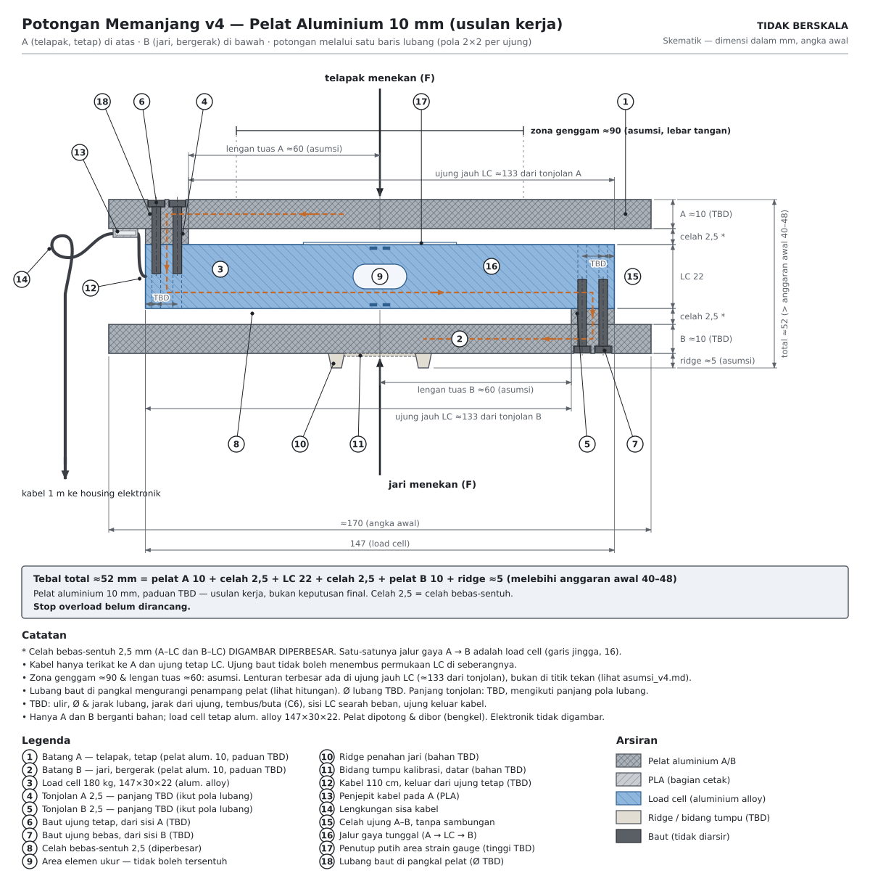
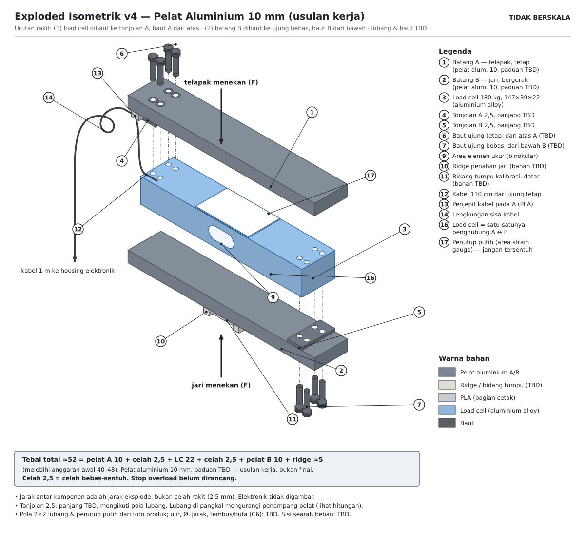
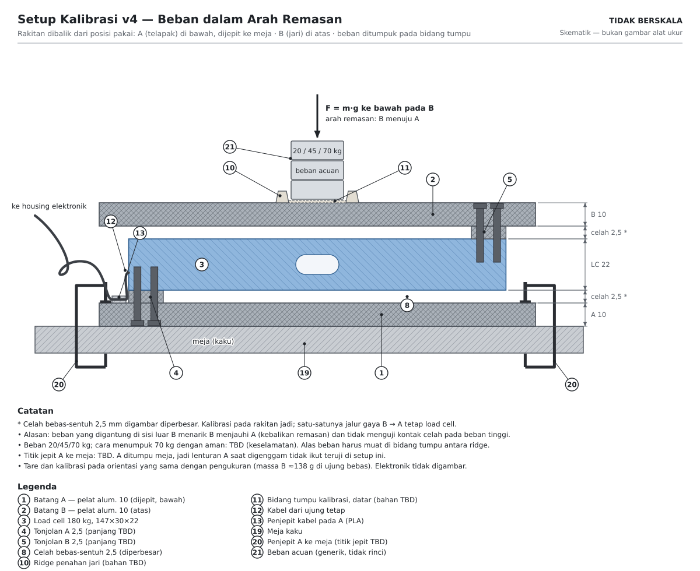

# Desain Housing Load Cell (v4)
**Final Project - Embedded Systems Course**

> Dokumen ini memuat seluruh desain housing grip yang berisi load cell: layout dua batang, dampak ke pembacaan gaya, temuan kekakuan batang, kalibrasi, pengadaan pelat, rujukan, dan asumsi gambar skematik v4 (Lampiran A). Dipisah dari [catatan proyek](catatan-proyek-hgd.md) (v34) supaya catatan proyek tidak melebar. Housing elektronik (ESP32, LCD, HX711, tombol, LED) akan ada di dokumen terpisah: [desain-housing-elektronik.md](desain-housing-elektronik.md) (rencana, belum dibuat).

Tautan balik: [catatan proyek](catatan-proyek-hgd.md) · tabel pengukuran jangka sorong: [Bagian 15 di catatan proyek](catatan-proyek-hgd.md#15-tabel-pengukuran-dengan-jangka-sorong) · spesifikasi S1-S5: [Bagian 13.1](catatan-proyek-hgd.md#131-tabel-spesifikasi-table-1-proposal-21)

Penomoran: bagian di dokumen ini memakai awalan HL (HL1 sampai HL20) dan Lampiran A memakai awalan A, supaya tidak tertukar dengan nomor bagian di catatan proyek. Gambar skematik dan berkas instruksi ada di folder `housing-grip/` pada Project (SVG v2 sampai v4); lihat HL12.

## Daftar isi

- [HL1. Keputusan: dua housing terpisah](#hl1-keputusan-dua-housing-terpisah)
- [HL2. Pembanding alat komersial (dokumen pabrikan, bukan peer-review)](#hl2-pembanding-alat-komersial-dokumen-pabrikan-bukan-peer-review)
- [HL3. Pengamatan foto produk (enam gambar rujukan)](#hl3-pengamatan-foto-produk-enam-gambar-rujukan)
- [HL4. Tata letak terpilih: dua batang dengan load cell di antaranya](#hl4-tata-letak-terpilih-dua-batang-dengan-load-cell-di-antaranya)
- [HL5. Dampak housing terhadap pembacaan gaya](#hl5-dampak-housing-terhadap-pembacaan-gaya)
- [HL6. Setup parametrik di Fusion 360](#hl6-setup-parametrik-di-fusion-360)
- [HL7. Aturan cetak dari modul 3D printing](#hl7-aturan-cetak-dari-modul-3d-printing)
- [HL8. Hal yang harus diukur sebelum cetak](#hl8-hal-yang-harus-diukur-sebelum-cetak)
- [HL9. Temuan kekakuan batang dan usulan bahan](#hl9-temuan-kekakuan-batang-dan-usulan-bahan)
- [HL10. Arah beban kalibrasi](#hl10-arah-beban-kalibrasi)
- [HL11. Pengadaan pelat logam](#hl11-pengadaan-pelat-logam)
- [HL12. Berkas gambar skematik dan catatan pernyataan AI](#hl12-berkas-gambar-skematik-dan-catatan-pernyataan-ai)
- [HL13. Alternatif dan keputusan yang dibatalkan](#hl13-alternatif-dan-keputusan-yang-dibatalkan)
- [HL14. Urutan prototipe: kardus sampai cetak](#hl14-urutan-prototipe-kardus-sampai-cetak)
- [HL15. Mockup modul 3D printing](#hl15-mockup-modul-3d-printing)
- [HL16. Cowork: cara kerja dan brief awal](#hl16-cowork-cara-kerja-dan-brief-awal)
- [HL17. Rujukan untuk memodel di Fusion](#hl17-rujukan-untuk-memodel-di-fusion)
- [HL18. Sumber rujukan housing (bukan peer-review)](#hl18-sumber-rujukan-housing-bukan-peer-review)
- [HL19. Riwayat koreksi dan audit](#hl19-riwayat-koreksi-dan-audit)
- [HL20. Pertanyaan terbuka untuk dosen atau TA dan konsultasi teknik mesin](#hl20-pertanyaan-terbuka-untuk-dosen-atau-ta-dan-konsultasi-teknik-mesin)
- [Lampiran A. Asumsi gambar skematik housing grip (v4, varian aluminium)](#lampiran-a-asumsi-gambar-skematik-housing-grip-v4-varian-aluminium)

*Status: layout dipilih, bahan batang belum final. Pelat PLA 7 mm terbukti terlalu lentur (HL9); usulan kerja adalah pelat aluminium 10 mm dengan celah minimal 2,5 mm, belum diputuskan. Dimensi menunggu pengukuran load cell ([Bagian 15 di catatan proyek](catatan-proyek-hgd.md#15-tabel-pengukuran-dengan-jangka-sorong)). Proposal 3.6 hanya menjelaskan housing elektronik; housing grip di bawah ini adalah pengembangan setelah proposal.*

## HL1. Keputusan: dua housing terpisah

- **Housing grip**: hanya load cell, dua batang penjepit, dan jepit kabel. Kecil, ringan, mudah dilap.
- **Housing elektronik**: PCB kustom dengan ESP32, tombol, LED, resistor, header ke HX711 dan LCD, dengan cutout USB dan kabel load cell (proposal 3.6).
- Alasan: kabel load cell sudah 110 cm (4 kabel dengan shield), jadi elektronik tidak perlu berada di tangan; elektronik terlindung dari keringat dan benturan; dua part kecil lebih mudah dijadwalkan di printer lab (jika satu gagal cetak, yang lain tidak ikut terbuang).
- Konsekuensi: tombol, LED, dan LCD ada di housing elektronik, bukan di grip, sehingga START dan NEXT ditekan dengan tangan lain atau oleh rekan; LED harus terlihat dari posisi duduk protokol; LCD diletakkan di meja dalam jangkauan kabel (sekitar 1 m).
- Pola serupa ada di alat komersial: Biopac dan Vernier memakai grip tanpa elektronik yang tersambung kabel ke unit terpisah (HL18).

## HL2. Pembanding alat komersial (dokumen pabrikan, bukan peer-review)

| Kode | Perangkat | Bentuk dan mekanisme | Rentang | Ukuran dan berat |
|---|---|---|---|---|
| KG1 | Kinvent K-Grip | Silinder, satu tangan, nirkabel | Maks 90 kgF | Tinggi 141 mm, 47 x 61 mm, 170 g |
| GA1 | GripAble | Rangka "C" lebar dan bulat untuk posisi konsisten | Teruji berulang sampai 90 kg | Lingkar 141 mm, 240 g plastik |
| VN1 | Vernier HD-BTA | Strain gauge isometrik, bodi memanjang dengan bantalan di kiri-kanan | 0-600 N (sekitar 61 kgf), aman sampai 850-900 N | Berkabel, tanpa layar |
| BP1 | Biopac SS25LA | Transduser isometrik, batang dengan posisi tangan ditentukan | 0-90 kg, rated 100 kg | Berkabel ke amplifier |
| PP1 | Push-pull aluminium (listing penjual) | Strain gauge, dua tangan | 0-100 kgF | 114 x 217 x 38 mm, 1,1 kg |

Pengamatan: load cell kita (147 mm) saja sudah lebih panjang dari seluruh K-Grip (141 mm), jadi alat kita berada di keluarga transduser lab (Biopac, Vernier, push-pull sekitar 217 mm), bukan alat saku. Prinsip isometrik (sensor nyaris tidak bergerak) menyarankan grip yang kaku dengan defleksi minimal. Diameter dan bentuk grip memengaruhi angka (GripAble membaca sekitar 69% dari Jamar PLUS+), jadi catat diameter grip di laporan dan jangan membandingkan angka mentah dengan norma berbasis Jamar (selaras dengan 13.2).

## HL3. Pengamatan foto produk (enam gambar rujukan)

1. Biopac (diagram sistem MP200): tangan menggenggam tabung tegak, blok sensor di kepala dengan dua lubang bulat; kabel ke amplifier lalu laptop; grafik remasan dengan puncak cukup datar.
2. Biopac batang bercelah: dua batang sejajar (satu lebih tebal, satu lebih tipis dan menonjol), keduanya bercelah panjang; kabel dari ujung bawah. Celah panjang kemungkinan membuat bagian itu melentur terkendali (inferensi). Secara bentuk paling dekat dengan load cell beam kita.
3. Vernier HD-BTA: bodi hitam memanjang dengan bantalan teal di kiri-kanan sebagai titik tekan; kabel dari bawah; tanpa layar.
4. Kemungkinan Kinvent K-Grip: silinder biru tua dengan celah vertikal yang membelah badan jadi dua sisi, tutup datar beraksen oranye di atas. Remasan kemungkinan menutup celah, dengan sensor di antara dua sisi (inferensi).
5. Kemungkinan GripAble: rangka C hijau dengan pelat biru di tengah tempat jari menekan, strip LED di ujung atas dan bawah, tali pergelangan tangan.
6. Dial analog (model Walmart): kepala bulat dengan dial kg, tombol RESET, pegangan berbantalan; tombol RESET setara tare.

Pola: pembaca di kepala dan grip di bawah; kabel keluar dari ujung bawah; dua keluarga mekanisme (batang bercelah dan bodi terbelah atau berbingkai C). Load cell beam kita paling natural di keluarga batang.

## HL4. Tata letak terpilih: dua batang dengan load cell di antaranya

Potongan memanjang dan exploded isometrik (skematik dari Cowork, tidak berskala; celah digambar diperbesar). Nomor callout mengikuti legenda di dalam gambar; angka dalam kurung di daftar bawah merujuk ke callout itu.

Telapak menekan A dari satu sisi dan jari menekan B dari sisi berlawanan. Satu-satunya jalur gaya dari A ke B adalah load cell.

1. (callout 4 dan 6) Ujung tetap load cell dibaut ke tonjolan pada A. Tonjolan inilah yang membuat celah di atas sisi bebas.
2. (callout 8 dan 15) Celah antara tiap batang dan badan load cell harus tetap terbuka pada beban penuh. Batang A dan B ikut melentur, dan lenturannya terbesar di ujung yang berada di atas ujung load cell sebelahnya (HL9). Celah ini bukan stop overload; stop overload belum dirancang. Ukuran: minimal 2,5 mm (usulan kerja) sampai tinggi penutup strain gauge dan lenturan load cell terukur.
3. (callout 5 dan 7) Ujung bebas dibaut ke tonjolan pada B dari sisi berlawanan. Di sisi kiri, B tidak boleh menyentuh badan load cell.
4. (callout 10 dan 11) Ridge penahan jari dan bidang tumpu kalibrasi (permukaan datar) berada di pusat jari. Beban kalibrasi ditumpuk di bidang itu dengan rakitan dibalik (A di bawah, dijepit) supaya arahnya sama dengan remasan (HL10). Titik gantung (eyelet) tidak dipakai karena beban gantung menarik B menjauhi A, kebalikan remasan.
5. (callout 12 sampai 14) Kabel dijepit di A (sisi tetap) dengan lengkungan sisa sebelum keluar, supaya tarikan kabel tidak terbaca sebagai gaya.

Dua batang harus kaku: satu-satunya bagian yang boleh melentur secara berarti adalah load cell. Persyaratan ini tidak dipenuhi oleh pelat PLA 7 mm (HL9). Berbeda dari referensi batang bercelah (Biopac), celah panjang tidak perlu ditiru di jalur beban; celah atau lubang pada batang hanya di luar jalur beban.

Tebal total grip = 2 x tebal batang + 2 x celah + sisi load cell yang searah beban + ridge sekitar 5 mm. Dengan aluminium 10 mm dan sisi 22 mm searah beban: sekitar 50 mm (celah 1,5 mm) atau sekitar 52 mm (celah 2,5 mm); tambah 8 mm bila sisi 30 mm yang searah beban. Kisaran 40-48 mm di draf awal berasal dari pelat PLA 7 mm yang ternyata terlalu lentur, dan itu bukan batas dari spesifikasi. Cek kenyamanannya dengan prototipe kardus lebih dulu. Arah beban load cell harus tegak lurus panjangnya, sesuai panah di badannya; cek panah itu sebelum menentukan sisi mana yang menghadap telapak.

## HL5. Dampak housing terhadap pembacaan gaya

| Efek | Pengaruh ke bacaan | Cara menangani |
|---|---|---|
| Rasio tuas (jarak tekan jari terhadap titik beban load cell) | Mengubah skala | Terserap di `calibration_factor` selama geometri tetap; kalibrasi pada rakitan jadi |
| Posisi tekan jari bergeser antar remasan | Galat acak (rasio berubah) | Ridge atau alur penahan jari; uji dengan beban di beberapa posisi; tidak dikoreksi di firmware karena posisi jari tidak diketahui sensor |
| Jalur gaya paralel (A dan B bersentuhan atau bergesek, kabel tertarik, baut mengenai bagian lain) | Bacaan terlalu kecil dan histeresis | Celah di semua titik selain tonjolan; kabel dijepit di sisi tetap |
| Kelenturan batang (dan creep bila PLA) di jalur beban | Batang yang melentur menyentuh load cell (gaya lewat jalur selain elemen ukur, bacaan terlalu kecil) atau patah; creep PLA menambah drift saat tahan 3-5 detik | Batang kaku, usulan pelat aluminium (HL9); cek residual kalibrasi. PETG bukan solusi: modulusnya sebanding dengan PLA |
| Massa bagian bergerak di ujung bebas | Offset berubah bila orientasi berubah setelah tare. Perkiraan kasar: batang PLA 170 x 30 x 7 mm berbobot sekitar 20-45 g; batang aluminium 10 mm sekitar 138 g; baja 8 mm sekitar 320 g. Semuanya sebanding atau jauh di atas tolerance ±36 g di S1 | Tare dan remas di orientasi yang sama; batang B seringan mungkin yang masih kaku |
| Kekakuan rangka mengubah sensitivitas sistem | `calibration_factor` tidak bisa diambil dari nilai generik atau datasheet | Kalibrasi ulang setelah rakit (FP1) |

**Perlu rumus tambahan di firmware?** Tidak, selama housing kaku, geometri tetap, dan kalibrasi dilakukan pada rakitan jadi: konversi linear `(raw - offset) / scale` yang sudah ada cukup (format yang sama dengan kalibrasi pabrik Vernier: slope dan intercept, VN1). Prosedur: kalibrasi 3 titik (20/45/70 kg), fit linear di Python, hitung residual dan RMSE. Jika residual dalam tolerance, firmware tetap linear. Jika tidak, fit polinomial orde 2 atau tabel piecewise secara offline dan tempel koefisiennya ke firmware. Efek yang paling berbahaya (posisi jari, jalur gaya paralel) tidak bisa diperbaiki dengan matematika dan harus ditangani lewat desain mekanik.

## HL6. Setup parametrik di Fusion 360

1. Buka Change Parameters (Design > Solid > Modify), lalu tambah user parameter lewat Add User Parameter (satu dialog per parameter). Cara cepat: impor [`fusion_parameters_housing_grip.csv`](fusion/fusion_parameters_housing_grip.csv) lewat Import Parameters; format kolom Name, Unit, Expression, Value, Comments, Favorite (contoh format ada di halaman bantuan "Parameters in Fusion"). Tulis satuan di dalam ekspresi (misalnya `147 mm`), pilih satuan mm sejak awal (mengganti satuan parameter yang sudah dipakai bisa bermasalah), dan cek kolom Value setelah memasukkan angka desimal karena pemisah desimal mengikuti pengaturan regional. Parameter: `LC_L` = 147, `LC_W` = 30, `LC_H` = 22, `bar_t` (usulan kerja 10 mm, pelat aluminium), `gap` (usulan kerja 2,5 mm), `lever_arm` = 60, `grip_zone` = 90, dan placeholder `hole_pitch`, `hole_d`, `hole_edge` (tebakan dulu; belum diukur).
2. Component `LoadCell_ref`: kotak 147 x 30 x 22 mm dengan dua lubang di tiap ujung memakai parameter di langkah 1. Hanya acuan, tidak dicetak.
3. Component `Bar_A` dan `Bar_B` terpisah, masing-masing dengan tonjolan setinggi `gap`. Tonjolan A di ujung tetap, tonjolan B di ujung bebas dari sisi berlawanan.
4. Rakit dengan joint, lalu Inspect > Interference: A dan B tidak boleh bersentuhan satu sama lain, dan tidak boleh menyentuh badan load cell selain di tonjolan.
5. Lubang baut dimodelkan lebih besar dari baut asli (aturan modul: M3 menjadi 3,4 mm), chamfer 0,3-0,5 mm di tepi bawah, sisi tonjolan menjadi alas di Z = 0.
6. Cetak kupon kecil dulu (tonjolan dan pola lubang saja) sebelum batang utuh; itu cara termurah memastikan baut dan load cell benar-benar masuk.
7. Bila batang berupa pelat logam, modelnya hanya untuk cek kecocokan dan gambar kerja bengkel; pelat tidak dicetak. Ridge, bidang tumpu, dan jepit kabel tetap bagian cetak PLA.

## HL7. Aturan cetak dari modul 3D printing

- Bahan PLA; printer lab dipakai bergantian (lima printer untuk empat belas kelompok); slot dipesan; hanya cetak setelah slice review disetujui; sertifikasi (Lampiran D) wajib selesai paling lambat Minggu 11 dan menjadi syarat G3 (Minggu 12).
- Anggaran modul untuk bagian utama: maksimal 60 menit dan 40 g per minggu. Itu batas modul; anggaran cetak untuk proyek akhir tidak tercatat di sini.
- Desain: kelonggaran 0,2-0,3 mm per sisi; lubang lewat M3 dimodelkan 3,4 mm; dinding minimal 1,2 mm (gunakan sekitar 2 mm di bagian yang menahan beban); overhang maksimal 45 derajat; chamfer 0,3-0,5 mm di tepi bawah.
- Slicer (Bambu Studio): preset proses 0.20mm Standard, dinding 3 untuk part penahan beban, infill 15-20%, support dimatikan bila desain mengikuti aturan 45 derajat.
- Orientasi: part FDM lebih lemah antar-layer daripada searah layer. Cetak batang rebah dengan sisi tonjolan menghadap plate, supaya layer sejajar panjang batang dan tonjolan tidak butuh support. Sumbu lubang baut vertikal.
- Bila batang berupa pelat logam, itu bukan bagian cetak. Bagian yang tetap dicetak PLA: ridge, bidang tumpu atau lapisan genggam, jepit kabel, dan housing elektronik. Cek ke TA apakah grip hibrida masih memenuhi syarat bagian cetak (G3).

## HL8. Hal yang harus diukur sebelum cetak

Jarak pusat-ke-pusat dan diameter lubang baut di kedua ujung load cell, jarak pusat lubang dari ujung badan, arah panah beban dan sisi (22 atau 30 mm) yang searah panah, serta ujung tempat kabel keluar. Daftar lengkap pengukuran jangka sorong ada di [Bagian 15 di catatan proyek](catatan-proyek-hgd.md#15-tabel-pengukuran-dengan-jangka-sorong).

## HL9. Temuan kekakuan batang dan usulan bahan

*Status: usulan kerja, belum keputusan final.*

Masalah: tiap batang bekerja sebagai kantilever dari tonjolannya. Batang A hanya ditopang di ujung tetap load cell dan batang B hanya di ujung bebas, jadi beban genggam melenturkan batang sepanjang lengan tuas. Dua akibat yang harus dicegah: (1) batang menyentuh badan load cell, sehingga sebagian gaya lewat jalur selain elemen ukur dan bacaan terlalu rendah; (2) batang patah atau meluluh.

Model (teori balok kasar). F = 686 N (70 kgf, batas atas S1), lebar batang b = 30 mm, I = b·h³/12:
- Lenturan di titik beban: δ = F·a³ / (3·E·I), a = jarak pusat beban dari tepi tonjolan.
- Lenturan di titik x ≥ a (ujung batang yang berada di atas ujung load cell sebelahnya): δ(x) = F·a²·(3x - a) / (6·E·I). Nilai ini yang menentukan sentuhan, bukan lenturan di titik beban.
- Tegangan maksimum di pangkal: σ = F·a·(h/2) / I. Momen pangkal = F x a, jadi selama pusat beban tetap, penyebaran beban di zona genggam tidak menurunkannya.
- Penampang berlubang: σ_net = σ · b / (b - n·d) untuk n lubang berdiameter d sejajar lebar; dua lubang Ø6,5 mm memberi faktor sekitar 1,76 bila lubang berada di penampang kritis.
- Asumsi: a = 60 mm (pusat zona genggam sekitar 90 mm, dari gambar rencana), ujung load cell yang jauh x = 133 mm dari tepi tonjolan (147 mm dikurangi tonjolan sekitar 13,5 mm), tonjolan dianggap kaku, E aluminium 70 GPa, baja 200 GPa, PLA sekitar 3 GPa.

Hasil untuk pelat PLA 7 mm (kantilever 120 mm, beban merata): 200 N memberi lenturan sekitar 17 mm dan tegangan sekitar 49 MPa; 400 N sekitar 34 mm dan 98 MPa; 686 N sekitar 58 mm dan 168 MPa. Agar lenturan di titik beban di bawah 0,5 mm pada 686 N dengan a = 60 mm, pelat PLA pejal perlu tebal sekitar 24 mm per batang. Celah 1,5 mm dan kekuatan PLA cetak (puluhan MPa) tidak terpenuhi.

Kandidat pelat logam (F = 686 N, a = 60 mm, x = 133 mm, lebar 30 mm, celah 1,5 mm):

| Pelat | Lenturan ujung jauh | Tegangan pangkal | Tegangan penampang berlubang (2 lubang Ø6,5 mm) | Berat per batang | Tebal total (celah 1,5 mm) |
|---|---|---|---|---|---|
| Aluminium 8 mm | 1,56 mm (melewati celah) | 129 MPa | sekitar 227 MPa | 110 g | 46 mm |
| Baja 6 mm | 1,29 mm | 229 MPa | sekitar 404 MPa | 240 g | 42 mm |
| Baja 8 mm | 0,55 mm | 129 MPa | sekitar 227 MPa | 320 g | 46 mm |
| Aluminium 10 mm | 0,80 mm | 82 MPa | sekitar 145 MPa | 138 g | 50 mm |

Pembacaan: aluminium 8 mm gagal di celah; baja 6 mm terlalu tipis marginnya dan tegangannya mendekati batas luluh baja lunak (sekitar 235 MPa); baja 8 mm lolos untuk penampang utuh (129 MPa) tetapi tegangan penampang berlubang sekitar 227 MPa hampir sama dengan luluh baja lunak (sekitar 235 MPa), dan beratnya 640 g untuk dua batang; aluminium 10 mm ringan dan lolos semua kriteria di atas kertas, dengan konsekuensi tebal total sekitar 50 mm. Tegangan luluh paduan aluminium bervariasi (kira-kira 200-275 MPa); grade belum diketahui.

Yang belum diketahui dan mengurangi margin: tinggi penutup putih strain gauge, lenturan load cell sendiri pada 70 kgf (ujung bebasnya naik mendekati batang), diameter lubang, kekakuan tonjolan dan sambungan baut, dan grade aluminium. Anggaran celah: lenturan ujung jauh + lenturan load cell + tinggi penutup + margin.

Usulan kerja (belum keputusan): pelat aluminium 10 mm (grade 6061-T6 atau 5052, tanyakan ke penjual), celah minimal 2,5 mm, tebal total sekitar 52 mm. Sebelum diputuskan: cek kenyamanan genggam dengan prototipe kardus; ukur penutup strain gauge dan lubang load cell ([Bagian 15 di catatan proyek](catatan-proyek-hgd.md#15-tabel-pengukuran-dengan-jangka-sorong)); validasi model lentur dengan uji sederhana (pelat PLA 30 x 7 mm dijepit satu ujung, beban 5 kg di jarak 120 mm; prediksi sekitar 11 mm, dan bila hasil jauh berbeda maka nilai E perlu diperbaiki). Alternatif yang tidak lolos: PLA setebal sekitar 24 mm (genggaman terlalu lebar); memperpendek lengan tuas (zona genggam sekitar 90 mm tidak muat). Proposal G1 (risiko enclosure) menyebut fallback "PETG atau bracket logam": PETG tidak menyelesaikan masalah karena modulusnya sebanding dengan PLA; yang relevan adalah bracket atau pelat logam.

Celah dan stop overload: karena batang sudah mendekati badan load cell pada beban penuh, celah tidak bisa sekaligus menjadi stop overload. Proteksi overload membutuhkan fitur terpisah yang belum dirancang.

Bahan alternatif untuk batang (tebal minimum agar lenturan ujung jauh ≤ 1 mm pada 686 N; model sama dengan di atas; modulus nilai umum yang bervariasi antar produk; kekuatan bahan non-logam tidak diperiksa):

| Bahan | Modulus (kira-kira) | Tebal minimum | Cocok? |
|---|---|---|---|
| PLA | 3 GPa | ≈26,5 mm | Tidak |
| Multipleks/kayu | 6-12 GPa | ≈17-21 mm | Tidak (juga lembap dan creep) |
| Fiberglass epoksi (FR4/G10) | 18-24 GPa | ≈13-15 mm | Tidak, terlalu tebal |
| Aluminium | 70 GPa | ≈9,3 mm | Ya, tebal 10 mm |
| Baja | 200 GPa | ≈6,5 mm | Ya, tetapi margin tegangan penampang berlubang tipis pada baja lunak |

Kesimpulan: bahan non-logam tidak menyelesaikan masalah pada tebal yang tersedia; yang tersisa adalah aluminium atau baja, dengan cara pengadaan yang berbeda (HL11). Pilihan yang tidak disarankan: PLA dengan inti logam di dalam (beban dan momen di pangkal harus lewat PLA di sekitar baut), dan menurunkan beban desain S1 (mengubah spesifikasi di proposal).

## HL10. Arah beban kalibrasi

Remasan mendorong B ke arah A. Beban yang digantung pada eyelet di sisi luar B menarik B menjauhi A, jadi arahnya kebalikan remasan dan tidak menguji kontak celah pada beban tinggi. Kalibrasi sebaiknya dalam arah remasan: rakitan dibalik (A di bawah dan dijepit ke meja, B di atas), beban acuan 20/45/70 kg ditumpuk pada bidang tumpu datar di pusat zona genggam. Cara menumpuk 70 kg dengan aman dan ketersediaan beban acuan masih terbuka (ini juga risiko di Bagian 6 proposal G1). Keterbatasan setup ini (dari gambar v4): bidang tumpu di antara dua ridge hanya selebar sekitar 22 mm sehingga tumpukan 70 kg tidak stabil dan perlu adaptor alas; A ditumpu meja sehingga lenturan A saat digenggam tidak teruji, hanya celah sisi B yang teruji pada beban tinggi; titik jepit A ke meja terbatas pada sisa batang sekitar 11,5 mm di tiap ujung. Alternatif untuk beban tinggi adalah kalibrasi komparatif terhadap timbangan referensi (FP1), yang belum dirancang. Soal orientasi: kemiringan faktor skala (slope) tidak bergantung orientasi pada pendekatan pertama, sedangkan offset berubah sekitar massa B (sekitar 138 g untuk aluminium 10 mm). Karena auto-tare terjadi di SIAP pada tiap percobaan, kalibrasi dalam orientasi terbalik tetap berlaku untuk slope; yang perlu dijaga adalah orientasi alat antara tare dan remasan.

## HL11. Pengadaan pelat logam

- Kata kunci marketplace (listing Tokopedia yang ditemukan memakai ejaan beragam): `plat strip aluminium 10mm`, `plat almunium tebal 10mm lebar 30mm`, `aluminium flat bar 30x10`, tambahkan `potong custom`; untuk jasa: `jasa potong plat aluminium`, `jasa bor plat`. Untuk baja (listing belum diverifikasi): `besi strip`, `plat strip besi 30x6`, `plat besi 6mm potong`. Ukuran stok yang terlihat berlebar 40 mm; lebar 30 mm mungkin perlu dipotong.
- Minta ukuran 170 x 30 mm (tebal sesuai keputusan), 2 pcs plus 1 cadangan, grade paduan dicantumkan, tepi di-deburr, tanpa lubang (dibor setelah jarak lubang load cell terukur).
- Anggaran: BOM proposal Rp253.875 sebelum ongkir, sisa sekitar Rp46.125 dari batas Rp300.000; harga plat dan jasa belum diverifikasi. Tambahkan ke BOM dan simpan bukti beli.
- Tahan pembelian sampai tebal pelat diputuskan dan lubang load cell terukur.
- Cek listing strip aluminium (gambar promosi bukan spesifikasi): lebar yang tersedia untuk tebal 10 mm (butuh 30 mm; 35-40 mm masih mungkin dengan penyesuaian gambar), panjang dan apakah bisa dipotong 170 mm (stok per batang panjang bisa melewati sisa anggaran), serta grade dan temper paduan (misalnya 6061-T6 atau 5052-H32). Jika penjual tidak bisa menyebutkan grade, anggap paduannya lunak (luluh puluhan sampai sekitar 100 MPa) dan hitung ulang atau cari penjual yang mencantumkan grade.
- Penjual strip umumnya hanya menjual stok atau potong panjang; pengeboran dikerjakan di tempat lain. Opsi: bengkel bubut atau jasa bor (kata kunci `bengkel bubut`, `jasa bor plat aluminium`, `jasa CNC milling aluminium`); bengkel atau lab kampus dengan bor duduk; atau bor sendiri dengan templat bor PLA yang lubangnya sesuai hasil ukur. Jasa CNC atau laser dengan file gambar kemungkinan melewati anggaran; minta penawaran dulu.
- Untuk pengeboran: diameter lubang pelat sekitar 0,5 mm lebih besar dari baut; hindari counterbore di pangkal pelat 10 mm (menipiskan bagian yang menahan momen terbesar); jangan mengebor menembus lubang berulir load cell, tandai posisi dari lubangnya.
- Rencana: beli strip sudah dipotong 170 mm tanpa lubang, bor setelah ukuran lubang load cell pasti, bawa gambar kerja ke bengkel. Lembar gambar kerja satu halaman (posisi dan diameter lubang, ukuran pelat, grade, toleransi) disiapkan setelah ukuran terukur.

## HL12. Berkas gambar skematik dan catatan pernyataan AI

- Gambar yang dipasang di dokumen ini (salin ke folder `img/` di samping dokumen): `potongan_memanjang_v4_logam.svg` dan `exploded_isometrik_v4_logam.svg` (HL4), `kalibrasi_setup_v4.svg` (HL10). Semua gambar skematik dibuat dengan Claude (Cowork) dari instruksi tertulis, disimpan di folder `housing-grip/` pada Project: `potongan_memanjang.svg`, `exploded_isometrik.svg`, `tampak_atas.svg`, `asumsi.md` (v2); `potongan_memanjang_v3.svg`, `potongan_memanjang_v3_logam.svg`, `exploded_isometrik_v3.svg`, `exploded_isometrik_v3_logam.svg`, `tampak_atas_v3.svg`, `asumsi_v3.md` (v3); `potongan_memanjang_v4_logam.svg`, `exploded_isometrik_v4_logam.svg`, `kalibrasi_setup_v4.svg`, `asumsi_v4.md` (v4, varian aluminium 10 mm). Instruksi: `koreksi.md` (v2 ke v3) dan `koreksi_v2.md` (v3 ke v4: aluminium 10 mm, celah 2,5 mm, bidang tumpu kalibrasi). Gambar v3 dan v4 sudah ditinjau secara visual dan sesuai instruksi koreksi. Hasil v4 (aluminium 10 mm, celah 2,5 mm): lenturan ujung jauh 0,80 mm pada 686 N sehingga sisa celah minimal 1,70 mm sebelum lenturan load cell dan tinggi penutup strain gauge diketahui; tegangan penampang berlubang 130-145 MPa; tebal total 52 mm melebihi kisaran 40-48 mm; aluminium 8 mm dengan celah 2,5 mm lolos celah tetapi gagal tegangan (203-227 MPa).
- Untuk Pernyataan Penggunaan AI (Lampiran C), kolom "anything the tool got wrong" yang ditekankan Panduan G1: (1) layout awal mengasumsikan batang kaku tanpa menghitung kekakuan, ditemukan lewat pemeriksaan asumsi Cowork; (2) instruksi koreksi menyatakan penyebaran beban menurunkan tegangan baja di pangkal, salah karena momen pangkal ditentukan pusat beban; (3) titik gantung kalibrasi arahnya kebalikan remasan; (4) hitungan awal hanya melaporkan lenturan di titik beban, bukan di ujung jauh yang menentukan sentuhan; (5) `koreksi_v2.md` memuat dua instruksi yang bertentangan (catatan "stop overload belum dirancang" wajib ada, tetapi kata itu juga dilarang muncul), ditemukan oleh Cowork yang lalu mengikuti instruksi pertama.

## HL13. Alternatif dan keputusan yang dibatalkan

- **Kantilever tunggal** (load cell sendirian, satu ujung tetap, pegangan di ujung bebas): konsep awal. Posisi tekan tangan mengubah momen sehingga bacaan bergantung titik genggam, dan bentuk pegangan belum jelas. Digantikan layout dua batang (HL4), yang memberi satu jalur gaya dan posisi tangan yang bisa dikendalikan dengan ridge.
- **Dua batang paralel dengan load cell berdampingan** (usulan pengguna forum, FP1): lebih tidak peka terhadap posisi genggam, tetapi butuh beberapa elemen sejajar dengan presisi, lebih rumit dicetak dan dirakit. Tidak dipilih untuk cakupan proyek, dan belum dicoba.
- **Sensor sentuh kapasitif TTP223 di titik tumpu ibu jari** untuk memvalidasi posisi jari sebagai syarat mulai: dibatalkan oleh tim, alasan tidak dicatat. Pertimbangan yang sempat muncul: logika deteksinya tersembunyi di dalam modul sehingga kurang bisa dijelaskan saat penilaian, dan sensor ini tidak menambah cakupan Sub-CPMK. Akibatnya teknik genggam hanya dijaga lewat instruksi verbal ([Bagian 13.2 di catatan proyek](catatan-proyek-hgd.md#132-what-the-device-will-not-do-proposal-22)).
- **Pelat PLA 7 mm** sebagai batang (HL9), **celah sebagai stop overload** (HL9), dan **titik gantung kalibrasi** (HL10): dibatalkan.
- **Elektronik di dalam pegangan** (tombol, LED, LCD di grip): dibatalkan, sejak keputusan dua housing terpisah (HL1).

## HL14. Urutan prototipe: kardus sampai cetak

- **Kardus** menguji geometri dan ergonomi: posisi tangan, tebal total sekitar 52 mm, panjang sekitar 170 mm, jangkauan zona genggam, dan titik keluar kabel. Load cell asli bisa ditempel pada prototipe kardus untuk cek penyaluran gaya. Kardus tidak menguji kekuatan, kekakuan, toleransi lubang, atau pas baut, dan melentur jauh lebih besar dari pelat sungguhan.
- **Urutan:** prototipe kardus, ukur load cell ([Bagian 15 di catatan proyek](catatan-proyek-hgd.md#15-tabel-pengukuran-dengan-jangka-sorong)), model parametrik di Fusion (HL6), kupon uji pas cetak (tonjolan dan pola lubang), uji lentur pelat (HL9), rakit, lalu kalibrasi (HL10).
- Kekakuan hanya bisa divalidasi lewat hitungan (HL9) dan uji lentur, bukan lewat kardus.

## HL15. Mockup modul 3D printing

- Mockup 3D untuk modul 3D printing dikerjakan dengan bantuan Copilot (bukan Claude); catat di Pernyataan Penggunaan AI. Berkas dan isinya tidak tercatat di catatan ini.
- Acuan dari modul 3D printing: pelat dasar Modul 4 berupa grid 8 x 5 lubang Ø3,4 mm dengan pitch 20 mm pada pelat 170 x 110 x 4 mm; bagian modul harus tersekrup ke pelat itu lewat dua lubang M3 yang jatuh pada kelipatan 20 mm (jarak 20, 40, atau 60 mm); lubang M3 dimodelkan 3,4 mm. Aturan ini berlaku untuk bagian modul, bukan otomatis untuk housing grip proyek.

## HL16. Cowork: cara kerja dan brief awal

- **Kemampuan** (Help Center Claude, "Can Claude produce images?" dan "Custom visuals in chat and Cowork"): Claude tidak membuat foto atau ilustrasi realistis; yang bisa dibuat adalah diagram, grafik, dan visual interaktif berbasis HTML dan SVG. Hal ini berlaku juga di Cowork; hasilnya bisa diunduh sebagai `.svg` atau `.html`, dan model yang lebih kuat disarankan untuk visual kompleks. Render realistis diperoleh dari Render workspace di Fusion setelah modelnya jadi.
- **Cara kerja Cowork:** ia bekerja pada folder yang diizinkan, bukan attachment per pesan; ia bisa membaca gambar (.png, .jpg, .svg). Isi folder yang disarankan: foto load cell asli (kedua sisi, panah beban, lubang baut, tempat kabel keluar), tangkapan layar model Fusion, dan gambar referensi gaya. Jangan memasukkan seluruh catatan proyek.
- **Alur yang dipakai:** brief awal (di bawah), gambar v2, `koreksi.md`, v3, `koreksi_v2.md`, v4.
- **Brief awal (ringkas):** gambar teknis skematik (bukan foto) untuk housing grip yang hanya berisi load cell. Dua batang A (telapak, tetap) dan B (jari, bergerak) dengan load cell di antaranya; ujung tetap load cell dibaut ke tonjolan A, ujung bebas dibaut ke tonjolan B dari sisi berlawanan; celah antar bagian dan jalur gaya tunggal lewat load cell; ridge dan titik beban kalibrasi di sisi luar B; kabel keluar dari ujung tetap dan dijepit di A; nilai yang belum diukur ditulis "TBD" dan tidak diisi angka; keluaran tiga SVG (potongan, exploded, tampak atas) dan daftar asumsi.

## HL17. Rujukan untuk memodel di Fusion

- **Dipakai:** `potongan_memanjang_v4_logam.svg` (layout dan dimensi), `exploded_isometrik_v4_logam.svg` (arah baut, pola lubang, urutan rakit), `asumsi_v4.md` (angka yang pasti dan yang TBD, hitungan kekakuan), catatan ini (HL6 parameter, HL7 aturan cetak, [Bagian 15 di catatan proyek](catatan-proyek-hgd.md#15-tabel-pengukuran-dengan-jangka-sorong) pengukuran), dan `kalibrasi_setup_v4.svg` hanya untuk merancang fixture kalibrasi.
- **Tidak dipakai:** semua file v2 dan v3 (digantikan), `koreksi.md` dan `koreksi_v2.md` (instruksi untuk Cowork), dan `referensi_layout.png` (sketsa konsep lama).
- Gambar tidak berskala, jadi jangan di-import sebagai sketsa; ambil hanya angka yang tertulis. Parameter awal: `bar_t` = 10, `gap` = 2,5, `lever_arm` = 60, `grip_zone` = 90. Yang dimodelkan: load cell sebagai acuan (tidak dicetak), Bar_A dan Bar_B sebagai pelat aluminium (model untuk cek kecocokan dan gambar kerja bengkel, bukan dicetak), dan bagian cetak PLA (ridge, bidang tumpu, jepit kabel).
- **Langkah kerja dan parameter siap impor** (folder `fusion/` di samping dokumen ini): [work_instructions_fusion_housing_grip.md](fusion/work_instructions_fusion_housing_grip.md) berisi langkah modelling di Fusion fase demi fase, dan [fusion_parameters_housing_grip.csv](fusion/fusion_parameters_housing_grip.csv) berisi 15 user parameter (impor belum diuji di Fusion).

## HL18. Sumber rujukan housing (bukan peer-review)

### HL18.1 Dokumentasi alat komersial (dokumen pabrikan dan penjual, BUKAN peer-review)

*Dipakai hanya sebagai pembanding bentuk dan rentang untuk desain housing (HL2). Halaman produk Biopac diblokir bot detection dan halaman produk Vernier terkena rate limit saat dibuka; data keduanya diambil dari datasheet dan manual yang tampil di hasil pencarian.*

| Kode | Isi (parafrase) | Sumber |
|---|---|---|
| KG1 | Kinvent K-Grip: bentuk silinder; tinggi 141 mm, lebar 47 mm, kedalaman 61 mm, 170 g; gaya maksimum 90 kgF; akuisisi 2000 Hz; nirkabel Bluetooth; baterai 12 jam | kinvent.com/kinvent-product/hand-dynamometer-k-grip/ dan jlwforce.com/products/kinvent-grip-dynamometer |
| GA1 | GripAble (Able Care): bentuk "C" yang lebih lebar dan bulat untuk menjaga posisi genggaman konsisten; lingkar 141 mm (Jamar 128 mm pada posisi 2); plastik 240 g (Jamar logam 490 g); diklaim tahan genggam berulang sampai 90 kg dan benturan jatuh; rata-rata membaca sekitar 69% dari Jamar PLUS+ untuk orang yang sama karena beda ukuran, bentuk, dan berat | able-care.co/blog/hand-dynamometer-guide |
| VN1 | Vernier HD-BTA: sensor gaya isometrik berbasis strain gauge; rentang 0-600 N (sekitar 61 kgf); resolusi 0,2159 N (halaman lain 0,2141 N); batas aman 850 N (halaman lain 900 N); akurasi ±0,6 N; daya 7 mA pada 5 VDC; kalibrasi pabrik berupa rumus linear slope dan intercept (contoh untuk kg: 18,0320 dan -1,9890); bisa untuk genggam atau jepit | vernier.com/hd-bta dan vernier.com/til/1431 |
| BP1 | Biopac SS25LA: transduser genggam isometrik; rentang isometrik 0-90 kg (kit BSL menyebut 0-50 kgf), rated 100 kg, sensitivitas 0,75 kg; posisi tangan didefinisikan (telapak melintang di batang yang lebih pendek; pada model lama di bagian atas busa, tepat di bawah lubang); rancangan isometrik disebut meningkatkan keterulangan | seas.upenn.edu/~belab/equipment/Biopac_sensors/SS25LA_hand_dynamometer.pdf dan biopac.com/?p=9303 |
| PP1 | Listing penjual (IndiaMART), push-pull aluminium berbasis strain gauge untuk dua tangan: 0-100 kgF, diameter pegangan 25 mm, 114 x 217 x 38 mm, 1,1 kg. Kualitas sumber rendah | m.indiamart.com/proddetail/push-pull-dynamometer-7472334988.html |
| SP1 | Dynamometer tipe pegas (entri database Rehadat): rumah aluminium, pegangan dapat disetel menurut ukuran tangan, sampai 100 kg | eastin.eu (database Rehadat, entri id-tec 101346.0) |
| WM1 | Listing Walmart: model dial analog pegas berbahan ABS (dial 42 mm); model digital di daftar serupa hanya menyebut kapasitas 90-120 kg tanpa detail mekanis. Hanya konteks pasar | walmart.com (listing produk dynamometer genggam) |

### HL18.2 Diskusi komunitas (BUKAN sumber akademik)

| Kode | Isi (parafrase) | Sumber |
|---|---|---|
| FP1 | Utas Arduino Forum tentang kalibrasi load cell straight-bar untuk dynamometer genggam: (a) kapasitas 20 kg terlalu kecil untuk genggam, disarankan 50-100 kg; (b) load cell dibaut di kedua ujung ke batang kaku, lalu beban berbobot diketahui digantung di titik genggam untuk kalibrasi; (c) load cell mengukur deformasi, bukan gaya langsung, dan menambah batang kaku mengubah kekakuan sistem sehingga `calibration_factor` harus dikalibrasi ulang setelah dirakit; (d) dua pendekatan kalibrasi: beban acuan diketahui, atau perbandingan statistik terhadap alat referensi | forum.arduino.cc/t/calibrating-a-straight-bar-load-cell/501923 |

## HL19. Riwayat koreksi dan audit

- v1: dipisah dari catatan proyek (v31); asumsi gambar skematik v4 digabung sebagai Lampiran A.
- v2: diagram ASCII di HL4 diganti SVG mandiri (konsep, nomor callout 1-5).
- v4: tautan ke langkah kerja Fusion dan CSV parameter di folder `fusion/` ditambahkan (HL6, HL17).
- v3: diagram konsep itu diganti gambar Cowork v4: potongan dan exploded di HL4, setup kalibrasi di HL10; daftar HL4 merujuk ke nomor callout gambar v4. Gambar konsep `hl4-layout.svg` tidak dipakai lagi.

### Audit v27: desain housing

1. Layout awal desain housing (catatan proyek v26) mengasumsikan batang kaku tanpa menghitung kekakuan. Pemeriksaan gambar skematik menunjukkan pelat PLA 7 mm melentur puluhan mm pada 70 kgf (HL9). Diperbaiki di v27: status bahan, tebal total, dan klaim "celah = stop overload" di 14.4.
2. Klaim bahwa titik gantung kalibrasi melewati jalur yang sama dengan remasan salah arah (HL10); diganti bidang tumpu.
3. Instruksi koreksi gambar sempat menyatakan penyebaran beban menurunkan tegangan di pangkal; salah (HL9).
4. Proposal G1 Bagian 6 (risiko enclosure) menyebut fallback "cetak ulang dengan PETG atau bracket logam". PETG tidak menyelesaikan kekakuan karena modulusnya sebanding dengan PLA; yang relevan adalah bracket atau pelat logam.
5. Proposal 3.6 belum memuat housing grip terpisah (sudah tercatat di Audit v26).

### Audit v28: hasil gambar v4

1. HL9 menulis baja 8 mm "lolos di atas kertas". Itu hanya benar untuk penampang utuh; dengan dua lubang Ø6,5 mm tegangannya sekitar 227 MPa, hampir sama dengan luluh baja lunak. Dikoreksi di v28.
2. Gambar v4 memenuhi instruksi: aluminium 10 mm, celah 2,5 mm sebagai celah bebas-sentuh, tanpa eyelet, bidang tumpu kalibrasi, penanda ujung jauh sekitar 133 mm, dan penjumlahan tebal total.
3. Tebal total 52 mm melebihi kisaran 40-48 mm di draf awal; kisaran itu bukan batas dari spesifikasi, tetapi kenyamanan genggam perlu dicek dengan prototipe kardus sebelum bahan diputuskan.
4. Setup kalibrasi v4 punya keterbatasan (HL10) yang belum punya solusi.

## HL20. Pertanyaan terbuka untuk dosen atau TA dan konsultasi teknik mesin

Keputusan bahan batang menunggu jawaban dosen atau TA, atau konsultasi dengan mahasiswa teknik mesin.

Untuk dosen atau TA:
1. Apakah grip hibrida (pelat logam dan bagian cetak PLA) memenuhi syarat bagian cetak dan enclosure cetak 3D di G3?
2. Apakah pelat logam dan jasa bor masuk anggaran Rp300.000 dengan bukti beli? Sisa anggaran sekitar Rp46 ribu sebelum ongkir.
3. Apakah bengkel kampus atau bor duduk boleh dipakai mahasiswa, dan apakah ada biayanya?
4. Apakah perubahan housing (grip terpisah, batang logam) perlu dicatat sebagai revisi proposal di luar 3.6?
5. Apakah lab punya anak timbang atau cara aman untuk beban kalibrasi 70 kg?
6. Tenggat gerber: Minggu 7 (BRP) atau Minggu 8 (Panduan G1); lihat konflik di catatan proyek.

Untuk konsultasi teknik mesin:
1. Cek hitungan lentur: kantilever, beban 686 N di 60 mm dari tonjolan, pelat aluminium 10 mm (E ≈ 70 GPa). Apakah celah 2,5 mm cukup, dan apakah tegangan penampang berlubang (≈130-145 MPa) wajar?
2. Apakah ada cara menyalurkan beban ke load cell yang lebih kaku dalam tebal total sekitar 52 mm?
3. Grade aluminium strip apa yang umum dijual di sini (6061 atau 5052), dan bagaimana cara mengeceknya?
4. Cara mengebor lubang baut yang akurat dengan alat sederhana (templat bor, mata bor, toleransi diameter).

Bahan yang dibawa: potongan v4 (`potongan_memanjang_v4_logam.svg`) dan hitungan di HL9; sebutkan yang berupa asumsi (beban 686 N, lengan tuas 60 mm, beban terpusat).

## Lampiran A. Asumsi gambar skematik housing grip (v4, varian aluminium)

Dikerjakan dari `koreksi_v2.md` (v3 → v4) dengan konteks bagian HL4, HL5, HL9, dan HL10 dokumen ini. File v2 dan v3 tidak ditimpa. Semua gambar **tidak berskala**, dan celah 2,5 mm digambar diperbesar.

| File v4 | Isi |
|---|---|
| `potongan_memanjang_v4_logam.svg` | Potongan memanjang, pelat aluminium 10 mm, celah 2,5 mm, dimensi lengan tuas dan ujung jauh (≈133), bidang tumpu kalibrasi |
| `exploded_isometrik_v4_logam.svg` | Exploded isometrik, pelat aluminium 10 mm, tonjolan 2,5 mm, bidang tumpu kalibrasi |
| `kalibrasi_setup_v4.svg` | Skema kalibrasi dalam arah remasan: rakitan dibalik, A dijepit ke meja, beban ditumpuk di bidang tumpu |

*Lampiran ini adalah isi `asumsi_v4.md` (dibuat dengan Cowork), digabung ke dokumen ini. Penomoran di dalam lampiran memakai awalan A (A1, A2.1, ...); rujukan lama seperti "bagian 2.5" di teks asli sama dengan A2.5. Bagian A2 tumpang tindih dengan HL9 (hitungan kekakuan) tetapi memuat rincian tambahan: anggaran celah, tegangan penampang berlubang untuk dua diameter lubang, dan keterbatasan kalibrasi. Hasil hitungan keduanya konsisten (selisih tidak lebih dari 1,5%).*

Varian PLA tidak digambar ulang. v3 tetap berlaku sebagai konsep awal dengan peringatan kekakuan.

### A1. Perubahan dari v3

1. **Bahan A dan B:** pelat aluminium 10 mm (paduan TBD). Di v3 ≈8 mm. Arsiran logam sama dengan v3. Load cell tidak berubah.
2. **Celah:** 2,5 mm di semua tempat (tinggi tonjolan 2,5 mm). Di v3 ≈1,5 mm.
3. **Tebal total ≈52 mm** = 10 + 2,5 + 22 + 2,5 + 10 + ridge ≈5. Penjumlahan ini tertulis di potongan dan exploded.
4. **Fungsi celah:** sekarang disebut "celah bebas-sentuh". Kata "stop overload" dihapus dari callout dan legenda, dan diganti catatan "Stop overload belum dirancang."
5. **Eyelet dihapus,** diganti bidang tumpu kalibrasi. Bidang ini berupa permukaan datar di sisi luar B, di antara dua ridge, di pusat zona genggam. Ridge tetap ada. Bahan ridge dan bidang tumpu: TBD (PLA tempel atau permukaan pelat itu sendiri). Di gambar keduanya diberi warna "TBD" tersendiri, bukan PLA.
6. **Panjang tonjolan:** ditulis "TBD, mengikuti panjang pola lubang". Panjang ≈13,5 mm dari v3 tidak lagi ditandai sebagai nilai.
7. **Lubang pada pelat:** Ø TBD. Ada callout baru (18) dan catatan "lubang di pangkal mengurangi penampang pelat (lihat A2)".
8. **Dimensi baru:** "ujung jauh LC ≈133 dari tonjolan A" dan "… dari tonjolan B" pada potongan. Zona genggam ≈90 mm dan lengan tuas ≈60 mm tetap seperti v3.
9. **Gambar baru `kalibrasi_setup_v4.svg`.**

#### Pertentangan dengan `asumsi_v3.md` (instruksi v4 diikuti)
- **Celah dan bahan:** v3 memakai celah ≈1,5 mm dan pelat aluminium ≈8 mm. v4 memakai 2,5 mm dan 10 mm.
- **Stop overload:** v3 (bagian 2.3) menyebut celah sisi bebas sebagai stop overload yang "perlu dicek ulang". v4 menetapkan celah hanya sebagai celah bebas-sentuh, dan stop overload belum dirancang.
- **Eyelet:** v3 mempertahankan eyelet PLA dan menandai kekuatannya perlu dicek. v4 menghapus eyelet.
- **Panjang tonjolan:** v3 menurunkan panjang tonjolan ≈13,5 mm dari asumsi lengan tuas. v4 menjadikannya TBD. Gambar v4 masih memakai proporsi yang sama, hanya sebagai simbol.
- **Tebal total:** v3 menulis anggaran tebal 40–48 mm. ≈52 mm di v4 **melampaui** anggaran itu (lihat A2.5).

#### Pertentangan di dalam `koreksi_v2.md`
- A.4 meminta catatan "stop overload belum dirancang". E.2 meminta "tidak ada kata 'stop overload' di gambar v4". Saya mengikuti A.4: frasa itu hanya muncul sebagai catatan wajib tersebut, satu kali di potongan dan satu kali di exploded. Tidak ada callout atau legenda yang menyebut celah sebagai stop overload. Gambar kalibrasi tidak memuat frasa itu.
- Kata "eyelet" tidak muncul di ketiga SVG v4. Alasan kalibrasi ditulis sebagai "beban yang digantung di sisi luar B".

### A2. Hitungan kekakuan

#### Model
- **Model:** teori balok kantilever. Lebar b = 30 mm, I = b·h³/12. F = 686 N (70 kgf, batas atas S1). a = 60 mm (pusat beban dari tepi tonjolan). x = 133 mm (ujung jauh load cell dari tepi tonjolan).
- **Lenturan di titik beban:** δ = F·a³ / (3·E·I)
- **Lenturan di x ≥ a:** δ(x) = F·a²·(3x − a) / (6·E·I)
- **Tegangan di pangkal:** σ = F·a·(h/2) / I. Momen pangkal = F·a, jadi selama pusat beban tetap, penyebaran beban tidak menurunkannya.
- **Penampang berlubang:** σ_net = σ·b / (b − n·d), dengan n = 2 lubang sejajar lebar.
- **E:** aluminium 70 GPa, baja 200 GPa.
- **Keterbatasan:**
  - Tonjolan dan sambungan baut dianggap kaku.
  - Beban dianggap terpusat di a.
  - Anisotropi cetak tidak relevan untuk logam.
  - σ_net memakai momen penuh F·a seolah lubang tepat di tepi tonjolan. Ini konservatif, karena lubang sebenarnya berada di dalam tonjolan.
  - Lenturan load cell sendiri tidak dihitung (TBD).
  - x = 133 mm diturunkan dari tonjolan ≈13,5 mm. Kalau tonjolan ternyata lebih panjang, a dan x sama-sama mengecil, sehingga hasil di bawah konservatif selama pusat zona genggam tetap di tengah batang.
  - Ini hitungan kasar untuk arah desain, bukan verifikasi.

#### A2.1 Tabel utama: aluminium 10 mm, celah 2,5 mm (dibandingkan dengan pelat lain)

| Pelat | Lenturan titik beban | Lenturan ujung jauh | σ pangkal | σ_net 2 × Ø5,5 | σ_net 2 × Ø6,5 | Berat/batang | Tebal total, celah 1,5 | Tebal total, celah 2,5 | Sisa celah 2,5* |
|---|---|---|---|---|---|---|---|---|---|
| **Aluminium 10 mm** | **0,28 mm** | **0,80 mm** | **82 MPa** | **130 MPa** | **145 MPa** | **138 g** | 50 mm | **52 mm** | **≥ 1,70 mm** |
| Aluminium 8 mm | 0,55 mm | 1,56 mm | 129 MPa | 203 MPa | 227 MPa | 110 g | 46 mm | 48 mm | ≥ 0,94 mm |
| Baja 6 mm | 0,46 mm | 1,29 mm | 229 MPa | 361 MPa | 404 MPa | 240 g | 42 mm | 44 mm | ≥ 1,21 mm |
| Baja 8 mm | 0,19 mm | 0,55 mm | 129 MPa | 203 MPa | 227 MPa | 320 g | 46 mm | 48 mm | ≥ 1,95 mm |

\* Sisa celah = 2,5 − lenturan ujung jauh, sebelum nilai TBD diketahui.

**Perbandingan dengan nilai acuan `koreksi_v2.md`:** semua selisih ≤ 1,5%. Selisih terbesar adalah lenturan titik beban baja 8 mm: 0,193 vs 0,19, karena pembulatan. Tidak ada yang melewati batas 10%, jadi tidak ada yang perlu dijelaskan.

#### A2.2 Apakah celah 2,5 mm terlampaui di bawah beban?
- **Aluminium 10 mm:** lenturan terbesar 0,80 mm di ujung jauh, jadi **celah 2,5 mm tidak terlampaui** oleh lenturan pelat saja. Sisanya ≥ 1,70 mm sebelum nilai TBD diperhitungkan.
- **Pembanding (celah 2,5 mm):** aluminium 8 mm menyisakan ≥ 0,94 mm, baja 6 mm ≥ 1,21 mm, dan baja 8 mm ≥ 1,95 mm. Dengan celah lama 1,5 mm, aluminium 8 mm gagal (−0,06 mm) dan aluminium 10 mm menyisakan 0,70 mm.

#### A2.3 Anggaran celah
Celah 2,5 mm harus menampung empat hal:

| Komponen | Nilai |
|---|---|
| Lenturan ujung jauh pelat (Al 10, 686 N) | 0,80 mm |
| Lenturan load cell sendiri pada 70 kgf (ujung bebas bergerak ke arah A dan ikut membawa pangkal B) | **TBD** (tidak ada di spesifikasi) |
| Tinggi penutup putih strain gauge di atas permukaan logam | **TBD** |
| Margin (toleransi rakit, kerataan pelat, kekakuan tonjolan dan baut) | **TBD** |
| **Sisa sebelum nilai TBD diketahui** | **≥ 1,70 mm** |

Ketiga nilai TBD harus dijumlahkan dan tetap di bawah 1,70 mm. Lenturan load cell memengaruhi kedua sisi: celah A–LC di ujung bebas, dan celah B–LC di ujung tetap.

#### A2.4 Tegangan
- **Aluminium 10 mm:** σ_net = 130–145 MPa. Ini di bawah kisaran luluh paduan aluminium (kira-kira 200–275 MPa, paduan TBD). Faktor aman kasar ≈1,4–1,9, bergantung pada paduannya. **Lolos di atas kertas**, tetapi jenis paduan harus dipastikan.
- **Aluminium 8 mm:** σ_net = 203–227 MPa, sudah masuk kisaran luluh. **Tidak lolos** kriteria tegangan, meskipun dengan celah 2,5 mm lolos kriteria celah.
- **Baja 6 mm:** σ pangkal 229 MPa sudah mendekati luluh baja lunak (≈235 MPa), dan σ_net 361–404 MPa jauh di atasnya. **Tidak lolos.**
- ⚠ **Baja 8 mm:** σ_net dengan 2 × Ø6,5 mm = 227 MPa, ≈97% dari luluh baja lunak (≈235 MPa). Versi awal HL9 menyebut baja 8 mm "lolos di atas kertas" (sudah dikoreksi di v28). Itu benar hanya untuk penampang utuh (129 MPa). Dengan lubang di penampang kritis, marginnya hampir habis. Perlu dicek bila baja 8 mm dipertimbangkan lagi.

#### A2.5 Kriteria yang tidak terpenuhi (dilaporkan apa adanya)
- **Tebal total ≈52 mm melampaui anggaran awal 40–48 mm** (brief awal dan v3). Kenyamanan genggam perlu dicek dengan prototipe kardus (HL9) sebelum bahan diputuskan.
- **Stop overload belum dirancang.** Pada 70 kgf pelat sudah melentur 0,80 mm ke arah load cell, jadi celah tidak bisa sekaligus menjadi stop overload. Batas aman load cell (150% F.S. ≈270 kg) jauh di atas 70 kgf, tetapi tidak ada fitur yang mencegah beban berlebih.
- **Celah belum bisa dinyatakan cukup** sampai lenturan load cell dan tinggi penutup putih terukur.
- **Pengamatan, bukan rekomendasi:** aluminium 8 mm dengan celah 2,5 mm akan masuk anggaran 48 mm. Pilihan ini gagal di kriteria tegangan σ_net (A2.4), jadi tidak menyelesaikan masalah tebal tanpa mengorbankan kekuatan.

### A3. Catatan massa
- **Massa B:** ≈138 g (aluminium 10 mm, 170 × 30 × 10 mm) dan berada di ujung bebas load cell. Ini jauh di atas tolerance ±36 g pada S1.
- **Akibatnya:** setiap perubahan orientasi setelah tare menggeser offset sebesar orde berat B.
- **Aturan:** tare, kalibrasi, dan pengukuran harus dilakukan pada orientasi yang sama.
- ⚠ **Konsekuensi untuk setup kalibrasi v4:** rakitan dibalik (B di atas), sedangkan posisi pakai bisa berbeda. Jika kalibrasi dan pengukuran tidak dilakukan pada orientasi yang sama, perlu tare ulang sebelum mengukur, dan efeknya perlu dicek (TBD).

### A4. Konsekuensi pelat logam
- **Pengerjaan:** pelat dipotong dan dibor, jadi butuh akses bengkel atau jasa potong/bor (HL11). Pengeboran sebaiknya menunggu jarak lubang load cell terukur.
- **Baut:** baut tidak lagi masuk ke PLA. Lubang dan counterbore dibuat di pelat logam, dengan ukuran mengikuti ulir load cell (TBD).
- **Grip hibrida:** pelat logam ditambah bagian cetak PLA (penjepit kabel, dan mungkin ridge/bidang tumpu bila dibuat PLA tempel).
- **Tonjolan 2,5 mm:** cara membuatnya di pelat logam masih TBD (frais, shim/ring, atau spacer).
- **Berat:** sepasang pelat ≈276 g.

### A5. Kalibrasi (`kalibrasi_setup_v4.svg`)
- **Setup:** rakitan dibalik, A di bawah dan dijepit ke meja (titik jepit TBD), B di atas. Beban acuan 20/45/70 kg ditumpuk di bidang tumpu, dengan gaya ke bawah pada B, searah remasan (B menuju A).
- **Alasan:** beban yang digantung di sisi luar B menarik B menjauhi A. Arahnya kebalikan remasan, dan tidak menguji kontak celah pada beban tinggi.
- **Cara menumpuk 70 kg dengan aman:** TBD (keselamatan). Timbangan dan anak timbang tidak digambar rinci.
- **Keterbatasan yang perlu diketahui:**
  - Bidang tumpu di antara dua ridge hanya selebar ≈22 mm (asumsi jarak ridge v3). Alas beban harus muat di situ, atau diperlukan adaptor (TBD). Tumpukan 70 kg di atas alas sekecil itu tidak stabil, dan ini bagian dari isu keselamatan.
  - A ditumpu meja, jadi **lenturan A saat digenggam tidak teruji** di setup ini. Hanya celah sisi B yang teruji pada beban tinggi.
  - Penjepit A ke meja hanya bisa memegang sisa batang ≈11,5 mm di kedua ujung, dan di sisi kiri tempat itu dipakai bersama penjepit kabel. Titik jepit TBD.

### A6. TBD (diperbarui)
- **Load cell:** ulir, Ø, jarak lubang, jarak dari ujung badan, tembus/buta (C6), sisi searah beban (C5), dan ujung keluar kabel.
- **Lubang pelat:** Ø TBD. Hitungan memakai Ø5,5 dan Ø6,5 hanya sebagai kasus.
- **Panjang tonjolan:** TBD, mengikuti panjang pola lubang. Cara pembuatannya di pelat logam juga TBD.
- **Paduan aluminium dan tegangan luluhnya.**
- **Lenturan load cell** pada 70 kgf.
- **Tinggi penutup putih** strain gauge, serta apakah sisi bawah juga punya penutup.
- **Bahan ridge dan bidang tumpu:** PLA tempel atau permukaan pelat.
- **Kalibrasi:** titik jepit A ke meja, cara menumpuk 70 kg dengan aman, dan adaptor alas beban.
- **Stop overload:** belum dirancang.
- **Kenyamanan genggam** pada tebal ≈52 mm (cek dengan prototipe kardus).

### A7. Pengecekan sebelum selesai (bagian E)
1. **Teks:** ketiga SVG v4 dirender di Chromium. Batas semua teks diukur otomatis: 0 tumpang tindih, 0 terpotong. Hasil render juga diperiksa visual, dan label dimensi terbaca.
2. **Kata terlarang:** tidak ada eyelet di gambar v4, dan kata "eyelet" tidak muncul di ketiga SVG. "Stop overload" hanya muncul sebagai catatan wajib "Stop overload belum dirancang" (lihat pertentangan di A1).
3. **Cek defleksi di bawah beban:** sudah ditulis di A2.2-A2.3. Celah 2,5 mm tidak terlampaui oleh lenturan pelat aluminium 10 mm (0,80 mm). Sisanya ≥ 1,70 mm sebelum nilai TBD. Cek geometri tanpa beban pada potongan juga lolos: A dan B tidak bersentuhan.
4. **Isi file ini:** memuat "Perubahan dari v3", "Hitungan kekakuan", dan daftar TBD yang diperbarui.
