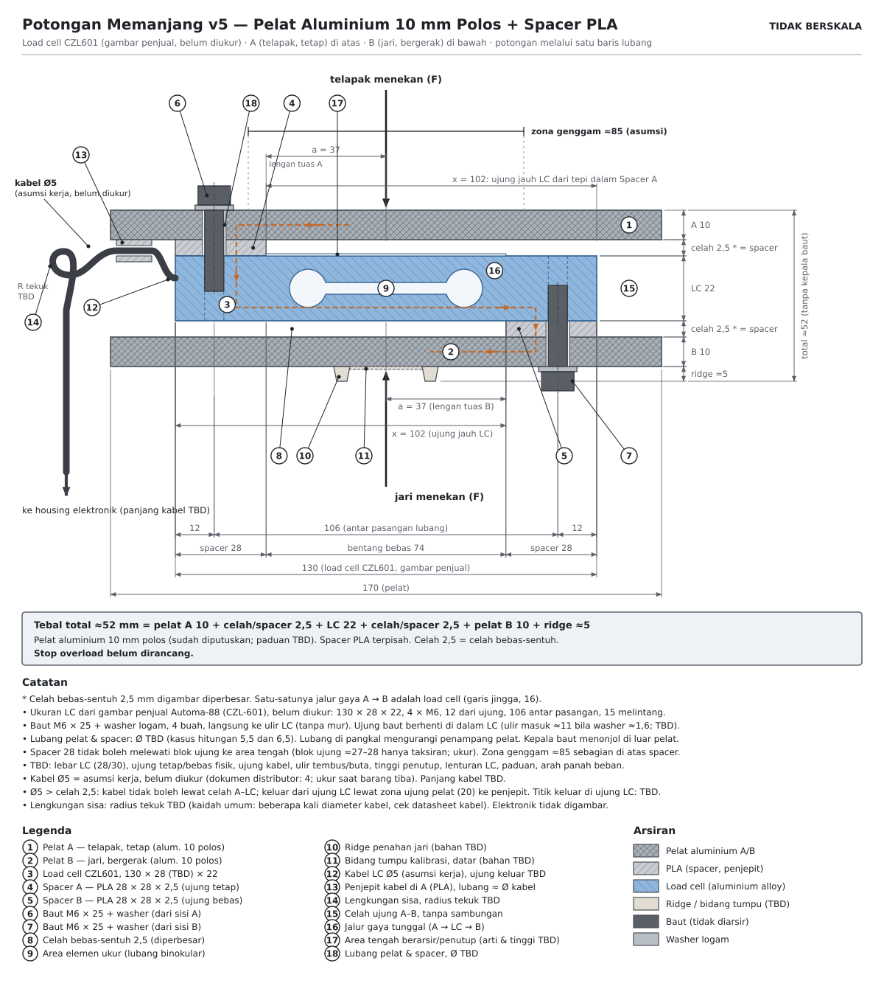
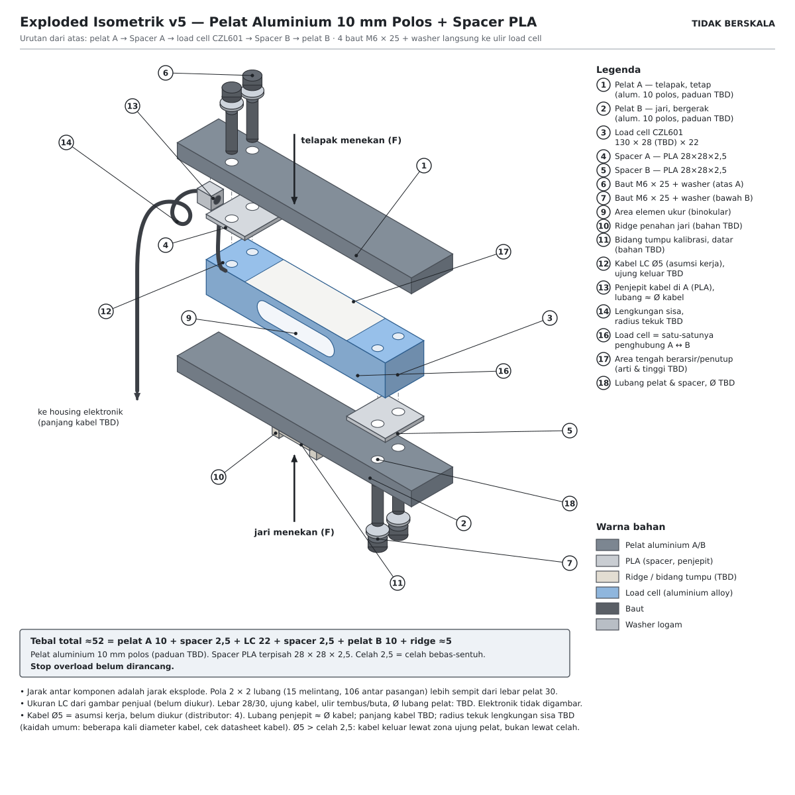

# Desain Housing Load Cell (v7)
**Final Project - Embedded Systems Course**

> Dokumen ini memuat seluruh desain housing grip yang berisi load cell: layout dua batang, dampak ke pembacaan gaya, temuan kekakuan batang, kalibrasi, pengadaan pelat, rujukan, dan asumsi gambar skematik v5 (Lampiran A; asumsi v4 sebagai riwayat di Lampiran B). Dipisah dari [catatan proyek](catatan-proyek-hgd.md) (v37) supaya catatan proyek tidak melebar. Housing elektronik (ESP32, LCD, HX711, tombol, LED) akan ada di dokumen terpisah: [desain-housing-elektronik.md](desain-housing-elektronik.md) (rencana, belum dibuat).

Tautan balik: [catatan proyek](catatan-proyek-hgd.md) · tabel pengukuran jangka sorong: [Bagian 15 di catatan proyek](catatan-proyek-hgd.md#15-tabel-pengukuran-dengan-jangka-sorong) · spesifikasi S1-S5: [Bagian 13.1](catatan-proyek-hgd.md#131-tabel-spesifikasi-table-1-proposal-21)

Penomoran: bagian di dokumen ini memakai awalan HL (HL1 sampai HL20), Lampiran A (v5) memakai awalan A, dan Lampiran B (v4, riwayat) memakai awalan B, supaya tidak tertukar dengan nomor bagian di catatan proyek. Gambar skematik dan berkas instruksi ada di folder `housing-grip/` pada Project (SVG v2 sampai v5); lihat HL12.

## Daftar isi

- [HL1. Keputusan: dua housing terpisah](#hl1-keputusan-dua-housing-terpisah)
- [HL2. Pembanding alat komersial (dokumen pabrikan, bukan peer-review)](#hl2-pembanding-alat-komersial-dokumen-pabrikan-bukan-peer-review)
- [HL3. Pengamatan foto produk (enam gambar rujukan)](#hl3-pengamatan-foto-produk-enam-gambar-rujukan)
- [HL4. Tata letak terpilih: dua batang dengan load cell di antaranya](#hl4-tata-letak-terpilih-dua-batang-dengan-load-cell-di-antaranya)
- [HL5. Dampak housing terhadap pembacaan gaya](#hl5-dampak-housing-terhadap-pembacaan-gaya)
- [HL6. Setup parametrik di Fusion 360](#hl6-setup-parametrik-di-fusion-360)
- [HL7. Aturan cetak dari modul 3D printing](#hl7-aturan-cetak-dari-modul-3d-printing)
- [HL8. Hal yang harus diukur sebelum cetak](#hl8-hal-yang-harus-diukur-sebelum-cetak)
- [HL9. Temuan kekakuan batang dan usulan bahan](#hl9-temuan-kekakuan-batang-dan-usulan-bahan)
- [HL10. Kalibrasi dan arah beban](#hl10-kalibrasi-dan-arah-beban)
- [HL11. Pengadaan pelat logam](#hl11-pengadaan-pelat-logam)
- [HL12. Berkas gambar skematik dan catatan pernyataan AI](#hl12-berkas-gambar-skematik-dan-catatan-pernyataan-ai)
- [HL13. Alternatif dan keputusan yang dibatalkan](#hl13-alternatif-dan-keputusan-yang-dibatalkan)
- [HL14. Urutan prototipe: kardus sampai cetak](#hl14-urutan-prototipe-kardus-sampai-cetak)
- [HL15. Mockup modul 3D printing](#hl15-mockup-modul-3d-printing)
- [HL16. Cowork: cara kerja dan brief awal](#hl16-cowork-cara-kerja-dan-brief-awal)
- [HL17. Rujukan untuk memodel di Fusion](#hl17-rujukan-untuk-memodel-di-fusion)
- [HL18. Sumber rujukan housing (bukan peer-review)](#hl18-sumber-rujukan-housing-bukan-peer-review)
- [HL19. Riwayat koreksi dan audit](#hl19-riwayat-koreksi-dan-audit)
- [HL20. Pertanyaan terbuka untuk dosen atau TA dan konsultasi teknik mesin](#hl20-pertanyaan-terbuka-untuk-dosen-atau-ta-dan-konsultasi-teknik-mesin)
- [Lampiran A. Asumsi gambar skematik housing grip (v5, pelat aluminium 10 mm dan spacer PLA)](#lampiran-a-asumsi-gambar-skematik-housing-grip-v5-pelat-aluminium-10-mm-dan-spacer-pla)
- [Lampiran B. Asumsi gambar skematik housing grip (v4, riwayat)](#lampiran-b-asumsi-gambar-skematik-housing-grip-v4-riwayat)

*Status (v7): layout dan bahan sudah dipilih: pelat aluminium polos 10 mm (paduan TBD), spacer PLA 28 x 28 x 2,5 mm di tiap ujung load cell, baut M6 x 25 + washer logam. Pelat PLA 7 mm terbukti terlalu lentur (HL9). Load cell adalah CZL 601 80 kg (130 x 28 x 22 mm menurut gambar penjual, belum diukur; lihat DS-LC1 di `datasheet-library.md`); ukuran ini menggantikan load cell 180 kg (147 x 30 x 22 mm) pada rencana lama. Metode kalibrasi mengikuti protokol dumbbell (HL10). Dimensi masih menunggu pengukuran load cell ([Bagian 15 di catatan proyek](catatan-proyek-hgd.md#15-tabel-pengukuran-dengan-jangka-sorong)). Proposal 3.6 hanya menjelaskan housing elektronik; housing grip di bawah ini adalah pengembangan setelah proposal.*

## HL1. Keputusan: dua housing terpisah

- **Housing grip**: hanya load cell, dua batang penjepit, dan jepit kabel. Kecil, ringan, mudah dilap.
- **Housing elektronik**: PCB kustom dengan ESP32, tombol, LED, resistor, header ke HX711 dan LCD, dengan cutout USB dan kabel load cell (proposal 3.6).
- Alasan: elektronik tidak perlu berada di tangan; elektronik terlindung dari keringat dan benturan; dua part kecil lebih mudah dijadwalkan di printer lab (jika satu gagal cetak, yang lain tidak ikut terbuang). Catatan v7: alasan "kabel load cell 110 cm" milik load cell 180 kg lama tidak berlaku lagi. Kabel CZL 601 pendek (sekitar 28 cm menurut listing, 0,42 m menurut GJ Impex; belum diukur), jadi housing elektronik harus berada dalam jangkauan kabel itu, atau dipakai kabel sambungan (cara sambung dan shielding: TBD).
- Konsekuensi: tombol, LED, dan LCD ada di housing elektronik, bukan di grip, sehingga START dan NEXT ditekan dengan tangan lain atau oleh rekan; LED harus terlihat dari posisi duduk protokol; LCD diletakkan di meja dalam jangkauan kabel (panjang kabel load cell dan kabel sambungan: TBD).
- Pola serupa ada di alat komersial: Biopac dan Vernier memakai grip tanpa elektronik yang tersambung kabel ke unit terpisah (HL18).

## HL2. Pembanding alat komersial (dokumen pabrikan, bukan peer-review)

| Kode | Perangkat | Bentuk dan mekanisme | Rentang | Ukuran dan berat |
|---|---|---|---|---|
| KG1 | Kinvent K-Grip | Silinder, satu tangan, nirkabel | Maks 90 kgF | Tinggi 141 mm, 47 x 61 mm, 170 g |
| GA1 | GripAble | Rangka "C" lebar dan bulat untuk posisi konsisten | Teruji berulang sampai 90 kg | Lingkar 141 mm, 240 g plastik |
| VN1 | Vernier HD-BTA | Strain gauge isometrik, bodi memanjang dengan bantalan di kiri-kanan | 0-600 N (sekitar 61 kgf), aman sampai 850-900 N | Berkabel, tanpa layar |
| BP1 | Biopac SS25LA | Transduser isometrik, batang dengan posisi tangan ditentukan | 0-90 kg, rated 100 kg | Berkabel ke amplifier |
| PP1 | Push-pull aluminium (listing penjual) | Strain gauge, dua tangan | 0-100 kgF | 114 x 217 x 38 mm, 1,1 kg |

Pengamatan: pelat grip kita (170 mm) lebih panjang dari seluruh K-Grip (141 mm) dan load cell-nya sendiri 130 mm, jadi alat kita berada di keluarga transduser lab (Biopac, Vernier, push-pull sekitar 217 mm), bukan alat saku. Prinsip isometrik (sensor nyaris tidak bergerak) menyarankan grip yang kaku dengan defleksi minimal. Diameter dan bentuk grip memengaruhi angka (GripAble membaca sekitar 69% dari Jamar PLUS+), jadi catat diameter grip di laporan dan jangan membandingkan angka mentah dengan norma berbasis Jamar (selaras dengan 13.2).

## HL3. Pengamatan foto produk (enam gambar rujukan)

1. Biopac (diagram sistem MP200): tangan menggenggam tabung tegak, blok sensor di kepala dengan dua lubang bulat; kabel ke amplifier lalu laptop; grafik remasan dengan puncak cukup datar.
2. Biopac batang bercelah: dua batang sejajar (satu lebih tebal, satu lebih tipis dan menonjol), keduanya bercelah panjang; kabel dari ujung bawah. Celah panjang kemungkinan membuat bagian itu melentur terkendali (inferensi). Secara bentuk paling dekat dengan load cell beam kita.
3. Vernier HD-BTA: bodi hitam memanjang dengan bantalan teal di kiri-kanan sebagai titik tekan; kabel dari bawah; tanpa layar.
4. Kemungkinan Kinvent K-Grip: silinder biru tua dengan celah vertikal yang membelah badan jadi dua sisi, tutup datar beraksen oranye di atas. Remasan kemungkinan menutup celah, dengan sensor di antara dua sisi (inferensi).
5. Kemungkinan GripAble: rangka C hijau dengan pelat biru di tengah tempat jari menekan, strip LED di ujung atas dan bawah, tali pergelangan tangan.
6. Dial analog (model Walmart): kepala bulat dengan dial kg, tombol RESET, pegangan berbantalan; tombol RESET setara tare.

Pola: pembaca di kepala dan grip di bawah; kabel keluar dari ujung bawah; dua keluarga mekanisme (batang bercelah dan bodi terbelah atau berbingkai C). Load cell beam kita paling natural di keluarga batang.

## HL4. Tata letak terpilih: dua batang dengan load cell di antaranya

Potongan memanjang dan exploded isometrik v5 (skematik dari Cowork, tidak berskala; celah digambar diperbesar; ukuran load cell dari gambar penjual Automa-88 dan belum diukur). Nomor callout mengikuti legenda di dalam gambar; angka dalam kurung di daftar bawah merujuk ke callout itu.

Telapak menekan A dari satu sisi dan jari menekan B dari sisi berlawanan. Satu-satunya jalur gaya dari A ke B adalah load cell (callout 16).

Ukuran kunci (gambar penjual CZL 601 80 kg): load cell 130 x 28 x 22 mm, empat lubang M6, dua per ujung, pusat lubang 12 mm dari ujung, 106 mm antar pasangan, 15 mm melintang. Pelat 170 x 30 mm dengan load cell di tengah, jadi tersisa 20 mm pelat di tiap ujung. Spacer 28 mm, bentang bebas antar spacer 74 mm, lengan tuas a = 37 mm, ujung jauh x = 102 mm, zona genggam sekitar 85 mm.

1. (callout 4, 6, 18) Ujung tetap load cell dibaut ke pelat A lewat Spacer A (PLA 28 x 28 x 2,5 mm, terpisah dari pelat). Dua baut M6 x 25 + washer logam menembus pelat dan spacer langsung ke ulir load cell, tanpa mur. Spacer menutup kedua lubang di ujungnya dan membuat celah 2,5 mm di atas sisi bebas.
2. (callout 8 dan 15) Celah antara tiap pelat dan badan load cell harus tetap terbuka pada beban penuh. Pelat melentur 0,24 mm di ujung jauh pada 70 kgf (HL9), jadi sisa celah minimal 2,26 mm sebelum lenturan load cell, tinggi penutup strain gauge, dan margin rakit diketahui. Celah ini bukan stop overload; stop overload belum dirancang.
3. (callout 5 dan 7) Ujung bebas dibaut ke pelat B dari sisi berlawanan lewat Spacer B (sama dengan A). Di ujung tetap, B tidak boleh menyentuh badan load cell.
4. (callout 10 dan 11) Ridge penahan jari dan bidang tumpu kalibrasi (permukaan datar selebar sekitar 22 mm di antara dua ridge) berada di pusat jari di sisi luar B. Kalibrasi memakai balok PLA dengan lidah yang masuk di antara dua ridge (HL10). Titik gantung (eyelet) tidak dipakai karena beban gantung menarik B menjauhi A, kebalikan remasan.
5. (callout 12 sampai 14) Kabel load cell diasumsikan Ø 5 mm (asumsi kerja; dokumen distributor menulis 4 mm; ukur saat barang tiba). Ø 5 mm lebih besar daripada celah 2,5 mm, jadi kabel tidak boleh lewat celah. Kabel keluar dari muka ujung load cell ke penjepit PLA di pelat A (di sisa pelat 0 sampai 20 mm dari ujung), dengan lengkungan sisa sebelum keluar supaya tarikan kabel tidak terbaca sebagai gaya. Titik keluar, radius tekuk, dan panjang kabel masih TBD; zona 20 mm bisa terlalu pendek untuk radius tekuk (A4.1).
6. Kepala baut dan washer menonjol di luar pelat A dan B, 32 mm dari ujung pelat, di luar zona genggam. Tebal total di bawah belum menghitung kepala baut.

Dua batang harus kaku: satu-satunya bagian yang boleh melentur secara berarti adalah load cell. Persyaratan ini tidak dipenuhi oleh pelat PLA 7 mm (HL9). Berbeda dari referensi batang bercelah (Biopac), celah panjang tidak perlu ditiru di jalur beban; celah atau lubang pada batang hanya di luar jalur beban.

Tebal total grip = 2 x tebal batang + 2 x tebal spacer (celah) + sisi load cell yang searah beban + ridge sekitar 5 mm = 2 x 10 + 2 x 2,5 + 22 + 5 = sekitar 52 mm, tanpa kepala baut. Bila sisi 28 mm yang ternyata searah beban, tambah 6 mm. Kisaran 40-48 mm di draf awal berasal dari pelat PLA 7 mm yang ternyata terlalu lentur, dan itu bukan batas dari spesifikasi. Cek kenyamanannya dengan prototipe kardus lebih dulu. Pelat aluminium 8 mm (total sekitar 48 mm) dihitung sebagai pembanding dan tidak dipilih (HL9). Arah beban load cell harus tegak lurus panjangnya, sesuai panah di badannya; cek panah itu sebelum menentukan sisi mana yang menghadap telapak.

## HL5. Dampak housing terhadap pembacaan gaya

| Efek | Pengaruh ke bacaan | Cara menangani |
|---|---|---|
| Rasio tuas (jarak tekan jari terhadap titik beban load cell) | Mengubah skala | Terserap di `calibration_factor` selama geometri tetap; kalibrasi pada rakitan jadi |
| Posisi tekan jari bergeser antar remasan | Galat acak (rasio berubah) | Ridge atau alur penahan jari; uji dengan beban di beberapa posisi; tidak dikoreksi di firmware karena posisi jari tidak diketahui sensor |
| Jalur gaya paralel (A dan B bersentuhan atau bergesek, kabel tertarik, baut mengenai bagian lain) | Bacaan terlalu kecil dan histeresis | Celah di semua titik selain spacer; kabel dijepit di sisi tetap (Ø5 mm tidak lewat celah 2,5 mm) |
| Kelenturan batang (dan creep bila PLA) di jalur beban | Batang yang melentur menyentuh load cell (gaya lewat jalur selain elemen ukur, bacaan terlalu kecil) atau patah; creep PLA menambah drift saat tahan 3-5 detik | Batang kaku, usulan pelat aluminium (HL9); cek residual kalibrasi. PETG bukan solusi: modulusnya sebanding dengan PLA |
| Massa bagian bergerak di ujung bebas | Offset berubah bila orientasi berubah setelah tare. Perkiraan kasar: batang PLA 170 x 30 x 7 mm berbobot sekitar 20-45 g; batang aluminium 10 mm sekitar 138 g; baja 8 mm sekitar 320 g. Semuanya sebanding atau jauh di atas tolerance ±36 g di S1 | Tare dan remas di orientasi yang sama; batang B seringan mungkin yang masih kaku |
| Spacer PLA di bawah baut: relaksasi preload (creep) | Baut mengendur, sambungan bergeser, bacaan drift (kompresi spacer saat remasan hanya sekitar 0,0008 mm, jadi bukan masalah kekakuan) | Washer logam di bawah kepala baut; cek kekencangan berkala; alternatif shim aluminium 3 mm |
| Kekakuan rangka mengubah sensitivitas sistem | `calibration_factor` tidak bisa diambil dari nilai generik atau datasheet | Kalibrasi ulang setelah rakit (FP1) |

**Perlu rumus tambahan di firmware?** Tidak, selama housing kaku, geometri tetap, dan kalibrasi dilakukan pada rakitan jadi: konversi linear `(raw - offset) / scale` yang sudah ada cukup (format yang sama dengan kalibrasi pabrik Vernier: slope dan intercept, VN1). Prosedur: kalibrasi dengan dumbbell sampai 42 kg ([protokol](protokol-kalibrasi-hgd.md), HL10), fit linear, hitung residual dan RMSE. Bagian 42 sampai 70 kgf adalah ekstrapolasi. Jika residual dalam tolerance, firmware tetap linear. Jika tidak, fit polinomial orde 2 atau tabel piecewise secara offline dan tempel koefisiennya ke firmware. Efek yang paling berbahaya (posisi jari, jalur gaya paralel) tidak bisa diperbaiki dengan matematika dan harus ditangani lewat desain mekanik.

## HL6. Setup parametrik di Fusion 360

1. Buka Change Parameters (Design > Solid > Modify), lalu tambah user parameter lewat Add User Parameter (satu dialog per parameter). Cara cepat: impor [`fusion_parameters_housing_grip.csv`](fusion/fusion_parameters_housing_grip.csv) lewat Import Parameters; format kolom Name, Unit, Expression, Value, Comments, Favorite (contoh format ada di halaman bantuan "Parameters in Fusion"). Tulis satuan di dalam ekspresi (misalnya `130 mm`), pilih satuan mm sejak awal (mengganti satuan parameter yang sudah dipakai bisa bermasalah), dan cek kolom Value setelah memasukkan angka desimal karena pemisah desimal mengikuti pengaturan regional. Parameter (v7, sesuai gambar penjual dan v5): `LC_L` = 130, `LC_W` = 28, `LC_H` = 22, `bar_t` = 10 (pelat aluminium, sudah diputuskan), `gap` = 2,5, `boss_L` = 28 (panjang spacer), `lever_arm` = `LC_L / 2 - boss_L` (37 mm), `spA_c` = `-( LC_L / 2 ) + ( boss_L / 2 )` dan `spB_c` = `( LC_L / 2 ) - ( boss_L / 2 )` (posisi pusat spacer, -51 dan +51 mm), `grip_zone` = 85, `hole_edge` = 12 (pusat lubang dari ujung load cell), `hole_pitch` = 106 (antar pasangan lubang, memanjang), `hole_cross` = 15 (antar dua lubang melintang), dan `hole_d` (Ø lubang lewat; TBD, kasus hitung 6,5 mm; belum diukur).
2. Component `LoadCell_ref`: kotak 130 x 28 x 22 mm dengan dua lubang M6 di tiap ujung (pola 2 x 2) memakai parameter di langkah 1. Hanya acuan, tidak dicetak.
3. Component `Bar_A` dan `Bar_B` berupa pelat polos `bar_L` x `bar_W` x `bar_t` (tanpa tonjolan). Component `Spacer_A` dan `Spacer_B` (PLA) terpisah, masing-masing `boss_L` x `LC_W` x `gap`: spacer A di ujung tetap load cell (di atasnya, di bawah pelat A) dan spacer B di ujung bebas (di bawahnya, di atas pelat B).
4. Rakit dengan joint, lalu Inspect > Interference: A dan B tidak boleh bersentuhan satu sama lain, dan tidak boleh menyentuh badan load cell selain lewat spacer.
5. Lubang lewat baut M6 di pelat dan spacer dimodelkan lebih besar dari baut (Ø TBD; kasus hitung 6,5 mm, sedangkan lubang lewat M6 menurut ISO 273 biasanya 6,4 / 6,6 / 7,0 mm; Ø 5,5 mm tidak mungkin dipakai untuk baut M6). Aturan modul "M3 menjadi 3,4 mm" hanya berlaku untuk bagian modul. Chamfer 0,3-0,5 mm di tepi bawah spacer; spacer menjadi alas di Z = 0 saat dicetak.
6. Cetak kupon kecil dulu (spacer dengan pola lubang saja) sebelum bagian lain; itu cara termurah memastikan baut dan load cell benar-benar masuk.
7. Bila batang berupa pelat logam, modelnya hanya untuk cek kecocokan dan gambar kerja bengkel; pelat tidak dicetak. Ridge, bidang tumpu, dan jepit kabel tetap bagian cetak PLA.

## HL7. Aturan cetak dari modul 3D printing

- Bahan PLA; printer lab dipakai bergantian; slot dipesan; hanya cetak setelah slice review disetujui; sertifikasi (Lampiran D) wajib selesai paling lambat Minggu 11 dan menjadi syarat G3 (Minggu 12).
- Anggaran modul untuk bagian utama: maksimal 60 menit dan 40 g per minggu. Itu batas modul; anggaran cetak untuk proyek akhir tidak tercatat di sini.
- Desain: kelonggaran 0,2-0,3 mm per sisi; lubang lewat M3 dimodelkan 3,4 mm; dinding minimal 1,2 mm (gunakan sekitar 2 mm di bagian yang menahan beban); overhang maksimal 45 derajat; chamfer 0,3-0,5 mm di tepi bawah.
- Slicer (Bambu Studio): preset proses 0.20mm Standard, dinding 3 untuk part penahan beban, infill 15-20%, support dimatikan bila desain mengikuti aturan 45 derajat.
- Orientasi: part FDM lebih lemah antar-layer daripada searah layer. Spacer PLA dicetak rebah (permukaan 28 x 28 mm di atas plate) sehingga tidak butuh support; bagian PLA yang panjang (jika ada) dicetak rebah supaya layer sejajar panjang bagian. Sumbu lubang baut vertikal.
- Bila batang berupa pelat logam, itu bukan bagian cetak. Bagian yang tetap dicetak PLA: ridge, bidang tumpu atau lapisan genggam, jepit kabel, dan housing elektronik. Cek ke TA apakah grip hibrida masih memenuhi syarat bagian cetak (G3).

## HL8. Hal yang harus diukur sebelum cetak

Lebar sebenarnya (28 menurut gambar penjual, 30 menurut GJ Impex), panjang blok ujung (sekitar 27-28 mm hanya taksiran), jarak pusat lubang ke ujung (12 mm), jarak antar pasangan lubang (106 mm) dan melintang (15 mm), ulir tembus atau buta beserta kedalamannya, arah panah beban dan sisi (22 atau 28 mm) yang searah panah, ujung tetap atau bebas secara fisik, ujung tempat kabel keluar beserta posisinya di muka ujung, diameter dan panjang kabel (asumsi Ø5 mm; listing 28 cm, GJ Impex 0,42 m), serta tinggi penutup strain gauge. Daftar lengkap pengukuran jangka sorong ada di [Bagian 15 di catatan proyek](catatan-proyek-hgd.md#15-tabel-pengukuran-dengan-jangka-sorong).

## HL9. Temuan kekakuan batang dan usulan bahan

*Status v7: pelat aluminium 10 mm diputuskan (paduan TBD); angka di bawah dari `asumsi_v5.md` (Lampiran A). Hitungan ini kasar untuk arah desain, bukan verifikasi.*

Masalah: tiap batang bekerja sebagai kantilever dari spacernya. Batang A hanya ditopang di ujung tetap load cell dan batang B hanya di ujung bebas, jadi beban genggam melenturkan batang sepanjang lengan tuas. Dua akibat yang harus dicegah: (1) batang menyentuh badan load cell, sehingga sebagian gaya lewat jalur selain elemen ukur dan bacaan terlalu rendah; (2) batang patah atau meluluh.

Model (teori balok kasar). F = 686 N (70 kgf, batas atas S1), lebar batang b = 30 mm, I = b·h³/12, E aluminium 70 GPa, baja 200 GPa, PLA sekitar 3 GPa:
- Lenturan di titik beban: δ = F·a³ / (3·E·I), a = jarak pusat beban dari tepi dalam spacer.
- Lenturan di titik x ≥ a (ujung batang yang berada di atas ujung load cell sebelahnya): δ(x) = F·a²·(3x - a) / (6·E·I). Nilai ini yang menentukan sentuhan, bukan lenturan di titik beban.
- Tegangan maksimum di pangkal: σ = F·a·(h/2) / I. Momen pangkal = F x a, jadi selama pusat beban tetap, penyebaran beban di zona genggam tidak menurunkannya.
- Penampang berlubang: σ_net = σ · b / (b - n·d) untuk n lubang berdiameter d sejajar lebar (konservatif, karena lubang berada 16 mm di dalam spacer, bukan di tepi dalamnya).
- Geometri v7: a = 130/2 - 28 = 37 mm (pusat zona genggam sekitar 85 mm, di tengah load cell), x = 130 - 28 = 102 mm, bentang bebas 74 mm. Spacer dan baut dianggap kaku, beban terpusat di tengah load cell (konservatif untuk momen, karena zona genggam 85 mm sebagian jatuh di atas spacer).

Hasil (F = 686 N, lebar 30 mm, celah 2,5 mm):

| Pelat | boss_L | a / x | Lenturan titik beban | Lenturan ujung jauh | Sisa celah 2,5 mm* | Tegangan pangkal | Tegangan penampang berlubang (2 lubang Ø5,5 / Ø6,5 mm) |
|---|---|---|---|---|---|---|---|
| **Aluminium 10 mm (dipilih)** | **28 mm** | **37 / 102 mm** | **0,066 mm** | **0,241 mm** | **minimal 2,26 mm** | **50,8 MPa** | **80 / 90 MPa** |
| Aluminium 8 mm (pembanding) | 28 mm | 37 / 102 mm | 0,129 mm | 0,470 mm | minimal 2,03 mm | 79,3 MPa | 125 / 140 MPa |
| Aluminium 10 mm | 24 mm | 41 / 106 mm | 0,090 mm | 0,304 mm | minimal 2,20 mm | 56,3 MPa | 89 / 99 MPa |
| Aluminium 8 mm | 24 mm | 41 / 106 mm | 0,176 mm | 0,594 mm | minimal 1,91 mm | 87,9 MPa | 139 / 155 MPa |

*Sisa celah = 2,5 mm dikurangi lenturan ujung jauh, sebelum lenturan load cell, tinggi penutup strain gauge, dan margin rakit diketahui. Baris boss_L 24 mm hanya untuk melihat kepekaan bila blok ujung ternyata lebih pendek dari 28 mm. Kasus Ø5,5 mm tidak mungkin dipakai untuk baut M6 (diameter nominal 6 mm); kasus Ø6,5 lebih realistis, dan dengan Ø7,0 mm tegangan penampang berlubang Al 10 / boss 28 sekitar 95 MPa.

Pembacaan:
- Aluminium 10 mm: lenturan ujung jauh 0,24 sampai 0,30 mm, jadi celah 2,5 mm tidak terlampaui oleh lenturan pelat. Tegangan penampang berlubang 80 sampai 99 MPa, jauh di bawah kisaran luluh paduan aluminium (sekitar 200-275 MPa; paduan TBD).
- Aluminium 8 mm juga lolos di atas kertas dengan spacer 28 mm, tetapi marginnya lebih tipis (125 sampai 155 MPa) dan tidak dipilih; keputusan pelat 10 mm sudah diambil (tebal total sekitar 52 mm).
- Dibanding v4 (tonjolan menyatu, a = 60 mm): lenturan ujung jauh turun dari 0,80 mm menjadi 0,24 mm karena a turun dari 60 ke 37 mm.
- Pelat PLA tetap gagal jauh (hitungan di riwayat di bawah).

Anggaran celah 2,5 mm (Al 10, boss 28):

| Komponen | Nilai |
|---|---|
| Lenturan ujung jauh pelat | 0,24 mm |
| Lenturan load cell sendiri pada 70 kgf | TBD (tidak ada di spesifikasi) |
| Tinggi penutup strain gauge di atas permukaan | TBD |
| Margin rakit (kerataan pelat, spacer, baut) | TBD |
| **Sisa sebelum nilai TBD diketahui** | **minimal 2,26 mm** |

Pemeriksaan spacer PLA dan baut:
- Kompresi spacer (E PLA sekitar 3 GPa, 686 N, tebal 2,5 mm): sekitar 0,0008 mm untuk spacer 28 x 28 dengan 2 lubang Ø6,5 (luas bersih 717,6 mm2); 0,0009 mm bila dihitung dengan 4 lubang (651,3 mm2). Dapat diabaikan terhadap celah.
- Tekanan tepi bila seluruh momen ditahan kontak spacer: M = F·a = 25 382 N·mm, S = 28·28²/6 = 3 659 mm³, jadi sekitar 6,9 MPa ditambah tekanan rata-rata sekitar 1 MPa, sekitar 7,9 MPa. Angka ini hanya berlaku bila preload baut cukup menjaga seluruh permukaan spacer tetap tertekan. Baut hanya 12 mm dari ujung (16 mm dari tepi dalam spacer), jadi tanpa preload pelat cenderung berungkit di tepi dalam: tarik baut sekitar 0,8 kN per baut dan gaya kontak sekitar 2,3 kN di tepi dalam. Tekanan lokalnya bergantung pada lebar kontak (TBD) dan bisa jauh di atas 7,9 MPa. Torsi dan preload baut: TBD.
- Risiko yang lebih nyata: relaksasi preload karena creep PLA. Washer logam di bawah kepala baut mengurangi tekanan di bawah kepala, tetapi tidak mencegah creep spacer itu sendiri; cek ulang torsi setelah beberapa kali pakai (prosedur TBD). Alternatif bila ragu: shim aluminium 3 mm (celah menjadi 3 mm, total tebal naik 1 mm), dibor bersama pelat.
- Baut M6 x 25: panjang ulir masuk sekitar 25 - washer 1,6 - pelat 10 - spacer 2,5 = 10,9 mm (sekitar 1,8 x d). Ujung baut tidak menembus muka seberang load cell (tinggi 22 mm) bila lubangnya tembus; bila lubang buta dengan kedalaman ulir kurang dari sekitar 11 mm, baut mentok. Kedalaman ulir: TBD.

Yang belum diketahui dan mengurangi margin: tinggi penutup strain gauge, lenturan load cell sendiri pada 70 kgf (ujung bebasnya naik mendekati batang), diameter lubang, kekakuan spacer dan sambungan baut, dan grade aluminium. Proteksi overload membutuhkan fitur terpisah yang belum dirancang: pelat sudah melentur 0,24 mm ke arah load cell pada 70 kgf, jadi celah tidak bisa sekaligus menjadi stop overload. Batas overload load cell menurut dokumen pabrikan: 120% (96 kgf) dan 150% (120 kgf), dari kapasitas 80 kg (DS-LC1 di `datasheet-library.md`); 70 kgf adalah 87,5% kapasitas.

Pilihan alternatif yang tidak lolos: PLA setebal sekitar 18 mm (genggaman terlalu lebar); memperpendek lengan tuas (zona genggam sekitar 85 mm tidak muat). Proposal (risiko enclosure) menyebut fallback "PETG atau bracket logam": PETG tidak menyelesaikan masalah karena modulusnya sebanding dengan PLA; yang relevan adalah bracket atau pelat logam. Validasi model lentur dengan uji sederhana: pelat PLA 30 x 7 mm dijepit satu ujung, beban 5 kg di jarak 120 mm; prediksi sekitar 11 mm, dan bila hasil jauh berbeda maka nilai E perlu diperbaiki.

Bahan alternatif untuk batang (tebal minimum agar lenturan ujung jauh tidak lebih dari 1 mm pada 686 N dengan a = 37 mm dan x = 102 mm; model sama dengan di atas, dihitung ulang di v7; modulus nilai umum yang bervariasi antar produk; kekuatan bahan non-logam tidak diperiksa):

| Bahan | Modulus (kira-kira) | Tebal minimum | Cocok? |
|---|---|---|---|
| PLA | 3 GPa | sekitar 17,8 mm | Tidak |
| Multipleks/kayu | 6-12 GPa | sekitar 11-14 mm | Tidak (juga lembap dan creep) |
| Fiberglass epoksi (FR4/G10) | 18-24 GPa | sekitar 9-10 mm | Kekakuan mendekati, tetapi tidak lebih tipis dari aluminium, lebih mahal, dan debu bor berbahaya; kekuatan tidak diperiksa |
| Aluminium | 70 GPa | sekitar 6,2 mm | Ya, 8 atau 10 mm (dipilih 10 mm) |
| Baja | 200 GPa | sekitar 4,4 mm | Ya, tetapi margin tegangan penampang berlubang tipis pada baja lunak |

Kesimpulan: bahan non-logam tidak lebih baik dari aluminium pada tebal yang tersedia; yang tersisa adalah aluminium atau baja, dengan cara pengadaan yang berbeda (HL11). Pilihan yang tidak disarankan: PLA dengan inti logam di dalam (beban dan momen di pangkal harus lewat PLA di sekitar baut), dan menurunkan beban desain S1 (mengubah spesifikasi di proposal).

### Riwayat hitungan (tidak berlaku untuk desain terbaru)

Blok di bawah dipertahankan sebagai riwayat dan penjelasan metode. Angkanya memakai load cell 147 mm yang tidak jadi dipakai.

**Spacer PLA terpisah 30 x 30 mm (hitungan lama sebelum v5; load cell 147 mm, a = 43,5 mm, x = 117 mm):**

| Pelat | Lenturan titik beban | Lenturan ujung jauh | Sisa celah 2,5 mm | Tegangan pangkal | Tegangan penampang berlubang (2 lubang Ø5,5 / Ø6,5 mm) | Berat per batang | Tebal total |
|---|---|---|---|---|---|---|---|
| Aluminium 8 mm | 0,21 mm | 0,74 mm | minimal 1,76 mm | 93 MPa | 147 / 165 MPa | 110 g | 48 mm |
| Aluminium 10 mm | 0,11 mm | 0,38 mm | minimal 2,12 mm | 60 MPa | 94 / 105 MPa | 138 g | 52 mm |
| Baja 6 mm | 0,17 mm | 0,62 mm | minimal 1,88 mm | 166 MPa | 262 / 293 MPa | 240 g | 44 mm |
| Baja 8 mm | 0,07 mm | 0,26 mm | minimal 2,24 mm | 93 MPa | 147 / 165 MPa | 320 g | 48 mm |
| PLA 7 mm | 7,3 mm | 25,9 mm | tidak lolos | 122 MPa | 192 / 215 MPa | 44 g | 46 mm |

**Desain awal dengan tonjolan menyatu (a = 60 mm, x = 133 mm, celah 1,5 mm):** pelat PLA 7 mm (kantilever 120 mm, beban merata) melentur sekitar 17 mm pada 200 N, 34 mm pada 400 N, dan 58 mm pada 686 N (tegangan sekitar 168 MPa); agar lenturan di titik beban di bawah 0,5 mm pada 686 N, PLA pejal perlu tebal sekitar 24 mm. Aluminium 8 mm melentur 1,56 mm di ujung jauh dan gagal di celah 1,5 mm; aluminium 10 mm 0,80 mm (tegangan penampang berlubang sekitar 145 MPa); baja 6 mm 1,29 mm (sekitar 404 MPa, melewati luluh baja lunak); baja 8 mm 0,55 mm (sekitar 227 MPa, hampir sama dengan luluh baja lunak sekitar 235 MPa, dan 640 g untuk dua batang).

## HL10. Kalibrasi dan arah beban

**Tahap kalibrasi.** Kalibrasi dikerjakan dalam dua tahap. Tahap 1 sampai 20 kg (dumbbell tunggal 1 sampai 6 kg, pasangan 6 kg = 12 kg, lalu pasangan 4 kg di atas 6 kg = 20 kg, tumpukan sekitar 19 cm) dikerjakan lebih dulu dan digambar di `img/kalibrasi_setup_v5_20kg.svg`. Tahap 2 sampai 42 kg menyusul dengan susunan di bawah. 20 kg baru sekitar 29 persen dari 70 kgf dan baru menjangkau batas bawah rentang alat (20 sampai 70 kgf), sehingga sisanya ekstrapolasi.

*Diperbarui di v7: metode kalibrasi mengikuti [protokol-kalibrasi-hgd.md](protokol-kalibrasi-hgd.md) (dumbbell berpasangan, papan kayu, balok PLA dengan lidah). Setup lama (rakitan dibalik, A dijepit ke meja, beban acuan 20/45/70 kg ditumpuk di bidang tumpu; `kalibrasi_setup_v4.svg`) digantikan dan hanya dipertahankan sebagai riwayat. Protokol belum diuji.*

**Arah beban.** Remasan mendorong B ke arah A. Beban yang digantung pada eyelet di sisi luar B menarik B menjauhi A, jadi arahnya kebalikan remasan dan tidak menguji kontak celah pada beban tinggi. Karena itu kalibrasi dilakukan dalam arah remasan: A di bawah di atas alas karet antiselip, B di atas, dan beban menekan B ke arah A. Gaya mengalir: beban, papan, balok PLA, ridge, B, load cell, A, meja.

**Metode (ringkas; langkah rinci ada di protokol):**
1. Alat: rakitan grip lengkap yang terhubung ke HX711 dan ESP32 final, alas karet antiselip, papan kayu sekitar 480 x 350 mm tebal 12 mm, balok PLA dengan lidah yang masuk di antara dua ridge (lebar lidah sekitar 21 mm; bidang tumpu di antara ridge sekitar 22 mm; balok tidak boleh menyentuh puncak ridge), dua pemandu kayu, dan dumbbell berpasangan 1, 2, 3, 4, 5, 6 kg (total 42 kg).
2. Timbang tiap dumbbell (12 buah) dengan timbangan yang sama; label massa biasanya meleset beberapa persen.
3. Seri A: dumbbell tunggal 1 sampai 6 kg di tengah papan, satu per satu, dengan papan kosong dan catatan nol di antaranya.
4. Seri B: pasangan ditumpuk, terberat dulu (12, 22, 30, 36, 40, 42 kg), lalu diturunkan dalam urutan terbalik; masing-masing seri minimal dua kali, pembacaan rata-rata 10 sampel setelah 10 detik.
5. Hasil: faktor skala (kemiringan, counts per kg), linearitas (R-kuadrat dan sisa terbesar), histeresis (naik lawan turun), drift (nol awal lawan nol akhir); verifikasi dengan massa yang tidak dipakai untuk fitting.

**Yang berubah dari setup lama:**

| Aspek | Setup lama (v4) | Protokol dumbbell (v7) |
|---|---|---|
| Beban | acuan 20 / 45 / 70 kg ditumpuk | dumbbell sampai 42 kg |
| A | dijepit ke meja (titik jepit TBD) | di atas alas karet antiselip, tidak dijepit (tepi meja lab tipis dan ada yang gompal) |
| Titik tekan | bidang tumpu sekitar 22 mm, tumpukan di atas alas kecil | lidah balok PLA di antara dua ridge, papan kayu menyebarkan beban, pemandu kayu mencegah tumpukan jatuh |
| 70 kgf | diuji langsung | ekstrapolasi dari 42 kg |

**Keterbatasan dan hal yang belum terjawab:**
1. Kalibrasi hanya sampai 42 kg (60% dari 70 kgf). Nilai di atas itu adalah ekstrapolasi, dan bagian yang paling kritis secara mekanis (lenturan pelat sekitar 0,24 mm, kemungkinan kontak celah) tidak teruji. Catat di laporan; cara menguji sampai 70 kgf (misalnya pembanding dengan timbangan referensi, FP1) belum dirancang. 42 kg adalah sekitar 52% kapasitas load cell 80 kg, di dalam batas overload.
2. Kepala baut dan washer menonjol di sisi luar pelat A (32 mm dari ujung, sekitar 5 sampai 6 mm menurut perkiraan kasar dari washer 1,6 mm dan kepala heksagonal M6 sekitar 4 mm; belum diukur). Dengan A di bawah, A bertumpu pada kepala baut di ujung tetap dan tidak rata terhadap alas. Gambar protokol belum menunjukkan ini. Perlu pengganjal setinggi kepala baut + washer di bawah ujung bebas A, atau cekungan pada alas karet (TBD). Ini inferensi dari gambar v5, bukan hasil pengukuran.
3. A bertumpu pada alas, sehingga lenturan A saat digenggam tidak teruji; yang teruji hanya jalur beban lewat load cell.
4. Tumpukan penuh 42 kg tingginya sekitar 25 sampai 28 cm di atas papan dengan tumpuan lidah sekitar 21 mm, jadi goyah (peringatan di protokol). Langkah keselamatan protokol berlaku: turunkan pelan, jangan taruh tangan di bawah tumpukan, berhenti bila tumpukan miring.
5. Soal orientasi: kemiringan faktor skala (slope) tidak bergantung orientasi pada pendekatan pertama, sedangkan offset berubah sekitar massa B (sekitar 138 g untuk aluminium 10 mm). Karena auto-tare terjadi di SIAP pada tiap percobaan, kalibrasi dalam orientasi terbalik tetap berlaku untuk slope; yang perlu dijaga adalah orientasi alat antara tare dan remasan.
6. Kalibrasi memakai beban statis di titik tengah, sedangkan genggaman nyata memberi beban di empat jari dengan posisi sedikit berbeda (HL5).

## HL11. Pengadaan pelat logam

- Kata kunci marketplace (listing Tokopedia yang ditemukan memakai ejaan beragam): `plat strip aluminium 10mm`, `plat almunium tebal 10mm lebar 30mm`, `aluminium flat bar 30x10`, tambahkan `potong custom`; untuk jasa: `jasa potong plat aluminium`, `jasa bor plat`. Untuk baja (listing belum diverifikasi): `besi strip`, `plat strip besi 30x6`, `plat besi 6mm potong`. Ukuran stok yang terlihat berlebar 40 mm; lebar 30 mm mungkin perlu dipotong.
- Minta ukuran 170 x 30 x 10 mm (tebal 10 mm sudah diputuskan), 2 pcs plus 1 cadangan, grade paduan dicantumkan, tepi di-deburr, tanpa lubang (dibor setelah jarak lubang load cell terukur).
- Anggaran: BOM proposal Rp253.875 sebelum ongkir, sisa sekitar Rp46.125 dari batas Rp300.000; harga plat dan jasa belum diverifikasi. Tambahkan ke BOM dan simpan bukti beli.
- Tebal pelat sudah diputuskan (10 mm). Tahan pengeboran sampai lubang load cell terukur; pelat polos tanpa lubang bisa dibeli lebih dulu.
- Cek listing strip aluminium (gambar promosi bukan spesifikasi): lebar yang tersedia untuk tebal 10 mm (butuh 30 mm; 35-40 mm masih mungkin dengan penyesuaian gambar), panjang dan apakah bisa dipotong 170 mm (stok per batang panjang bisa melewati sisa anggaran), serta grade dan temper paduan (misalnya 6061-T6 atau 5052-H32). Jika penjual tidak bisa menyebutkan grade, anggap paduannya lunak (luluh puluhan sampai sekitar 100 MPa) dan hitung ulang atau cari penjual yang mencantumkan grade.
- Penjual strip umumnya hanya menjual stok atau potong panjang; pengeboran dikerjakan di tempat lain. Opsi: bengkel bubut atau jasa bor (kata kunci `bengkel bubut`, `jasa bor plat aluminium`, `jasa CNC milling aluminium`); bengkel atau lab kampus dengan bor duduk; atau bor sendiri dengan templat bor PLA yang lubangnya sesuai hasil ukur. Jasa CNC atau laser dengan file gambar kemungkinan melewati anggaran; minta penawaran dulu.
- Untuk pengeboran: diameter lubang pelat sekitar 0,5 mm lebih besar dari baut; hindari counterbore di pangkal pelat 10 mm (menipiskan bagian yang menahan momen terbesar); jangan mengebor menembus lubang berulir load cell, tandai posisi dari lubangnya.
- Rencana: beli strip sudah dipotong 170 mm tanpa lubang, bor setelah ukuran lubang load cell pasti, bawa gambar kerja ke bengkel. Lembar gambar kerja satu halaman (posisi dan diameter lubang, ukuran pelat, grade, toleransi) disiapkan setelah ukuran terukur.
- Dengan spacer PLA terpisah, yang dibeli adalah strip polos tanpa tonjolan, jadi tidak perlu frais. Spacer dicetak (28 x 28 x 2,5 mm, dua per rakitan); pelat dan spacer dibor bersama (templat bor PLA atau dijepit bersama) setelah ukuran lubang load cell diketahui.

## HL12. Berkas gambar skematik dan catatan pernyataan AI

- Gambar yang dipasang di dokumen ini (salin ke folder `img/` di samping dokumen): `potongan_memanjang_v5_logam.svg` dan `exploded_isometrik_v5_logam.svg` (HL4), `kalibrasi_protokol.svg` (HL10). `kalibrasi_setup_v4.svg` digantikan (riwayat; Lampiran B). Semua gambar skematik dibuat dengan Claude (Cowork) dari instruksi tertulis, disimpan di folder `housing-grip/` pada Project: `potongan_memanjang.svg`, `exploded_isometrik.svg`, `tampak_atas.svg`, `asumsi.md` (v2); `potongan_memanjang_v3.svg`, `potongan_memanjang_v3_logam.svg`, `exploded_isometrik_v3.svg`, `exploded_isometrik_v3_logam.svg`, `tampak_atas_v3.svg`, `asumsi_v3.md` (v3); `potongan_memanjang_v4_logam.svg`, `exploded_isometrik_v4_logam.svg`, `kalibrasi_setup_v4.svg`, `asumsi_v4.md` (v4, varian aluminium 10 mm); `potongan_memanjang_v5_logam.svg`, `exploded_isometrik_v5_logam.svg`, `asumsi_v5.md` (v5, load cell CZL 601, spacer PLA terpisah, kabel Ø5 mm). `kalibrasi_setup_v5.svg` sengaja tidak dibuat (digantikan protokol dumbbell). Instruksi: `koreksi.md` (v2 ke v3), `koreksi_v2.md` (v3 ke v4), `koreksi_v3.md` (v4 ke v5, memakai load cell 147 mm lama; digantikan sebagian) dan `koreksi_v4.md` (v4 ke v5 dengan ukuran CZL 601; menggantikan angka dan geometri di `koreksi_v3.md`), serta satu pesan lanjutan untuk asumsi kabel Ø5 mm. Gambar v3, v4, dan v5 sudah ditinjau secara visual dan sesuai instruksi koreksi; dua cacat tampilan di potongan v5 (garis callout 1 yang melintasi teks, teks "R tekuk TBD" menempel di tepi) sudah diperbaiki di versi terakhir. Hasil v5 (aluminium 10 mm, spacer 28 mm, celah 2,5 mm): lenturan ujung jauh 0,24 mm pada 686 N sehingga sisa celah minimal 2,26 mm sebelum lenturan load cell dan tinggi penutup strain gauge diketahui; tegangan penampang berlubang 80-90 MPa; tebal total sekitar 52 mm tanpa kepala baut. Hasil v4 (tonjolan menyatu, a = 60 mm) ada di Lampiran B.
- Untuk Pernyataan Penggunaan AI (Lampiran C), kolom "anything the tool got wrong" yang ditekankan panduan tugas: (1) layout awal mengasumsikan batang kaku tanpa menghitung kekakuan, ditemukan lewat pemeriksaan asumsi Cowork; (2) instruksi koreksi menyatakan penyebaran beban menurunkan tegangan baja di pangkal, salah karena momen pangkal ditentukan pusat beban; (3) titik gantung kalibrasi arahnya kebalikan remasan; (4) hitungan awal hanya melaporkan lenturan di titik beban, bukan di ujung jauh yang menentukan sentuhan; (5) `koreksi_v2.md` memuat dua instruksi yang bertentangan (catatan "stop overload belum dirancang" wajib ada, tetapi kata itu juga dilarang muncul), ditemukan oleh Cowork yang lalu mengikuti instruksi pertama; (6) ukuran load cell 147 x 30 mm dari rencana lama (load cell 180 kg) sempat terbawa ke instruksi dan dokumen sampai gambar penjual CZL 601 tersedia; (7) instruksi memuat satu nilai acuan yang tidak konsisten (lenturan titik beban Al 8 mm, boss 24 mm: tertulis 0,16 mm, hitungan 0,176 mm), kasus lubang Ø5,5 mm yang tidak mungkin dipakai untuk baut M6, dan "empat lubang" per spacer padahal tiap spacer hanya menutup dua lubang; ketiganya ditemukan Cowork saat menghitung ulang; (8) dalam peninjauan, penjepit kabel sempat ditulis berada di Spacer A, padahal terpasang di pelat A.

## HL13. Alternatif dan keputusan yang dibatalkan

- **Kantilever tunggal** (load cell sendirian, satu ujung tetap, pegangan di ujung bebas): konsep awal. Posisi tekan tangan mengubah momen sehingga bacaan bergantung titik genggam, dan bentuk pegangan belum jelas. Digantikan layout dua batang (HL4), yang memberi satu jalur gaya dan posisi tangan yang bisa dikendalikan dengan ridge.
- **Dua batang paralel dengan load cell berdampingan** (usulan pengguna forum, FP1): lebih tidak peka terhadap posisi genggam, tetapi butuh beberapa elemen sejajar dengan presisi, lebih rumit dicetak dan dirakit. Tidak dipilih untuk cakupan proyek, dan belum dicoba.
- **Sensor sentuh kapasitif TTP223 di titik tumpu ibu jari** untuk memvalidasi posisi jari sebagai syarat mulai: dibatalkan oleh tim, alasan tidak dicatat. Pertimbangan yang sempat muncul: logika deteksinya tersembunyi di dalam modul sehingga kurang bisa dijelaskan saat penilaian, dan sensor ini tidak menambah cakupan Sub-CPMK. Akibatnya teknik genggam hanya dijaga lewat instruksi verbal ([Bagian 13.2 di catatan proyek](catatan-proyek-hgd.md#132-what-the-device-will-not-do-proposal-22)).
- **Pelat PLA 7 mm** sebagai batang (HL9), **celah sebagai stop overload** (HL9), dan **titik gantung kalibrasi** (HL10): dibatalkan.
- **Elektronik di dalam pegangan** (tombol, LED, LCD di grip): dibatalkan, sejak keputusan dua housing terpisah (HL1).
- **Tonjolan menyatu dengan pelat** (sekitar 13,5 mm): diganti spacer PLA terpisah. Alasan: tonjolan 2,5 mm pada pelat aluminium sulit dibuat tanpa frais, dan tonjolan 13,5 mm terlalu pendek untuk menutup lubang yang pusatnya 12 mm dari ujung load cell. Ukuran spacer berubah dari 30 x 30 x 2,5 mm (load cell 147 mm lama) menjadi 28 x 28 x 2,5 mm (CZL 601).
- **Setup kalibrasi dibalik dengan beban acuan 20/45/70 kg dan A dijepit ke meja** (`kalibrasi_setup_v4.svg`): digantikan protokol dumbbell sampai 42 kg (HL10). Alasan: tumpukan 70 kg tidak stabil di atas bidang tumpu sekitar 22 mm, beban acuan 70 kg tidak tersedia, dan tepi meja lab tidak boleh dijepit.
- **Load cell generik 180 kg (147 x 30 x 22 mm, kabel 110 cm)**: diganti CZL 601 80 kg (DS-LC1 di `datasheet-library.md`). Semua ukuran dan angka kekakuan di dokumen ini sudah dihitung ulang untuk load cell baru.
- **Pelat aluminium 8 mm**: dihitung sebagai pembanding (HL9) dan tidak dipilih; tebal 10 mm diputuskan.
- **Sabuk PLA yang membungkus batang** sebagai pengganti celah: tidak dilanjutkan. Risikonya jalur gaya paralel yang memintas load cell (PLA kaku). Sabuk longgar yang tidak menahan beban mungkin berguna sebagai pelindung jepit jari atau penahan saat dibawa, belum dirancang.

## HL14. Urutan prototipe: kardus sampai cetak

- **Kardus** menguji geometri dan ergonomi: posisi tangan, tebal total sekitar 52 mm, panjang sekitar 170 mm, jangkauan zona genggam, dan titik keluar kabel. Load cell asli bisa ditempel pada prototipe kardus untuk cek penyaluran gaya. Kardus tidak menguji kekuatan, kekakuan, toleransi lubang, atau pas baut, dan melentur jauh lebih besar dari pelat sungguhan.
- **Urutan:** prototipe kardus, ukur load cell ([Bagian 15 di catatan proyek](catatan-proyek-hgd.md#15-tabel-pengukuran-dengan-jangka-sorong)), model parametrik di Fusion (HL6), kupon uji pas cetak (spacer dan pola lubang), uji lentur pelat (HL9), rakit, lalu kalibrasi dengan protokol dumbbell (HL10).
- Kekakuan hanya bisa divalidasi lewat hitungan (HL9) dan uji lentur, bukan lewat kardus.

## HL15. Mockup modul 3D printing

- Mockup 3D untuk modul 3D printing dikerjakan dengan bantuan Copilot (bukan Claude); catat di Pernyataan Penggunaan AI. Berkas dan isinya tidak tercatat di catatan ini.
- Acuan dari modul 3D printing: pelat dasar modul praktikum berupa grid 8 x 5 lubang Ø3,4 mm dengan pitch 20 mm pada pelat 170 x 110 x 4 mm; bagian modul harus tersekrup ke pelat itu lewat dua lubang M3 yang jatuh pada kelipatan 20 mm (jarak 20, 40, atau 60 mm); lubang M3 dimodelkan 3,4 mm. Aturan ini berlaku untuk bagian modul, bukan otomatis untuk housing grip proyek.

## HL16. Cowork: cara kerja dan brief awal

- **Kemampuan** (Help Center Claude, "Can Claude produce images?" dan "Custom visuals in chat and Cowork"): Claude tidak membuat foto atau ilustrasi realistis; yang bisa dibuat adalah diagram, grafik, dan visual interaktif berbasis HTML dan SVG. Hal ini berlaku juga di Cowork; hasilnya bisa diunduh sebagai `.svg` atau `.html`, dan model yang lebih kuat disarankan untuk visual kompleks. Render realistis diperoleh dari Render workspace di Fusion setelah modelnya jadi.
- **Cara kerja Cowork:** ia bekerja pada folder yang diizinkan, bukan attachment per pesan; ia bisa membaca gambar (.png, .jpg, .svg). Isi folder yang disarankan: foto load cell asli (kedua sisi, panah beban, lubang baut, tempat kabel keluar), tangkapan layar model Fusion, dan gambar referensi gaya. Jangan memasukkan seluruh catatan proyek.
- **Alur yang dipakai:** brief awal (di bawah), gambar v2, `koreksi.md`, v3, `koreksi_v2.md`, v4, `koreksi_v4.md` (dengan `koreksi_v3.md` untuk bagian yang tidak digantikan), v5, lalu satu pesan tambahan untuk asumsi kabel Ø5 mm.
- **Brief awal (ringkas):** gambar teknis skematik (bukan foto) untuk housing grip yang hanya berisi load cell. Dua batang A (telapak, tetap) dan B (jari, bergerak) dengan load cell di antaranya; ujung tetap load cell dibaut ke tonjolan A, ujung bebas dibaut ke tonjolan B dari sisi berlawanan; celah antar bagian dan jalur gaya tunggal lewat load cell; ridge dan titik beban kalibrasi di sisi luar B; kabel keluar dari ujung tetap dan dijepit di A; nilai yang belum diukur ditulis "TBD" dan tidak diisi angka; keluaran tiga SVG (potongan, exploded, tampak atas) dan daftar asumsi.

## HL17. Rujukan untuk memodel di Fusion

- **Dipakai:** `potongan_memanjang_v5_logam.svg` (layout dan dimensi), `exploded_isometrik_v5_logam.svg` (arah baut, pola lubang, urutan rakit), `asumsi_v5.md` (angka yang pasti dan yang TBD, hitungan kekakuan), catatan ini (HL6 parameter, HL7 aturan cetak, [Bagian 15 di catatan proyek](catatan-proyek-hgd.md#15-tabel-pengukuran-dengan-jangka-sorong) pengukuran), dan `protokol-kalibrasi-hgd.md` dengan `kalibrasi_protokol.svg` hanya untuk merancang fixture kalibrasi (papan, balok PLA dengan lidah, pemandu).
- **Tidak dipakai:** semua file v2, v3, dan v4 (digantikan), `kalibrasi_setup_v4.svg`, `koreksi*.md` (instruksi untuk Cowork), dan `referensi_layout.png` (sketsa konsep lama).
- Gambar tidak berskala, jadi jangan di-import sebagai sketsa; ambil hanya angka yang tertulis. Parameter awal: `bar_t` = 10, `gap` = 2,5, `boss_L` = 28, `lever_arm` = 37, `grip_zone` = 85. Yang dimodelkan: load cell sebagai acuan (tidak dicetak), Bar_A dan Bar_B sebagai pelat aluminium (model untuk cek kecocokan dan gambar kerja bengkel, bukan dicetak), dan bagian cetak PLA (Spacer_A, Spacer_B, ridge, bidang tumpu, jepit kabel).
- **Langkah kerja dan parameter siap impor** (folder `fusion/` di samping dokumen ini): [work_instructions_fusion_housing_grip.md](fusion/work_instructions_fusion_housing_grip.md) berisi langkah modelling di Fusion fase demi fase, dan [fusion_parameters_housing_grip.csv](fusion/fusion_parameters_housing_grip.csv) berisi user parameter (v7: ukuran CZL 601 dan pola lubang 2 x 2), termasuk `spA_c` dan `spB_c` (posisi pusat spacer, ±51 mm dengan load cell di titik asal); impor belum diuji di Fusion.

## HL18. Sumber rujukan housing (bukan peer-review)

### HL18.1 Dokumentasi alat komersial (dokumen pabrikan dan penjual, BUKAN peer-review)

*Dipakai hanya sebagai pembanding bentuk dan rentang untuk desain housing (HL2). Halaman produk Biopac diblokir bot detection dan halaman produk Vernier terkena rate limit saat dibuka; data keduanya diambil dari datasheet dan manual yang tampil di hasil pencarian.*

| Kode | Isi (parafrase) | Sumber |
|---|---|---|
| KG1 | Kinvent K-Grip: bentuk silinder; tinggi 141 mm, lebar 47 mm, kedalaman 61 mm, 170 g; gaya maksimum 90 kgF; akuisisi 2000 Hz; nirkabel Bluetooth; baterai 12 jam | kinvent.com/kinvent-product/hand-dynamometer-k-grip/ dan jlwforce.com/products/kinvent-grip-dynamometer |
| GA1 | GripAble (Able Care): bentuk "C" yang lebih lebar dan bulat untuk menjaga posisi genggaman konsisten; lingkar 141 mm (Jamar 128 mm pada posisi 2); plastik 240 g (Jamar logam 490 g); diklaim tahan genggam berulang sampai 90 kg dan benturan jatuh; rata-rata membaca sekitar 69% dari Jamar PLUS+ untuk orang yang sama karena beda ukuran, bentuk, dan berat | able-care.co/blog/hand-dynamometer-guide |
| VN1 | Vernier HD-BTA: sensor gaya isometrik berbasis strain gauge; rentang 0-600 N (sekitar 61 kgf); resolusi 0,2159 N (halaman lain 0,2141 N); batas aman 850 N (halaman lain 900 N); akurasi ±0,6 N; daya 7 mA pada 5 VDC; kalibrasi pabrik berupa rumus linear slope dan intercept (contoh untuk kg: 18,0320 dan -1,9890); bisa untuk genggam atau jepit | vernier.com/hd-bta dan vernier.com/til/1431 |
| BP1 | Biopac SS25LA: transduser genggam isometrik; rentang isometrik 0-90 kg (kit BSL menyebut 0-50 kgf), rated 100 kg, sensitivitas 0,75 kg; posisi tangan didefinisikan (telapak melintang di batang yang lebih pendek; pada model lama di bagian atas busa, tepat di bawah lubang); rancangan isometrik disebut meningkatkan keterulangan | seas.upenn.edu/~belab/equipment/Biopac_sensors/SS25LA_hand_dynamometer.pdf dan biopac.com/?p=9303 |
| PP1 | Listing penjual (IndiaMART), push-pull aluminium berbasis strain gauge untuk dua tangan: 0-100 kgF, diameter pegangan 25 mm, 114 x 217 x 38 mm, 1,1 kg. Kualitas sumber rendah | m.indiamart.com/proddetail/push-pull-dynamometer-7472334988.html |
| SP1 | Dynamometer tipe pegas (entri database Rehadat): rumah aluminium, pegangan dapat disetel menurut ukuran tangan, sampai 100 kg | eastin.eu (database Rehadat, entri id-tec 101346.0) |
| WM1 | Listing Walmart: model dial analog pegas berbahan ABS (dial 42 mm); model digital di daftar serupa hanya menyebut kapasitas 90-120 kg tanpa detail mekanis. Hanya konteks pasar | walmart.com (listing produk dynamometer genggam) |

### HL18.2 Diskusi komunitas (BUKAN sumber akademik)

| Kode | Isi (parafrase) | Sumber |
|---|---|---|
| FP1 | Utas Arduino Forum tentang kalibrasi load cell straight-bar untuk dynamometer genggam: (a) kapasitas 20 kg terlalu kecil untuk genggam, disarankan 50-100 kg; (b) load cell dibaut di kedua ujung ke batang kaku, lalu beban berbobot diketahui digantung di titik genggam untuk kalibrasi; (c) load cell mengukur deformasi, bukan gaya langsung, dan menambah batang kaku mengubah kekakuan sistem sehingga `calibration_factor` harus dikalibrasi ulang setelah dirakit; (d) dua pendekatan kalibrasi: beban acuan diketahui, atau perbandingan statistik terhadap alat referensi | forum.arduino.cc/t/calibrating-a-straight-bar-load-cell/501923 |

## HL19. Riwayat koreksi dan audit

- v7: disesuaikan dengan load cell CZL 601 80 kg (130 x 28 x 22 mm) dan gambar v5: spacer 28 x 28 x 2,5 mm, a = 37 mm, x = 102 mm, pelat aluminium 10 mm diputuskan, baut M6 x 25, kabel Ø5 mm (asumsi); HL1, HL2, HL4 sampai HL14, HL16, HL17, HL20 diperbarui; HL9 memuat hitungan v5 dan riwayat; metode kalibrasi diganti protokol dumbbell (HL10); Lampiran A diganti isi `asumsi_v5.md` dan asumsi v4 dipindah ke Lampiran B.
- v1: dipisah dari catatan proyek (v31); asumsi gambar skematik v4 digabung sebagai Lampiran A.
- v2: diagram ASCII di HL4 diganti SVG mandiri (konsep, nomor callout 1-5).
- v6: parameter `spA_c` dan `spB_c` ditambahkan (CSV, HL6, HL17, work instructions); koordinat panjang di work instructions memakai load cell di titik asal.
- v5: desain berubah ke spacer PLA terpisah 30 x 30 x 2,5 mm dan pelat polos; HL4, HL5, HL6, HL7, HL9 (blok pembaruan dengan angka baru), HL11, HL13, HL20, dan catatan di Lampiran A diperbarui. Gambar Cowork v4 belum diperbarui.
- v4: tautan ke langkah kerja Fusion dan CSV parameter di folder `fusion/` ditambahkan (HL6, HL17).
- v3: diagram konsep itu diganti gambar Cowork v4: potongan dan exploded di HL4, setup kalibrasi di HL10; daftar HL4 merujuk ke nomor callout gambar v4. Gambar konsep `hl4-layout.svg` tidak dipakai lagi.

### Audit v27: desain housing

1. Layout awal desain housing (catatan proyek v26) mengasumsikan batang kaku tanpa menghitung kekakuan. Pemeriksaan gambar skematik menunjukkan pelat PLA 7 mm melentur puluhan mm pada 70 kgf (HL9). Diperbaiki di v27: status bahan, tebal total, dan klaim "celah = stop overload" di 14.4.
2. Klaim bahwa titik gantung kalibrasi melewati jalur yang sama dengan remasan salah arah (HL10); diganti bidang tumpu.
3. Instruksi koreksi gambar sempat menyatakan penyebaran beban menurunkan tegangan di pangkal; salah (HL9).
4. Proposal Bagian 6 (risiko enclosure) menyebut fallback "cetak ulang dengan PETG atau bracket logam". PETG tidak menyelesaikan kekakuan karena modulusnya sebanding dengan PLA; yang relevan adalah bracket atau pelat logam.
5. Proposal 3.6 belum memuat housing grip terpisah (sudah tercatat di Audit v26).

### Audit v28: hasil gambar v4

1. HL9 menulis baja 8 mm "lolos di atas kertas". Itu hanya benar untuk penampang utuh; dengan dua lubang Ø6,5 mm tegangannya sekitar 227 MPa, hampir sama dengan luluh baja lunak. Dikoreksi di v28.
2. Gambar v4 memenuhi instruksi: aluminium 10 mm, celah 2,5 mm sebagai celah bebas-sentuh, tanpa eyelet, bidang tumpu kalibrasi, penanda ujung jauh sekitar 133 mm, dan penjumlahan tebal total.
3. Tebal total 52 mm melebihi kisaran 40-48 mm di draf awal; kisaran itu bukan batas dari spesifikasi, tetapi kenyamanan genggam perlu dicek dengan prototipe kardus sebelum bahan diputuskan.
4. Setup kalibrasi v4 punya keterbatasan (HL10) yang belum punya solusi.

## HL20. Pertanyaan terbuka untuk dosen atau TA dan konsultasi teknik mesin

Keputusan bahan batang menunggu jawaban dosen atau TA, atau konsultasi dengan mahasiswa teknik mesin.

Untuk dosen atau TA:
1. Apakah grip hibrida (pelat logam dan bagian cetak PLA) memenuhi syarat bagian cetak dan enclosure cetak 3D di tahap akhir?
2. Apakah pelat logam dan jasa bor masuk anggaran Rp300.000 dengan bukti beli? Sisa anggaran sekitar Rp46 ribu sebelum ongkir.
3. Apakah bengkel kampus atau bor duduk boleh dipakai mahasiswa, dan apakah ada biayanya?
4. Apakah perubahan housing (grip terpisah, batang logam) perlu dicatat sebagai revisi proposal di luar 3.6?
5. Apakah lab punya anak timbang atau cara aman untuk beban kalibrasi sampai 70 kgf, atau cukup kalibrasi dumbbell sampai 42 kg dengan ekstrapolasi (HL10)?
6. Tenggat gerber: Minggu 7 (panduan mata kuliah) atau Minggu 8 (panduan tugas); lihat konflik di catatan proyek.

Untuk konsultasi teknik mesin:
1. Cek hitungan lentur: kantilever, beban 686 N di 37 mm dari tepi spacer 28 mm, pelat aluminium 10 mm (E ≈ 70 GPa). Apakah celah 2,5 mm cukup, dan apakah tegangan penampang berlubang (≈80-90 MPa) wajar?
2. Apakah ada cara menyalurkan beban ke load cell yang lebih kaku dalam tebal total sekitar 52 mm?
3. Grade aluminium strip apa yang umum dijual di sini (6061 atau 5052), dan bagaimana cara mengeceknya?
4. Cara mengebor lubang baut yang akurat dengan alat sederhana (templat bor, mata bor, toleransi diameter).
5. Apakah spacer PLA 2,5 mm di bawah baut aman terhadap relaksasi preload (creep)? Alternatifnya shim aluminium 3 mm.
6. Apakah tekanan tepi dan gaya ungkit di tepi dalam spacer (baut 12 mm dari ujung, 16 mm dari tepi dalam spacer) wajar, dan berapa torsi baut M6 yang sesuai untuk ulir di aluminium load cell dan spacer PLA?

Bahan yang dibawa: potongan v5 (`potongan_memanjang_v5_logam.svg`) dan hitungan di HL9; sebutkan yang berupa asumsi (beban 686 N, lengan tuas 37 mm, beban terpusat, ukuran load cell dari gambar penjual yang belum diukur).

## Lampiran A. Asumsi gambar skematik housing grip (v5, pelat aluminium 10 mm dan spacer PLA)

*Lampiran ini meringkas `asumsi_v5.md` (dibuat dengan Cowork; berkas lengkap ada di folder `housing-grip/` pada Project). Penomoran memakai awalan A. Semua gambar tidak berskala, dan celah 2,5 mm digambar diperbesar. Berkas v4 tidak ditimpa (Lampiran B).*

Sumber: `koreksi_v4.md` (utama), bagian `koreksi_v3.md` yang tidak digantikan, instruksi pengguna, dan gambar penjual Automa-88 "Loadcell CZL-601, Size & Dimensions" (`czl601_dimensi_automa88.png`; gambar penjual, belum diukur).

| File v5 | Isi |
|---|---|
| `potongan_memanjang_v5_logam.svg` | Potongan memanjang melalui satu baris lubang. Pelat Al 10 polos, Spacer A/B PLA, load cell 130 mm, baut M6 x 25 + washer. a = 37, x = 102, spacer 28, bentang bebas 74, lubang 12 dari ujung, 106 antar pasangan |
| `exploded_isometrik_v5_logam.svg` | Pelat A, Spacer A, load cell, Spacer B, pelat B; 4 baut pola 2 x 2 (15 melintang, 106 antar pasangan) |
| `kalibrasi_setup_v5.svg` | Tidak dibuat; digantikan protokol dumbbell (HL10) |

### A1. Perubahan dari v4

1. Load cell diganti CZL 601 (gambar penjual): 130 x 28 x 22 mm; ukuran lama 147 x 30 x 22 mm tidak dipakai. Load cell di tengah pelat 170 mm, sisa 20 mm tiap ujung.
2. Lubang pasang 4 x M6, dua per ujung: pusat 12 mm dari ujung, 106 mm antar pasangan, 15 mm melintang. Diameter lubang pelat dan spacer: Ø TBD (kasus hitung 5,5 dan 6,5).
3. Tonjolan dihapus; pelat A dan B menjadi pelat aluminium 10 mm polos (paduan TBD); counterbore v4 dihapus.
4. Spacer PLA terpisah, 28 x 28 x 2,5 mm, menutup kedua lubang di ujungnya. Callout 4 = Spacer A, callout 5 = Spacer B.
5. Baut M6 x 25 + washer logam, 4 buah, langsung ke ulir load cell tanpa mur.
6. Geometri turunan (boss_L = 28): a = 37 mm, x = 102 mm, bentang bebas 74 mm. Nilai lama 60/133 (v4) dan 43,5/117/30/87 (`koreksi_v3.md`) tidak dipakai.
7. Zona genggam sekitar 85 mm (v4: sekitar 90).
8. Area tengah load cell digambar sebagai area tengah/penutup dengan arti dan tinggi TBD (callout 17); lubang binokular digambar skematik tanpa angka.
9. Panjang kabel CZL 601 belum diketahui: ditulis TBD di gambar.
10. Tetap sama: celah 2,5 mm sebagai celah bebas-sentuh, tebal total sekitar 52 mm, ridge dan bidang tumpu di sisi luar B, jepit kabel di A, arah beban remasan, jalur gaya tunggal, dan catatan "Stop overload belum dirancang".
11. Asumsi baru (revisi v5): diameter kabel load cell 5 mm, asumsi kerja yang belum diukur (distributor menulis 4 mm).

### A2. Hitungan kekakuan

Model dan hasil sama dengan HL9 (kantilever, F = 686 N, b = 30 mm, E aluminium 70 GPa, beban terpusat di tengah load cell, spacer dan baut kaku; hitungan kasar, bukan verifikasi). Cowork menghitung ulang tabel acuan di `koreksi_v4.md`; semua sel berselisih 1,4% atau kurang kecuali dua:
- Al 10 mm, boss 28, lenturan titik beban: acuan 0,07 mm, hitungan 0,066 mm (selisih 5,4%): pembulatan (0,0662 mm); tidak ada beda model.
- Al 8 mm, boss 24, lenturan titik beban: acuan 0,16 mm, hitungan 0,176 mm (selisih 9,9%): nilai acuan tidak konsisten. Rasio Al 8 terhadap Al 10 harus (10/8)³ = 1,95, jadi 0,090 x 1,95 = 0,176; nilai 0,16 hanya keluar bila a ≈ 39,7 mm. Kolom lain di baris yang sama cocok dengan a = 41. Angka tidak disamakan diam-diam.

Celah 2,5 mm tidak terlampaui oleh lenturan pelat aluminium 10 mm (0,24 sampai 0,30 mm); sisa celah minimal 2,20 sampai 2,26 mm sebelum lenturan load cell, tinggi penutup, dan margin rakit (semua TBD) diketahui. Kasus Ø5,5 mm tidak mungkin untuk baut M6; lubang lewat M6 menurut ISO 273 biasanya 6,4 / 6,6 / 7,0 mm.

### A3. Spacer PLA dan baut

- Kompresi spacer 0,0008 mm (2 lubang) atau 0,0009 mm (4 lubang); tekanan tepi 6,9 MPa dari momen ditambah sekitar 1 MPa tekanan rata-rata (sekitar 7,9 MPa) hanya bila preload cukup; tanpa preload, kontak berungkit di tepi dalam (sekitar 2,3 kN, tekanan lokal TBD). Rinci di HL9.
- Baut M6 x 25: ulir masuk sekitar 10,9 mm (washer 1,6 mm), tidak menembus muka seberang bila lubang tembus; bila buta dengan kedalaman ulir kurang dari sekitar 11 mm, baut mentok (TBD). Kepala baut dan washer menonjol di luar pelat, 32 mm dari ujung pelat, di luar zona genggam (42,5 sampai 127,5 mm dari ujung pelat).
- Lebar spacer 28 mm tetap menutup kedua lubang bila load cell ternyata 30 mm (pusat ±7,5 mm + jari-jari 3,3 mm = 10,8 mm < 14 mm). Panjang spacer 28 mm tidak boleh melewati blok ujung ke area tengah; blok ujung sekitar 27-28 mm hanya taksiran dari skala gambar, jadi ukur. Bila blok hanya 27 mm, spacer menumpang 1 mm di area tengah; kasus boss_L = 24 mm tetap lolos.

### A4. Catatan lain

- Kapasitas load cell 80 kg: 70 kgf adalah 87,5% kapasitas. Spesifikasi lama (2,0 mV/V, overload 150%, kabel 110 cm) milik load cell 180 kg dan tidak berlaku. Stop overload belum dirancang, jadi remasan di atas sekitar 80 kg tidak terlindungi.
- Massa B sekitar 138 g di ujung bebas, jauh di atas tolerance ±36 g di S1: tare dan pengukuran pada orientasi yang sama.
- Grip hibrida: pelat logam (dipotong dan dibor di bengkel) + spacer dan penjepit PLA.

#### A4.1 Asumsi kabel: diameter 5 mm (belum diukur)

- Diameter kabel 5 mm adalah asumsi kerja. Dokumen distributor menulis 4 mm; ukur dengan jangka sorong saat barang tiba. Bila kabel ternyata 4 mm, lubang penjepit perlu diperkecil supaya kabel tetap terjepit.
- Penjepit kabel di pelat A: lubang sekitar Ø kabel; lebar dan tinggi penjepit sekitar 7,4 sampai 9 mm (Ø kabel + 2 x dinding 1,2 sampai 2 mm); letaknya di sisa pelat 0 sampai 20 mm dari ujung dan tidak masuk ke area di atas load cell. Kelonggaran atau jepitan: TBD.
- Ø5 mm lebih besar daripada celah 2,5 mm, jadi kabel tidak boleh dirutekan lewat celah A-LC atau B-LC; kabel keluar dari muka ujung load cell lalu naik ke penjepit. Titik keluar (posisi dan tinggi) dan ujung yang punya kabel: TBD.
- Radius tekuk TBD (kaidah umum: beberapa kali diameter kabel). Zona ujung 20 mm dikurangi panjang penjepit mungkin tidak cukup bila radius tekuk minimum beberapa kali 5 mm; penjepit mungkin harus digeser atau tekukan diletakkan di luar ujung pelat.
- Panjang kabel TBD (listing sekitar 28 cm, GJ Impex 0,42 m). Dengan kabel sependek ini, housing elektronik harus berada dalam jangkauan kabel, atau perlu kabel sambungan (cara sambung dan shielding: TBD; HL1).

### A5. Pertentangan instruksi dan cara penyelesaiannya

Aturan: ikuti instruksi yang lebih spesifik.
1. Ukuran spacer dan geometri: `koreksi_v3.md` (30 x 30, a = 43,5, x = 117, bentang 87) lawan `koreksi_v4.md` (28 x 28, a = 37, x = 102, bentang 74): ikut `koreksi_v4.md`.
2. Posisi lubang: `koreksi_v3.md` melarang angka koordinat, `koreksi_v4.md` dan pengguna memberi 12 / 106 / 15: angka ditulis, diameter tetap TBD.
3. Jumlah lubang: `koreksi_v3.md` menyebut 2 x 2 per ujung (8 lubang), `koreksi_v4.md` dan pengguna menyebut 4 x M6: 4 lubang.
4. Luas bersih spacer: `koreksi_v4.md` menyebut empat lubang, tetapi tiap spacer menutup dua: hitungan utama 2 lubang, 4 lubang sebagai pembanding.
5. Dua sel tabel acuan berbeda lebih dari 2% (A2).
6. Setup kalibrasi: `koreksi_v3.md` meminta `kalibrasi_setup_v5.svg`, `koreksi_v4.md` meminta bertanya dulu, pengguna meminta jangan dibuat: tidak dibuat.
7. Zona genggam: v4 sekitar 90 mm, `koreksi_v3.md` dan `koreksi_v4.md` sekitar 85 mm: 85 mm.
8. Kasus Ø5,5 mm tidak cocok untuk M6: dihitung dan diberi tanda, tidak dihapus.
9. "Stop overload" muncul tepat satu kali per SVG sebagai catatan "belum dirancang".
10. Ujung tetap/bebas fisik TBD padahal gambar butuh satu ujung tetap: ujung tetap digambar di kiri sebagai konvensi gambar; desain mengharuskan kabel keluar di ujung tetap.

### A6. TBD

- Load cell: lebar (28 atau 30), panjang blok ujung dan arti arsiran tengah, ujung tetap/bebas fisik, ujung kabel, ulir tembus atau buta beserta kedalamannya, arah panah beban, tinggi penutup/area tengah, lenturan load cell pada 70 kgf, datasheet CZL 601 80 kg (termasuk batas overload).
- Kabel: diameter (asumsi 5 mm, distributor 4 mm), panjang, radius tekuk minimum, titik keluar di muka ujung.
- Pelat dan spacer: Ø lubang, grade aluminium.
- Baut: jenis kepala, tebal washer, torsi dan preload, prosedur cek ulang torsi (creep PLA).
- Bagian lain: bahan dan bentuk akhir ridge dan bidang tumpu; penjepit kabel (bahan, lebar/tinggi final, kelonggaran atau jepitan).

### A7. Pengecekan sebelum selesai

1. Kedua SVG v5 dirender di Chromium; batas semua teks diukur otomatis: 0 tumpang tindih, 0 terpotong; hasil render juga diperiksa visual. Claude (di luar Cowork) merender ulang keduanya dan memeriksa secara visual: label dimensi, callout, dan legenda lengkap (1 sampai 18); angka dimensi sama dengan teks di atas.
2. Di potongan, semua bentuk milik A (pelat, Spacer A, baut + washer, penjepit) dan milik B (pelat, Spacer B, baut + washer, ridge, bidang tumpu) tidak bersentuhan pada geometri tanpa beban. Cek di bawah beban ada di HL9.
3. Semua gambar bertanda "TIDAK BERSKALA"; "Stop overload" muncul satu kali per SVG; tidak ada eyelet; berkas v4 tidak diubah.

## Lampiran B. Asumsi gambar skematik housing grip (v4, riwayat)

> Catatan v7: lampiran ini adalah riwayat. Isinya merekam gambar dan hitungan v4 dengan load cell 147 mm lama, tonjolan menyatu (sekitar 13,5 mm), a = 60 mm, x = 133 mm, dan aluminium 10 mm. Desain terbaru memakai load cell CZL 601 dengan spacer PLA terpisah 28 x 28 x 2,5 mm (a = 37 mm, x = 102 mm); lihat Lampiran A dan HL9. Setup kalibrasi di B5 digantikan protokol dumbbell (HL10).

Dikerjakan dari `koreksi_v2.md` (v3 → v4) dengan konteks bagian HL4, HL5, HL9, dan HL10 dokumen ini. File v2 dan v3 tidak ditimpa. Semua gambar **tidak berskala**, dan celah 2,5 mm digambar diperbesar.

| File v4 | Isi |
|---|---|
| `potongan_memanjang_v4_logam.svg` | Potongan memanjang, pelat aluminium 10 mm, celah 2,5 mm, dimensi lengan tuas dan ujung jauh (≈133), bidang tumpu kalibrasi |
| `exploded_isometrik_v4_logam.svg` | Exploded isometrik, pelat aluminium 10 mm, tonjolan 2,5 mm, bidang tumpu kalibrasi |
| `kalibrasi_setup_v4.svg` | Skema kalibrasi dalam arah remasan: rakitan dibalik, A dijepit ke meja, beban ditumpuk di bidang tumpu |

*Lampiran ini adalah isi `asumsi_v4.md` (dibuat dengan Cowork), digabung ke dokumen ini. Penomoran di dalam lampiran memakai awalan A (B1, B2.1, ...); rujukan lama seperti "bagian 2.5" di teks asli sama dengan B2.5. Bagian B2 tumpang tindih dengan HL9 (hitungan kekakuan) tetapi memuat rincian tambahan: anggaran celah, tegangan penampang berlubang untuk dua diameter lubang, dan keterbatasan kalibrasi. Hasil hitungan keduanya konsisten (selisih tidak lebih dari 1,5%).*

Varian PLA tidak digambar ulang. v3 tetap berlaku sebagai konsep awal dengan peringatan kekakuan.

### B1. Perubahan dari v3

1. **Bahan A dan B:** pelat aluminium 10 mm (paduan TBD). Di v3 ≈8 mm. Arsiran logam sama dengan v3. Load cell tidak berubah.
2. **Celah:** 2,5 mm di semua tempat (tinggi tonjolan 2,5 mm). Di v3 ≈1,5 mm.
3. **Tebal total ≈52 mm** = 10 + 2,5 + 22 + 2,5 + 10 + ridge ≈5. Penjumlahan ini tertulis di potongan dan exploded.
4. **Fungsi celah:** sekarang disebut "celah bebas-sentuh". Kata "stop overload" dihapus dari callout dan legenda, dan diganti catatan "Stop overload belum dirancang."
5. **Eyelet dihapus,** diganti bidang tumpu kalibrasi. Bidang ini berupa permukaan datar di sisi luar B, di antara dua ridge, di pusat zona genggam. Ridge tetap ada. Bahan ridge dan bidang tumpu: TBD (PLA tempel atau permukaan pelat itu sendiri). Di gambar keduanya diberi warna "TBD" tersendiri, bukan PLA.
6. **Panjang tonjolan:** ditulis "TBD, mengikuti panjang pola lubang". Panjang ≈13,5 mm dari v3 tidak lagi ditandai sebagai nilai.
7. **Lubang pada pelat:** Ø TBD. Ada callout baru (18) dan catatan "lubang di pangkal mengurangi penampang pelat (lihat B2)".
8. **Dimensi baru:** "ujung jauh LC ≈133 dari tonjolan A" dan "… dari tonjolan B" pada potongan. Zona genggam ≈90 mm dan lengan tuas ≈60 mm tetap seperti v3.
9. **Gambar baru `kalibrasi_setup_v4.svg`.**

#### Pertentangan dengan `asumsi_v3.md` (instruksi v4 diikuti)
- **Celah dan bahan:** v3 memakai celah ≈1,5 mm dan pelat aluminium ≈8 mm. v4 memakai 2,5 mm dan 10 mm.
- **Stop overload:** v3 (bagian 2.3) menyebut celah sisi bebas sebagai stop overload yang "perlu dicek ulang". v4 menetapkan celah hanya sebagai celah bebas-sentuh, dan stop overload belum dirancang.
- **Eyelet:** v3 mempertahankan eyelet PLA dan menandai kekuatannya perlu dicek. v4 menghapus eyelet.
- **Panjang tonjolan:** v3 menurunkan panjang tonjolan ≈13,5 mm dari asumsi lengan tuas. v4 menjadikannya TBD. Gambar v4 masih memakai proporsi yang sama, hanya sebagai simbol.
- **Tebal total:** v3 menulis anggaran tebal 40–48 mm. ≈52 mm di v4 **melampaui** anggaran itu (lihat B2.5).

#### Pertentangan di dalam `koreksi_v2.md`
- A.4 meminta catatan "stop overload belum dirancang". E.2 meminta "tidak ada kata 'stop overload' di gambar v4". Saya mengikuti A.4: frasa itu hanya muncul sebagai catatan wajib tersebut, satu kali di potongan dan satu kali di exploded. Tidak ada callout atau legenda yang menyebut celah sebagai stop overload. Gambar kalibrasi tidak memuat frasa itu.
- Kata "eyelet" tidak muncul di ketiga SVG v4. Alasan kalibrasi ditulis sebagai "beban yang digantung di sisi luar B".

### B2. Hitungan kekakuan

#### Model
- **Model:** teori balok kantilever. Lebar b = 30 mm, I = b·h³/12. F = 686 N (70 kgf, batas atas S1). a = 60 mm (pusat beban dari tepi tonjolan). x = 133 mm (ujung jauh load cell dari tepi tonjolan).
- **Lenturan di titik beban:** δ = F·a³ / (3·E·I)
- **Lenturan di x ≥ a:** δ(x) = F·a²·(3x − a) / (6·E·I)
- **Tegangan di pangkal:** σ = F·a·(h/2) / I. Momen pangkal = F·a, jadi selama pusat beban tetap, penyebaran beban tidak menurunkannya.
- **Penampang berlubang:** σ_net = σ·b / (b − n·d), dengan n = 2 lubang sejajar lebar.
- **E:** aluminium 70 GPa, baja 200 GPa.
- **Keterbatasan:**
  - Tonjolan dan sambungan baut dianggap kaku.
  - Beban dianggap terpusat di a.
  - Anisotropi cetak tidak relevan untuk logam.
  - σ_net memakai momen penuh F·a seolah lubang tepat di tepi tonjolan. Ini konservatif, karena lubang sebenarnya berada di dalam tonjolan.
  - Lenturan load cell sendiri tidak dihitung (TBD).
  - x = 133 mm diturunkan dari tonjolan ≈13,5 mm. Kalau tonjolan ternyata lebih panjang, a dan x sama-sama mengecil, sehingga hasil di bawah konservatif selama pusat zona genggam tetap di tengah batang.
  - Ini hitungan kasar untuk arah desain, bukan verifikasi.

#### B2.1 Tabel utama: aluminium 10 mm, celah 2,5 mm (dibandingkan dengan pelat lain)

| Pelat | Lenturan titik beban | Lenturan ujung jauh | σ pangkal | σ_net 2 × Ø5,5 | σ_net 2 × Ø6,5 | Berat/batang | Tebal total, celah 1,5 | Tebal total, celah 2,5 | Sisa celah 2,5* |
|---|---|---|---|---|---|---|---|---|---|
| **Aluminium 10 mm** | **0,28 mm** | **0,80 mm** | **82 MPa** | **130 MPa** | **145 MPa** | **138 g** | 50 mm | **52 mm** | **≥ 1,70 mm** |
| Aluminium 8 mm | 0,55 mm | 1,56 mm | 129 MPa | 203 MPa | 227 MPa | 110 g | 46 mm | 48 mm | ≥ 0,94 mm |
| Baja 6 mm | 0,46 mm | 1,29 mm | 229 MPa | 361 MPa | 404 MPa | 240 g | 42 mm | 44 mm | ≥ 1,21 mm |
| Baja 8 mm | 0,19 mm | 0,55 mm | 129 MPa | 203 MPa | 227 MPa | 320 g | 46 mm | 48 mm | ≥ 1,95 mm |

\* Sisa celah = 2,5 − lenturan ujung jauh, sebelum nilai TBD diketahui.

**Perbandingan dengan nilai acuan `koreksi_v2.md`:** semua selisih ≤ 1,5%. Selisih terbesar adalah lenturan titik beban baja 8 mm: 0,193 vs 0,19, karena pembulatan. Tidak ada yang melewati batas 10%, jadi tidak ada yang perlu dijelaskan.

#### B2.2 Apakah celah 2,5 mm terlampaui di bawah beban?
- **Aluminium 10 mm:** lenturan terbesar 0,80 mm di ujung jauh, jadi **celah 2,5 mm tidak terlampaui** oleh lenturan pelat saja. Sisanya ≥ 1,70 mm sebelum nilai TBD diperhitungkan.
- **Pembanding (celah 2,5 mm):** aluminium 8 mm menyisakan ≥ 0,94 mm, baja 6 mm ≥ 1,21 mm, dan baja 8 mm ≥ 1,95 mm. Dengan celah lama 1,5 mm, aluminium 8 mm gagal (−0,06 mm) dan aluminium 10 mm menyisakan 0,70 mm.

#### B2.3 Anggaran celah
Celah 2,5 mm harus menampung empat hal:

| Komponen | Nilai |
|---|---|
| Lenturan ujung jauh pelat (Al 10, 686 N) | 0,80 mm |
| Lenturan load cell sendiri pada 70 kgf (ujung bebas bergerak ke arah A dan ikut membawa pangkal B) | **TBD** (tidak ada di spesifikasi) |
| Tinggi penutup putih strain gauge di atas permukaan logam | **TBD** |
| Margin (toleransi rakit, kerataan pelat, kekakuan tonjolan dan baut) | **TBD** |
| **Sisa sebelum nilai TBD diketahui** | **≥ 1,70 mm** |

Ketiga nilai TBD harus dijumlahkan dan tetap di bawah 1,70 mm. Lenturan load cell memengaruhi kedua sisi: celah A–LC di ujung bebas, dan celah B–LC di ujung tetap.

#### B2.4 Tegangan
- **Aluminium 10 mm:** σ_net = 130–145 MPa. Ini di bawah kisaran luluh paduan aluminium (kira-kira 200–275 MPa, paduan TBD). Faktor aman kasar ≈1,4–1,9, bergantung pada paduannya. **Lolos di atas kertas**, tetapi jenis paduan harus dipastikan.
- **Aluminium 8 mm:** σ_net = 203–227 MPa, sudah masuk kisaran luluh. **Tidak lolos** kriteria tegangan, meskipun dengan celah 2,5 mm lolos kriteria celah.
- **Baja 6 mm:** σ pangkal 229 MPa sudah mendekati luluh baja lunak (≈235 MPa), dan σ_net 361–404 MPa jauh di atasnya. **Tidak lolos.**
- ⚠ **Baja 8 mm:** σ_net dengan 2 × Ø6,5 mm = 227 MPa, ≈97% dari luluh baja lunak (≈235 MPa). Versi awal HL9 menyebut baja 8 mm "lolos di atas kertas" (sudah dikoreksi di v28). Itu benar hanya untuk penampang utuh (129 MPa). Dengan lubang di penampang kritis, marginnya hampir habis. Perlu dicek bila baja 8 mm dipertimbangkan lagi.

#### B2.5 Kriteria yang tidak terpenuhi (dilaporkan apa adanya)
- **Tebal total ≈52 mm melampaui anggaran awal 40–48 mm** (brief awal dan v3). Kenyamanan genggam perlu dicek dengan prototipe kardus (HL9) sebelum bahan diputuskan.
- **Stop overload belum dirancang.** Pada 70 kgf pelat sudah melentur 0,80 mm ke arah load cell, jadi celah tidak bisa sekaligus menjadi stop overload. Batas aman load cell (150% F.S. ≈270 kg) jauh di atas 70 kgf, tetapi tidak ada fitur yang mencegah beban berlebih.
- **Celah belum bisa dinyatakan cukup** sampai lenturan load cell dan tinggi penutup putih terukur.
- **Pengamatan, bukan rekomendasi:** aluminium 8 mm dengan celah 2,5 mm akan masuk anggaran 48 mm. Pilihan ini gagal di kriteria tegangan σ_net (B2.4), jadi tidak menyelesaikan masalah tebal tanpa mengorbankan kekuatan.

### B3. Catatan massa
- **Massa B:** ≈138 g (aluminium 10 mm, 170 × 30 × 10 mm) dan berada di ujung bebas load cell. Ini jauh di atas tolerance ±36 g pada S1.
- **Akibatnya:** setiap perubahan orientasi setelah tare menggeser offset sebesar orde berat B.
- **Aturan:** tare, kalibrasi, dan pengukuran harus dilakukan pada orientasi yang sama.
- ⚠ **Konsekuensi untuk setup kalibrasi v4:** rakitan dibalik (B di atas), sedangkan posisi pakai bisa berbeda. Jika kalibrasi dan pengukuran tidak dilakukan pada orientasi yang sama, perlu tare ulang sebelum mengukur, dan efeknya perlu dicek (TBD).

### B4. Konsekuensi pelat logam
- **Pengerjaan:** pelat dipotong dan dibor, jadi butuh akses bengkel atau jasa potong/bor (HL11). Pengeboran sebaiknya menunggu jarak lubang load cell terukur.
- **Baut:** baut tidak lagi masuk ke PLA. Lubang dan counterbore dibuat di pelat logam, dengan ukuran mengikuti ulir load cell (TBD).
- **Grip hibrida:** pelat logam ditambah bagian cetak PLA (penjepit kabel, dan mungkin ridge/bidang tumpu bila dibuat PLA tempel).
- **Tonjolan 2,5 mm:** cara membuatnya di pelat logam masih TBD (frais, shim/ring, atau spacer).
- **Berat:** sepasang pelat ≈276 g.

### B5. Kalibrasi (`kalibrasi_setup_v4.svg`)
- **Setup:** rakitan dibalik, A di bawah dan dijepit ke meja (titik jepit TBD), B di atas. Beban acuan 20/45/70 kg ditumpuk di bidang tumpu, dengan gaya ke bawah pada B, searah remasan (B menuju A).
- **Alasan:** beban yang digantung di sisi luar B menarik B menjauhi A. Arahnya kebalikan remasan, dan tidak menguji kontak celah pada beban tinggi.
- **Cara menumpuk 70 kg dengan aman:** TBD (keselamatan). Timbangan dan anak timbang tidak digambar rinci.
- **Keterbatasan yang perlu diketahui:**
  - Bidang tumpu di antara dua ridge hanya selebar ≈22 mm (asumsi jarak ridge v3). Alas beban harus muat di situ, atau diperlukan adaptor (TBD). Tumpukan 70 kg di atas alas sekecil itu tidak stabil, dan ini bagian dari isu keselamatan.
  - A ditumpu meja, jadi **lenturan A saat digenggam tidak teruji** di setup ini. Hanya celah sisi B yang teruji pada beban tinggi.
  - Penjepit A ke meja hanya bisa memegang sisa batang ≈11,5 mm di kedua ujung, dan di sisi kiri tempat itu dipakai bersama penjepit kabel. Titik jepit TBD.

### B6. TBD (diperbarui)
- **Load cell:** ulir, Ø, jarak lubang, jarak dari ujung badan, tembus/buta (C6), sisi searah beban (C5), dan ujung keluar kabel.
- **Lubang pelat:** Ø TBD. Hitungan memakai Ø5,5 dan Ø6,5 hanya sebagai kasus.
- **Panjang tonjolan:** TBD, mengikuti panjang pola lubang. Cara pembuatannya di pelat logam juga TBD.
- **Paduan aluminium dan tegangan luluhnya.**
- **Lenturan load cell** pada 70 kgf.
- **Tinggi penutup putih** strain gauge, serta apakah sisi bawah juga punya penutup.
- **Bahan ridge dan bidang tumpu:** PLA tempel atau permukaan pelat.
- **Kalibrasi:** titik jepit A ke meja, cara menumpuk 70 kg dengan aman, dan adaptor alas beban.
- **Stop overload:** belum dirancang.
- **Kenyamanan genggam** pada tebal ≈52 mm (cek dengan prototipe kardus).

### B7. Pengecekan sebelum selesai (bagian E)
1. **Teks:** ketiga SVG v4 dirender di Chromium. Batas semua teks diukur otomatis: 0 tumpang tindih, 0 terpotong. Hasil render juga diperiksa visual, dan label dimensi terbaca.
2. **Kata terlarang:** tidak ada eyelet di gambar v4, dan kata "eyelet" tidak muncul di ketiga SVG. "Stop overload" hanya muncul sebagai catatan wajib "Stop overload belum dirancang" (lihat pertentangan di B1).
3. **Cek defleksi di bawah beban:** sudah ditulis di B2.2-B2.3. Celah 2,5 mm tidak terlampaui oleh lenturan pelat aluminium 10 mm (0,80 mm). Sisanya ≥ 1,70 mm sebelum nilai TBD. Cek geometri tanpa beban pada potongan juga lolos: A dan B tidak bersentuhan.
4. **Isi file ini:** memuat "Perubahan dari v3", "Hitungan kekakuan", dan daftar TBD yang diperbarui.
