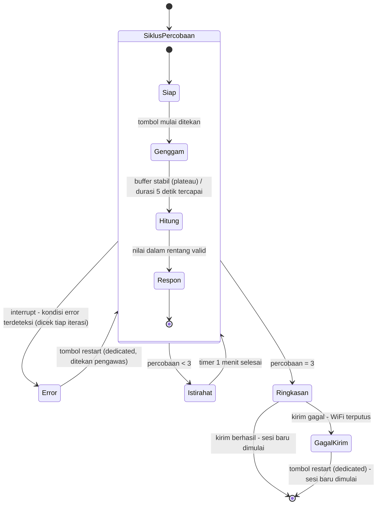

# Catatan Riset & Perencanaan - Hand Grip Dynamometer (v2)
**Final Project - Embedded Systems Course**

> Dokumen ini BUKAN proposal. Ini adalah wadah (vessel) yang menyimpan semua informasi, rujukan, dan keputusan yang sudah diambil sejauh ini, agar penyusunan proposal G1 nanti tinggal menyusun ulang isi dokumen ini ke dalam format yang diminta.

---

## 1. RINGKASAN PROYEK

| Item | Detail |
|------|--------|
| Mata kuliah | Mata kuliah embedded system (biomedik) |
| Posisi saat ini | Minggu ke-4 (topik: ADC, sensor analog, peripheral serial) |
| Platform wajib | ESP32 (Arduino IDE) |
| Anggaran komponen | Maksimum Rp300.000 per kelompok, dengan bukti pembelian |
| Filosofi cakupan | Menguji keterampilan teknis mahasiswa - BUKAN prototipe siap produksi massal |
| Perangkat | Hand grip dynamometer |

---

## 2. SUMBER RUJUKAN

| Sumber | Fokus utama | Kontribusi ke proyek ini |
|--------|-------------|---------------------------|
| Ramadhani et al. 2019 (IJEEEMI) | Alat ukur genggam pasien pasca-stroke: Arduino Uno + HX711 + load cell batang + LCD 16x2 + indikator 3-tingkat | Arsitektur paling sederhana dan paling dekat dengan skala proyek kelas - jadi referensi utama arsitektur hardware |
| Gotthelf et al. 2021 (J NeuroEng Rehab) | Sistem grip berbasis game (Rocket Launch), tracking MVC + fatigue selama sesi, divalidasi terhadap data normatif literatur | Sumber ide "pengukuran serial dari waktu ke waktu", TIDAK diadopsi fitur game-nya (di luar skop kelas) |
| Becerra et al. 2021 (Applied Sciences, UIB) | Perangkat wireless multi-sensor: gaya genggam + tekanan jari (FSR) + orientasi/tremor (IMU) + Bluetooth | Referensi untuk memahami instrumentation amplifier (AD627) sebagai alternatif HX711 - TIDAK diadopsi multi-sensornya (di luar skop kelas) |
| Chang & Chen 2015 (Bio-Med Mat & Eng, Taiwan) | Dynamometer + NI DAQ + LabView, data normatif Taiwan berdasarkan usia/tinggi/berat/panjang telapak | Referensi metodologi korelasi (tinggi, berat, panjang tangan vs kekuatan genggam) - platform (NI DAQ) TIDAK relevan untuk ESP32 |
| Vaishya et al. 2024 (J Health Pop & Nutrition) | Narrative review: HGS sebagai vital sign baru, cutoff per populasi, asosiasi dengan T2D/CVD/mortalitas/sarcopenia, protokol pengukuran (Box 1) | Sumber argumen medis utama proposal + protokol pengukuran standar (duduk, siku 90 derajat, tahan 3-5 detik, 3 kali percobaan, istirahat 1 menit antar percobaan) + konsep relative HGS (HGS/BMI) |
| Marwedel, *Embedded System Design* (ed. 4) | Buku teks embedded system - teori state machine, evaluasi, dependability | §2.4 StateCharts (formalisasi hierarki 2 lapisan, Bagian 6), §5.3 Quality Metrics (RMSE/MAE, Bagian 9), §5.6.5 FMEA/FTA (daftar risiko, Bagian 9), Bab 1 Tabel 1.2 (justifikasi ESP32, Bagian 8) |
| White, *Making Embedded Systems* (ed. 1, 2011) - dirujuk BRP sebagai [3] | Buku teks embedded system - praktik implementasi C untuk mikrokontroler | Bab 4 (debounce tombol, PWM), Bab 5 (table-driven state machine, watchdog), Bab 6 (circular buffer, event vs data-driven), Bab 3 (pola "Error Handling Library"), Bab 9 (taking an average) - lihat §6.4 untuk rincian per keputusan |

---

## 3. KEBUTUHAN DARI BRP (Buku Rancangan Pengajaran)

### 3.1 Gerbang Proyek & Tenggat Waktu

| Minggu | Tonggak |
|--------|---------|
| 5-6 | Proposal + Design Review (**G1**) - draf disusun sekarang |
| 7 | Tenggat berkas gerber (wajib untuk ikut batch fabrikasi kolektif) |
| 9 | **G2** - jalur penginderaan & aktuasi hidup di breadboard, PCB dipesan kolektif |
| 11-12 | PCB diterima; **G3** - PCB dirakit & lolos uji dasar |
| 14 | **G4** - purwarupa terintegrasi lolos uji mandiri |
| 16 | UAS - demo expo, makalah, viva individu |

### 3.2 Rubrik G1: Proposal dan Design Review (checklist)

| Bagian wajib | Status di dokumen ini |
|---|---|
| Perumusan masalah medis | Selesai - lihat Bagian 4 |
| Spesifikasi terukur (range, akurasi, waktu respons, daya) | Sebagian (~25%) - range fisik sudah ditentukan, lihat Bagian 9 |
| Arsitektur sistem + kelayakan teknis | Sebagian besar - lihat Bagian 6 (state machine 2 lapisan lengkap dengan keputusan teknis per state; pin-out diagram blok komponen belum) |
| BOM dalam anggaran Rp300.000 | ~90% - lihat Bagian 9.1, harga riil sudah ada |
| Jadwal selaras dengan gerbang proyek | **BELUM** |
| Daftar risiko & mitigasi | Belum diisi - metodologi (FMEA) sudah ditentukan, lihat Bagian 9 |

---

## 4. EVOLUSI PERUMUSAN MASALAH

Keputusan populasi target berubah beberapa kali selama diskusi - dicatat di sini supaya alasan penolakan versi-versi sebelumnya tidak hilang.

| Versi | Populasi target | Alasan ditolak/direvisi |
|-------|------------------|--------------------------|
| v1 | Pasien pasca-stroke | Terlalu besar skopnya untuk proyek satu semester; butuh proses rekrutmen populasi rentan yang lebih rumit dari yang bisa ditangani jadwal kelas |
| v2 | Mahasiswa teknik, argumen berbasis tugas okupasional (mengetik/coding, menyolder, menggambar manual) | Lebih kuat, tapi populasinya (lintas fakultas) masih sulit direkrut secara realistis |
| **v3 (final)** | **Mahasiswa Teknik Elektro, Teknik Biomedik, dan Teknik Komputer** (satu departemen di fakultas teknik) | Dipilih karena: (1) tidak mudah ditebak arah hasilnya - benar-benar pertanyaan terbuka; (2) populasi realistis direkrut karena satu departemen; (3) penulis sendiri adalah mahasiswa Teknik Biomedik, memberi motivasi personal yang sah tanpa anekdot yang perlu dijelaskan |

> **Rumusan masalah (draf kerja):**
> Berbagai jurusan di Departemen Teknik Elektro menuntut penggunaan tangan secara berbeda dan berkelanjutan - mahasiswa Teknik Komputer terbiasa mengetik/coding dalam waktu lama, mahasiswa Teknik Elektro banyak menyolder dan menangani komponen kecil, sementara mahasiswa Teknik Biomedik kerap melakukan keduanya. Belum ada cara sederhana untuk memantau apakah pola penggunaan tangan ini memengaruhi kekuatan genggam dari waktu ke waktu - celah inilah yang coba dijawab alat ini, sekaligus menguji apakah perbedaan jurusan benar-benar berkorelasi dengan kekuatan genggam atau tidak.

---

## 5. FUNGSI PERANGKAT (Keputusan Skop)

| # | Fungsi | Sub-CPMK terkait | Sumber ide | Status |
|---|--------|-------------------|------------|--------|
| 1 | Pembacaan gaya real-time (kg/N) | Sub-CPMK 4 (ADC) | Semua paper referensi | Wajib |
| 2 | Penangkapan gaya puncak per percobaan (MVC) | Sub-CPMK 4 | Ramadhani, Gotthelf, protokol Vaishya (Box 1) | Wajib |
| 3 | Tampilan hasil (LCD/serial) | Sub-CPMK 4 | Semua paper referensi | Wajib |
| 4 | Umpan balik aktuator (buzzer/LED) saat percobaan selesai | Sub-CPMK 5 (aktuator) | Tidak ada di paper - ditambahkan agar Sub-CPMK 5 punya tempat wajar di perangkat ini | Wajib |
| 5 | Pencatatan data lintas-sesi (cloud/lokal) | Sub-CPMK 7 (IoT) | Argumen utama Vaishya: nilai klinis HGS datang dari **pengukuran serial**, bukan sekali baca | Wajib |
| 6 | Rata-rata 3 percobaan + timer istirahat | - | Protokol standar Box 1 (Vaishya): 3 percobaan per tangan, istirahat ~1 menit | Opsional (murah, hanya logika software) |

**Sengaja TIDAK dimasukkan** (di luar skop "uji keterampilan teknis"):
- Relative HGS (butuh input tinggi/berat + logika tambahan) - **dipindah ke tahap analisis data pasca-pengukuran**, bukan fitur firmware
- Game biofeedback penuh ala Gotthelf - itu proyek software/UX, bukan embedded
- Sensor jari (FSR) + IMU tremor ala Becerra - di luar cakupan penilaian mata kuliah

**Variabel yang tetap dicatat manual (bukan fitur firmware), untuk analisis data di makalah akhir:**
tinggi badan, berat badan, tangan dominan, jam coding/menyolder/menggambar per minggu, frekuensi olahraga. (Dipakai untuk menghitung relative HGS dan mengendalikan variabel perancu saat membandingkan 3 jurusan.)

---

## 6. ARSITEKTUR SISTEM (Alur State Machine)

Dirancang berlapis (hierarchical state, lihat §6.4) - bukan satu loop datar seperti draf awal. **Lapisan luar** menangani satu sesi (3 percobaan + istirahat + ringkasan). **Lapisan dalam** menangani satu percobaan tunggal (4 state). Lapisan dalam "bersarang" di dalam satu kotak pada lapisan luar.

### 6.1 Lapisan luar (per sesi)

Selain siklus percobaan, istirahat, dan ringkasan, ada satu **interrupt transition** yang berlaku untuk seluruh isi kotak `SiklusPercobaan` - bukan transisi dari satu state tertentu di dalamnya:

```
[Siklus percobaan] --(interrupt: kondisi error terdeteksi)--> [Error: tahan, tampilkan detail]
[Error] --(tombol restart ditekan pengawas)--> kembali ke [Siklus percobaan]
[Siklus percobaan] --(< 3 kali)--> [Istirahat: timer 1 menit] --> kembali ke [Siklus percobaan]
[Siklus percobaan] --(= 3 kali)--> [Ringkasan: rata-rata & histori]
[Ringkasan] --(kirim gagal)--> [GagalKirim: tahan, tampilkan data] --(tombol restart)--> [Sesi baru dimulai]
[Ringkasan] --(kirim berhasil)--> [Sesi baru dimulai]
```

- **Error**: state "tahan" (hold) sungguhan (bukan transisi sesaat yang langsung retry) - alat berhenti total, menampilkan jenis error dan pembacaan ADC mentah **secara live** (terus di-update, bukan snapshot beku) supaya pengawas bisa memeriksa fisik alat sambil melihat perubahan pembacaan. Layar tidak berubah sampai pengawas menekan **tombol restart khusus** (komponen baru, bukan reuse tombol mulai) setelah selesai mencatat manual - ini pola **"Error Handling Library"** (White, Bab 3 "Dealing with Errors" - satu modul/fungsi dipanggil dari titik manapun yang butuh) yang sama dipakai lagi di `GagalKirim` (lihat bawah). Percobaan yang error TIDAK dihitung sebagai salah satu dari 3 percobaan. Audiens state ini adalah pengawas alat (TA/tim riset), bukan partisipan - jadi larangan "tidak boleh lihat angka mentah" di Bagian 7 sengaja dikecualikan di sini (**keputusan desain kami sendiri**, bukan dari sumber eksternal - alasannya: rubrik Divais dan Demo BRP menilai ketahanan uji adversarial termasuk kondisi gagal, jadi transparansi ke pengawas justru dinilai positif). Dicatat **manual** ke logbook tim (jenis error + waktu relatif `T+mm:ss` sejak alat menyala) - **keputusan tim kami sendiri** untuk TIDAK menambahkan counter otomatis di firmware, karena angka hitungan saja tidak menjelaskan "errornya karena apa", sedangkan logbook manual 1-2 menit memberi konteks yang jauh lebih berguna untuk analisis nanti.
- **Istirahat**: timer 1 menit sesuai protokol standar (Box 1, Vaishya) untuk mencegah kelelahan otot memengaruhi percobaan berikutnya.
- **Ringkasan**: hitung rata-rata 3 percobaan, ambil riwayat sesi lalu untuk perbandingan ("lebih kuat dari sesi lalu"), lalu kirim ke cloud. **Kalau kirim gagal** (WiFi terputus di lapangan), masuk ke state `GagalKirim` - pola yang **identik dengan `Error`** di atas (layar diam/live menampilkan data yang gagal terkirim, tidak berubah sampai pengawas selesai mencatat manual, keluar lewat tombol restart yang sama). Bedanya cuma tujuan keluar: `Error` kembali ke `SiklusPercobaan` (karena perlu diulang), `GagalKirim` langsung ke akhir sesi (karena data pengukurannya sudah valid, cuma belum ter-upload - tidak perlu diulang, cukup dicatat).

### 6.2 Lapisan dalam (satu siklus percobaan): SIAP -> GENGGAM -> HITUNG -> RESPON

**[SIAP]**
- Menunggu interrupt tombol (bukan polling `digitalRead()`), agar tetap non-blocking (Sub-CPMK 3). Debounce **software** - abaikan re-trigger < ~50ms sejak interrupt terakhir (dicek di dalam ISR pakai `millis()`), teknik dari **White Bab 4 "Momentary Button Press"** (dikonfirmasi juga di Modul Praktikum 1).
- **Auto-tare**, dijalankan tiap masuk state ini (termasuk setelah kembali dari Istirahat) - **keputusan desain kami sendiri** (bukan dari sumber eksternal manapun - tidak ada satupun dari 5 paper referensi yang membahas auto-tare per percobaan), diputuskan karena kami membandingkan 3 percobaan dalam satu sesi untuk dirata-ratakan, jadi konsistensi titik nol antar percobaan penting untuk validitas data. Dua langkah berurutan dalam state yang sama: (1) tampilkan `"Menyesuaikan nol..."` di LCD, jalankan fungsi tare; (2) begitu selesai (~1 detik, angka pasti menunggu pengujian fisik), ganti tampilan jadi `"Siap - tekan tombol"`. Tidak perlu animasi/state terpisah - durasi tare cukup singkat untuk cukup ditandai teks statis.
- Tidak ada jalur ke ERROR dari state ini.

**[GENGGAM]**
- Loop baca ADC dari HX711, terapkan `calibration_factor`, tampilkan real-time ke LCD.
- HX711 `get_units()` bersifat blocking (menunggu pin DOUT turun, ~100ms pada 10Hz) - **diterima apa adanya** untuk versi awal (bukan polling `is_ready()`), karena cuma satu instance singkat per iterasi dan sudah dibahas Modul Praktikum 2 soal kapan delay masih acceptable.
- **Smoothing + deteksi plateau digabung jadi satu mekanisme** (circular buffer, **White Bab 6 "Circular Buffers" & Bab 9 "Taking an Average"**): simpan 5 pembacaan terakhir dalam buffer melingkar. Tiap pembacaan baru masuk, cek selisih (tertinggi - terendah) dalam buffer terhadap **threshold kestabilan** (nilai pasti menunggu hasil eksperimen - pegang load cell diam, ukur noise alami dari serial monitor; threshold harus di atas noise alami itu). Kalau belum stabil (gaya masih naik menuju puncak), buffer terus bergeser - LCD tetap menampilkan pembacaan real-time dari buffer (sudah halus, tidak goyang) tapi belum ada nilai final. Begitu buffer terdeteksi stabil (gaya sudah plateau), rata-rata buffer itu jadi `ref` (nilai puncak final) - **sekaligus** jadi sinyal untuk exit trigger (lihat bawah). Konsep "tunggu sampai plateau" ini sejalan dengan instruksi protokol asli **Vaishya Box 1**: *"squeeze... until I say stop (when the needle stops rising)"* - deteksi berhentinya kenaikan, bukan cuma durasi tetap semata.
- Exit trigger: tahan minimum 3 detik (**protokol Vaishya, Box 1**), **DAN** salah satu dari: buffer terdeteksi stabil (plateau - exit lebih awal), atau durasi maksimum 5 detik tercapai (batas aman kalau plateau tidak pernah terdeteksi - **keputusan tim kami sendiri** sebagai pengaman, tidak eksplisit di protokol Vaishya). Tidak ada kondisi "gaya turun ke ambang" terpisah - sudah tercakup dalam mekanisme buffer di atas (dicek juga ke Ramadhani & Gotthelf: tidak ada satupun implementasi referensi yang pakai threshold gaya untuk deteksi akhir).
- Refresh rate LCD: dipisah dari sample rate sensor via timer terpisah (`millis()`), supaya sensor tetap dibaca secepat mungkin tapi LCD tidak diupdate berlebihan. Metodologi penentuan angka: eksperimen langsung (modifikasi Walking Light Challenge 1 tanpa tombol, coba beberapa nilai delay 50-500ms, rasakan mana yang terasa "mengalir mulus" vs "patah-patah") + tambahan ~20ms buffer untuk kompensasi waktu kirim I2C ke LCD (**estimasi teknis kami sendiri**, berdasar kecepatan standar I2C 100kHz - bukan dari sumber eksternal manapun). **Angka final masih menunggu hasil eksperimen** - bukan besaran teoretis, jadi tetap terbuka sampai diuji dengan hardware sungguhan.
- Transisi keluar: ke HITUNG (normal). Kondisi gagal (HX711 tidak `is_ready()` dalam batas waktu tertentu / nilai ADC mendekati saturasi 24-bit) tidak lagi jadi transisi eksplisit dari state ini - ditangani interrupt transition dari batas kotak SiklusPercobaan (lihat §6.1). **Angka batas waktu dan ambang saturasi juga masih menunggu pengujian dengan load cell 180kg sungguhan.**

**[HITUNG]**
- One-shot (bukan loop), dieksekusi sekali begitu GENGGAM selesai (`ref` sudah jadi hasil rata-rata buffer yang stabil, bukan pembacaan mentah tunggal). Validasi rentang nilai `ref` terhadap kapasitas load cell 180kg (misal reject kalau `ref` > 100kg atau `ref` < 0) - **angka 100kg diturunkan dari data Gotthelf** (individu terkuat di rentang usia populasi target tercatat ~78kgf; 100kg dipilih sebagai batas dengan margin aman di atas itu tapi jauh di bawah kapasitas sensor 180kg), **angka ambang pasti tetap menunggu pengujian fisik**. Simpan ke posisi percobaan ke-1/2/3.
- Sengaja TIDAK menghitung relative HGS di sini - tetap dipindah ke analisis data pasca-pengukuran sesuai keputusan skop di Bagian 5.
- Smoothing sudah selesai di GENGGAM (lihat atas) - alasan utamanya **bukan** soal larangan "tidak boleh lihat nilai mentah" di Bagian 7 (itu bicara soal kalibrasi kg, bukan smoothing), tapi murni kualitas pengalaman: tampilan real-time yang stabil terasa lebih meyakinkan dilihat pengguna dibanding angka kg yang sudah terkalibrasi tapi masih goyang karena noise.
- Nilai float mentah (sebelum dibulatkan untuk tampilan LCD) tetap disimpan di memori, supaya presisi tidak hilang untuk analisis akurasi nanti (lihat §6.4, Bab 5 Marwedel).
- Transisi keluar: ke RESPON (lolos validasi). Nilai di luar rentang fisik yang masuk akal ditangani interrupt transition dari batas kotak SiklusPercobaan (lihat §6.1), bukan transisi eksplisit dari state ini.

**[RESPON]**
- Nyalakan LED (Sub-CPMK 5) + tampilkan hasil dengan konteks dalam-sesi ("Percobaan 2 dari 3 - 27.1 kg"). Perbandingan lintas sesi BUKAN di sini - itu terjadi di RINGKASAN (lapisan luar). **Buzzer sengaja dilepas dari scope - ini keputusan tim kami sendiri** (bukan dari paper/buku manapun), dengan alasan: alat riset kecil-kecilan yang diawasi langsung tidak butuh sinyal audio berlebihan seperti alat komersial, dan bobot penilaian proyek ini lebih besar di firmware daripada aksesoris hardware (lihat Bagian 5).
- Tidak butuh timer terpisah: LED cukup **diikat ke masuk/keluar state** - menyala begitu masuk RESPON, mati otomatis begitu pindah ke ISTIRAHAT/RINGKASAN. Ini jauh lebih sederhana dari rencana awal (yang mengasumsikan ada durasi bunyi buzzer yang perlu dikelola non-blocking) - keputusan melepas buzzer menghilangkan seluruh kebutuhan pengaturan timing sinyal di state ini.
- Tidak ada jalur ERROR dari state ini (nilai sudah tervalidasi di HITUNG).
- Transisi keluar (bercabang ke lapisan luar): percobaan < 3 -> ISTIRAHAT; percobaan = 3 -> RINGKASAN.

### 6.2b Diagram Mermaid (gabungan lapisan luar & dalam)



*`Error` dan `GagalKirim` memakai pola yang sama (tahan layar, live/tidak berubah sampai pengawas selesai mencatat manual, keluar lewat tombol restart yang sama) - cukup diimplementasikan sebagai satu fungsi/modul kode yang dipanggil dari dua titik berbeda di firmware, meski keduanya tetap dua state FSM terpisah karena tujuan keluarnya berbeda.*

*Render otomatis di GitHub. Untuk versi draw.io (proposal Word/PDF), gunakan shape UML State Machine dengan composite state untuk `SiklusPercobaan` dan guard condition `[percobaan < 3]` / `[percobaan = 3]` pada label transisi keluar.*

### 6.3 Diagram blok komponen (pin-out belum lengkap - lihat Bagian 9)
`Load cell -> HX711 (amplifier + 24-bit ADC) -> ESP32 -> {LCD, LED, WiFi/cloud}`

### 6.4 Referensi teori

**Marwedel, *Embedded System Design* (ed. 4):**
- Formalisasi hierarki dua lapisan di atas: **Bab 2, §2.4 Communicating Finite State Machines**, khususnya **§2.4.2 StateCharts** (hierarchical & orthogonal states).
- Pipeline sensor/ADC (GENGGAM): **Bab 3, §3.2.1 Sensors, §3.2.2 Sample-and-Hold, §3.2.4 ADC**.
- Aktuator/PWM: **Bab 3, §3.6.1 DAC, §3.6.3 Pulse-Width Modulation, §3.6.4 Actuators**.
- Metodologi validasi akurasi (untuk Bagian 9): **Bab 5, §5.3 Quality Metrics** (RMSE/MAE terhadap beban referensi).
- Metodologi daftar risiko (untuk Bagian 9): **Bab 5, §5.6.5 Fault Tree Analysis & FMEA**.

**White, *Making Embedded Systems* (ed. 1, 2011) - rujukan BRP [3]:**
- Debounce tombol di SIAP: **Bab 4, "Momentary Button Press"**.
- Pola shared-module untuk Error/GagalKirim: **Bab 3, "Dealing with Errors"** - "Error Handling Library" pattern.
- Cara implementasi kode state machine (belum dikerjakan - lihat Bagian 10): **Bab 5, "State Machines"** - lima pola implementasi, table-driven direkomendasikan penulis.
- Watchdog (belum diintegrasikan ke desain - lihat Bagian 10): **Bab 5, "Watchdog"** - tiga anti-pattern pemberian sinyal yang harus dihindari, rekomendasi satu titik feed di main loop.
- Smoothing nilai puncak di GENGGAM: **Bab 6, "Circular Buffers"** & **Bab 9, "Taking an Average"**.
- Pembedaan event-driven vs data-driven (dasar kenapa GENGGAM "terasa beda" dari state lain): **Bab 6, "Data Handling"**.

**Vaishya et al. 2024 (Box 1):**
- Durasi tahan 3-5 detik, rest 1 menit antar percobaan: dipakai langsung sebagai exit trigger GENGGAM dan durasi ISTIRAHAT.
- Instruksi "until I say stop (when the needle stops rising)": dasar konsep deteksi plateau di GENGGAM, bukan cuma durasi tetap.

**Gotthelf et al. 2021:**
- Data individu MVC per kelompok usia: dasar penentuan kapasitas load cell (180kg) dan ambang validasi di HITUNG (100kg).

---

## 7. NARASI PENGALAMAN PENGGUNA

*Disusun dari sudut pandang user (lihat pendekatan kerja di Bagian 1), disintesis dari pola UX konkret di Ramadhani (tombol start/reset fisik, tampilan LCD+indikator), Gotthelf (kalibrasi disamarkan jadi instruksi, feedback real-time terhadap target), dan Becerra (histori/riwayat sesi) - bukan disalin satu-satu, tapi digabung sesuai kebutuhan proyek ini.*

- Pengguna: mahasiswa teknik, tidak diasumsikan punya latar belakang teknis alat ini
- Mengambil alat: cukup kecil digenggam satu tangan, layar/lampu menunjukkan alat siap
- Memulai: satu tombol, konfirmasi jelas ("Squeeze now")
- Saat meremas: umpan balik visual real-time (angka naik / bar terisi)
- Selesai: sinyal jelas (**LED + visual**, lihat Bagian 6.2 RESPON - buzzer/getar sudah dilepas dari scope), hasil ditampilkan dengan konteks ("lebih kuat dari sesi lalu"), bukan angka mentah tanpa makna
- Antar sesi: alat/dashboard mengingat riwayat, menunjukkan tren - ini adalah **inti nilai alat**, bukan fitur tambahan (argumen utama Vaishya: nilai klinis HGS datang dari pengukuran serial, bukan sekali baca - lihat Bagian 5 Fitur #5)
- Yang harus dihindari: pengguna tidak boleh melihat angka mentah belum terkalibrasi (dikecualikan untuk pengawas di state Error/GagalKirim - lihat Bagian 6.1); kegagalan pembacaan tidak boleh senyap (rubrik BRP "ketahanan uji adversarial" - lihat Bagian 6.1)

---

## 8. CATATAN PLATFORM: ESP32 vs RASPBERRY PI

- G1 (proposal) jatuh tempo minggu 5-6; Raspberry Pi baru diajarkan minggu 10 (Sub-CPMK 8) - artinya arsitektur inti proyek **realistisnya harus ESP32-only** saat proposal ditulis
- Raspberry Pi dicatat sebagai **kemungkinan ekstensi pasca-minggu 10** (mis. sebagai local data hub/dashboard), bukan kebutuhan wajib
- Edge AI (minggu 11, Sub-CPMK 9) dinilai **tidak relevan** dipaksakan ke proyek ini - tidak ada tugas inferensi on-device yang bermakna untuk dynamometer

**Justifikasi ESP32 (dari Marwedel Bab 1, Definisi 1.1 & Tabel 1.2):**
> "Embedded systems are information processing systems embedded into enclosing products." - ESP32 di dalam alat genggam ini persis memenuhi definisi ini.

| Kriteria (Tabel 1.2 Marwedel) | Embedded (ESP32) | PC-like |
|---|---|---|
| Arsitektur | Kompak, heterogen | Tidak kompak, homogen |
| Tujuan optimasi | Energi, ukuran | Performa rata-rata |
| Relevansi real-time | Sering penting | Jarang |
| Safety-critical | Mungkin | Biasanya tidak |

Argumen proposal: alat genggam butuh ukuran kompak, daya rendah, dan pewaktuan yang bisa diprediksi (non-blocking) - ESP32 cocok, PC/laptop tidak.

---

## 9. AREA YANG BELUM DIBAHAS (Checklist Terbuka)

| Area | Status | Catatan |
|------|--------|---------|
| Spesifikasi terukur (range gaya, akurasi, waktu respons, anggaran daya) | Sebagian | Range fisik sensor sudah ditentukan (load cell 180kg, headroom besar dari kekuatan genggam individu terkuat di populasi target ~78kgf, data Gotthelf). Akurasi/waktu respons/anggaran daya belum dihitung formal - metodologi akurasi sudah diidentifikasi: RMSE/MAE terhadap beban referensi (Marwedel Bab 5 §5.3, lihat Bagian 6.4) |
| Diagram blok komponen lengkap (bukan hanya alur state) | Sebagian | Alur state machine 2 lapisan sudah lengkap (Bagian 6); yang belum cuma pin-out dan interface spesifik (SPI/bit-bang HX711, dst.) |
| BOM dengan harga riil, dalam Rp300.000 | ~90% - lihat tabel 9.1 | Total Rp165.500 dari Rp300.000 (komponen utama), sisa ~Rp134.500. LED belum dikonfirmasi/checkout |
| Jadwal kerja selaras dengan gerbang G1-G4 | Belum dimulai | |
| Daftar risiko & mitigasi | Belum diisi | Metodologi sudah diidentifikasi: kerangka FMEA (Marwedel Bab 5 §5.6.5, lihat Bagian 6.4); perlu mencakup risiko studi banding 3 jurusan: rekrutmen tidak seimbang, sampel kecil, variabel perancu (usia, olahraga, tangan dominan) |
| Proses consent informal untuk partisipan | Disebutkan, belum didetailkan | Cukup persetujuan lisan/tertulis sederhana, bukan proses etik formal. Tambahkan satu kalimat: pengulangan percobaan kadang terjadi karena alasan teknis (state Error), bukan kesalahan partisipan (lihat Bagian 6.1 & 7) |

### 9.1 BOM (harga riil, per komponen)

| Komponen | Qty | Harga satuan | Subtotal | Catatan |
|---|---|---|---|---|
| Load cell 180kg (full bridge, 4 kabel) | 1 | Rp115.000 | Rp115.000 | Perlu frame/tuas di enclosure - lihat Bagian 6.3 |
| Modul HX711 | 1 | Rp8.500 | Rp8.500 | Beri daya 2.7-5V dari ESP32, gunakan channel A saja |
| LCD 16x2 I2C (hijau, alamat 0x27/0x3f) | 1 | Rp39.500 | Rp39.500 | Beri daya 3.3V (bukan 5V) - level GPIO ESP32 tidak toleran 5V |
| Push button tactile 6x6x5mm | 5 (min. order) | Rp500 | Rp2.500 | Cuma butuh 2 (mulai + restart), sisa 3 jadi cadangan |
| LED indikator | 1 | - | - | **Belum di-checkout** - cek dulu apakah sudah termasuk komponen pasif lab (BRP D.5) sebelum beli sendiri (~Rp500-1.000 kalau beli) |
| Motor getar 3-5VDC 80mA | - | - | - | **Dilepas dari scope untuk sekarang** - butuh driver transistor+diode yang belum siap dijustifikasi ke dosen; LED sudah cukup untuk Fitur #4 |
| **Total** | | | **~Rp165.500** | Sisa anggaran ~Rp134.500 dari Rp300.000 (belum termasuk LED kalau ternyata perlu beli sendiri) |

Resistor basis untuk transistor driver termasuk komponen pasif yang sudah disediakan lab (BRP D.5), tidak perlu dibeli. Breadboard, kabel jumper, ESP32 juga sudah disediakan lab. Motor getar + driver bisa dipertimbangkan lagi sebagai ekstensi opsional kalau ada waktu/kebutuhan tambahan menjelang G4.

---

## 10. CATATAN TERBUKA / PERTANYAAN YANG BELUM TERJAWAB

- Berapa target jumlah partisipan per jurusan? (mempengaruhi validitas perbandingan 3 kelompok)
- Apakah akan menggunakan tangan dominan saja, atau kedua tangan?
- Bagaimana bentuk pencatatan riwayat sesi ditampilkan ke pengguna - cukup di serial monitor untuk demo, atau perlu dashboard sederhana?

---

*Dokumen ini adalah catatan riset dan perencanaan untuk proposal akhir mata kuliah embedded system (biomedik). Bukan proposal final - gunakan sebagai bahan mentah untuk menyusun dokumen proposal G1 sesuai format yang diminta dosen.*
