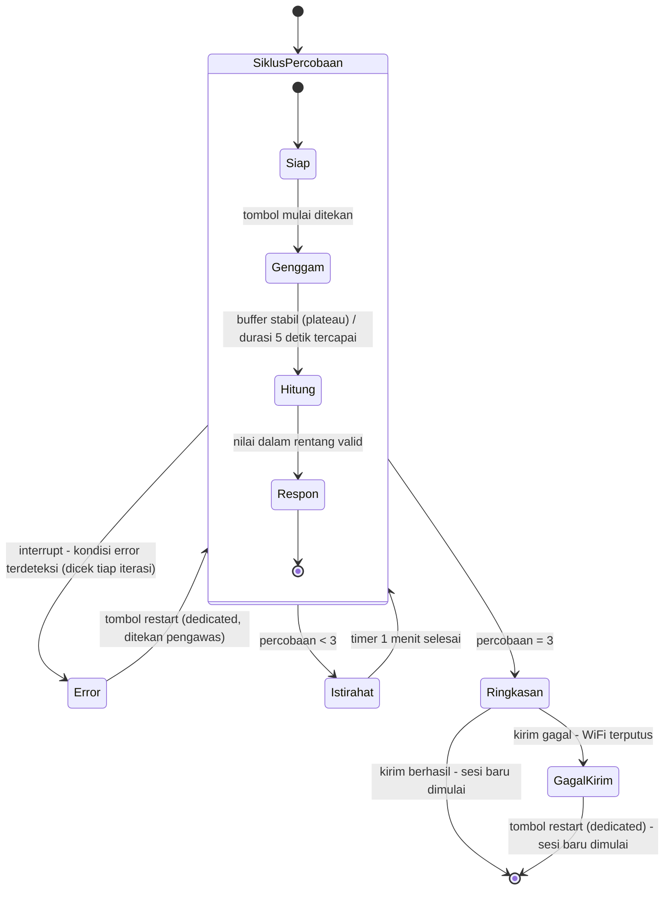

# Catatan Riset & Perencanaan - Hand Grip Dynamometer (v9)
**Final Project - Embedded Systems Course**

> Dokumen ini BUKAN proposal. Ini adalah wadah (vessel) yang menyimpan semua informasi, rujukan, dan keputusan yang sudah diambil sejauh ini, agar penyusunan proposal G1 nanti tinggal menyusun ulang isi dokumen ini ke dalam format yang diminta.

---

## 1. RINGKASAN PROYEK

| Item | Detail |
|------|--------|
| Mata kuliah | Mata kuliah embedded system (biomedik) |
| Posisi saat ini | Minggu ke-4 (topik: ADC, sensor analog, peripheral serial) |
| Platform wajib | ESP32 (Arduino IDE) |
| Anggaran komponen | Maksimum Rp300.000 per kelompok, dengan bukti pembelian |
| Filosofi cakupan | Menguji keterampilan teknis mahasiswa - BUKAN prototipe siap produksi massal |
| Perangkat | Hand grip dynamometer |

---

## 2. SUMBER RUJUKAN

https://drive.google.com/drive/folders/1nbT_B_snksXwBb6IFAcCBsopwRYrQzlZ?usp=sharing
| Sumber | Fokus utama | Kontribusi ke proyek ini |
|--------|-------------|---------------------------|
| Ramadhani et al. 2019 (IJEEEMI) | Alat ukur genggam pasien pasca-stroke: Arduino Uno + HX711 + load cell batang + LCD 16x2 + indikator 3-tingkat | Arsitektur paling sederhana dan paling dekat dengan skala proyek kelas - jadi referensi utama arsitektur hardware |
| Gotthelf et al. 2021 (J NeuroEng Rehab) | Sistem grip berbasis game (Rocket Launch), tracking MVC + fatigue selama sesi, divalidasi terhadap data normatif literatur | Sumber ide "pengukuran serial dari waktu ke waktu", TIDAK diadopsi fitur game-nya (di luar skop kelas) |
| Becerra et al. 2021 (Applied Sciences, UIB) | Perangkat wireless multi-sensor: gaya genggam + tekanan jari (FSR) + orientasi/tremor (IMU) + Bluetooth | Referensi untuk memahami instrumentation amplifier (AD627) sebagai alternatif HX711 - TIDAK diadopsi multi-sensornya (di luar skop kelas) |
| Chang & Chen 2015 (Bio-Med Mat & Eng, Taiwan) | Dynamometer + NI DAQ + LabView, data normatif Taiwan berdasarkan usia/tinggi/berat/panjang telapak | Referensi metodologi korelasi (tinggi, berat, panjang tangan vs kekuatan genggam) - platform (NI DAQ) TIDAK relevan untuk ESP32 |
| Vaishya et al. 2024 (J Health Pop & Nutrition) | Narrative review: HGS sebagai vital sign baru, cutoff per populasi, asosiasi dengan T2D/CVD/mortalitas/sarcopenia, protokol pengukuran (Box 1) | Sumber argumen medis utama proposal + protokol pengukuran standar (duduk, siku 90 derajat, tahan 3-5 detik, 3 kali percobaan, istirahat 1 menit antar percobaan) + konsep relative HGS (HGS/BMI) |
| Marwedel, *Embedded System Design* (ed. 4) | Buku teks embedded system - teori state machine, evaluasi, dependability | §2.4 StateCharts (formalisasi hierarki 2 lapisan, Bagian 6), §5.3 Quality Metrics (RMSE/MAE, Bagian 9), §5.6.5 FMEA/FTA (daftar risiko, Bagian 9), Bab 1 Tabel 1.2 (justifikasi ESP32, Bagian 8) |
| White, *Making Embedded Systems* (ed. 1, 2011) - dirujuk BRP sebagai [3] | Buku teks embedded system - praktik implementasi C untuk mikrokontroler | Bab 4 (debounce tombol, PWM), Bab 5 (table-driven state machine, watchdog), Bab 6 (circular buffer, event vs data-driven), Bab 3 (pola "Error Handling Library"), Bab 9 (taking an average) - lihat §6.4 untuk rincian per keputusan |
| Russell, *Introduction to Embedded Systems Using ANSI C and the Arduino Development Environment* (2010) - dirujuk BRP sebagai [1] | Buku teks embedded system - dasar C, arsitektur ATmega328P, GPIO/timer/interrupt/ADC | §9.1.2 ISR and Main Task Communication (kebenaran teknis komunikasi ISR-loop utama, Bagian 6.2 SIAP), §6.2.2 Internal Pull-up Resistor (justifikasi hindari floating pin, Bagian 6.2 SIAP) |

---

## 3. KEBUTUHAN DARI BRP (Buku Rancangan Pengajaran)

### 3.1 Gerbang Proyek & Tenggat Waktu

| Minggu | Tonggak |
|--------|---------|
| 5-6 | Proposal + Design Review (**G1**) - draf disusun sekarang |
| 7 | Tenggat berkas gerber (wajib untuk ikut batch fabrikasi kolektif) |
| 9 | **G2** - jalur penginderaan & aktuasi hidup di breadboard, PCB dipesan kolektif |
| 11-12 | PCB diterima; **G3** - PCB dirakit & lolos uji dasar |
| 14 | **G4** - purwarupa terintegrasi lolos uji mandiri |
| 16 | UAS - demo expo, makalah, viva individu |

### 3.2 Rubrik G1: Proposal dan Design Review (checklist)

| Bagian wajib | Status di dokumen ini |
|---|---|
| Perumusan masalah medis | Selesai - lihat Bagian 4 |
| Spesifikasi terukur (range, akurasi, waktu respons, daya) | Sebagian (~25%) - range fisik sudah ditentukan, lihat Bagian 9 |
| Arsitektur sistem + kelayakan teknis | Sebagian besar - lihat Bagian 6 (state machine 2 lapisan lengkap dengan keputusan teknis per state; pin-out diagram blok komponen belum) |
| BOM dalam anggaran Rp300.000 | ~90% - lihat Bagian 9.1, harga riil sudah ada |
| Jadwal selaras dengan gerbang proyek | **BELUM** |
| Daftar risiko & mitigasi | Belum diisi - metodologi (FMEA) sudah ditentukan, lihat Bagian 9 |

---

## 4. EVOLUSI PERUMUSAN MASALAH

Keputusan populasi target berubah beberapa kali selama diskusi - dicatat di sini supaya alasan penolakan versi-versi sebelumnya tidak hilang.

| Versi | Populasi target | Alasan ditolak/direvisi |
|-------|------------------|--------------------------|
| **v1 (motivasi medis dasar - lihat catatan di bawah)** | Pasien pasca-stroke | Terlalu besar skopnya untuk proyek satu semester; butuh proses rekrutmen populasi rentan yang lebih rumit dari yang bisa ditangani jadwal kelas. **TIDAK dibuang** - dipakai kembali di v5 sebagai rujukan kebutuhan klinis, bukan sebagai populasi yang diuji |
| v2 | Mahasiswa teknik, argumen berbasis tugas okupasional (mengetik/coding, menyolder, menggambar manual) | Lebih kuat, tapi populasinya (lintas fakultas) masih sulit direkrut secara realistis |
| v3 (superseded oleh v5) | Mahasiswa Teknik Elektro, Teknik Biomedik, dan Teknik Komputer (satu departemen di fakultas teknik) | Sempat dipilih karena: (1) tidak mudah ditebak arah hasilnya; (2) populasi realistis direkrut karena satu departemen; (3) penulis sendiri mahasiswa Teknik Biomedik. **Dibatalkan**: tetap merupakan pengujian pada orang di luar anggota tim (lintas jurusan), yang menurut Panduan G1 ("Testing on patients or on anyone outside your team") perlu persetujuan tertulis dosen sebelum proposal diajukan - risiko approval tidak turun tepat waktu sebelum tenggat Minggu 5 dianggap terlalu tinggi |
| v4 (superseded oleh v5) | Mahasiswa Teknik Biomedik saja (satu jurusan) | Sempat dicatat sebagai fallback kalau rekrutmen 3 jurusan (v3) tidak realistis. **Dibatalkan untuk alasan yang sama seperti v3**: tetap pengujian di luar anggota tim, tetap butuh persetujuan yang sama, cuma skalanya lebih kecil - tidak menyelesaikan masalah kepatuhan, cuma mengecilkannya |
| **v5 (final)** | **Hanya anggota kelompok sendiri** - tidak ada pengujian ke pasien maupun ke mahasiswa/pihak lain di luar tim | Dipilih karena sesuai persis dengan batas yang diizinkan Panduan G1: *"Non-invasive, low-voltage measurements on team members are fine"* - dynamometry genggam tangan non-invasif dan tegangan rendah, jadi seluruh pengukuran validasi (kalibrasi, MVC, protokol V1) bisa dijalankan tanpa perlu persetujuan tertulis dosen sama sekali. Pertanyaan "apakah jurusan berkorelasi dengan kekuatan genggam" (inti v3) **tidak lagi jadi tujuan proyek** - dicatat sebagai future work/di luar cakupan mata kuliah, bukan sesuatu yang diklaim sudah dijawab. Motivasi klinis proyek tetap dari v1 (lihat catatan di bawah), dan celah yang diisi proyek berubah dari "pertanyaan lintas-jurusan" menjadi "logging otomatis yang tidak dimiliki alat komersial" (lihat catatan di bawah) |

*v5 adalah rencana final untuk proposal G1. v1-v4 tetap didokumentasikan di sini supaya jejak alasan penolakan tiap versi tidak hilang - terutama v1, yang isinya (motivasi medis) tetap dipakai lagi di v5 walau populasi ujinya tidak.*

> **v1 sebagai motivasi medis dasar (bukan populasi uji).** Kebutuhan klinis yang memotivasi proyek ini tetap argumen v1: pasien pasca-stroke dan populasi dengan penurunan kekuatan genggam adalah alasan HGS penting diukur dan dipantau secara klinis (R1 - Ramadhani et al. memakai populasi ini langsung; V1/V2/V4 - Vaishya et al. mendokumentasikan HGS sebagai vital sign dan ambang klinisnya). Proposal G1 memakai v1 di Bagian 1 (Perumusan Masalah Medis) sebagai *rujukan kebutuhan klinis*, bukan sebagai populasi yang direkrut - device dirancang mengikuti protokol dan rentang yang relevan untuk populasi tersebut, tapi pengujian aktual di course ini (Minggu 5-14) hanya dilakukan pada anggota tim, sesuai v5.

> **Celah yang diisi proyek (pengganti pertanyaan lintas-jurusan v3): logging.** Kebanyakan hand grip dynamometer komersial (termasuk model analog klasik seperti JAMAR) tidak punya pencatatan data otomatis - pencatat harus menyalin nilai secara manual satu per satu, yang rawan human error dan kehilangan data (C2 - Chang & Chen 2015 secara eksplisit menyebut ini sebagai kelemahan dynamometer tradisional yang coba diatasi versi digital-terintegrasi). Argumen v2 dari Vaishya (nilai klinis HGS datang dari pengukuran serial dari waktu ke waktu, bukan sekali baca) berarti logging bukan fitur tambahan - itu bagian dari kenapa alat ini punya nilai dibanding alat manual. Kontribusi proyek: menambahkan logging otomatis yang tidak dimiliki alat pembanding.

> **Standar keberhasilan proyek disederhanakan jadi dua hal saja (menggantikan daftar 5-6 fitur "wajib" di Bagian 5 sebagai kriteria sukses utama):**
> 1. **Measurement** - pengukuran sesuai protokol standar V1 (duduk, siku ditekuk 90°, tahan 3-5 detik, 3 kali percobaan, istirahat ~1 menit antar percobaan), diverifikasi dengan RMSE/MAE terhadap beban referensi (M5).
> 2. **Logging** - data setiap sesi tersimpan otomatis (tidak hilang, tidak perlu disalin manual), ke **SD card dan/atau cloud** - bukan cuma CSV lewat USB serial ke laptop pribadi seperti default Modul 3 (Guided Example 4). Catatan dari Modul 3: *"Logging in Guided Example 4 now goes to a CSV file on your own laptop over the USB serial link; the lab has one SD card module, offered as an optional station."* Lab cuma punya **satu unit** modul SD card sebagai stasiun opsional/bergantian - ini jadi kendala ketersediaan resource yang perlu masuk ke Bagian 6 (Risiko) sebagai risiko spesifik proyek, dan jadi alasan kenapa jalur cloud tetap relevan sebagai alternatif/cadangan kalau giliran memakai modul SD card lab terbatas.

> **Rumusan masalah (draf kerja):**
> Berbagai jurusan di Departemen Teknik Elektro menuntut penggunaan tangan secara berbeda dan berkelanjutan - mahasiswa Teknik Komputer terbiasa mengetik/coding dalam waktu lama, mahasiswa Teknik Elektro banyak menyolder dan menangani komponen kecil, sementara mahasiswa Teknik Biomedik kerap melakukan keduanya. Belum ada cara sederhana untuk memantau apakah pola penggunaan tangan ini memengaruhi kekuatan genggam dari waktu ke waktu - celah inilah yang coba dijawab alat ini, sekaligus menguji apakah perbedaan jurusan benar-benar berkorelasi dengan kekuatan genggam atau tidak.

---

## 5. FUNGSI PERANGKAT (Keputusan Skop)

| # | Fungsi | Sub-CPMK terkait | Sumber ide | Status |
|---|--------|-------------------|------------|--------|
| 1 | Pembacaan gaya real-time (kg/N) | Sub-CPMK 4 (ADC) | Semua paper referensi | Wajib |
| 2 | Penangkapan gaya puncak per percobaan (MVC) | Sub-CPMK 4 | Ramadhani (R1), Gotthelf (G1), protokol Vaishya (V1) | Wajib |
| 3 | Tampilan hasil (LCD/serial) | Sub-CPMK 4 | Semua paper referensi | Wajib |
| 4 | Umpan balik aktuator (buzzer/LED) saat percobaan selesai | Sub-CPMK 5 (aktuator) | Tidak ada di paper - ditambahkan agar Sub-CPMK 5 punya tempat wajar di perangkat ini | Wajib |
| 5 | Pencatatan data lintas-sesi (cloud/lokal) | Sub-CPMK 7 (IoT) | Argumen utama Vaishya: nilai klinis HGS datang dari **pengukuran serial**, bukan sekali baca (V2) | Wajib |
| 6 | Rata-rata 3 percobaan + timer istirahat | - | Protokol standar Box 1, Vaishya (V1): 3 percobaan per tangan, istirahat ~1 menit | Opsional (murah, hanya logika software) |

**Sengaja TIDAK dimasukkan** (di luar skop "uji keterampilan teknis"):
- Relative HGS (V3, butuh input tinggi/berat + logika tambahan) - **dipindah ke tahap analisis data pasca-pengukuran**, bukan fitur firmware
- Game biofeedback penuh ala Gotthelf - itu proyek software/UX, bukan embedded
- Sensor jari (FSR) + IMU tremor ala Becerra - di luar cakupan penilaian mata kuliah

**Variabel yang tetap dicatat manual (bukan fitur firmware), untuk analisis data di makalah akhir:**
tinggi badan, berat badan, tangan dominan, jam coding/menyolder/menggambar per minggu, frekuensi olahraga. (Dipakai untuk menghitung relative HGS dan mengendalikan variabel perancu saat membandingkan 3 jurusan.)

---

## 6. ARSITEKTUR SISTEM (Alur State Machine)

Dirancang berlapis (hierarchical state, lihat §6.4) - bukan satu loop datar seperti draf awal. **Lapisan luar** menangani satu sesi (3 percobaan + istirahat + ringkasan). **Lapisan dalam** menangani satu percobaan tunggal (4 state). Lapisan dalam "bersarang" di dalam satu kotak pada lapisan luar.

### 6.1 Lapisan luar (per sesi)

Selain siklus percobaan, istirahat, dan ringkasan, ada satu **interrupt transition** yang berlaku untuk seluruh isi kotak `SiklusPercobaan` - bukan transisi dari satu state tertentu di dalamnya:

```
[Siklus percobaan] --(interrupt: kondisi error terdeteksi)--> [Error: tahan, tampilkan detail]
[Error] --(tombol restart ditekan pengawas)--> kembali ke [Siklus percobaan]
[Siklus percobaan] --(< 3 kali)--> [Istirahat: timer 1 menit] --> kembali ke [Siklus percobaan]
[Siklus percobaan] --(= 3 kali)--> [Ringkasan: rata-rata & histori]
[Ringkasan] --(kirim gagal)--> [GagalKirim: tahan, tampilkan data] --(tombol restart)--> [Sesi baru dimulai]
[Ringkasan] --(kirim berhasil)--> [Sesi baru dimulai]
```

- **Error**: state "tahan" (hold) sungguhan (bukan transisi sesaat yang langsung retry) - alat berhenti total, menampilkan jenis error dan pembacaan ADC mentah **secara live** (terus di-update, bukan snapshot beku) supaya pengawas bisa memeriksa fisik alat sambil melihat perubahan pembacaan. Layar tidak berubah sampai pengawas menekan **tombol restart khusus** (komponen baru, bukan reuse tombol mulai) setelah selesai mencatat manual - ini pola **"Error Handling Library"** (W2) yang sama dipakai lagi di `GagalKirim` (lihat bawah). Percobaan yang error TIDAK dihitung sebagai salah satu dari 3 percobaan. Audiens state ini adalah pengawas alat (TA/tim riset), bukan partisipan - jadi larangan "tidak boleh lihat angka mentah" di Bagian 7 sengaja dikecualikan di sini (**keputusan desain kami sendiri**, bukan dari sumber eksternal - alasannya: rubrik Divais dan Demo BRP menilai ketahanan uji adversarial termasuk kondisi gagal, jadi transparansi ke pengawas justru dinilai positif). Dicatat **manual** ke logbook tim (jenis error + waktu relatif `T+mm:ss` sejak alat menyala) - **keputusan tim kami sendiri** untuk TIDAK menambahkan counter otomatis di firmware, karena angka hitungan saja tidak menjelaskan "errornya karena apa", sedangkan logbook manual 1-2 menit memberi konteks yang jauh lebih berguna untuk analisis nanti.
- **Istirahat**: timer 1 menit sesuai protokol standar Box 1 (V1) untuk mencegah kelelahan otot memengaruhi percobaan berikutnya.
- **Ringkasan**: hitung rata-rata 3 percobaan, ambil riwayat sesi lalu untuk perbandingan ("lebih kuat dari sesi lalu"), lalu kirim ke cloud. **Kalau kirim gagal** (WiFi terputus di lapangan), masuk ke state `GagalKirim` - pola yang **identik dengan `Error`** di atas (layar diam/live menampilkan data yang gagal terkirim, tidak berubah sampai pengawas selesai mencatat manual, keluar lewat tombol restart yang sama). Bedanya cuma tujuan keluar: `Error` kembali ke `SiklusPercobaan` (karena perlu diulang), `GagalKirim` langsung ke akhir sesi (karena data pengukurannya sudah valid, cuma belum ter-upload - tidak perlu diulang, cukup dicatat).

### 6.2 Lapisan dalam (satu siklus percobaan): SIAP -> GENGGAM -> HITUNG -> RESPON

**[SIAP]**
- Menunggu interrupt tombol (bukan polling `digitalRead()`), agar tetap non-blocking (Sub-CPMK 3). Debounce **software** - abaikan re-trigger < ~50ms sejak interrupt terakhir (dicek di dalam ISR pakai `millis()`), teknik dari (W1) - dikonfirmasi juga di Modul Praktikum 1.
- **Pin tombol wajib pakai pull-up** (internal `INPUT_PULLUP`, bukan dibiarkan floating) - kalau pin input tidak disambung ke apapun saat tidak ditekan, sinyalnya "mengambang" dan bisa memicu interrupt palsu secara acak (RU2).
- **Variabel yang diubah di dalam ISR (misal flag "tombol ditekan") wajib dideklarasikan `volatile`** - tanpa ini, compiler bisa meng-optimasi pembacaan variabel itu di loop utama seolah nilainya tidak pernah berubah dari luar, dan state machine bisa macet permanen di `Siap` walau tombol sudah ditekan (RU1). Kalau nanti ada variabel multi-byte (misal timestamp `unsigned long`) yang dibaca ISR **dan** loop utama sekaligus, perlu hati-hati juga terhadap risiko "setengah lama-setengah baru" saat interrupt terjadi persis di tengah pembacaan (RU1) - untuk desain sekarang risiko ini belum relevan karena variabel debounce cuma diakses di dalam ISR sendiri, tapi perlu diingat kalau nanti ada variabel baru yang dishare ke loop utama.
- Auto-tare, dijalankan tiap masuk state ini (termasuk setelah kembali dari Istirahat) - **keputusan desain kami sendiri** (bukan dari sumber eksternal manapun - tidak ada satupun dari 5 paper referensi yang membahas auto-tare per percobaan), diputuskan karena kami membandingkan 3 percobaan dalam satu sesi untuk dirata-ratakan, jadi konsistensi titik nol antar percobaan penting untuk validitas data. Dua langkah berurutan dalam state yang sama: (1) tampilkan `"Menyesuaikan nol..."` di LCD, jalankan fungsi tare; (2) begitu selesai (~1 detik, angka pasti menunggu pengujian fisik), ganti tampilan jadi `"Siap - tekan tombol"`. Tidak perlu animasi/state terpisah - durasi tare cukup singkat untuk cukup ditandai teks statis.
- Tidak ada jalur ke ERROR dari state ini.

**[GENGGAM]**
- Loop baca ADC dari HX711, terapkan `calibration_factor`, tampilkan real-time ke LCD.
- HX711 `get_units()` bersifat blocking (menunggu pin DOUT turun, ~100ms pada 10Hz) - **diterima apa adanya** untuk versi awal (bukan polling `is_ready()`), karena cuma satu instance singkat per iterasi dan sudah dibahas Modul Praktikum 2 soal kapan delay masih acceptable.
- **Smoothing + deteksi plateau digabung jadi satu mekanisme** (circular buffer, W5+W6): simpan 5 pembacaan terakhir dalam buffer melingkar. Tiap pembacaan baru masuk, cek selisih (tertinggi - terendah) dalam buffer terhadap **threshold kestabilan** (nilai pasti menunggu hasil eksperimen - pegang load cell diam, ukur noise alami dari serial monitor; threshold harus di atas noise alami itu). Kalau belum stabil (gaya masih naik menuju puncak), buffer terus bergeser - LCD tetap menampilkan pembacaan real-time dari buffer (sudah halus, tidak goyang) tapi belum ada nilai final. Begitu buffer terdeteksi stabil (gaya sudah plateau), rata-rata buffer itu jadi `ref` (nilai puncak final) - **sekaligus** jadi sinyal untuk exit trigger (lihat bawah). Konsep "tunggu sampai plateau" ini sejalan dengan instruksi protokol asli Box 1 (V1): *"squeeze... until I say stop (when the needle stops rising)"* - deteksi berhentinya kenaikan, bukan cuma durasi tetap semata.
- Exit trigger: tahan minimum 3 detik (V1), **DAN** salah satu dari: buffer terdeteksi stabil (plateau - exit lebih awal), atau durasi maksimum 5 detik tercapai (batas aman kalau plateau tidak pernah terdeteksi - **keputusan tim kami sendiri** sebagai pengaman, tidak eksplisit di protokol Vaishya). Tidak ada kondisi "gaya turun ke ambang" terpisah - sudah tercakup dalam mekanisme buffer di atas (dicek juga ke R2 & G2: tidak ada satupun implementasi referensi yang pakai threshold gaya untuk deteksi akhir).
- Refresh rate LCD: dipisah dari sample rate sensor via timer terpisah (`millis()`), supaya sensor tetap dibaca secepat mungkin tapi LCD tidak diupdate berlebihan. Metodologi penentuan angka: eksperimen langsung (modifikasi Walking Light Challenge 1 tanpa tombol, coba beberapa nilai delay 50-500ms, rasakan mana yang terasa "mengalir mulus" vs "patah-patah") + tambahan ~20ms buffer untuk kompensasi waktu kirim I2C ke LCD (**estimasi teknis kami sendiri**, berdasar kecepatan standar I2C 100kHz - bukan dari sumber eksternal manapun). **Angka final masih menunggu hasil eksperimen** - bukan besaran teoretis, jadi tetap terbuka sampai diuji dengan hardware sungguhan.
- Transisi keluar: ke HITUNG (normal). Kondisi gagal (HX711 tidak `is_ready()` dalam batas waktu tertentu / nilai ADC mendekati saturasi 24-bit) tidak lagi jadi transisi eksplisit dari state ini - ditangani interrupt transition dari batas kotak SiklusPercobaan (lihat §6.1). **Angka batas waktu dan ambang saturasi juga masih menunggu pengujian dengan load cell 180kg sungguhan.**

**[HITUNG]**
- One-shot (bukan loop), dieksekusi sekali begitu GENGGAM selesai (`ref` sudah jadi hasil rata-rata buffer yang stabil, bukan pembacaan mentah tunggal). Validasi rentang nilai `ref` terhadap kapasitas load cell 180kg (misal reject kalau `ref` > 100kg atau `ref` < 0) - **angka 100kg diturunkan dari data Gotthelf (G1)** (individu terkuat di rentang usia populasi target tercatat ~78kgf; 100kg dipilih sebagai batas dengan margin aman di atas itu tapi jauh di bawah kapasitas sensor 180kg), **angka ambang pasti tetap menunggu pengujian fisik**. Simpan ke posisi percobaan ke-1/2/3.
- Sengaja TIDAK menghitung relative HGS (V3) di sini - tetap dipindah ke analisis data pasca-pengukuran sesuai keputusan skop di Bagian 5.
- Smoothing sudah selesai di GENGGAM (lihat atas) - alasan utamanya **bukan** soal larangan "tidak boleh lihat nilai mentah" di Bagian 7 (itu bicara soal kalibrasi kg, bukan smoothing), tapi murni kualitas pengalaman: tampilan real-time yang stabil terasa lebih meyakinkan dilihat pengguna dibanding angka kg yang sudah terkalibrasi tapi masih goyang karena noise.
- Nilai float mentah (sebelum dibulatkan untuk tampilan LCD) tetap disimpan di memori, supaya presisi tidak hilang untuk analisis akurasi nanti (M5, lihat §6.4).
- Transisi keluar: ke RESPON (lolos validasi). Nilai di luar rentang fisik yang masuk akal ditangani interrupt transition dari batas kotak SiklusPercobaan (lihat §6.1), bukan transisi eksplisit dari state ini.

**[RESPON]**
- Nyalakan LED (Sub-CPMK 5) + tampilkan hasil dengan konteks dalam-sesi ("Percobaan 2 dari 3 - 27.1 kg"). Perbandingan lintas sesi BUKAN di sini - itu terjadi di RINGKASAN (lapisan luar). **Buzzer sengaja dilepas dari scope - ini keputusan tim kami sendiri** (bukan dari paper/buku manapun), dengan alasan: alat riset kecil-kecilan yang diawasi langsung tidak butuh sinyal audio berlebihan seperti alat komersial, dan bobot penilaian proyek ini lebih besar di firmware daripada aksesoris hardware (lihat Bagian 5).
- Tidak butuh timer terpisah: LED cukup **diikat ke masuk/keluar state** - menyala begitu masuk RESPON, mati otomatis begitu pindah ke ISTIRAHAT/RINGKASAN. Ini jauh lebih sederhana dari rencana awal (yang mengasumsikan ada durasi bunyi buzzer yang perlu dikelola non-blocking) - keputusan melepas buzzer menghilangkan seluruh kebutuhan pengaturan timing sinyal di state ini.
- Tidak ada jalur ERROR dari state ini (nilai sudah tervalidasi di HITUNG).
- Transisi keluar (bercabang ke lapisan luar): percobaan < 3 -> ISTIRAHAT; percobaan = 3 -> RINGKASAN.

### 6.2b Diagram Mermaid (gabungan lapisan luar & dalam)



*`Error` dan `GagalKirim` memakai pola yang sama (tahan layar, live/tidak berubah sampai pengawas selesai mencatat manual, keluar lewat tombol restart yang sama) - cukup diimplementasikan sebagai satu fungsi/modul kode yang dipanggil dari dua titik berbeda di firmware, meski keduanya tetap dua state FSM terpisah karena tujuan keluarnya berbeda.*

*Render otomatis di GitHub. Untuk versi draw.io (proposal Word/PDF), gunakan shape UML State Machine dengan composite state untuk `SiklusPercobaan` dan guard condition `[percobaan < 3]` / `[percobaan = 3]` pada label transisi keluar.*

### 6.3 Diagram blok komponen (pin-out belum lengkap - lihat Bagian 9)
`Load cell -> HX711 (amplifier + 24-bit ADC) -> ESP32 -> {LCD, LED, WiFi/cloud}`

### 6.4 Referensi teori

*Isi lengkap tiap kode ada di Bagian 11 (Library Sitasi). Daftar di bawah cuma peta cepat: kode mana dipakai di keputusan mana.*

- Formalisasi hierarki dua lapisan (§6, §6.1): **M1**
- Justifikasi platform ESP32 (Bagian 8): **M2**
- Pipeline sensor/ADC (GENGGAM): **M3**
- Aktuator/PWM (dasar teori, meski buzzer akhirnya dilepas - RESPON): **M4**
- Metodologi validasi akurasi (Bagian 9): **M5**
- Metodologi daftar risiko (Bagian 9): **M6**
- Debounce tombol (SIAP): **W1**
- Pull-up internal, hindari floating pin (SIAP): **RU2**
- Kebenaran teknis ISR-loop utama, `volatile` (SIAP): **RU1**
- Pola shared-module Error/GagalKirim (§6.1): **W2**
- Cara implementasi kode state machine (belum dikerjakan - Bagian 10): **W3**
- Watchdog (belum diintegrasikan - Bagian 10): **W4**
- Smoothing nilai puncak (GENGGAM): **W5, W6**
- Event-driven vs data-driven, dasar kenapa GENGGAM "terasa beda": **W7**
- Durasi tahan, rest antar percobaan (GENGGAM, Istirahat): **V1**
- Deteksi plateau (GENGGAM): **V1**
- Argumen pengukuran serial (Fitur #5, Bagian 7): **V2**
- Kapasitas load cell & ambang validasi (HITUNG, Bagian 9): **G1**
- Tidak ada threshold gaya untuk deteksi akhir di referensi manapun (GENGGAM): **R2, G2**

---

## 7. NARASI PENGALAMAN PENGGUNA

*Disusun dari sudut pandang user (lihat pendekatan kerja di Bagian 1), disintesis dari pola UX konkret di Ramadhani - tombol start/reset fisik, tampilan LCD+indikator (R1), Gotthelf - kalibrasi disamarkan jadi instruksi, feedback real-time terhadap target (G3), dan Becerra - histori/riwayat sesi (B1) - bukan disalin satu-satu, tapi digabung sesuai kebutuhan proyek ini.*

- Pengguna: mahasiswa teknik, tidak diasumsikan punya latar belakang teknis alat ini
- Mengambil alat: cukup kecil digenggam satu tangan, layar/lampu menunjukkan alat siap
- Memulai: satu tombol, konfirmasi jelas ("Squeeze now")
- Saat meremas: umpan balik visual real-time (angka naik / bar terisi)
- Selesai: sinyal jelas (**LED + visual**, lihat Bagian 6.2 RESPON - buzzer/getar sudah dilepas dari scope), hasil ditampilkan dengan konteks ("lebih kuat dari sesi lalu"), bukan angka mentah tanpa makna
- Antar sesi: alat/dashboard mengingat riwayat, menunjukkan tren - ini adalah **inti nilai alat**, bukan fitur tambahan (argumen utama Vaishya (V2): nilai klinis HGS datang dari pengukuran serial, bukan sekali baca - lihat Bagian 5 Fitur #5)
- Yang harus dihindari: pengguna tidak boleh melihat angka mentah belum terkalibrasi (dikecualikan untuk pengawas di state Error/GagalKirim - lihat Bagian 6.1); kegagalan pembacaan tidak boleh senyap (rubrik BRP "ketahanan uji adversarial" - lihat Bagian 6.1)

---

## 8. CATATAN PLATFORM: ESP32 vs RASPBERRY PI

- G1 (proposal) jatuh tempo minggu 5-6; Raspberry Pi baru diajarkan minggu 10 (Sub-CPMK 8) - artinya arsitektur inti proyek **realistisnya harus ESP32-only** saat proposal ditulis
- Raspberry Pi dicatat sebagai **kemungkinan ekstensi pasca-minggu 10** (mis. sebagai local data hub/dashboard), bukan kebutuhan wajib
- Edge AI (minggu 11, Sub-CPMK 9) dinilai **tidak relevan** dipaksakan ke proyek ini - tidak ada tugas inferensi on-device yang bermakna untuk dynamometer

**Justifikasi ESP32 (M2):**
> "Embedded systems are information processing systems embedded into enclosing products." - ESP32 di dalam alat genggam ini persis memenuhi definisi ini.

| Kriteria (M2) | Embedded (ESP32) | PC-like |
|---|---|---|
| Arsitektur | Kompak, heterogen | Tidak kompak, homogen |
| Tujuan optimasi | Energi, ukuran | Performa rata-rata |
| Relevansi real-time | Sering penting | Jarang |
| Safety-critical | Mungkin | Biasanya tidak |

Argumen proposal: alat genggam butuh ukuran kompak, daya rendah, dan pewaktuan yang bisa diprediksi (non-blocking) - ESP32 cocok, PC/laptop tidak.

---

## 9. AREA YANG BELUM DIBAHAS (Checklist Terbuka)

| Area | Status | Catatan |
|------|--------|---------|
| Spesifikasi terukur (range gaya, akurasi, waktu respons, anggaran daya) | Sebagian | Range fisik sensor sudah ditentukan (load cell 180kg, headroom besar dari kekuatan genggam individu terkuat di populasi target ~78kgf, G1). Akurasi/waktu respons/anggaran daya belum dihitung formal - metodologi akurasi sudah diidentifikasi: RMSE/MAE terhadap beban referensi (M5, lihat Bagian 6.4) |
| Diagram blok komponen lengkap (bukan hanya alur state) | Sebagian | Alur state machine 2 lapisan sudah lengkap (Bagian 6); yang belum cuma pin-out dan interface spesifik (SPI/bit-bang HX711, dst.) |
| BOM dengan harga riil, dalam Rp300.000 | ~90% - lihat tabel 9.1 | Total Rp165.500 dari Rp300.000 (komponen utama), sisa ~Rp134.500. LED belum dikonfirmasi/checkout |
| Jadwal kerja selaras dengan gerbang G1-G4 | Belum dimulai | |
| Daftar risiko & mitigasi | Belum diisi | Metodologi sudah diidentifikasi: kerangka FMEA (M6, lihat Bagian 6.4); perlu mencakup risiko studi banding 3 jurusan: rekrutmen tidak seimbang, sampel kecil, variabel perancu (usia, olahraga, tangan dominan), variasi teknik genggam antar partisipan (belum ada mitigasi hardware - kembali ke instruksi verbal sesuai protokol V1) |
| Proses consent informal untuk partisipan | Disebutkan, belum didetailkan | Cukup persetujuan lisan/tertulis sederhana, bukan proses etik formal. Tambahkan satu kalimat: pengulangan percobaan kadang terjadi karena alasan teknis (state Error), bukan kesalahan partisipan (lihat Bagian 6.1 & 7) |

### 9.1 BOM (harga riil, per komponen)

| Komponen | Qty | Harga satuan | Subtotal | Catatan |
|---|---|---|---|---|
| Load cell 180kg (full bridge, 4 kabel) | 1 | Rp115.000 | Rp115.000 | Perlu frame/tuas di enclosure - lihat Bagian 6.3. Kapasitas dipilih dengan filosofi headroom (C1) di atas data individu terkuat populasi target (G1) |
| Modul HX711 | 1 | Rp8.500 | Rp8.500 | Beri daya 2.7-5V dari ESP32, gunakan channel A saja |
| LCD 16x2 I2C (hijau, alamat 0x27/0x3f) | 1 | Rp39.500 | Rp39.500 | Beri daya 3.3V (bukan 5V) - level GPIO ESP32 tidak toleran 5V |
| Push button tactile 6x6x5mm | 5 (min. order) | Rp500 | Rp2.500 | Cuma butuh 2 (mulai + restart), sisa 3 jadi cadangan |
| LED indikator | 1 | - | - | **Belum di-checkout** - cek dulu apakah sudah termasuk komponen pasif lab (BRP D.5) sebelum beli sendiri (~Rp500-1.000 kalau beli) |
| Motor getar 3-5VDC 80mA | - | - | - | **Dilepas dari scope untuk sekarang** - butuh driver transistor+diode yang belum siap dijustifikasi ke dosen; LED sudah cukup untuk Fitur #4 |
| **Total** | | | **~Rp165.500** | Sisa anggaran ~Rp134.500 dari Rp300.000 (belum termasuk LED kalau ternyata perlu beli sendiri) |

Resistor basis untuk transistor driver termasuk komponen pasif yang sudah disediakan lab (BRP D.5), tidak perlu dibeli. Breadboard, kabel jumper, ESP32 juga sudah disediakan lab. Motor getar + driver bisa dipertimbangkan lagi sebagai ekstensi opsional kalau ada waktu/kebutuhan tambahan menjelang G4.

---

## 11. LIBRARY SITASI - TEORI BUKU & TEMUAN PAPER

*Parafrase setia (bukan kutipan verbatim) dari kedua buku teks, diterjemahkan ke Indonesia dengan analogi di beberapa titik. Temuan paper diinterpretasi. Cakupan dibatasi pada yang benar-benar jadi fondasi keputusan di dokumen ini - bagian buku/paper yang dibaca tapi tidak dipakai (misal fitur game Gotthelf, sensor FSR/IMU Becerra, amplifier AD627) sengaja tidak dimasukkan di sini (lihat Bagian 2 untuk catatan "TIDAK diadopsi"-nya).*

**Konvensi sitasi lokal:** kode di kolom pertama tabel di bawah (M1, W1, V1, dst.) dipakai sebagai sitasi `(kode)` di sepanjang dokumen ini - ditulis menempel setelah klaim yang didukungnya, gaya IEEE. **Sistem ini TIDAK universal** - kode ini cuma berlaku di dalam catatan ini sendiri, tidak bisa dipakai/dikenali di dokumen lain (beda dari sitasi [1], [2] ala BRP yang merujuk Daftar Pustaka baku). Kalau bagian dari catatan ini disalin ke draf proposal G1 nanti, kode `(kode)` ini perlu ditulis ulang jadi sitasi format resmi (APA/IEEE sesuai ketentuan dosen) merujuk ke daftar pustaka yang sebenarnya - bukan dibiarkan sebagai kode internal ini.

### 11.1 Marwedel, *Embedded System Design* (ed. 4, 2021)

| Kode | Isi (parafrase) | Asal |
|---|---|---|
| M1 | Statechart memperluas FSM datar dengan dua kemampuan: (a) state hierarkis - satu "superstate" bisa membungkus beberapa state di dalamnya, dan (b) orthogonal region - beberapa state bisa aktif bersamaan secara paralel. Transisi bisa digambar dari batas superstate itu sendiri (bukan dari tiap state anak satu-satu) dan otomatis berlaku untuk seluruh state di dalamnya - disebut interrupt transition. Analogi: seperti aturan "kalau alarm kebakaran berbunyi, semua orang di gedung keluar" - tidak perlu aturan terpisah per lantai/ruangan, cukup satu aturan di level gedung. | Bab 2, §2.4 Communicating Finite State Machines, §2.4.2 StateCharts |
| M2 | Embedded system didefinisikan sebagai sistem pemrosesan informasi yang tertanam ke dalam produk yang membungkusnya (bukan berdiri sendiri sebagai komputer umum). Tabel 1.2 membandingkan lewat 4 kriteria: arsitektur (kompak-heterogen vs tidak kompak-homogen), tujuan optimasi (energi/ukuran vs performa rata-rata), relevansi real-time (sering penting vs jarang), dan safety-critical (mungkin vs biasanya tidak). | Bab 1, Definisi 1.1 & Tabel 1.2 |
| M3 | Sensor mengubah besaran fisik (di sini: gaya tekan) jadi sinyal listrik analog. Karena sinyal analog kontinu tapi mikrokontroler memproses secara diskrit, dibutuhkan dua tahap diskritisasi: sample-and-hold (menangkap nilai sinyal pada satu momen dan menahannya stabil sesaat), lalu ADC (mengubah nilai yang ditahan itu jadi angka digital). Analogi: seperti memfoto air yang mengalir - kamera "menahan" satu momen (sample-and-hold) sebelum dicetak jadi gambar diam (ADC). | Bab 3, §3.2.1 Sensors, §3.2.2 Sample-and-Hold, §3.2.4 ADC |
| M4 | Kebalikan dari ADC - DAC mengubah sinyal digital jadi analog untuk menggerakkan aktuator. PWM adalah alternatif lebih murah dari DAC asli: sinyal digital dinyalakan-matikan sangat cepat dengan rasio (duty cycle) tertentu, dan secara rata-rata "terasa" seperti tegangan analog di antara 0 dan penuh oleh perangkat penerima (motor, mata manusia untuk LED). | Bab 3, §3.6.1 DAC, §3.6.3 Pulse-Width Modulation, §3.6.4 Actuators |
| M5 | Metrik kuantitatif seberapa jauh nilai hasil pengukuran menyimpang dari nilai sebenarnya: MAE (rata-rata selisih absolut), MSE (rata-rata selisih kuadrat - menghukum error besar lebih berat), RMSE (akar dari MSE, kembali ke satuan asli sehingga mudah diinterpretasi), SNR/PSNR (rasio sinyal terhadap noise). | Bab 5, §5.3 Quality Metrics |
| M6 | Dua metode analisis risiko formal. FMEA bekerja dari bawah ke atas: mendaftar tiap kemungkinan cara komponen gagal (mode kegagalan), efeknya ke sistem, lalu tingkat keparahan. FTA bekerja dari atas ke bawah: mulai dari satu kegagalan sistem yang tidak diinginkan, menelusuri kombinasi kegagalan komponen yang bisa menyebabkannya (pohon logika AND/OR). | Bab 5, §5.6.5 Fault Tree Analysis, Failure Mode, and Effect Analysis |

### 11.2 White, *Making Embedded Systems* (ed. 1, 2011) - rujukan BRP [3]

| Kode | Isi (parafrase) | Asal |
|---|---|---|
| W1 | Kontak tombol mekanik tidak berubah bersih dari 0 ke 1 saat ditekan - fisiknya bergetar (bouncing) beberapa milidetik, menyebabkan pembacaan digital berubah cepat berkali-kali padahal cuma satu tekanan. Solusi debounce software: catat waktu tiap kali sinyal berubah, abaikan perubahan berikutnya kalau terjadi dalam jendela waktu terlalu singkat sejak perubahan terakhir (dianggap bouncing, bukan tekanan baru). | Bab 4, "Momentary Button Press" |
| W2 | Pola desain di mana logika penanganan error (deteksi, pencatatan, pemulihan) dikumpulkan jadi satu modul/fungsi yang dipanggil dari berbagai titik program yang membutuhkan, alih-alih ditulis berulang di tiap tempat kode yang bisa gagal. Manfaat: konsistensi penanganan error di seluruh sistem, perubahan cukup di satu tempat kalau kebijakan error berubah. | Bab 3, "Dealing with Errors" - Error Handling Library pattern |
| W3 | Lima cara mengkodekan finite state machine di C: (1) State-Centric - percabangan besar berdasarkan state aktif; (2) State-Centric with Hidden Transitions - varian dengan transisi disembunyikan di dalam fungsi state; (3) Event-Centric - percabangan berdasarkan event masuk, bukan state aktif; (4) State Pattern - satu objek/struct per state dengan fungsi seragam (gaya OOP); (5) Table-Driven - tabel data yang memetakan (state saat ini + event) ke (state berikutnya + aksi), dieksekusi satu "engine" generik yang sama untuk semua state. Penulis merekomendasikan table-driven karena engine-nya reusable dan tiap baris tabel gampang diuji terpisah. | Bab 5, "State Machines" & "Choosing a State Machine Implementation" |
| W4 | Timer hardware terpisah dari prosesor utama yang me-reset sistem kalau tidak menerima sinyal "sistem sehat" ("kick"/"pet the dog") dalam batas waktu tertentu. Menangani kegagalan yang TIDAK bisa dipulihkan software sendiri (macet total/infinite loop) - bukan pengganti error handling normal. Tiga pola pemberian sinyal yang salah: (a) dari timer interrupt terpisah - membatalkan tujuan watchdog karena sistem tidak pernah reset walau macet; (b) di dalam fungsi delay - sinyal tersebar, area tanpa delay tidak terpantau; (c) disebar di banyak fungsi panjang - melemahkan pengawasan. Rekomendasi: satu titik sinyal saja, idealnya di ujung main loop. | Bab 5, "Watchdog" |
| W5 | Struktur data array berukuran tetap yang "melingkar" - begitu penuh, data baru menimpa data terlama. Cocok menyimpan N sampel terakhir dengan memori terprediksi dan konstan, tanpa menggeser seluruh isi array tiap ada data baru. | Bab 6, "Circular Buffers" |
| W6 | Dua pendekatan menghitung rata-rata data yang terus mengalir: cumulative average (rata-rata berjalan, diperbarui lewat rumus incremental tanpa menyimpan seluruh riwayat - hemat memori) versus menyimpan beberapa sampel terakhir lalu dirata-rata/dicari mediannya sekali di akhir (median lebih tahan outlier/noise ekstrem, tapi butuh memori menyimpan sampel). | Bab 9, "Taking an Average" & "Different Averages: Cumulative and Median" |
| W7 | Dua gaya arsitektur sistem embedded. Event-driven: sistem diam menunggu kejadian (interrupt, tombol) lalu bereaksi sesaat, kembali diam. Data-driven: sistem memproses aliran data yang datang terus-menerus (misal dari sensor) secara berulang. Kebanyakan sistem nyata adalah campuran keduanya - penulis menyarankan memisahkan dengan jelas bagian mana tergolong mana dalam satu desain. | Bab 6, "Data Handling" |

### 11.3 Vaishya et al. 2024 (J Health Pop & Nutrition)

| Kode | Isi (interpretasi) | Asal |
|---|---|---|
| V1 | Protokol pengukuran standar (Box 1): posisi duduk, bahu netral, siku ditekuk 90°, pergelangan tangan 0-30° dorsofleksi; kalibrasi alat sebelum mulai; instruksi verbal ke partisipan "remas sekuat dan selama mungkin sampai saya bilang berhenti (ketika jarum berhenti naik)"; tahan 3-5 detik; istirahat ~1 menit antar percobaan; 3 kali percobaan bergantian tangan. | Box 1 |
| V2 | Nilai klinis HGS datang dari pengukuran berulang dari waktu ke waktu untuk melihat tren, bukan dari satu kali pembacaan tunggal. | Bagian pembahasan utama |
| V3 | Relative HGS = HGS dibagi BMI, untuk menormalisasi perbedaan ukuran tubuh antar individu saat membandingkan kekuatan genggam. | Bagian pembahasan utama |
| V4 | Ambang "lemah" (sarkopenia) untuk HGS menurut berbagai badan kesehatan: EWGSOP2 (Eropa) <27kg pria/<16kg wanita; AWGS (Asia) <28kg pria/<18kg wanita; India (Sarco-CUBES) <27,5kg pria/<18kg wanita. Populasi sehat pada umumnya berada jauh di atas ambang ini. | Tabel 1 |

### 11.4 Ramadhani et al. 2019 (IJEEEMI)

| Kode | Isi (interpretasi) | Asal |
|---|---|---|
| R1 | Arsitektur: Arduino Uno + HX711 (amplifier sinyal + ADC 24-bit) + load cell tipe batang + LCD karakter 16x2 + indikator tingkat kekuatan (lemah/sedang/kuat). | Bagian II (Materials and Methods) & III (Block Diagram) |
| R2 | Device ini tidak mendeteksi kapan genggaman "selesai" secara otomatis - nilai puncak terus dilacak selama alat menyala, direset hanya lewat tombol manual terpisah. | Bagian III.A (kode program) |
| R3 | Load cell batang kapasitas 50kg dipilih untuk mengukur kekuatan genggam pasien pasca-stroke (populasi dengan kekuatan genggam sudah menurun akibat kondisi medis). | Bagian II.A |

### 11.5 Gotthelf et al. 2021 (J NeuroEng Rehab)

| Kode | Isi (interpretasi) | Asal |
|---|---|---|
| G1 | Dari 237 partisipan (usia 6-30), kekuatan genggam individu tertinggi tercatat sampai 764N (~78kgf) di kelompok usia 30-34, dan sampai 581N (~59kgf) di kelompok usia 20-24 (laki-laki). | Tabel 1 |
| G2 | Protokol permainan (Rocket Launch) memakai jendela waktu tetap (5 detik kalibrasi, 15 detik tracking) untuk menentukan kapan satu fase pengukuran berakhir - bukan berdasarkan nilai gaya turun di bawah suatu ambang. | Bagian Methods (Hand grip system) |
| G3 | Fase kalibrasi MVC (mengukur kekuatan maksimal) disampaikan ke partisipan sebagai instruksi permainan ("luncurkan roket"), bukan sebagai prosedur kalibrasi teknis yang terasa formal. | Bagian Methods |

### 11.6 Becerra et al. 2021 (Applied Sciences, UIB)

| Kode | Isi (interpretasi) | Asal |
|---|---|---|
| B1 | Interface pengujian menampilkan gaya maksimum + gaya saat ini secara numerik, status tiap sensor jari, orientasi tangan (representasi 3D), dan grafik riwayat gaya dalam satu sesi - kombinasi elemen visual real-time, bukan cuma satu angka. | Bagian 2.2.3 (Client Application) & Gambar 6 |

### 11.7 Chang & Chen 2015 (Bio-Med Mat & Eng, Taiwan)

| Kode | Isi (interpretasi) | Asal |
|---|---|---|
| C1 | Load cell dipilih dengan kapasitas jauh di atas kekuatan genggam maksimum yang diharapkan dari populasi target (136kg untuk mengukur populasi dengan grip <100kg) - memberi margin aman tanpa risiko saturasi. | Bagian 2 (Experimental Details) |
| C2 | Dynamometer digital terintegrasi menyimpan data pengukuran otomatis ke komputer, mengatasi kelemahan dynamometer analog tradisional (seperti JAMAR) yang mengharuskan pencatat menyalin nilai manual satu per satu - rawan human error dan kehilangan data. | Bagian 1 (Introduction) |

### 11.8 Russell, *Introduction to Embedded Systems Using ANSI C and the Arduino Development Environment* (2010) - rujukan BRP [1]

*Catatan: sitasi BRP untuk buku ini akurat di Minggu 1-3 (Bab 1-2, 3-4-6, 9), tapi Minggu 4 (ADC) dan Minggu 5 (aktuator) sama-sama dikutip sebagai "Bab 10" padahal Bab 10 aslinya adalah Serial Communications - kemungkinan salah ketik di BRP. ADC yang benar ada di Bab 8, PWM/timer (aktuator) di Bab 7.*

| Kode | Isi (parafrase) | Asal |
|---|---|---|
| RU1 | ISR (kode yang jalan saat interrupt terjadi) tidak bisa berkomunikasi ke program utama lewat parameter/return value biasa - satu-satunya jalan lewat variabel bersama (shared memory). Masalahnya, satu instruksi C sebenarnya terdiri dari beberapa instruksi mesin; kalau interrupt terjadi persis di tengah proses baca/tulis suatu variabel oleh program utama, variabel itu bisa berakhir dalam kondisi "setengah lama-setengah baru" - rusak, bukan salah satu dari dua nilai yang valid. Variabel yang dibaca/ditulis ISR wajib dideklarasikan `volatile` supaya compiler tidak meng-cache nilainya seolah tidak pernah berubah dari luar. | §9.1.2 ISR and Main Task Communication |
| RU2 | Pin input yang tidak disambung ke apapun (floating) punya sinyal yang "mengambang" secara elektris dan bisa memicu transisi/interrupt yang tidak diinginkan secara acak. Solusi standar: sambungkan resistor pull-up (menarik pin ke tegangan tinggi secara lemah saat tidak ada sinyal aktif) - kebanyakan mikrokontroler modern menyediakan ini secara internal, tidak perlu resistor fisik tambahan. | §6.2.2 Internal Pull-up Resistor |

---

- Berapa target jumlah partisipan per jurusan? (mempengaruhi validitas perbandingan 3 kelompok)
- Apakah akan menggunakan tangan dominan saja, atau kedua tangan?
- Bagaimana bentuk pencatatan riwayat sesi ditampilkan ke pengguna - cukup di serial monitor untuk demo, atau perlu dashboard sederhana?

---

*Dokumen ini adalah catatan riset dan perencanaan untuk proposal akhir mata kuliah embedded system (biomedik). Bukan proposal final - gunakan sebagai bahan mentah untuk menyusun dokumen proposal G1 sesuai format yang diminta dosen.*
