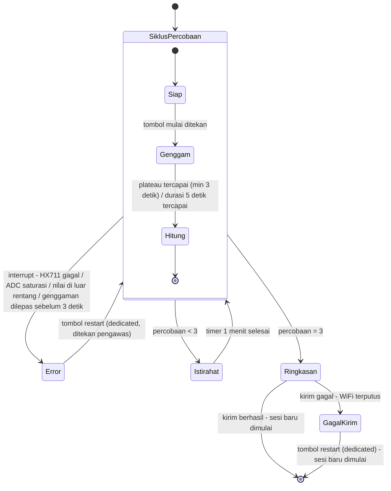

# Catatan Riset & Perencanaan - Hand Grip Dynamometer (v16)
**Final Project - Embedded Systems Course**

> Dokumen ini BUKAN proposal. Ini adalah wadah (vessel) yang menyimpan semua informasi, rujukan, dan keputusan yang sudah diambil sejauh ini, agar penyusunan proposal G1 nanti tinggal menyusun ulang isi dokumen ini ke dalam format yang diminta.

---

## 1. RINGKASAN PROYEK

| Item | Detail |
|------|--------|
| Mata kuliah | Mata kuliah embedded system (biomedik) |
| Posisi saat ini | Minggu ke-4 (topik: ADC, sensor analog, peripheral serial) |
| Platform wajib | ESP32 (Arduino IDE) |
| Anggaran komponen | Maksimum Rp300.000 per kelompok, dengan bukti pembelian |
| Filosofi cakupan | Menguji keterampilan teknis mahasiswa - BUKAN prototipe siap produksi massal |
| Perangkat | Hand grip dynamometer |

---

## 2. SUMBER RUJUKAN

https://drive.google.com/drive/folders/1nbT_B_snksXwBb6IFAcCBsopwRYrQzlZ?usp=sharing
| Sumber | Fokus utama | Kontribusi ke proyek ini |
|--------|-------------|---------------------------|
| Ramadhani et al. 2019 (IJEEEMI) | Alat ukur genggam pasien pasca-stroke: Arduino Uno + HX711 + load cell batang + LCD 16x2 + indikator 3-tingkat | Arsitektur paling sederhana dan paling dekat dengan skala proyek kelas - jadi referensi utama arsitektur hardware |
| Gotthelf et al. 2021 (J NeuroEng Rehab) | Sistem grip berbasis game (Rocket Launch), tracking MVC + fatigue selama sesi, divalidasi terhadap data normatif literatur | Sumber ide "pengukuran serial dari waktu ke waktu", TIDAK diadopsi fitur game-nya (di luar skop kelas) |
| Becerra et al. 2021 (Applied Sciences, UIB) | Perangkat wireless multi-sensor: gaya genggam + tekanan jari (FSR) + orientasi/tremor (IMU) + Bluetooth | Referensi untuk memahami instrumentation amplifier (AD627) sebagai alternatif HX711 - TIDAK diadopsi multi-sensornya (di luar skop kelas) |
| Chang & Chen 2015 (Bio-Med Mat & Eng, Taiwan) | Dynamometer + NI DAQ + LabView, data normatif Taiwan berdasarkan usia/tinggi/berat/panjang telapak | Referensi metodologi korelasi (tinggi, berat, panjang tangan vs kekuatan genggam) - platform (NI DAQ) TIDAK relevan untuk ESP32 |
| Vaishya et al. 2024 (J Health Pop & Nutrition) | Narrative review: HGS sebagai vital sign baru, cutoff per populasi, asosiasi dengan T2D/CVD/mortalitas/sarcopenia, protokol pengukuran (Box 1) | Sumber argumen medis utama proposal + protokol pengukuran standar (duduk, siku 90 derajat, tahan 3-5 detik, 3 kali percobaan, istirahat 1 menit antar percobaan) + konsep relative HGS (HGS/BMI) |
| Marwedel, *Embedded System Design* (ed. 4) | Buku teks embedded system - teori state machine, evaluasi, dependability | §2.4 StateCharts (formalisasi hierarki 2 lapisan, Bagian 6), §5.3 Quality Metrics (RMSE/MAE, Bagian 9), §5.6.5 FMEA/FTA (daftar risiko, Bagian 9), Bab 1 Tabel 1.2 (justifikasi ESP32, Bagian 8) |
| White, *Making Embedded Systems* (ed. 1, 2011) - dirujuk BRP sebagai [3] | Buku teks embedded system - praktik implementasi C untuk mikrokontroler | Bab 4 (debounce tombol, PWM), Bab 5 (table-driven state machine, watchdog), Bab 6 (circular buffer, event vs data-driven), Bab 3 (pola "Error Handling Library"), Bab 9 (taking an average) - lihat §6.4 untuk rincian per keputusan |
| Russell, *Introduction to Embedded Systems Using ANSI C and the Arduino Development Environment* (2010) - dirujuk BRP sebagai [1] | Buku teks embedded system - dasar C, arsitektur ATmega328P, GPIO/timer/interrupt/ADC | §9.1.2 ISR and Main Task Communication (kebenaran teknis komunikasi ISR-loop utama, Bagian 6.2 SIAP), §6.2.2 Internal Pull-up Resistor (justifikasi hindari floating pin, Bagian 6.2 SIAP) |

---

## 3. KEBUTUHAN DARI BRP (Buku Rancangan Pengajaran)

### 3.1 Gerbang Proyek & Tenggat Waktu

| Minggu | Tonggak |
|--------|---------|
| 5-6 | Proposal + Design Review (**G1**) - draf disusun sekarang |
| 7 ATAU 8 | Tenggat berkas gerber - **KONFLIK ANTAR DOKUMEN RESMI, lihat catatan di bawah** |
| 9 | **G2** - jalur penginderaan & aktuasi hidup di breadboard, PCB dipesan kolektif |
| 11-12 | PCB diterima; **G3** - PCB dirakit & lolos uji dasar |
| 14 | **G4** - purwarupa terintegrasi lolos uji mandiri |
| 16 | UAS - demo expo, makalah, viva individu |

> ⚠️ **KONFLIK BELUM TERSELESAIKAN (ditemukan saat cross-check dengan Panduan G1, Rubrik G1, dan Template resmi):** BRP asli menyebut tenggat gerber **Minggu ke-7** secara eksplisit di dua tempat (Modul Praktikum 6, dan Bagian D.5 - "berkas gerber yang melewati tenggat Minggu ke-7 tidak diikutsertakan dalam batch"). Panduan Proposal G1 yang baru menyebut **Minggu 8** ("Gerber files due — no extension", baris terpisah dari "PCB layout and gerber" di Minggu 7). **Dua dokumen resmi ini saling bertentangan** - JANGAN tuliskan salah satu sebagai final di proposal sebelum dikonfirmasi ke TA. Ini bukan salah ketik satu pihak yang bisa ditebak - perlu klarifikasi eksternal sebelum jadwal proposal (checklist di Bagian 9) bisa ditulis final.

### 3.2 Checklist Internal Kami (BUKAN rubrik skor resmi - lihat catatan)

> **Catatan penting:** rubrik skor G1 yang sebenarnya cuma punya **4 kriteria** (Perumusan masalah medis; Spesifikasi terukur; Kelayakan teknis+arsitektur+BOM digabung jadi satu; Jadwal+risiko digabung jadi satu), masing-masing 0-100, G1 = rata-rata keempatnya. Tabel di bawah ini checklist tracking internal kami sendiri yang lebih granular (6 baris) - jangan disamakan dengan struktur rubrik resmi saat presentasi design review, supaya tidak salah sebut ke reviewer.

| Bagian wajib (checklist internal) | Status di dokumen ini |
|---|---|
| Perumusan masalah medis | Selesai - lihat Bagian 4 |
| Spesifikasi terukur (range, akurasi, waktu respons, daya) | Sebagian (~25%) - range fisik sudah ditentukan, lihat Bagian 9 |
| Arsitektur sistem + kelayakan teknis | Sebagian besar - lihat Bagian 6 (state machine 2 lapisan lengkap dengan keputusan teknis per state; pin-out diagram blok komponen belum) |
| BOM dalam anggaran Rp300.000 | ~90% - lihat Bagian 9.1, harga riil sudah ada |
| Jadwal selaras dengan gerbang proyek | **BELUM** - terhambat konflik tenggat gerber di atas |
| Daftar risiko & mitigasi | Belum diisi - metodologi (FMEA) sudah ditentukan, lihat Bagian 9 |

### 3.3 Persyaratan format resmi (dari Panduan/Template G1 - belum ditangani di dokumen ini)

| Persyaratan | Sumber | Status |
|---|---|---|
| Body maksimal 8 halaman (Bagian 1-6; cover/referensi/lampiran tidak dihitung) | Template | Belum dicek - tunggu draf jadi |
| Pakai Template resmi apa adanya - urutan bagian TIDAK boleh diubah | Panduan | Belum mulai drafting ke template |
| Nama file: `G1_Kelompok-XX_Proposal.pdf` | Panduan | Belum ada nomor kelompok |
| Tiap komponen BOM yang dibeli wajib ada link supplier riil, bukan cuma nama+harga | Template §4 | Bagian 9.1 belum ada link |
| Tiap risiko wajib 3 bagian: tanda peringatan dini + mitigasi + fallback (bukan cuma metodologi FMEA) | Template §6 | Belum ditulis - FMEA baru metodologi, bukan isi |
| Tabel alokasi pin - wajib cek tidak ada pin dobel, dan pin input-only/strapping ESP32 tidak disalahgunakan | Template §3.4 | Belum ada sama sekali. Catatan: pin SPI untuk SD card TIDAK lagi relevan setelah keputusan logging di Bagian 4 (cloud+CSV-serial, bukan SD card) - tabel pin jadi lebih sederhana |
| Power budget wajib ditutup 1 baris: catu daya yang dipilih + arus rated-nya + margin di atas peak current total | Template §3.3 | Belum dihitung sama sekali |
| Rail aktuator harus terpisah elektris dari rail logika, satu ground bersama | Panduan | Belum dicatat (LED arusnya kecil, tapi tetap perlu 1 baris catatan) |
| Design review: anggota manapun bisa ditanya bagian manapun, bukan cuma subsistem sendiri | Panduan | Perlu semua anggota paham keseluruhan desain, bukan cuma bagian sendiri |

---

## 4. EVOLUSI PERUMUSAN MASALAH

Keputusan populasi target berubah beberapa kali selama diskusi - dicatat di sini supaya alasan penolakan versi-versi sebelumnya tidak hilang.

| Versi | Populasi target | Alasan ditolak/direvisi |
|-------|------------------|--------------------------|
| **v1 (motivasi medis dasar - lihat catatan di bawah)** | Pasien pasca-stroke | Terlalu besar skopnya untuk proyek satu semester; butuh proses rekrutmen populasi rentan yang lebih rumit dari yang bisa ditangani jadwal kelas. **TIDAK dibuang** - dipakai kembali di v5 sebagai rujukan kebutuhan klinis, bukan sebagai populasi yang diuji |
| v2 | Mahasiswa teknik, argumen berbasis tugas okupasional (mengetik/coding, menyolder, menggambar manual) | Lebih kuat, tapi populasinya (lintas fakultas) masih sulit direkrut secara realistis |
| v3 (superseded oleh v5) | Mahasiswa Teknik Elektro, Teknik Biomedik, dan Teknik Komputer (satu departemen di fakultas teknik) | Sempat dipilih karena: (1) tidak mudah ditebak arah hasilnya; (2) populasi realistis direkrut karena satu departemen; (3) penulis sendiri mahasiswa Teknik Biomedik. **Dibatalkan**: tetap merupakan pengujian pada orang di luar anggota tim (lintas jurusan), yang menurut Panduan G1 ("Testing on patients or on anyone outside your team") perlu persetujuan tertulis dosen sebelum proposal diajukan - risiko approval tidak turun tepat waktu sebelum tenggat Minggu 5 dianggap terlalu tinggi |
| v4 (superseded oleh v5) | Mahasiswa Teknik Biomedik saja (satu jurusan) | Sempat dicatat sebagai fallback kalau rekrutmen 3 jurusan (v3) tidak realistis. **Dibatalkan untuk alasan yang sama seperti v3**: tetap pengujian di luar anggota tim, tetap butuh persetujuan yang sama, cuma skalanya lebih kecil - tidak menyelesaikan masalah kepatuhan, cuma mengecilkannya |
| **v5 (final)** | **Hanya anggota kelompok sendiri** - tidak ada pengujian ke pasien maupun ke mahasiswa/pihak lain di luar tim | Dipilih karena sesuai persis dengan batas yang diizinkan Panduan G1: *"Non-invasive, low-voltage measurements on team members are fine"* - dynamometry genggam tangan non-invasif dan tegangan rendah, jadi seluruh pengukuran validasi (kalibrasi, MVC, protokol V1) bisa dijalankan tanpa perlu persetujuan tertulis dosen sama sekali. Pertanyaan "apakah jurusan berkorelasi dengan kekuatan genggam" (inti v3) **tidak lagi jadi tujuan proyek** - dicatat sebagai future work/di luar cakupan mata kuliah, bukan sesuatu yang diklaim sudah dijawab. Motivasi klinis proyek tetap dari v1 (lihat catatan di bawah), dan celah yang diisi proyek berubah dari "pertanyaan lintas-jurusan" menjadi "logging otomatis yang tidak dimiliki alat komersial" (lihat catatan di bawah) |

*v5 adalah rencana final untuk proposal G1. v1-v4 tetap didokumentasikan di sini supaya jejak alasan penolakan tiap versi tidak hilang - terutama v1, yang isinya (motivasi medis) tetap dipakai lagi di v5 walau populasi ujinya tidak.*

> **v1 sebagai motivasi medis dasar (bukan populasi uji).** Kebutuhan klinis yang memotivasi proyek ini tetap argumen v1: pasien pasca-stroke dan populasi dengan penurunan kekuatan genggam adalah alasan HGS penting diukur dan dipantau secara klinis (R1 - Ramadhani et al. memakai populasi ini langsung; V1/V2/V4 - Vaishya et al. mendokumentasikan HGS sebagai vital sign dan ambang klinisnya). Proposal G1 memakai v1 di Bagian 1 (Perumusan Masalah Medis) sebagai *rujukan kebutuhan klinis*, bukan sebagai populasi yang direkrut - device dirancang mengikuti protokol dan rentang yang relevan untuk populasi tersebut, tapi pengujian aktual di course ini (Minggu 5-14) hanya dilakukan pada anggota tim, sesuai v5.

> **Celah yang diisi proyek (pengganti pertanyaan lintas-jurusan v3): logging.** Kebanyakan hand grip dynamometer komersial (termasuk model analog klasik seperti JAMAR) tidak punya pencatatan data otomatis - pencatat harus menyalin nilai secara manual satu per satu, yang rawan human error dan kehilangan data (C2 - Chang & Chen 2015 secara eksplisit menyebut ini sebagai kelemahan dynamometer tradisional yang coba diatasi versi digital-terintegrasi). Argumen v2 dari Vaishya (nilai klinis HGS datang dari pengukuran serial dari waktu ke waktu, bukan sekali baca) berarti logging bukan fitur tambahan - itu bagian dari kenapa alat ini punya nilai dibanding alat manual. Kontribusi proyek: menambahkan logging otomatis yang tidak dimiliki alat pembanding.

> **Standar keberhasilan proyek disederhanakan jadi dua hal saja (menggantikan daftar 5-6 fitur "wajib" di Bagian 5 sebagai kriteria sukses utama):**
> 1. **Measurement** - pengukuran sesuai protokol standar V1 (duduk, siku ditekuk 90°, tahan 3-5 detik, 3 kali percobaan, istirahat ~1 menit antar percobaan), diverifikasi dengan RMSE/MAE terhadap beban referensi (M5).
> 2. **Logging** - data setiap sesi tersimpan otomatis (tidak hilang, tidak perlu disalin manual), lewat **cloud sebagai jalur utama, dengan CSV-over-USB-serial ke laptop sebagai fallback** (bukan SD card). **Keputusan direvisi** setelah dicek ke Panduan BRP: SD card **tidak wajib** - satu-satunya yang diwajibkan cuma ESP32 sebagai controller utama; *"cloud logging... may be added where the problem needs them; say why in the proposal"* menyebut cloud logging eksplisit sebagai tambahan opsional, bukan requirement, dan SD card cuma disebut di Modul 3 sebagai *"the lab has one SD card module, offered as an optional station"* - fasilitas lab, bukan kewajiban course. Karena lab cuma punya satu unit modul SD (risiko ketersediaan/rebutan kalau dijadwalkan bareng tim lain), fallback logging dipindah ke pola yang sudah diajarkan Modul 3 Guided Example 4 sendiri: *"Logging in Guided Example 4 now goes to a CSV file on your own laptop over the USB serial link."* Ini juga sekaligus menyederhanakan pin allocation (3.3) - tidak perlu jalur SPI terpisah untuk SD card. **Trade-off yang perlu ditulis eksplisit di Bagian 2.2 (What the device will not do)**: fallback CSV ini butuh laptop host tersambung dan menjalankan script penerima saat pengukuran - bukan penyimpanan mandiri seperti SD card tertanam di alat. Karena pengujian aktual dibatasi ke anggota tim (v5) di lingkungan yang terkontrol, ketersediaan laptop saat sesi pengukuran realistis diasumsikan, jadi ini bukan keterbatasan praktis - cuma perlu dinyatakan sebagai batas skop, bukan dibiarkan seolah luput dipikirkan.

> **Rumusan masalah (draf kerja):**
> Berbagai jurusan di Departemen Teknik Elektro menuntut penggunaan tangan secara berbeda dan berkelanjutan - mahasiswa Teknik Komputer terbiasa mengetik/coding dalam waktu lama, mahasiswa Teknik Elektro banyak menyolder dan menangani komponen kecil, sementara mahasiswa Teknik Biomedik kerap melakukan keduanya. Belum ada cara sederhana untuk memantau apakah pola penggunaan tangan ini memengaruhi kekuatan genggam dari waktu ke waktu - celah inilah yang coba dijawab alat ini, sekaligus menguji apakah perbedaan jurusan benar-benar berkorelasi dengan kekuatan genggam atau tidak.

---

## 5. FUNGSI PERANGKAT (Keputusan Skop)

| # | Fungsi | Sub-CPMK terkait | Sumber ide | Status |
|---|--------|-------------------|------------|--------|
| 1 | Pembacaan gaya real-time (kg/N) | Sub-CPMK 4 (ADC) | Semua paper referensi | Wajib |
| 2 | Penangkapan gaya puncak per percobaan (MVC) | Sub-CPMK 4 | Ramadhani (R1), Gotthelf (G1), protokol Vaishya (V1) | Wajib |
| 3 | Tampilan hasil (LCD/serial) | Sub-CPMK 4 | Semua paper referensi | Wajib |
| 4 | Umpan balik aktuator (LED, menyala selama proses genggam) | Sub-CPMK 5 (aktuator) | Tidak ada di paper - ditambahkan agar Sub-CPMK 5 punya tempat wajar di perangkat ini | Wajib |
| 5 | Pencatatan data lintas-sesi (cloud/lokal) | Sub-CPMK 7 (IoT) | Argumen utama Vaishya: nilai klinis HGS datang dari **pengukuran serial**, bukan sekali baca (V2) | Wajib |
| 6 | Rata-rata 3 percobaan + timer istirahat | - | Protokol standar Box 1, Vaishya (V1): 3 percobaan per tangan, istirahat ~1 menit | Opsional (murah, hanya logika software) |

**Sengaja TIDAK dimasukkan** (di luar skop "uji keterampilan teknis"):
- Relative HGS (V3, butuh input tinggi/berat + logika tambahan) - **dipindah ke tahap analisis data pasca-pengukuran**, bukan fitur firmware
- Game biofeedback penuh ala Gotthelf - itu proyek software/UX, bukan embedded
- Sensor jari (FSR) + IMU tremor ala Becerra - di luar cakupan penilaian mata kuliah

**Variabel yang tetap dicatat manual (bukan fitur firmware), untuk analisis data di makalah akhir:**
tinggi badan, berat badan, tangan dominan, jam coding/menyolder/menggambar per minggu, frekuensi olahraga. (Dipakai untuk menghitung relative HGS dan mengendalikan variabel perancu saat membandingkan 3 jurusan.)

---

## 6. ARSITEKTUR SISTEM (Alur State Machine)

Dirancang berlapis (hierarchical state, lihat §6.4) - bukan satu loop datar seperti draf awal. **Lapisan luar** menangani satu sesi (3 percobaan + istirahat + ringkasan). **Lapisan dalam** menangani satu percobaan tunggal (4 state). Lapisan dalam "bersarang" di dalam satu kotak pada lapisan luar.

### 6.1 Lapisan luar (per sesi)

Selain siklus percobaan, istirahat, dan ringkasan, ada satu **interrupt transition** yang berlaku untuk seluruh isi kotak `SiklusPercobaan` - bukan transisi dari satu state tertentu di dalamnya:

```
[Siklus percobaan] --(interrupt: kondisi error terdeteksi)--> [Error: tahan, tampilkan detail]
[Error] --(tombol restart ditekan pengawas)--> kembali ke [Siklus percobaan]
[Siklus percobaan] --(< 3 kali)--> [Istirahat: timer 1 menit] --> kembali ke [Siklus percobaan]
[Siklus percobaan] --(= 3 kali)--> [Ringkasan: rata-rata & histori]
[Ringkasan] --(kirim gagal)--> [GagalKirim: tahan, tampilkan data] --(tombol restart)--> [Sesi baru dimulai]
[Ringkasan] --(kirim berhasil)--> [Sesi baru dimulai]
```

- **Catatan scoping storyboard LCD**: storyboard visual yang sudah dibuat (16 layar, lihat riwayat diskusi) itu representatif untuk **jalur sukses saja**. Tampilan layar `Error`/`GagalKirim` yang sebenarnya belum digambar final - itu baru bisa ditentukan konkret setelah modul Error Handling Library (W2) benar-benar dikoding, bukan didesain visual duluan sebelum implementasinya ada. Jadi storyboard yang ada sekarang jangan dianggap mencakup jalur gagal secara visual, walau kebijakannya (kapan CSV ditulis, kapan tahan-tombol-restart) sudah ditetapkan di teks Bagian 6.1 ini.
- **Error**: state "tahan" (hold) sungguhan (bukan transisi sesaat yang langsung retry) - alat berhenti total, menampilkan jenis error dan pembacaan ADC mentah **secara live** (terus di-update, bukan snapshot beku) supaya pengawas bisa memeriksa fisik alat sambil melihat perubahan pembacaan. Layar tidak berubah sampai pengawas menekan **tombol restart khusus** (komponen baru, bukan reuse tombol mulai) setelah selesai mencatat manual - ini pola **"Error Handling Library"** (W2) yang sama dipakai lagi di `GagalKirim` (lihat bawah). Percobaan yang error TIDAK dihitung sebagai salah satu dari 3 percobaan. Audiens state ini adalah pengawas alat (TA/tim riset), bukan partisipan - jadi larangan "tidak boleh lihat angka mentah" di Bagian 7 sengaja dikecualikan di sini (**keputusan desain kami sendiri**, bukan dari sumber eksternal - alasannya: rubrik Divais dan Demo BRP menilai ketahanan uji adversarial termasuk kondisi gagal, jadi transparansi ke pengawas justru dinilai positif). Dicatat **manual** ke logbook tim (jenis error + waktu relatif `T+mm:ss` sejak alat menyala) - **keputusan tim kami sendiri** untuk TIDAK menambahkan counter otomatis di firmware, karena angka hitungan saja tidak menjelaskan "errornya karena apa", sedangkan logbook manual 1-2 menit memberi konteks yang jauh lebih berguna untuk analisis nanti.
- **Istirahat**: dua sub-langkah. (1) "Lepaskan genggaman" - exit begitu gaya turun di bawah threshold onset (threshold yang sama dipakai simetris dengan GENGGAM, lihat 6.2). (2) "Istirahat 60 detik" - timer non-blocking sesuai protokol standar Box 1 (V1) untuk mencegah kelelahan otot memengaruhi percobaan berikutnya.
- **Ringkasan**: terjadi **SATU KALI SAJA**, setelah percobaan ke-3 (bukan tiap percobaan - ini sempat salah digambar di storyboard awal, sudah diluruskan). Hitung rata-rata 3 percobaan, ambil riwayat sesi lalu untuk perbandingan ("lebih kuat dari sesi lalu"), lalu kirim ke cloud.
  - **Kirim berhasil**: TIDAK ada pesan CSV ditampilkan sama sekali (CSV memang tidak ditulis di jalur ini). Tampilkan countdown "Selesai" 3 detik (refresh tiap 100ms) lalu **otomatis** kembali ke SIAP sesi baru - tidak perlu pengawas menekan apapun.
  - **Kirim gagal** (WiFi terputus): tulis data ke CSV lokal, tampilkan pesan `"Dituliskan ke CSV"` - **keputusan kami sendiri, murni untuk kenyamanan psikologis pengguna** (meyakinkan data tidak hilang walau kirim gagal), bukan requirement teknis eksternal. Masuk ke state `GagalKirim` - pola yang **identik dengan `Error`** (layar diam/live, tidak berubah sampai pengawas selesai mencatat manual, keluar lewat tombol restart yang sama, BUKAN otomatis seperti jalur berhasil). Bedanya cuma tujuan keluar: `Error` kembali ke `SiklusPercobaan` (perlu diulang), `GagalKirim` langsung ke akhir sesi (data sudah valid, cuma belum ter-upload).

### 6.2 Lapisan dalam (satu siklus percobaan): SIAP -> GENGGAM -> HITUNG

**[SIAP]**
- Menunggu interrupt tombol (bukan polling `digitalRead()`), agar tetap non-blocking (Sub-CPMK 3). Debounce **software** - abaikan re-trigger < ~50ms sejak interrupt terakhir (dicek di dalam ISR pakai `millis()`), teknik dari (W1) - dikonfirmasi juga di Modul Praktikum 1.
- **Pin tombol wajib pakai pull-up** (internal `INPUT_PULLUP`, bukan dibiarkan floating) - kalau pin input tidak disambung ke apapun saat tidak ditekan, sinyalnya "mengambang" dan bisa memicu interrupt palsu secara acak (RU2).
- **Variabel yang diubah di dalam ISR (misal flag "tombol ditekan") wajib dideklarasikan `volatile`** - tanpa ini, compiler bisa meng-optimasi pembacaan variabel itu di loop utama seolah nilainya tidak pernah berubah dari luar, dan state machine bisa macet permanen di `Siap` walau tombol sudah ditekan (RU1). Kalau nanti ada variabel multi-byte (misal timestamp `unsigned long`) yang dibaca ISR **dan** loop utama sekaligus, perlu hati-hati juga terhadap risiko "setengah lama-setengah baru" saat interrupt terjadi persis di tengah pembacaan (RU1) - untuk desain sekarang risiko ini belum relevan karena variabel debounce cuma diakses di dalam ISR sendiri, tapi perlu diingat kalau nanti ada variabel baru yang dishare ke loop utama.
- Auto-tare, dijalankan tiap masuk state ini (termasuk setelah kembali dari Istirahat) - **keputusan desain kami sendiri** (bukan dari sumber eksternal manapun - tidak ada satupun dari 5 paper referensi yang membahas auto-tare per percobaan), diputuskan karena kami membandingkan 3 percobaan dalam satu sesi untuk dirata-ratakan, jadi konsistensi titik nol antar percobaan penting untuk validitas data. Dua langkah berurutan dalam state yang sama: (1) tampilkan `"Menyesuaikan nol..."` di LCD, jalankan fungsi tare; (2) begitu selesai (~1 detik, angka pasti menunggu pengujian fisik), ganti tampilan jadi `"Siap - tekan tombol"`. Tidak perlu animasi/state terpisah - durasi tare cukup singkat untuk cukup ditandai teks statis.
- Tidak ada jalur ke ERROR dari state ini.

**[GENGGAM]** - dua fase di dalam satu state, LED menyala menembus keduanya tanpa putus.

*Fase 1 - Menunggu mulai:* begitu masuk dari SIAP, timer 3-5 detik **belum jalan**. LED menyala (lihat rasional LED di bawah), LCD menampilkan `"Menunggu genggaman"`. Sistem cuma menunggu fluktuasi gaya pertama melewati **threshold onset** (nilai pasti menunggu eksperimen - sama metodologi dengan threshold kestabilan: ukur noise alami load cell diam, threshold di atas itu).

*Fase 2 - Menghitung:* begitu threshold onset terlampaui, timer 3-5 detik mulai, LCD ganti jadi `"Tahan selama 3-5 detik"` (teks beda dari Fase 1 - lebih informatif daripada instruksi statis yang sama di kedua fase). Baca ADC dari HX711, terapkan `calibration_factor`. HX711 `get_units()` bersifat blocking (~100ms pada 10Hz) - **diterima apa adanya**, sudah dibahas Modul Praktikum 2 soal kapan delay masih acceptable. **Smoothing + deteksi plateau** (circular buffer, W5+W6): simpan 5 pembacaan terakhir dalam buffer melingkar, bandingkan selisih (tertinggi-terendah) terhadap threshold kestabilan. Konsep "tunggu sampai plateau" sejalan dengan protokol Box 1 (V1): *"squeeze... until I say stop (when the needle stops rising)"*.

**Threshold onset dan threshold "dilepas terlalu awal" adalah nilai yang SAMA, dicek dua arah** - naik melewati threshold saat Fase 1 = mulai (masuk Fase 2); turun kembali di bawah threshold itu **sebelum 3 detik** = dilepas terlalu awal. Ini simplifikasi sengaja - cuma butuh satu eksperimen kalibrasi, bukan dua threshold terpisah.

**Tiga jalur keluar dari GENGGAM:**
1. **Dilepas sebelum 3 detik** → masuk `Error` (pola Error Handling Library, W2 - sama seperti kegagalan HX711/ADC saturasi yang sudah ada). Percobaan TIDAK dihitung sebagai salah satu dari 3. Ini kondisi baru yang ditambahkan ke daftar pemicu interrupt transition `Error` di §6.1.
2. **Plateau tercapai, durasi ≥3 detik** → HITUNG (jalur normal, sudah ada sejak awal).
3. **Durasi mencapai 5 detik tanpa plateau** → sistem otomatis berhenti menerima gaya, langsung ke HITUNG memakai nilai buffer terbaik yang ada saat itu (bukan dibatalkan) - **Opsi A**, dikonfirmasi eksplisit.

Tidak ada kondisi "gaya turun ke ambang" generik lagi seperti draf sangat awal - sudah digantikan mekanisme onset/plateau/5-detik di atas (dicek juga ke R2 & G2: tidak ada satupun referensi yang pakai threshold gaya untuk deteksi akhir - tapi onset/early-release ini beda kategori, lihat penjelasan di percakapan).

Refresh rate LCD tetap dipisah dari sample rate sensor via timer terpisah (`millis()`). Metodologi penentuan angka: eksperimen langsung (Walking Light Challenge 1 tanpa tombol, coba delay 50-500ms) + ~20ms buffer kompensasi I2C (**estimasi teknis kami sendiri**). **Angka final masih menunggu hasil eksperimen.**

**Rasional LED (keputusan kami sendiri, bukan sitasi eksternal):** LED menyala sepanjang GENGGAM (kedua fase) sampai keluar (ke HITUNG atau ERROR). Alasannya murni aksesibilitas - refresh LCD **sengaja dilambatkan** (150ms+ hasil eksperimen di atas) supaya mata manusia bisa mengikuti angka yang berubah, tapi ini berarti pengguna belum tentu bisa "keep up" secara visual dengan LCD saat itu juga. LED jadi sinyal biner sederhana ("sedang aktif direkam") yang jauh lebih mudah diikuti mata dibanding membaca angka fluktuatif - pelengkap LCD, bukan pengganti.

**[HITUNG]**
- One-shot (bukan loop), dieksekusi sekali begitu GENGGAM selesai jalur normal (`ref` = rata-rata buffer stabil, atau nilai buffer terbaik kalau exit via batas 5 detik). Validasi rentang nilai `ref` terhadap kapasitas load cell 180kg (reject kalau `ref` > 100kg atau `ref` < 0) - **angka 100kg dari data Gotthelf (G1)**, angka ambang pasti menunggu pengujian fisik. Simpan ke posisi percobaan ke-1/2/3.
- **Tampilkan hasil dengan konteks dalam-sesi** ("Percobaan 2 dari 3 - 27.1 kg") - fungsi ini pindah ke sini setelah state RESPON dihapus (LED sudah selesai tugasnya di GENGGAM, tidak perlu state terpisah lagi cuma untuk menampilkan angka). Perbandingan lintas sesi BUKAN di sini - itu di RINGKASAN.
- Sengaja TIDAK menghitung relative HGS (V3) di sini - dipindah ke analisis data pasca-pengukuran (Bagian 5).
- Smoothing sudah selesai di GENGGAM - alasannya murni kualitas pengalaman (tampilan real-time stabil), bukan soal larangan nilai mentah di Bagian 7 (itu soal kalibrasi kg, beda topik).
- Nilai float mentah tetap disimpan di memori sebelum dibulatkan untuk LCD, supaya presisi tidak hilang untuk analisis akurasi nanti (M5).
- Transisi keluar (bercabang langsung ke lapisan luar, tidak ada state RESPON lagi): percobaan < 3 → ISTIRAHAT; percobaan = 3 → RINGKASAN. Nilai di luar rentang fisik masuk akal → interrupt transition ke ERROR dari batas SiklusPercobaan (§6.1).

**Buzzer dan state RESPON terpisah sudah dihapus dari scope** - LED cukup, diikat ke durasi GENGGAM (bukan momen "selesai" terpisah). Ini keputusan tim kami sendiri (Bagian 5) - alat riset kecil-kecilan yang diawasi langsung tidak butuh sinyal audio berlebihan, dan bobot penilaian lebih besar di firmware daripada aksesoris hardware.

### 6.2b Diagram Mermaid (gabungan lapisan luar & dalam)


```mermaid
stateDiagram-v2
    [*] --> SiklusPercobaan

    state SiklusPercobaan {
        [*] --> Siap
        Siap --> Genggam: tombol mulai ditekan
        Genggam --> Hitung: plateau tercapai (min 3 detik) / durasi 5 detik tercapai
        Hitung --> [*]
    }

    SiklusPercobaan --> Error: interrupt - HX711 gagal / ADC saturasi / nilai di luar rentang / genggaman dilepas sebelum 3 detik
    Error --> SiklusPercobaan: tombol restart (dedicated, ditekan pengawas)

    SiklusPercobaan --> Istirahat: percobaan < 3
    Istirahat --> SiklusPercobaan: timer 1 menit selesai
    SiklusPercobaan --> Ringkasan: percobaan = 3

    Ringkasan --> [*]: kirim berhasil - sesi baru dimulai
    Ringkasan --> GagalKirim: kirim gagal - WiFi terputus
    GagalKirim --> [*]: tombol restart (dedicated) - sesi baru dimulai
```

*`Error` dan `GagalKirim` memakai pola yang sama (tahan layar, live/tidak berubah sampai pengawas selesai mencatat manual, keluar lewat tombol restart yang sama) - cukup diimplementasikan sebagai satu fungsi/modul kode yang dipanggil dari dua titik berbeda di firmware, meski keduanya tetap dua state FSM terpisah karena tujuan keluarnya berbeda.*

*Render otomatis di GitHub. Untuk versi draw.io (proposal Word/PDF), gunakan shape UML State Machine dengan composite state untuk `SiklusPercobaan` dan guard condition `[percobaan < 3]` / `[percobaan = 3]` pada label transisi keluar.*

### 6.2c Tabel state lengkap (referensi kerja - bukan versi ringkas proposal)

*Ini versi paling lengkap untuk kerja internal kami, bukan tabel 3.5 proposal yang lebih ringkas. Kolom "Status" menandai mana yang closed vs masih open item.*

| State | Yang terjadi (entry + loop) | Variabel kunci | Kondisi keluar → tujuan | Mekanisme waktu | Sitasi/basis | Status |
|---|---|---|---|---|---|---|
| SIAP | Entry: LCD "Menyesuaikan nol...", jalankan `tare()`. Setelah ~1s, LCD → "Siap - tekan tombol". Tunggu interrupt tombol. | `volatile bool tombolDitekan`; timestamp debounce di ISR | Tombol ditekan (lolos debounce ~50ms) → GENGGAM | Interrupt-driven, non-blocking. Durasi tare ~1s - metode blocking/non-blocking tare sendiri belum ditentukan | W1, RU1, RU2 | Sebagian besar closed; metode eksekusi tare masih open |
| GENGGAM - Fase 1 | Entry: LED on, LCD "Menunggu genggaman". Polling ADC, bandingkan ke `thresholdOnset`. | `thresholdOnset` (TBD) | Force > `thresholdOnset` → lanjut Fase 2 (internal, state sama) | Non-blocking, belum ada timer aktif | Keputusan kami sendiri | Angka threshold masih open |
| GENGGAM - Fase 2 | Mulai timer, LCD ganti "Tahan selama 3-5 detik". Baca HX711, isi circular buffer 5 sampel, cek stabilitas, update LCD tiap refresh interval. | `buffer[5]`, `thresholdStabilitas` (TBD), `startTime`, `elapsed` | (a) elapsed<3000ms & force<thresholdOnset → ERROR. (b) elapsed≥3000ms & buffer stabil → HITUNG (ref=rata2 buffer). (c) elapsed≥5000ms → HITUNG paksa (Opsi A) | Campuran: loop non-blocking; `get_units()` blocking ~100ms/baca | V1, W5+W6, R2+G2 | thresholdStabilitas dan refresh rate LCD masih pending eksperimen |
| HITUNG | Validasi `ref` (0<ref≤100kg). Simpan ke slot percobaan ke-n. Tampilkan hasil dalam-sesi ("Percobaan n dari 3"). **Terjadi tiap percobaan (1,2,3)** - sempat hilang dari storyboard awal, dipastikan tetap ada. | `ref` (float presisi penuh), `percobaanKe` | ref valid + percobaanKe<3 → ISTIRAHAT. ref valid + percobaanKe=3 → RINGKASAN. ref invalid → ERROR | Non-blocking, one-shot | G1, M5, V3 | Angka ambang pasti (selain placeholder 100kg) masih pending fisik |
| ISTIRAHAT | (1) LCD "Lepaskan genggaman" - tunggu force turun di bawah `thresholdOnset` (reuse simetris). (2) LCD "Istirahat 60 detik", mulai timer. | `startTime`, reuse `thresholdOnset` | Sub-langkah 1 selesai → sub-langkah 2. elapsed≥60000ms → SIAP (counter percobaan TIDAK direset) | Non-blocking (threshold check) lalu timer non-blocking | V1 | Closed |
| RINGKASAN | **Satu kali saja, setelah percobaan ke-3** (bukan tiap percobaan). Hitung rata-rata 3 percobaan, ambil riwayat sesi lalu (sumber belum ditentukan), kirim ke cloud. | `rataRata`, `riwayatSesiLalu` | Kirim berhasil → countdown "Selesai" 3 detik (refresh 100ms) → **otomatis** SIAP sesi baru, TANPA CSV/tombol restart. Kirim gagal → tulis CSV (pesan "Dituliskan ke CSV", murni kenyamanan psikologis pengguna) → GAGALKIRIM (tunggu restart manual) | Kirim: BELUM DITENTUKAN (blocking/async). Countdown sukses: timer 100ms | V2 | Mekanisme kirim (blocking/async) dan sumber riwayat masih open; sisanya closed |
| ERROR | Tampilkan jenis error (4 kondisi: HX711 timeout, ADC saturasi, nilai di luar rentang, dilepas <3 detik) + ADC mentah live. Tunggu tombol restart. | `jenisError`, waktu masuk (T+mm:ss) | Tombol restart → SIAP (counter percobaan TIDAK berubah) | Interrupt masuk (4 sumber), non-blocking menunggu restart | W2 | Closed secara pola; sengaja tanpa counter otomatis |
| GAGALKIRIM | Tampilkan data gagal kirim, live/tahan. Pola sama ERROR (reuse modul). | `dataGagalKirim` | Tombol restart → selesai (langsung akhir sesi, beda dari ERROR) | Sama seperti ERROR | W2 | Closed secara pola; bergantung RINGKASAN yang masih open |

### 6.3 Diagram blok komponen (pin-out belum lengkap - lihat Bagian 9)
`Load cell -> HX711 (amplifier + 24-bit ADC) -> ESP32 -> {LCD, LED, WiFi/cloud}`

### 6.4 Referensi teori

*Isi lengkap tiap kode ada di Bagian 11 (Library Sitasi). Daftar di bawah cuma peta cepat: kode mana dipakai di keputusan mana.*

- Formalisasi hierarki dua lapisan (§6, §6.1): **M1**
- Justifikasi platform ESP32 (Bagian 8): **M2**
- Pipeline sensor/ADC (GENGGAM): **M3**
- Aktuator/PWM (dasar teori, meski buzzer akhirnya dilepas - LED di GENGGAM): **M4**
- Metodologi validasi akurasi (Bagian 9): **M5**
- Metodologi daftar risiko (Bagian 9): **M6**
- Debounce tombol (SIAP): **W1**
- Pull-up internal, hindari floating pin (SIAP): **RU2**
- Kebenaran teknis ISR-loop utama, `volatile` (SIAP): **RU1**
- Pola shared-module Error/GagalKirim (§6.1): **W2**
- Cara implementasi kode state machine (belum dikerjakan - Bagian 10): **W3**
- Watchdog (belum diintegrasikan - Bagian 10): **W4**
- Smoothing nilai puncak (GENGGAM): **W5, W6**
- Event-driven vs data-driven, dasar kenapa GENGGAM "terasa beda": **W7**
- Durasi tahan, rest antar percobaan (GENGGAM, Istirahat): **V1**
- Deteksi plateau (GENGGAM): **V1**
- Argumen pengukuran serial (Fitur #5, Bagian 7): **V2**
- Kapasitas load cell & ambang validasi (HITUNG, Bagian 9): **G1**
- Tidak ada threshold gaya untuk deteksi akhir di referensi manapun (GENGGAM): **R2, G2**

---

## 7. NARASI PENGALAMAN PENGGUNA

*Disusun dari sudut pandang user (lihat pendekatan kerja di Bagian 1), disintesis dari pola UX konkret di Ramadhani - tombol start/reset fisik, tampilan LCD+indikator (R1), Gotthelf - kalibrasi disamarkan jadi instruksi, feedback real-time terhadap target (G3), dan Becerra - histori/riwayat sesi (B1) - bukan disalin satu-satu, tapi digabung sesuai kebutuhan proyek ini.*

- Pengguna: mahasiswa teknik, tidak diasumsikan punya latar belakang teknis alat ini
- Mengambil alat: cukup kecil digenggam satu tangan, layar/lampu menunjukkan alat siap
- Memulai: satu tombol, konfirmasi jelas ("Squeeze now")
- Saat meremas: umpan balik visual real-time (angka naik / bar terisi)
- Saat meremas: LED menyala (aid visual - LCD sengaja lambat direfresh supaya mata bisa mengikuti, LED beri sinyal biner yang lebih gampang diikuti, lihat Bagian 6.2 GENGGAM) + instruksi "TAHAN SELAMA 3-5 DETIK" di LCD
- Selesai: LED mati, hasil ditampilkan dengan konteks di HITUNG ("Percobaan 2 dari 3 - 27.1 kg"), bukan angka mentah tanpa makna. Buzzer/getar sudah dilepas dari scope sejak awal
- Antar sesi: alat/dashboard mengingat riwayat, menunjukkan tren - ini adalah **inti nilai alat**, bukan fitur tambahan (argumen utama Vaishya (V2): nilai klinis HGS datang dari pengukuran serial, bukan sekali baca - lihat Bagian 5 Fitur #5)
- Yang harus dihindari: pengguna tidak boleh melihat angka mentah belum terkalibrasi (dikecualikan untuk pengawas di state Error/GagalKirim - lihat Bagian 6.1); kegagalan pembacaan tidak boleh senyap (rubrik BRP "ketahanan uji adversarial" - lihat Bagian 6.1)

---

## 8. CATATAN PLATFORM: ESP32 vs RASPBERRY PI

- G1 (proposal) jatuh tempo minggu 5-6; Raspberry Pi baru diajarkan minggu 10 (Sub-CPMK 8) - artinya arsitektur inti proyek **realistisnya harus ESP32-only** saat proposal ditulis
- Raspberry Pi dicatat sebagai **kemungkinan ekstensi pasca-minggu 10** (mis. sebagai local data hub/dashboard), bukan kebutuhan wajib
- Edge AI (minggu 11, Sub-CPMK 9) dinilai **tidak relevan** dipaksakan ke proyek ini - tidak ada tugas inferensi on-device yang bermakna untuk dynamometer

**Justifikasi ESP32 (M2):**
> "Embedded systems are information processing systems embedded into enclosing products." - ESP32 di dalam alat genggam ini persis memenuhi definisi ini.

| Kriteria (M2) | Embedded (ESP32) | PC-like |
|---|---|---|
| Arsitektur | Kompak, heterogen | Tidak kompak, homogen |
| Tujuan optimasi | Energi, ukuran | Performa rata-rata |
| Relevansi real-time | Sering penting | Jarang |
| Safety-critical | Mungkin | Biasanya tidak |

Argumen proposal: alat genggam butuh ukuran kompak, daya rendah, dan pewaktuan yang bisa diprediksi (non-blocking) - ESP32 cocok, PC/laptop tidak.

---

## 9. AREA YANG BELUM DIBAHAS (Checklist Terbuka)

| Area | Status | Catatan |
|------|--------|---------|
| Spesifikasi terukur (range gaya, akurasi, waktu respons, anggaran daya) | Sebagian | Range fisik sensor sudah ditentukan (load cell 180kg, headroom besar dari kekuatan genggam individu terkuat di populasi target ~78kgf, G1). Akurasi/waktu respons/anggaran daya belum dihitung formal - metodologi akurasi sudah diidentifikasi: RMSE/MAE terhadap beban referensi (M5, lihat Bagian 6.4) |
| Diagram blok komponen lengkap (bukan hanya alur state) | Sebagian | Alur state machine 2 lapisan sudah lengkap (Bagian 6); yang belum cuma pin-out dan interface spesifik (I2C/bit-bang HX711, dst.). Tidak perlu lagi alokasi pin SPI untuk SD card - lihat baris logging di bawah |
| Media logging: SD card vs cloud vs CSV-over-serial | **Selesai** | Dicek ke Panduan BRP: SD card tidak wajib, cuma disebut di Modul 3 sebagai stasiun opsional lab (1 unit saja - risiko rebutan). Keputusan final: cloud sebagai jalur utama, CSV-over-USB-serial (pola Modul 3 Guided Example 4) sebagai fallback kalau cloud gagal - bukan SD card. Lihat catatan lengkap di Bagian 4 (callout Standar Keberhasilan). Trade-off (butuh laptop host tersambung saat logging fallback) perlu ditulis di Bagian 2.2 proposal |
| BOM dengan harga riil, dalam Rp300.000 | ~90% - lihat tabel 9.1 | Total Rp165.500 dari Rp300.000 (komponen utama), sisa ~Rp134.500. LED belum dikonfirmasi/checkout. **Link supplier riil belum ditambahkan ke tabel - wajib untuk Template §4** |
| Jadwal kerja selaras dengan gerbang G1-G4 | Belum dimulai | Terhambat konflik tenggat gerber Minggu 7 vs 8 (lihat Bagian 3.1) - selesaikan itu dulu sebelum menulis jadwal |
| Daftar risiko & mitigasi | Belum diisi | Metodologi sudah diidentifikasi: kerangka FMEA (M6, lihat Bagian 6.4). **Wajib ditulis dengan 3 bagian per risiko (tanda peringatan dini + mitigasi + fallback), bukan cuma metodologi** - lihat Bagian 3.3. Perlu mencakup: ketersediaan modul SD card lab (cuma 1 unit, dipakai bergantian - sudah tidak jadi blocker karena keputusan logging di atas, tapi tetap relevan sebagai risiko yang sudah dimitigasi), variasi teknik genggam antar partisipan (belum ada mitigasi hardware - kembali ke instruksi verbal sesuai protokol V1) |
| Proses consent informal untuk partisipan | **Tidak relevan lagi setelah v5** | v5 cuma menguji anggota tim sendiri (lihat Bagian 4) - tidak perlu proses consent formal ke pihak luar |
| Tabel alokasi pin ESP32 | Belum dimulai | Wajib untuk Template §3.4 - cek pin input-only (GPIO 34-39) dan strapping pin tidak disalahgunakan. Lebih sederhana sekarang karena tidak perlu SPI untuk SD card |
| Power budget dengan peak current | Belum dimulai | Wajib untuk Template §3.3 - tutup dengan 1 baris: catu daya dipilih + arus rated + margin di atas peak total |

### 9.1 BOM (harga riil, per komponen)

| Komponen | Qty | Harga satuan | Subtotal | Catatan |
|---|---|---|---|---|
| Load cell 180kg (full bridge, 4 kabel) | 1 | Rp115.000 | Rp115.000 | Perlu frame/tuas di enclosure - lihat Bagian 6.3. Kapasitas dipilih dengan filosofi headroom (C1) di atas data individu terkuat populasi target (G1). **Link supplier belum dicatat di sini** |
| Modul HX711 | 1 | Rp8.500 | Rp8.500 | Beri daya 2.7-5V dari ESP32, gunakan channel A saja. **Link supplier belum dicatat di sini** |
| LCD 16x2 I2C (hijau, alamat 0x27/0x3f) | 1 | Rp39.500 | Rp39.500 | Beri daya 3.3V (bukan 5V) - level GPIO ESP32 tidak toleran 5V. **Link supplier belum dicatat di sini** |
| Push button tactile 6x6x5mm | 5 (min. order) | Rp500 | Rp2.500 | Cuma butuh 2 (mulai + restart), sisa 3 jadi cadangan. **Link supplier belum dicatat di sini** |
| LED indikator | 1 | - | - | **Belum di-checkout** - cek dulu apakah sudah termasuk komponen pasif lab (BRP D.5) sebelum beli sendiri (~Rp500-1.000 kalau beli) |
| **Total** | | | **~Rp165.500** | Sisa anggaran ~Rp134.500 dari Rp300.000 (belum termasuk LED kalau ternyata perlu beli sendiri) |

Resistor basis untuk transistor driver termasuk komponen pasif yang sudah disediakan lab (BRP D.5), tidak perlu dibeli. Breadboard, kabel jumper, ESP32 juga sudah disediakan lab. Motor getar + driver bisa dipertimbangkan lagi sebagai ekstensi opsional kalau ada waktu/kebutuhan tambahan menjelang G4.

---

## 11. LIBRARY SITASI - TEORI BUKU & TEMUAN PAPER

*Parafrase setia (bukan kutipan verbatim) dari kedua buku teks, diterjemahkan ke Indonesia dengan analogi di beberapa titik. Temuan paper diinterpretasi. Cakupan dibatasi pada yang benar-benar jadi fondasi keputusan di dokumen ini - bagian buku/paper yang dibaca tapi tidak dipakai (misal fitur game Gotthelf, sensor FSR/IMU Becerra, amplifier AD627) sengaja tidak dimasukkan di sini (lihat Bagian 2 untuk catatan "TIDAK diadopsi"-nya).*

**Konvensi sitasi lokal:** kode di kolom pertama tabel di bawah (M1, W1, V1, dst.) dipakai sebagai sitasi `(kode)` di sepanjang dokumen ini - ditulis menempel setelah klaim yang didukungnya, gaya IEEE. **Sistem ini TIDAK universal** - kode ini cuma berlaku di dalam catatan ini sendiri, tidak bisa dipakai/dikenali di dokumen lain (beda dari sitasi [1], [2] ala BRP yang merujuk Daftar Pustaka baku). Kalau bagian dari catatan ini disalin ke draf proposal G1 nanti, kode `(kode)` ini perlu ditulis ulang jadi sitasi format resmi (APA/IEEE sesuai ketentuan dosen) merujuk ke daftar pustaka yang sebenarnya - bukan dibiarkan sebagai kode internal ini.

### 11.1 Marwedel, *Embedded System Design* (ed. 4, 2021)

| Kode | Isi (parafrase) | Asal |
|---|---|---|
| M1 | Statechart memperluas FSM datar dengan dua kemampuan: (a) state hierarkis - satu "superstate" bisa membungkus beberapa state di dalamnya, dan (b) orthogonal region - beberapa state bisa aktif bersamaan secara paralel. Transisi bisa digambar dari batas superstate itu sendiri (bukan dari tiap state anak satu-satu) dan otomatis berlaku untuk seluruh state di dalamnya - disebut interrupt transition. Analogi: seperti aturan "kalau alarm kebakaran berbunyi, semua orang di gedung keluar" - tidak perlu aturan terpisah per lantai/ruangan, cukup satu aturan di level gedung. | Bab 2, §2.4 Communicating Finite State Machines, §2.4.2 StateCharts |
| M2 | Embedded system didefinisikan sebagai sistem pemrosesan informasi yang tertanam ke dalam produk yang membungkusnya (bukan berdiri sendiri sebagai komputer umum). Tabel 1.2 membandingkan lewat 4 kriteria: arsitektur (kompak-heterogen vs tidak kompak-homogen), tujuan optimasi (energi/ukuran vs performa rata-rata), relevansi real-time (sering penting vs jarang), dan safety-critical (mungkin vs biasanya tidak). | Bab 1, Definisi 1.1 & Tabel 1.2 |
| M3 | Sensor mengubah besaran fisik (di sini: gaya tekan) jadi sinyal listrik analog. Karena sinyal analog kontinu tapi mikrokontroler memproses secara diskrit, dibutuhkan dua tahap diskritisasi: sample-and-hold (menangkap nilai sinyal pada satu momen dan menahannya stabil sesaat), lalu ADC (mengubah nilai yang ditahan itu jadi angka digital). Analogi: seperti memfoto air yang mengalir - kamera "menahan" satu momen (sample-and-hold) sebelum dicetak jadi gambar diam (ADC). | Bab 3, §3.2.1 Sensors, §3.2.2 Sample-and-Hold, §3.2.4 ADC |
| M4 | Kebalikan dari ADC - DAC mengubah sinyal digital jadi analog untuk menggerakkan aktuator. PWM adalah alternatif lebih murah dari DAC asli: sinyal digital dinyalakan-matikan sangat cepat dengan rasio (duty cycle) tertentu, dan secara rata-rata "terasa" seperti tegangan analog di antara 0 dan penuh oleh perangkat penerima (motor, mata manusia untuk LED). | Bab 3, §3.6.1 DAC, §3.6.3 Pulse-Width Modulation, §3.6.4 Actuators |
| M5 | Metrik kuantitatif seberapa jauh nilai hasil pengukuran menyimpang dari nilai sebenarnya: MAE (rata-rata selisih absolut), MSE (rata-rata selisih kuadrat - menghukum error besar lebih berat), RMSE (akar dari MSE, kembali ke satuan asli sehingga mudah diinterpretasi), SNR/PSNR (rasio sinyal terhadap noise). | Bab 5, §5.3 Quality Metrics |
| M6 | Dua metode analisis risiko formal. FMEA bekerja dari bawah ke atas: mendaftar tiap kemungkinan cara komponen gagal (mode kegagalan), efeknya ke sistem, lalu tingkat keparahan. FTA bekerja dari atas ke bawah: mulai dari satu kegagalan sistem yang tidak diinginkan, menelusuri kombinasi kegagalan komponen yang bisa menyebabkannya (pohon logika AND/OR). | Bab 5, §5.6.5 Fault Tree Analysis, Failure Mode, and Effect Analysis |

### 11.2 White, *Making Embedded Systems* (ed. 1, 2011) - rujukan BRP [3]

| Kode | Isi (parafrase) | Asal |
|---|---|---|
| W1 | Kontak tombol mekanik tidak berubah bersih dari 0 ke 1 saat ditekan - fisiknya bergetar (bouncing) beberapa milidetik, menyebabkan pembacaan digital berubah cepat berkali-kali padahal cuma satu tekanan. Solusi debounce software: catat waktu tiap kali sinyal berubah, abaikan perubahan berikutnya kalau terjadi dalam jendela waktu terlalu singkat sejak perubahan terakhir (dianggap bouncing, bukan tekanan baru). | Bab 4, "Momentary Button Press" |
| W2 | Pola desain di mana logika penanganan error (deteksi, pencatatan, pemulihan) dikumpulkan jadi satu modul/fungsi yang dipanggil dari berbagai titik program yang membutuhkan, alih-alih ditulis berulang di tiap tempat kode yang bisa gagal. Manfaat: konsistensi penanganan error di seluruh sistem, perubahan cukup di satu tempat kalau kebijakan error berubah. | Bab 3, "Dealing with Errors" - Error Handling Library pattern |
| W3 | Lima cara mengkodekan finite state machine di C: (1) State-Centric - percabangan besar berdasarkan state aktif; (2) State-Centric with Hidden Transitions - varian dengan transisi disembunyikan di dalam fungsi state; (3) Event-Centric - percabangan berdasarkan event masuk, bukan state aktif; (4) State Pattern - satu objek/struct per state dengan fungsi seragam (gaya OOP); (5) Table-Driven - tabel data yang memetakan (state saat ini + event) ke (state berikutnya + aksi), dieksekusi satu "engine" generik yang sama untuk semua state. Penulis merekomendasikan table-driven karena engine-nya reusable dan tiap baris tabel gampang diuji terpisah. | Bab 5, "State Machines" & "Choosing a State Machine Implementation" |
| W4 | Timer hardware terpisah dari prosesor utama yang me-reset sistem kalau tidak menerima sinyal "sistem sehat" ("kick"/"pet the dog") dalam batas waktu tertentu. Menangani kegagalan yang TIDAK bisa dipulihkan software sendiri (macet total/infinite loop) - bukan pengganti error handling normal. Tiga pola pemberian sinyal yang salah: (a) dari timer interrupt terpisah - membatalkan tujuan watchdog karena sistem tidak pernah reset walau macet; (b) di dalam fungsi delay - sinyal tersebar, area tanpa delay tidak terpantau; (c) disebar di banyak fungsi panjang - melemahkan pengawasan. Rekomendasi: satu titik sinyal saja, idealnya di ujung main loop. | Bab 5, "Watchdog" |
| W5 | Struktur data array berukuran tetap yang "melingkar" - begitu penuh, data baru menimpa data terlama. Cocok menyimpan N sampel terakhir dengan memori terprediksi dan konstan, tanpa menggeser seluruh isi array tiap ada data baru. | Bab 6, "Circular Buffers" |
| W6 | Dua pendekatan menghitung rata-rata data yang terus mengalir: cumulative average (rata-rata berjalan, diperbarui lewat rumus incremental tanpa menyimpan seluruh riwayat - hemat memori) versus menyimpan beberapa sampel terakhir lalu dirata-rata/dicari mediannya sekali di akhir (median lebih tahan outlier/noise ekstrem, tapi butuh memori menyimpan sampel). | Bab 9, "Taking an Average" & "Different Averages: Cumulative and Median" |
| W7 | Dua gaya arsitektur sistem embedded. Event-driven: sistem diam menunggu kejadian (interrupt, tombol) lalu bereaksi sesaat, kembali diam. Data-driven: sistem memproses aliran data yang datang terus-menerus (misal dari sensor) secara berulang. Kebanyakan sistem nyata adalah campuran keduanya - penulis menyarankan memisahkan dengan jelas bagian mana tergolong mana dalam satu desain. | Bab 6, "Data Handling" |

### 11.3 Vaishya et al. 2024 (J Health Pop & Nutrition)

| Kode | Isi (interpretasi) | Asal |
|---|---|---|
| V1 | Protokol pengukuran standar (Box 1): posisi duduk, bahu netral, siku ditekuk 90°, pergelangan tangan 0-30° dorsofleksi; kalibrasi alat sebelum mulai; instruksi verbal ke partisipan "remas sekuat dan selama mungkin sampai saya bilang berhenti (ketika jarum berhenti naik)"; tahan 3-5 detik; istirahat ~1 menit antar percobaan; 3 kali percobaan bergantian tangan. | Box 1 |
| V2 | Nilai klinis HGS datang dari pengukuran berulang dari waktu ke waktu untuk melihat tren, bukan dari satu kali pembacaan tunggal. | Bagian pembahasan utama |
| V3 | Relative HGS = HGS dibagi BMI, untuk menormalisasi perbedaan ukuran tubuh antar individu saat membandingkan kekuatan genggam. | Bagian pembahasan utama |
| V4 | Ambang "lemah" (sarkopenia) untuk HGS menurut berbagai badan kesehatan: EWGSOP2 (Eropa) <27kg pria/<16kg wanita; AWGS (Asia) <28kg pria/<18kg wanita; India (Sarco-CUBES) <27,5kg pria/<18kg wanita. Populasi sehat pada umumnya berada jauh di atas ambang ini. | Tabel 1 |

### 11.4 Ramadhani et al. 2019 (IJEEEMI)

| Kode | Isi (interpretasi) | Asal |
|---|---|---|
| R1 | Arsitektur: Arduino Uno + HX711 (amplifier sinyal + ADC 24-bit) + load cell tipe batang + LCD karakter 16x2 + indikator tingkat kekuatan (lemah/sedang/kuat). | Bagian II (Materials and Methods) & III (Block Diagram) |
| R2 | Device ini tidak mendeteksi kapan genggaman "selesai" secara otomatis - nilai puncak terus dilacak selama alat menyala, direset hanya lewat tombol manual terpisah. | Bagian III.A (kode program) |
| R3 | Load cell batang kapasitas 50kg dipilih untuk mengukur kekuatan genggam pasien pasca-stroke (populasi dengan kekuatan genggam sudah menurun akibat kondisi medis). | Bagian II.A |

### 11.5 Gotthelf et al. 2021 (J NeuroEng Rehab)

| Kode | Isi (interpretasi) | Asal |
|---|---|---|
| G1 | Dari 237 partisipan (usia 6-30), kekuatan genggam individu tertinggi tercatat sampai 764N (~78kgf) di kelompok usia 30-34, dan sampai 581N (~59kgf) di kelompok usia 20-24 (laki-laki). | Tabel 1 |
| G2 | Protokol permainan (Rocket Launch) memakai jendela waktu tetap (5 detik kalibrasi, 15 detik tracking) untuk menentukan kapan satu fase pengukuran berakhir - bukan berdasarkan nilai gaya turun di bawah suatu ambang. | Bagian Methods (Hand grip system) |
| G3 | Fase kalibrasi MVC (mengukur kekuatan maksimal) disampaikan ke partisipan sebagai instruksi permainan ("luncurkan roket"), bukan sebagai prosedur kalibrasi teknis yang terasa formal. | Bagian Methods |

### 11.6 Becerra et al. 2021 (Applied Sciences, UIB)

| Kode | Isi (interpretasi) | Asal |
|---|---|---|
| B1 | Interface pengujian menampilkan gaya maksimum + gaya saat ini secara numerik, status tiap sensor jari, orientasi tangan (representasi 3D), dan grafik riwayat gaya dalam satu sesi - kombinasi elemen visual real-time, bukan cuma satu angka. | Bagian 2.2.3 (Client Application) & Gambar 6 |

### 11.7 Chang & Chen 2015 (Bio-Med Mat & Eng, Taiwan)

| Kode | Isi (interpretasi) | Asal |
|---|---|---|
| C1 | Load cell dipilih dengan kapasitas jauh di atas kekuatan genggam maksimum yang diharapkan dari populasi target (136kg untuk mengukur populasi dengan grip <100kg) - memberi margin aman tanpa risiko saturasi. | Bagian 2 (Experimental Details) |
| C2 | Dynamometer digital terintegrasi menyimpan data pengukuran otomatis ke komputer, mengatasi kelemahan dynamometer analog tradisional (seperti JAMAR) yang mengharuskan pencatat menyalin nilai manual satu per satu - rawan human error dan kehilangan data. | Bagian 1 (Introduction) |

### 11.8 Russell, *Introduction to Embedded Systems Using ANSI C and the Arduino Development Environment* (2010) - rujukan BRP [1]

*Catatan: sitasi BRP untuk buku ini akurat di Minggu 1-3 (Bab 1-2, 3-4-6, 9), tapi Minggu 4 (ADC) dan Minggu 5 (aktuator) sama-sama dikutip sebagai "Bab 10" padahal Bab 10 aslinya adalah Serial Communications - kemungkinan salah ketik di BRP. ADC yang benar ada di Bab 8, PWM/timer (aktuator) di Bab 7.*

| Kode | Isi (parafrase) | Asal |
|---|---|---|
| RU1 | ISR (kode yang jalan saat interrupt terjadi) tidak bisa berkomunikasi ke program utama lewat parameter/return value biasa - satu-satunya jalan lewat variabel bersama (shared memory). Masalahnya, satu instruksi C sebenarnya terdiri dari beberapa instruksi mesin; kalau interrupt terjadi persis di tengah proses baca/tulis suatu variabel oleh program utama, variabel itu bisa berakhir dalam kondisi "setengah lama-setengah baru" - rusak, bukan salah satu dari dua nilai yang valid. Variabel yang dibaca/ditulis ISR wajib dideklarasikan `volatile` supaya compiler tidak meng-cache nilainya seolah tidak pernah berubah dari luar. | §9.1.2 ISR and Main Task Communication |
| RU2 | Pin input yang tidak disambung ke apapun (floating) punya sinyal yang "mengambang" secara elektris dan bisa memicu transisi/interrupt yang tidak diinginkan secara acak. Solusi standar: sambungkan resistor pull-up (menarik pin ke tegangan tinggi secara lemah saat tidak ada sinyal aktif) - kebanyakan mikrokontroler modern menyediakan ini secara internal, tidak perlu resistor fisik tambahan. | §6.2.2 Internal Pull-up Resistor |

---

## 12. CROSS-CHECK VS DOKUMEN RESMI G1 (Rubrik, Panduan, Template)

*Log verifikasi terhadap tiga dokumen resmi G1 (Rubrik dan Lembar Penilaian, Panduan Proposal, Template Proposal). Hasil sudah dipindahkan ke bagian relevan (3.1, 3.2, 3.3, 9) - baris di bawah murni jejak audit, supaya jelas apa yang sudah dicek dan apa hasilnya kalau ada yang bertanya nanti.*

- Rubrik skor resmi: 4 kriteria (bukan 6), masing-masing 0-100, G1 = rata-rata. Sudah dikoreksi di Bagian 3.2.
- Tenggat gerber: **KONFLIK BELUM SELESAI** antara BRP (Minggu 7) dan Panduan G1 (Minggu 8) - lihat Bagian 3.1. Perlu konfirmasi TA sebelum menulis jadwal proposal.
- Media logging (SD card vs cloud vs CSV-serial): dicek ke Panduan + Modul 3 - SD card cuma fasilitas opsional lab (1 unit), bukan requirement. Diputuskan cloud utama + CSV-serial fallback. Sudah diperbarui di Bagian 4 dan 9.
- Semua persyaratan format resmi lain (limit halaman, nama file, link supplier, struktur risiko 3-bagian, tabel pin, power budget, pemisahan rail, kesiapan tiap anggota) - dicatat di Bagian 3.3, belum ada satupun yang dikerjakan isinya.

---

- Berapa target jumlah partisipan per jurusan? **Tidak relevan lagi setelah v5 (Bagian 4)** - v5 cuma anggota tim sendiri
- Apakah akan menggunakan tangan dominan saja, atau kedua tangan?
- Bagaimana bentuk pencatatan riwayat sesi ditampilkan ke pengguna - cukup di serial monitor untuk demo, atau perlu dashboard sederhana?

---

*Dokumen ini adalah catatan riset dan perencanaan untuk proposal akhir mata kuliah embedded system (biomedik). Bukan proposal final - gunakan sebagai bahan mentah untuk menyusun dokumen proposal G1 sesuai format yang diminta dosen.*
