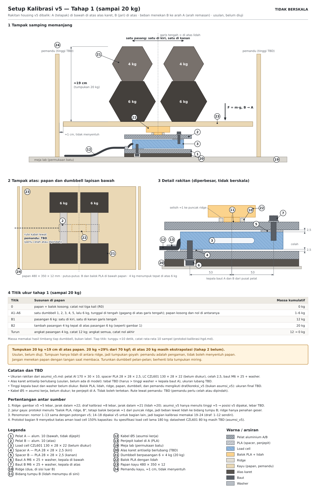
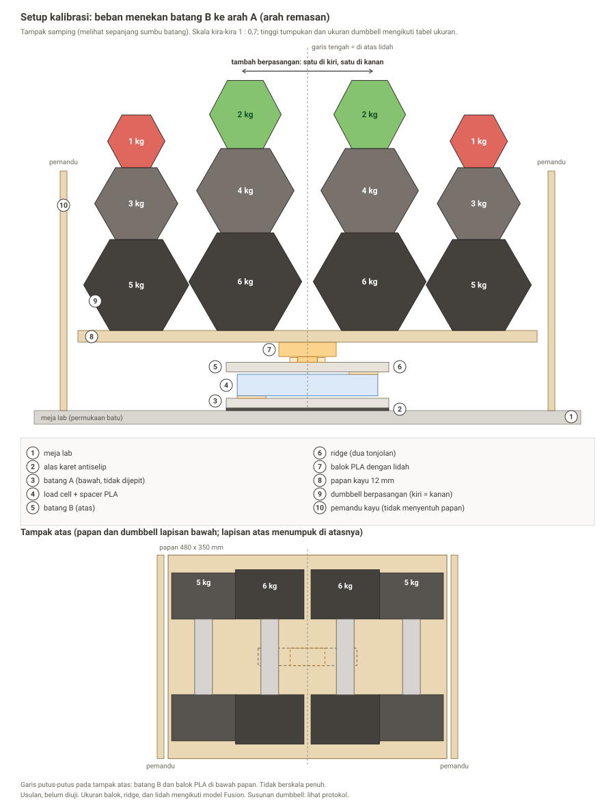

# Protokol Kalibrasi Hand Grip Dynamometer (untuk tim proyek)

Status: usulan, belum diuji. Ukuran papan, balok PLA, ridge, dan lidah masih mengikuti model Fusion dan bisa berubah. Gambar di bawah memakai dumbbell heksagonal milik tim (pasangan 3, 4, 5, 6 kg berbentuk heksagon; yang 2 kg dan 1 kg bentuknya sedikit berbeda, di gambar disederhanakan menjadi heksagon).

## 1. Tujuan

Mencari **faktor skala** (hitungan HX711 per kg) supaya pembacaan alat bisa ditampilkan dalam kg. Nol (tare) sudah dilakukan firmware pada keadaan SIAP, jadi yang dicari hanya kemiringan garis (counts per kg). Kita juga memeriksa linearitas, histeresis (naik lawan turun), dan drift.

## 2. Gambar setup

**Tahap 1 (sampai 20 kg), dengan rakitan housing v5.** Tahap ini dikerjakan lebih dulu. Gambar di bawah memakai pelat aluminium 10 mm, spacer PLA 28 x 28 x 2,5 mm, load cell CZL 601, dan baut M6 x 25. Titik ukur: nol, dumbbell tunggal 1 sampai 6 kg (seri A), pasangan 6 kg (12 kg), lalu pasangan 4 kg di atas 6 kg (20 kg), dan turun kembali. Tumpukan 20 kg sekitar 19 cm, jauh lebih rendah daripada tumpukan 42 kg. 20 kg baru sekitar 29 persen dari 70 kgf, sehingga faktor skala dari tahap ini belum cukup untuk seluruh rentang. Alas karet perlu lubang untuk kepala baut di bawah A (usulan, belum ada di model).

**Tahap 2 (sampai 42 kg)** memakai susunan di bawah ini, dengan gambar lama (belum diperbarui ke rakitan v5):

Cara membaca gambar (nomor sama dengan nomor di gambar):

1. **Meja lab.** Permukaan batu yang datar. Jangan dijepit (tepinya tipis dan sudah ada yang gompal, lihat catatan di bawah).
2. **Alas karet antiselip** di bawah batang A. Mencegah A bergeser.
3. **Batang A** di bawah. Beban menekan batang B ke arah A, sama dengan arah remasan tangan. Gaya mengalir: beban, papan, balok PLA, ridge, B, load cell, A, meja.
4. **Load cell + spacer PLA.** Spacer berada di ujung yang berbeda: A di ujung kiri, B di ujung kanan.
5. **Batang B** di atas.
6. **Ridge.** Dua tonjolan kecil di permukaan atas B.
7. **Balok PLA dengan lidah.** Lidah masuk di antara dua ridge, jadi balok tidak bisa menggeser sepanjang batang. Balok tidak boleh menyentuh puncak ridge (selisih 1 mm).
8. **Papan kayu** (kira-kira 480 x 350 mm, tebal 12 mm) di atas balok. Papan kaku yang menyebarkan beban dan menahan dumbbell.
9. **Dumbbell berpasangan.** Satu di kiri garis tengah, satu di kanan. Itu menjaga titik berat tepat di atas lidah tanpa harus diatur.
10. **Pemandu kayu.** Berdiri di meja, tidak menyentuh papan (jarak sekitar 1 cm). Kalau tumpukan miring, tumpukan menabrak pemandu dan bukan jatuh ke load cell. Pemandu tidak boleh menahan papan; kalau menyentuh, hasil pembacaan salah.

**Tampak atas** (bagian bawah gambar): papan, garis tengah, dan dumbbell lapisan bawah (6 kg paling dalam, 5 kg di luarnya). Garis putus-putus adalah batang B dan balok PLA di bawah papan.

Peringatan jujur: tumpukan penuh (42 kg) tingginya sekitar 25 sampai 28 cm di atas papan, sedangkan tumpuannya hanya lidah sekitar 21 mm. Karena itu alat ini goyah. Langkah di bawah mengurangi risiko, tetapi tetap hati-hati.

## 3. Alat dan bahan

- Rakitan grip lengkap (A, spacer, load cell, B), terhubung ke HX711 dan ESP32 final.
- Alas karet antiselip, papan kayu 12 mm, balok PLA (lidah + ridge), dua pemandu kayu.
- Dumbbell: pasangan 1, 2, 3, 4, 5, 6 kg (total 42 kg).
- Timbangan badan (atau timbangan dapur untuk dumbbell ringan), alat tulis atau laptop untuk mencatat.
- Kotak atau nampan penadah di lantai, sepatu tertutup.

## 4. Persiapan

1. **Timbang dumbbell satu per satu** (12 buah). Label massa biasanya meleset beberapa persen. Pakai metode selisih untuk timbangan badan: naik timbangan sendiri, catat; pegang dumbbell, catat; selisihnya adalah massa dumbbell. Pakai timbangan yang sama untuk semuanya dan catat resolusinya.
2. Catat massa papan + balok (hanya untuk dokumentasi; tare sudah menghapusnya).
3. Pasang alas karet, batang A, load cell, dan batang B. Pastikan baut terpasang sama seperti rakitan final dan kabel tidak tertekan.
4. Sambungkan ke HX711 dan ESP32 final (tegangan dan kabel sama dengan yang dipakai nanti). Nyalakan dan **biarkan 10 menit** supaya stabil.
5. Pasang balok dan papan. Letakkan pemandu sekitar 1 cm dari ujung papan.
6. Cek bahwa papan tidak menyentuh apa pun selain balok (tidak menyentuh pemandu, kabel, atau meja).

## 5. Langkah pengukuran

Satu orang memegang catatan, satu orang menaruh beban, satu orang mengawasi tumpukan. Setiap pembacaan: tunggu **10 detik** sampai angka stabil, lalu catat rata-rata 10 sampel (`get_value(10)` pada library HX711).

**Seri A: dumbbell tunggal (titik rendah).**
1. Papan kosong: catat pembacaan nol, tiga kali (R0).
2. Taruh **satu** dumbbell 1 kg tepat di tengah, gagangnya di atas garis tengah. Catat. Angkat.
3. Ulangi untuk 2, 3, 4, 5, 6 kg (satu per satu, tidak ditumpuk). Setelah tiap dumbbell, papan kosong lagi dan catat nol.

**Seri B: pasangan ditumpuk (titik tinggi), terberat dulu.**
4. Pasang pasangan 6 kg: satu di kiri, satu di kanan garis tengah (tampak atas). Catat (12 kg).
5. Tambah pasangan 5 kg di luar pasangan 6 kg. Catat (22 kg).
6. Tambah pasangan 4 kg di atas pasangan 6 kg. Catat (30 kg).
7. Tambah pasangan 3 kg di atas pasangan 5 kg. Catat (36 kg).
8. Tambah pasangan 2 kg di atas pasangan 4 kg. Catat (40 kg).
9. Tambah pasangan 1 kg di atas pasangan 3 kg. Catat (42 kg).
10. **Turun:** angkat pasangan dalam urutan terbalik (1, 2, 3, 4, 5, 6) dan catat di tiap titik (40, 36, 30, 22, 12 kg), lalu papan kosong lagi (R-akhir).

Masing-masing seri minimal diulang **dua kali**. Untuk massa kumulatif, gunakan hasil timbang dari langkah 1, bukan label.

## 6. Pencatatan

| No | Susunan | Massa timbang (kg) | Naik (counts) | Turun (counts) |
|---|---|---|---|---|
| 0 | Papan kosong | 0 | | |
| A1 | 1 kg tunggal | | | - |
| A2 | 2 kg tunggal | | | - |
| A3 | 3 kg tunggal | | | - |
| A4 | 4 kg tunggal | | | - |
| A5 | 5 kg tunggal | | | - |
| A6 | 6 kg tunggal | | | - |
| B1 | 6 kg x 2 | | | |
| B2 | + 5 kg x 2 | | | |
| B3 | + 4 kg x 2 | | | |
| B4 | + 3 kg x 2 | | | |
| B5 | + 2 kg x 2 | | | |
| B6 | + 1 kg x 2 | | | |

## 7. Pengolahan data

1. Plot counts (sumbu y) terhadap massa (sumbu x), kurangi R0.
2. Cocokkan garis lurus (regresi linier). **Kemiringan = faktor skala** (counts per kg). Pada library HX711, `set_scale(kemiringan)` membuat `get_units()` menghasilkan kg. Kalau kemiringan negatif (pembacaan turun saat beban naik), pakai nilai negatif.
3. Hitung R-kuadrat dan sisa terbesar (selisih titik dengan garis, dalam kg). Bandingkan sisa terbesar dengan toleransi S1 di catatan proyek.
4. Histeresis: selisih terbesar antara pembacaan naik dan turun pada massa yang sama.
5. Drift: selisih antara nol awal dan nol akhir.
6. Konsistensi: seri A dan seri B harus memberi kemiringan yang kira-kira sama. Kalau seri B jauh berbeda, curigai papan yang menyentuh pemandu atau beban tidak tepat di tengah.

## 8. Verifikasi

Setelah faktor skala dipasang, ukur massa yang **belum dipakai untuk fitting**, misalnya 2 kg + 5 kg, atau 3 kg + 4 kg + 6 kg. Bandingkan pembacaan alat dengan massa timbang. Catat galatnya.

## 9. Keselamatan

- Turunkan dumbbell pelan-pelan; jangan dijatuhkan ke papan.
- Jangan menaruh tangan atau wajah di bawah atau di antara tumpukan. Berdiri di samping.
- Jika tumpukan mulai miring atau terdengar menyentuh pemandu, **berhenti**, angkat dari atas ke bawah.
- Jangan melebihi 42 kg (tahap 1: 20 kg). Batas aman load cell CZL 601 80 kg dipegang konservatif di 120% kapasitas (96 kgf), jauh di atas beban kalibrasi, tetapi tumpukan tinggi tetap berbahaya. (Angka 150% berasal dari load cell 180 kg yang tidak jadi dipakai.)
- Jangan tekan papan dengan tangan saat membaca. Tangan menambah gaya.
- Jangan menjepit meja lab tanpa izin; tepinya tipis dan sudah ada yang gompal.

## 10. Batasan yang harus dicatat di laporan

- Kalibrasi hanya sampai 42 kg. Nilai di atas itu (hingga 70 kgf) adalah ekstrapolasi.
- Kalibrasi dilakukan dengan beban statis di titik tengah; genggaman nyata memberi beban di empat jari dan bisa sedikit berbeda posisi.
- Massa acuan dari timbangan badan; ketelitiannya membatasi ketelitian kalibrasi.
- Setup belum diuji dan dapat berubah setelah percobaan pertama.
